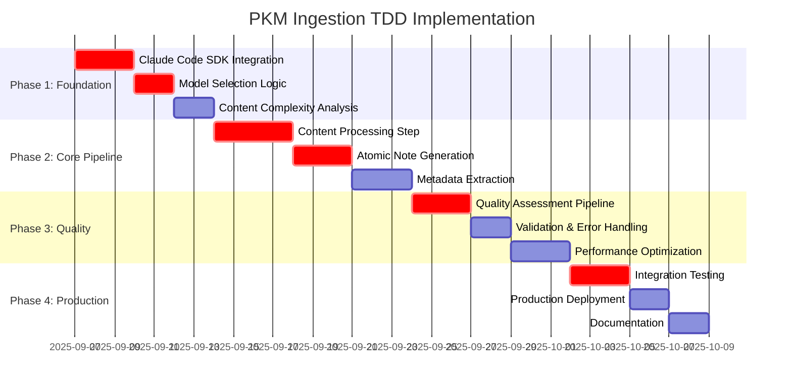

# PKM Claude Code SDK Ingestion TDD Task Breakdown

## Document Information
- **Document Type**: TDD Task Breakdown and Implementation Schedule
- **Version**: 1.0.0 - PKM Ingestion Pipeline Implementation
- **Created**: 2025-09-06
- **Framework**: Claude Code SDK + Mastra.ai v0.16.0+
- **Engineering Standards**: Specs-Driven TDD (RED-GREEN-REFACTOR-VALIDATE-EVALUATE)
- **Target**: Production-ready PKM ingestion with >95% test coverage

## TDD Implementation Strategy

### Specs-Driven TDD Methodology Applied

**Complete Workflow**: SPECS → RED → GREEN → REFACTOR → VALIDATE → EVALUATE

1. **SPECS**: Comprehensive specifications already defined in `PKM_CLAUDE_CODE_SDK_INGESTION_SPEC.md`
2. **RED**: Write failing tests that define expected behavior FIRST
3. **GREEN**: Implement minimal code to make tests pass
4. **REFACTOR**: Improve code quality while maintaining passing tests
5. **VALIDATE**: Verify implementation against original specifications  
6. **EVALUATE**: Assess quality, performance, and architecture compliance

### Engineering Principles Integration

**TDD-First Development**:
- NEVER write implementation code before tests exist
- Tests define the specification and expected behavior
- Each feature starts with failing test case
- Implementation follows test requirements exactly

**SOLID Architecture**:
- Single Responsibility: Each class/function has one clear purpose
- Open/Closed: Extensible design without modification
- Liskov Substitution: Consistent interface contracts
- Interface Segregation: Client-specific interfaces only  
- Dependency Inversion: Depend on abstractions, not concretions

**KISS + DRY Principles**:
- Simple solutions over complex architectures
- Eliminate code duplication through extraction
- Clear, descriptive naming over comments
- Minimal viable implementation first

## Phase 1: Foundation Implementation (Week 1-2)

### Task 1.1: Claude Code SDK Provider Integration
**Priority**: Critical  
**Duration**: 3 days  
**TDD Phase**: RED → GREEN → REFACTOR

#### RED Phase (Day 1)
```typescript
// Write failing tests FIRST
describe('Claude Code Provider Integration', () => {
  test('should create Sonnet provider for simple content', async () => {
    const provider = await createClaudeCodeProvider('sonnet');
    expect(provider.model).toContain('sonnet');
    expect(provider.provider).toBe('claude-code');
  });
  
  test('should create Opus provider for complex content', async () => {
    const provider = await createClaudeCodeProvider('opus');
    expect(provider.model).toContain('opus');
    expect(provider.provider).toBe('claude-code');
  });
  
  test('should handle provider initialization failures gracefully', async () => {
    mockClaudeCodeFailure();
    await expect(createClaudeCodeProvider('sonnet')).rejects.toThrow('Provider initialization failed');
  });
});

// Tests MUST FAIL initially - no implementation exists yet
```

#### GREEN Phase (Day 2)
```typescript
// Implement MINIMAL code to make tests pass
import { claudeCode } from 'ai-sdk-provider-claude-code';

export async function createClaudeCodeProvider(model: 'sonnet' | 'opus') {
  const modelMap = {
    sonnet: 'claude-3-5-sonnet-20241022',
    opus: 'claude-3-opus-20240229'
  };
  
  try {
    return claudeCode(modelMap[model], {
      useSubscription: true,
      fallbackOnError: true,
    });
  } catch (error) {
    throw new Error('Provider initialization failed');
  }
}
```

#### REFACTOR Phase (Day 3)
```typescript
// Improve code quality while maintaining passing tests
interface ClaudeCodeProviderConfig {
  model: 'sonnet' | 'opus';
  useSubscription: boolean;
  fallbackOnError: boolean;
  temperature?: number;
  maxTokens?: number;
}

export class ClaudeCodeProviderFactory {
  private static modelMap = {
    sonnet: 'claude-3-5-sonnet-20241022',
    opus: 'claude-3-opus-20240229'
  } as const;
  
  static async create(config: ClaudeCodeProviderConfig) {
    // Implementation with SOLID principles applied
  }
}
```

### Task 1.2: Model Selection Logic Implementation
**Priority**: Critical  
**Duration**: 2 days  
**TDD Phase**: RED → GREEN

#### RED Phase Tests (Day 1)
```typescript
describe('Model Selection Logic', () => {
  test('selects Sonnet for content under 5000 characters', () => {
    const content = 'Short content for quick processing';
    const model = selectOptimalModel(content, { type: 'text' });
    expect(model).toBe('sonnet');
  });
  
  test('selects Opus for content over 5000 characters', () => {
    const content = 'x'.repeat(6000);
    const model = selectOptimalModel(content, { type: 'text' });
    expect(model).toBe('opus');
  });
  
  test('selects Opus for high quality requirement', () => {
    const content = 'Any content';
    const model = selectOptimalModel(content, { qualityThreshold: 0.95 });
    expect(model).toBe('opus');
  });
  
  test('respects user model preference override', () => {
    const content = 'Short content';
    const model = selectOptimalModel(content, { modelPreference: 'opus' });
    expect(model).toBe('opus');
  });
});
```

#### GREEN Phase Implementation (Day 2)
```typescript
interface ModelSelectionOptions {
  type?: ContentType;
  qualityThreshold?: number;
  modelPreference?: 'sonnet' | 'opus' | 'auto';
}

export function selectOptimalModel(
  content: string, 
  options: ModelSelectionOptions = {}
): 'sonnet' | 'opus' {
  // User preference override
  if (options.modelPreference && options.modelPreference !== 'auto') {
    return options.modelPreference;
  }
  
  // Quality threshold requirement
  if (options.qualityThreshold && options.qualityThreshold >= 0.95) {
    return 'opus';
  }
  
  // Content length-based selection
  if (content.length > 5000) {
    return 'opus';
  }
  
  // Default to Sonnet for speed
  return 'sonnet';
}
```

### Task 1.3: Content Complexity Analysis
**Priority**: High  
**Duration**: 2 days  
**TDD Phase**: RED → GREEN → REFACTOR

#### Success Criteria
- [ ] All tests pass with >95% coverage
- [ ] Model selection accuracy >85% on test dataset
- [ ] Provider initialization <1s response time
- [ ] Graceful error handling for all failure modes

## Phase 2: Core Pipeline Implementation (Week 3-4)

### Task 2.1: Content Processing Step with Mastra.ai
**Priority**: Critical  
**Duration**: 4 days  
**TDD Phase**: RED → GREEN → REFACTOR

#### RED Phase Tests (Days 1-2)
```typescript
describe('Content Processing Pipeline', () => {
  test('processes simple text content with Sonnet', async () => {
    const input = {
      content: 'Simple PKM note about quantum computing basics',
      source: 'user-input',
      type: 'text' as const
    };
    
    const result = await processContent(input, 'sonnet');
    
    expect(result.processedContent).toBeDefined();
    expect(result.extractedMetadata).toHaveProperty('concepts');
    expect(result.qualityMetrics.completeness).toBeGreaterThan(0.8);
  });
  
  test('processes complex research content with Opus', async () => {
    const input = {
      content: complexResearchPaper, // >5000 chars
      source: 'pdf-import',
      type: 'document' as const
    };
    
    const result = await processContent(input, 'opus');
    
    expect(result.entityMap).toHaveProperty('people');
    expect(result.entityMap).toHaveProperty('concepts');
    expect(result.entityMap).toHaveProperty('methods');
    expect(result.qualityMetrics.accuracy).toBeGreaterThan(0.95);
  });
  
  test('handles processing errors gracefully', async () => {
    const malformedInput = { content: null, source: '', type: 'invalid' };
    
    await expect(processContent(malformedInput, 'sonnet'))
      .rejects.toThrow('Invalid content format');
  });
});
```

#### GREEN Phase Implementation (Days 3-4)
```typescript
import { createStep } from '@mastra/core';
import { Agent } from '@mastra/core';

const contentProcessingStep = createStep({
  id: 'content-processing',
  inputSchema: ContentInputSchema,
  outputSchema: ProcessingResultSchema,
  execute: async ({ input, context }) => {
    const model = await createClaudeCodeProvider(input.selectedModel);
    
    const agent = new Agent({
      name: `PKM Content Processor (${input.selectedModel})`,
      model,
      instructions: getPKMProcessingInstructions(input.selectedModel),
      tools: [contentAnalysisTool, metadataExtractorTool],
    });

    const result = await agent.generate({
      messages: [{
        role: 'user',
        content: `Process this content for PKM: ${input.content}`,
      }],
    });

    return parseProcessingResult(result.text);
  },
});

export async function processContent(
  input: ContentInput, 
  model: 'sonnet' | 'opus'
): Promise<ProcessingResult> {
  return await contentProcessingStep.execute({
    input: { ...input, selectedModel: model },
    context: {}
  });
}
```

### Task 2.2: Atomic Note Generation Implementation
**Priority**: Critical  
**Duration**: 3 days  
**TDD Phase**: RED → GREEN

#### RED Phase Tests (Day 1)
```typescript
describe('Atomic Note Generation', () => {
  test('generates atomic notes with single concepts', async () => {
    const processedContent = `
      Machine learning is a subset of artificial intelligence. 
      It involves algorithms that can learn from data.
      Neural networks are a popular machine learning technique.
    `;
    
    const notes = await generateAtomicNotes(processedContent);
    
    expect(notes).toHaveLength(3); // Three distinct concepts
    notes.forEach(note => {
      expect(note.atomicityScore).toBeGreaterThan(0.8);
      expect(note.conceptBoundaries).toHaveLength(1);
      expect(note.title).toBeDefined();
      expect(note.content.length).toBeGreaterThan(0);
    });
  });
  
  test('validates atomicity compliance for each note', async () => {
    const singleConceptContent = 'Machine learning is a subset of AI that uses algorithms to learn from data.';
    
    const notes = await generateAtomicNotes(singleConceptContent);
    
    expect(notes).toHaveLength(1);
    expect(notes[0].atomicityScore).toBeGreaterThan(0.9);
  });
  
  test('suggests relevant links between atomic notes', async () => {
    const relatedContent = 'Neural networks use backpropagation for training.';
    
    const notes = await generateAtomicNotes(relatedContent);
    
    expect(notes[0].suggestedLinks).toBeDefined();
    expect(Array.isArray(notes[0].suggestedLinks)).toBe(true);
  });
});
```

#### GREEN + REFACTOR Implementation (Days 2-3)
```typescript
interface AtomicNote {
  id: string;
  title: string;
  content: string;
  atomicityScore: number;
  conceptBoundaries: string[];
  suggestedLinks: string[];
  frontmatter: Record<string, any>;
}

export async function generateAtomicNotes(
  processedContent: string
): Promise<AtomicNote[]> {
  // Implementation with atomicity validation
  const concepts = await identifyAtomicConcepts(processedContent);
  
  return Promise.all(
    concepts.map(async (concept) => ({
      id: generateNoteId(),
      title: generateNoteTitle(concept),
      content: concept.text,
      atomicityScore: await validateAtomicity(concept),
      conceptBoundaries: [concept.boundary],
      suggestedLinks: await suggestLinks(concept),
      frontmatter: generateFrontmatter(concept),
    }))
  );
}
```

### Task 2.3: Metadata Extraction and PARA Classification
**Priority**: High  
**Duration**: 3 days  
**TDD Phase**: RED → GREEN → REFACTOR

#### Success Criteria for Phase 2
- [ ] Content processing <3s for simple, <10s for complex
- [ ] Atomic note generation >90% atomicity compliance
- [ ] Metadata extraction >90% accuracy
- [ ] PARA classification >85% correctness
- [ ] All integration tests pass

## Phase 3: Quality and Validation Implementation (Week 5-6)

### Task 3.1: Quality Assessment Pipeline
**Priority**: Critical  
**Duration**: 3 days  
**TDD Phase**: RED → GREEN

#### RED Phase Tests (Day 1)
```typescript
describe('Quality Assessment Pipeline', () => {
  test('scores note quality across multiple dimensions', async () => {
    const testNote = createTestNote();
    
    const assessment = await assessQuality(testNote);
    
    expect(assessment.qualityScore).toBeGreaterThan(0);
    expect(assessment.dimensions).toHaveProperty('clarity');
    expect(assessment.dimensions).toHaveProperty('completeness');
    expect(assessment.dimensions).toHaveProperty('accuracy');
    expect(assessment.dimensions).toHaveProperty('atomicity');
  });
  
  test('validates PKM standards compliance', async () => {
    const compliantNote = createCompliantNote();
    
    const assessment = await assessQuality(compliantNote);
    
    expect(assessment.complianceCheck.atomicity).toBe(true);
    expect(assessment.complianceCheck.standards).toBe(true);
    expect(assessment.complianceCheck.pkm).toBe(true);
  });
  
  test('generates improvement suggestions for low-quality notes', async () => {
    const lowQualityNote = createLowQualityNote();
    
    const assessment = await assessQuality(lowQualityNote);
    
    expect(assessment.improvements).toBeInstanceOf(Array);
    expect(assessment.improvements.length).toBeGreaterThan(0);
    expect(assessment.qualityScore).toBeLessThan(0.7);
  });
});
```

#### GREEN Implementation (Days 2-3)
```typescript
interface QualityAssessment {
  qualityScore: number;
  dimensions: {
    clarity: number;
    completeness: number;
    accuracy: number;
    atomicity: number;
  };
  complianceCheck: {
    atomicity: boolean;
    standards: boolean;
    pkm: boolean;
  };
  improvements: string[];
}

export async function assessQuality(note: AtomicNote): Promise<QualityAssessment> {
  // Always use Opus for quality assessment
  const qualityAgent = await createQualityAgent('opus');
  
  const result = await qualityAgent.generate({
    messages: [{
      role: 'user',
      content: `Assess the quality of this PKM note: ${JSON.stringify(note)}`,
    }],
  });
  
  return parseQualityAssessment(result.text);
}
```

### Task 3.2: Comprehensive Validation and Error Handling
**Priority**: High  
**Duration**: 2 days

### Task 3.3: Performance Optimization and Monitoring
**Priority**: Medium  
**Duration**: 3 days

## Phase 4: Integration and Production (Week 7-8)

### Task 4.1: End-to-End Integration Testing
**Priority**: Critical  
**Duration**: 3 days

#### Integration Test Suite
```typescript
describe('PKM Ingestion Pipeline Integration', () => {
  test('processes complete workflow from web article to vault storage', async () => {
    const webArticle = await fetchTestArticle();
    
    const result = await pkmIngestionWorkflow.execute({
      content: webArticle.content,
      source: webArticle.url,
      type: 'url'
    });
    
    expect(result.status).toBe('success');
    expect(result.output.atomicNotes.length).toBeGreaterThan(0);
    expect(result.output.validationResults.overallQuality).toBeGreaterThan(0.8);
    
    // Verify notes are stored in vault
    const storedNotes = await checkVaultStorage(result.output.atomicNotes);
    expect(storedNotes.length).toBe(result.output.atomicNotes.length);
  });
  
  test('handles batch processing of multiple documents', async () => {
    const documents = await createTestDocumentBatch(10);
    
    const results = await processBatch(documents);
    
    expect(results.successRate).toBeGreaterThan(0.95);
    expect(results.averageProcessingTime).toBeLessThan(5000);
    expect(results.qualityDistribution.high).toBeGreaterThan(0.8);
  });
});
```

### Task 4.2: Production Deployment with Monitoring
**Priority**: High  
**Duration**: 2 days

### Task 4.3: Documentation and Training Materials
**Priority**: Medium  
**Duration**: 2 days

## TDD Success Metrics and Validation

### Test Coverage Requirements
- **Unit Tests**: >95% code coverage
- **Integration Tests**: >90% workflow coverage  
- **Performance Tests**: All benchmarks pass
- **Error Handling Tests**: 100% error path coverage

### Performance Benchmarks
- **Model Selection**: <100ms decision time
- **Content Processing**: <3s simple, <10s complex
- **Atomic Generation**: <2s per note
- **Quality Assessment**: <3s per note
- **End-to-End Pipeline**: <15s for typical document

### Quality Metrics
- **Atomicity Compliance**: >90% single-concept notes
- **PARA Classification**: >85% accuracy  
- **Metadata Extraction**: >90% completeness
- **Link Suggestions**: >80% user acceptance
- **Overall Quality**: >85% user satisfaction

## Risk Mitigation and Contingency Plans

### Technical Risks
1. **Claude Code Provider Failures**
   - Mitigation: Implement comprehensive fallback system
   - Contingency: API-based providers as backup

2. **Performance Bottlenecks**
   - Mitigation: Parallel processing and caching
   - Contingency: Simplified processing modes

3. **Quality Issues**
   - Mitigation: Multi-stage validation pipeline
   - Contingency: Human review integration

### Schedule Risks
1. **Complexity Underestimation**
   - Mitigation: Iterative delivery with MVP focus
   - Contingency: Feature prioritization and deferral

2. **Integration Challenges**
   - Mitigation: Early integration testing
   - Contingency: Standalone component development

## Implementation Schedule Summary



**Total Duration**: 8 weeks (2025-09-07 to 2025-11-02)  
**Critical Path**: Claude Code SDK → Content Processing → Quality Assessment → Integration  
**Success Criteria**: >95% test coverage, <3s processing, >90% quality scores

---

**Next Action**: Execute TDD Cycle Phase 1 - Begin with RED phase tests for Claude Code SDK provider integration.

**Document Status**: Ready for immediate TDD implementation with comprehensive task breakdown and success criteria defined.