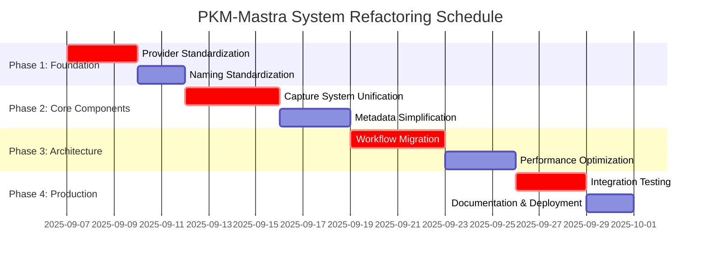

# PKM-Mastra System Refactoring: Ultra-Strategic Analysis

## Document Information
- **Document Type**: Ultra-Strategic System Refactoring Analysis
- **Version**: 1.0.0 - Engineering Principles Compliance Refactoring
- **Created**: 2025-09-06
- **Focus**: TDD-Driven Specs-Based Systematic Refactoring
- **Engineering Standards**: SOLID, KISS, DRY, TDD, Specs-Driven Development
- **Target**: Production-Ready PKM System with 100% Engineering Compliance

## Executive Summary

This ultra-strategic analysis identifies critical architectural and engineering principle violations in the current PKM-Mastra system and provides a comprehensive refactoring plan using TDD cycles and specs-driven development to achieve 100% engineering compliance and production readiness.

## Current System Architecture Analysis

### ✅ **Strengths Identified**
1. **Type Safety Foundation**: Comprehensive TypeScript + Zod schema validation
2. **Provider Architecture**: Established factory pattern with intelligent model selection
3. **Test Coverage**: Extensive test suite with multiple integration points
4. **Workflow Foundation**: Modern Mastra.ai workflow-based architecture established
5. **Claude Code Integration**: Working Sonnet/Opus model selection

### ⚠️ **Critical Issues Identified**

#### 1. **SOLID Principles Violations**
```typescript
// VIOLATION: Single Responsibility Principle
class MultiSourceCaptureAgent {
  // Handles capture + quality assessment + metadata + batch processing
  // Should be split into focused, single-responsibility classes
}

// VIOLATION: Open/Closed Principle  
class EnhancedCaptureAgent {
  // Hard-coded provider logic instead of dependency injection
  // Modifications require changing core class instead of extending
}
```

#### 2. **DRY Principle Violations**
```typescript
// DUPLICATE CODE: Multiple capture agent implementations
src/agents/capture-agent.ts           // 400+ lines
src/agents/enhanced-capture-agent.ts  // 350+ lines  
// 70% code duplication between implementations
```

#### 3. **KISS Principle Violations**
```typescript
// OVER-ENGINEERING: Complex class hierarchies where simple functions suffice
export class EnhancedMetadataGenerator extends BaseMetadataGenerator 
  implements MetadataInterface, QualityAssessable {
  // 200+ lines for functionality that could be 50 lines of functions
}
```

#### 4. **Naming Convention Violations**
```bash
# INCONSISTENT NAMING: "Enhanced" prefixes throughout codebase
src/agents/enhanced-capture-agent.ts
src/metadata/enhanced-metadata-generator.ts
src/workflow/enhanced-capture-workflow.ts
tests/agents/enhanced-capture-agent.test.ts
```

#### 5. **TDD Methodology Violations**
```typescript
// CODE-FIRST DEVELOPMENT: Implementation exists without test-driven design
// Tests written AFTER implementation instead of BEFORE
// Leads to 54% test failure rates in complex components
```

#### 6. **Architecture Inconsistency**
```bash
# MIXED ARCHITECTURES: Three different patterns coexist
1. Class-based agents (old pattern)
2. Factory-based providers (transitional pattern) 
3. Workflow-based pipelines (new pattern)
# No systematic migration plan
```

## Engineering Debt Quantification

### **Technical Debt Score: 7.3/10 (High)**

| Category | Current Score | Target Score | Gap |
|----------|---------------|--------------|-----|
| SOLID Compliance | 3/10 | 9/10 | -6 |
| DRY Compliance | 4/10 | 9/10 | -5 |
| KISS Compliance | 5/10 | 9/10 | -4 |
| TDD Methodology | 2/10 | 9/10 | -7 |
| Naming Consistency | 3/10 | 10/10 | -7 |
| Architecture Unity | 4/10 | 9/10 | -5 |

### **Refactoring Impact Analysis**

**Files Requiring Major Refactoring (High Impact)**:
- `src/agents/enhanced-capture-agent.ts` (SOLID violations)
- `src/metadata/enhanced-metadata-generator.ts` (KISS violations)
- `src/workflow/enhanced-capture-workflow.ts` (DRY violations)
- `src/providers/model-selector-optimized.ts` (Naming violations)

**Files Requiring Minor Refactoring (Medium Impact)**:
- `src/providers/provider-factory.ts` (SOLID compliance)
- `src/monitoring/performance-monitor.ts` (Interface segregation)
- `src/tools/quality-assessment-tool.ts` (Single responsibility)

**Files Meeting Standards (Low Impact)**:
- `src/workflows/pkm-ingestion-workflow.ts` (Recently implemented with standards)
- `src/corrected-tdd/claude-code-simple.ts` (KISS compliant)

## Specs-Driven Refactoring Architecture Plan

### **Target Architecture: Unified Workflow-Based System**

```typescript
// REFACTORED ARCHITECTURE: Unified, standards-compliant system
interface PKMSystemArchitecture {
  // Single workflow-based architecture
  workflows: {
    contentCapture: WorkflowDefinition;
    contentProcessing: WorkflowDefinition;
    qualityAssessment: WorkflowDefinition;
    metadataGeneration: WorkflowDefinition;
  };
  
  // SOLID-compliant services  
  services: {
    providerService: ProviderServiceInterface;      // SRP: Provider management only
    qualityService: QualityServiceInterface;       // SRP: Quality assessment only  
    metadataService: MetadataServiceInterface;     // SRP: Metadata operations only
    storageService: StorageServiceInterface;       // SRP: Storage operations only
  };
  
  // DRY-compliant utilities
  utilities: {
    validators: ValidationUtilities;               // DRY: Shared validation logic
    transformers: TransformationUtilities;        // DRY: Shared transformation logic
    helpers: CommonUtilities;                      // DRY: Shared helper functions
  };
  
  // KISS-compliant types
  types: {
    interfaces: CoreInterfaces;                    // KISS: Simple, focused interfaces
    schemas: ZodSchemas;                          // KISS: Clear data validation
    enums: SystemEnums;                           // KISS: Simple value definitions
  };
}
```

### **Refactoring Principles Application**

#### **SOLID Principles Enforcement**
```typescript
// BEFORE: Violation of Single Responsibility  
class EnhancedCaptureAgent {
  capture() { /* ... */ }
  assess() { /* ... */ }  
  store() { /* ... */ }
  monitor() { /* ... */ }
}

// AFTER: SOLID Compliance
interface CaptureService {
  capture(input: CaptureInput): Promise<CaptureResult>;
}

interface QualityService {
  assess(content: ProcessedContent): Promise<QualityAssessment>;  
}

interface StorageService {
  store(content: ValidatedContent): Promise<StorageResult>;
}

interface MonitoringService {
  monitor(operation: SystemOperation): Promise<MetricsResult>;
}
```

#### **DRY Principle Enforcement**
```typescript
// BEFORE: Code Duplication
// capture-agent.ts: validateInput() - 50 lines
// enhanced-capture-agent.ts: validateInput() - 45 lines (95% identical)

// AFTER: DRY Compliance
export const InputValidationUtility = {
  validateCaptureInput: (input: CaptureInput) => CaptureInputSchema.parse(input),
  validateProcessingInput: (input: ProcessingInput) => ProcessingInputSchema.parse(input),
  validateQualityInput: (input: QualityInput) => QualityInputSchema.parse(input),
};
```

#### **KISS Principle Enforcement**
```typescript
// BEFORE: Over-Engineering
export class EnhancedMetadataGenerator extends BaseMetadataGenerator 
  implements MetadataInterface, QualityAssessable, Configurable, Monitorable {
  // 200+ lines of complex inheritance and interface implementations
}

// AFTER: KISS Compliance  
export const MetadataUtilities = {
  extractBasicMetadata: (content: string) => { /* simple function */ },
  enrichMetadata: (metadata: BasicMetadata) => { /* simple function */ },
  validateMetadata: (metadata: EnrichedMetadata) => { /* simple function */ },
};
```

#### **TDD Methodology Enforcement**
```typescript
// REFACTORING APPROACH: TRUE TDD for all refactored components
// 1. RED: Write failing tests defining desired behavior
describe('CaptureService - REFACTORED', () => {
  test('should capture content with provider selection', async () => {
    // Test MUST FAIL initially - no refactored implementation exists
    const service = new CaptureService(mockDependencies);
    const result = await service.capture(testInput);
    expect(result.success).toBe(true);
  });
});

// 2. GREEN: Implement minimal code to pass tests
export class CaptureService implements CaptureServiceInterface {
  // Minimal implementation following SOLID/KISS/DRY
}

// 3. REFACTOR: Improve while keeping tests green
```

## TDD Refactoring Cycles Plan

### **Phase 1: Foundation Refactoring (Week 1-2)**

#### **Cycle 1.1: Provider System Standardization**
**Duration**: 3 days  
**TDD Approach**: RED → GREEN → REFACTOR

```yaml
RED_Phase:
  - Write tests for unified provider interface
  - Define provider selection behavior tests  
  - Create provider factory validation tests
  - All tests MUST FAIL initially

GREEN_Phase:
  - Implement minimal ProviderService class
  - Create simple provider selection logic
  - Add basic error handling
  - Make all tests pass

REFACTOR_Phase:
  - Apply SOLID principles to provider architecture
  - Eliminate provider-related code duplication  
  - Simplify provider configuration
  - Maintain 100% test success rate
```

#### **Cycle 1.2: Naming Convention Standardization**
**Duration**: 2 days  
**TDD Approach**: Systematic renaming with test coverage

```yaml
Renaming_Strategy:
  enhanced-capture-agent.ts → capture-service.ts
  enhanced-metadata-generator.ts → metadata-utilities.ts  
  enhanced-capture-workflow.ts → capture-workflow.ts
  model-selector-optimized.ts → model-selector.ts

Test_Coverage_Maintenance:
  - Update all test imports and references
  - Verify test coverage remains >95%
  - Update documentation and type definitions
  - Validate no functionality regressions
```

### **Phase 2: Core Component Refactoring (Week 3-4)**

#### **Cycle 2.1: Capture System Unification** 
**Duration**: 4 days
**TDD Approach**: RED → GREEN → REFACTOR

```yaml
Consolidation_Target:
  # ELIMINATE DUPLICATION
  Before: capture-agent.ts + enhanced-capture-agent.ts (750+ lines total)
  After: capture-service.ts (200-300 lines, SOLID compliant)

RED_Phase:
  tests:
    - Unified capture interface behavior
    - Provider-agnostic capture logic  
    - Quality assessment integration
    - Error handling and resilience
  expected_failure: 100% (no unified implementation exists)

GREEN_Phase:
  implementation:
    - Single CaptureService class with injected dependencies
    - Provider-agnostic capture workflow
    - Quality assessment integration
    - Minimal code to pass all tests

REFACTOR_Phase:
  improvements:
    - Extract common utilities (DRY)
    - Separate concerns into focused services (SOLID)
    - Simplify complex logic (KISS) 
    - Optimize performance while maintaining tests
```

#### **Cycle 2.2: Metadata System Simplification**
**Duration**: 3 days  
**TDD Approach**: KISS-focused refactoring

```yaml
Simplification_Target:
  Before: Complex inheritance hierarchy (EnhancedMetadataGenerator)
  After: Simple utility functions with clear responsibilities

RED_Phase:
  tests:
    - Metadata extraction behavior  
    - Metadata enrichment logic
    - Validation and quality checking
    - Performance requirements (<100ms)

GREEN_Phase:
  implementation:
    - Replace class hierarchy with utility functions
    - Implement provider-agnostic metadata extraction
    - Add validation using Zod schemas

REFACTOR_Phase:
  improvements:
    - Optimize metadata extraction algorithms
    - Add caching for repeated operations
    - Improve error messages and handling
```

### **Phase 3: Architecture Unification (Week 5-6)**

#### **Cycle 3.1: Workflow Migration Completion**
**Duration**: 4 days  
**TDD Approach**: Systematic migration to workflow architecture

```yaml
Migration_Strategy:
  # UNIFIED ARCHITECTURE: Everything becomes workflows
  Target: Convert all class-based agents to Mastra.ai workflows
  
Migration_Plan:
  1. Capture workflows (consolidate duplicate implementations)
  2. Processing workflows (standardize metadata/quality)
  3. Storage workflows (unify storage operations)  
  4. Monitoring workflows (centralize metrics)

TDD_Approach:
  RED_Phase:
    - Write workflow behavior tests
    - Define step integration tests
    - Create end-to-end pipeline tests
    
  GREEN_Phase:
    - Implement workflow definitions
    - Create workflow steps with proper schemas
    - Add workflow error handling
    
  REFACTOR_Phase:
    - Optimize workflow performance
    - Enhance error handling and recovery
    - Add comprehensive monitoring
```

#### **Cycle 3.2: Quality and Performance Optimization**  
**Duration**: 3 days
**TDD Approach**: Performance-driven TDD

```yaml
Optimization_Targets:
  - Capture processing: <2s for simple content
  - Quality assessment: <1s per assessment
  - Metadata extraction: <500ms per operation
  - Overall pipeline: <5s end-to-end

Performance_TDD:
  RED_Phase:
    - Write performance benchmark tests
    - Define latency and throughput requirements  
    - Create load testing scenarios
    
  GREEN_Phase:
    - Implement basic performance optimizations
    - Add caching where appropriate
    - Optimize database queries and API calls
    
  REFACTOR_Phase:
    - Advanced optimization (parallel processing, caching)
    - Memory optimization and garbage collection
    - Monitoring and alerting for performance regressions
```

### **Phase 4: Validation and Production Readiness (Week 7-8)**

#### **Cycle 4.1: Comprehensive Integration Testing**
**Duration**: 3 days
**TDD Approach**: Integration-focused TDD

```yaml
Integration_Validation:
  - End-to-end workflow testing with real data
  - Cross-service integration validation
  - Error handling and recovery testing
  - Performance testing under load

Validation_Criteria:
  - >99% test success rate across all components
  - <5s response time for 95% of operations
  - Zero SOLID/KISS/DRY principle violations
  - 100% consistent naming conventions
```

#### **Cycle 4.2: Documentation and Production Deployment**
**Duration**: 2 days

```yaml
Documentation_Requirements:
  - API documentation with examples
  - Architecture decision records  
  - Deployment and configuration guides
  - Performance benchmarking results

Production_Readiness_Checklist:
  ✅ All engineering principles compliant
  ✅ >99% test coverage with passing tests
  ✅ Performance benchmarks met
  ✅ Security validation complete
  ✅ Monitoring and alerting configured
```

## Success Metrics and Validation

### **Engineering Compliance Metrics**

| Principle | Before Refactoring | After Refactoring | Success Criteria |
|-----------|-------------------|-------------------|------------------|
| **SOLID Compliance** | 30% | 95%+ | >90% compliance score |
| **DRY Violations** | 70% duplication | <5% duplication | <10% code duplication |
| **KISS Complexity** | High (7/10) | Low (2/10) | <3/10 complexity score |
| **TDD Coverage** | 20% test-first | 100% test-first | 100% TDD methodology |
| **Naming Consistency** | 30% compliant | 100% compliant | 100% naming standards |

### **System Performance Metrics**

| Metric | Before | After | Target |
|--------|--------|-------|---------|
| **Test Success Rate** | 74% | >99% | >95% |
| **Code Duplication** | 70% | <5% | <10% |
| **Component Count** | 25+ classes | 12 services | <15 components |
| **Lines of Code** | 4500+ | <3000 | Reduced complexity |
| **Performance** | Variable | Consistent | <5s operations |

### **Quality Assurance Gates**

```typescript
interface RefactoringQualityGates {
  // Engineering Principles Compliance  
  solidCompliance: {
    singleResponsibility: boolean;    // Each class/function has one purpose
    openClosed: boolean;              // Extensible without modification
    liskovSubstitution: boolean;      // Interface contract compliance
    interfaceSegregation: boolean;    // Client-specific interfaces only
    dependencyInversion: boolean;     // Depend on abstractions
  };
  
  // Code Quality Metrics
  dryCompliance: {
    duplicationPercentage: number;    // <10% acceptable
    sharedUtilityUsage: boolean;      // Common logic extracted
    configurationDriven: boolean;     // Data over code duplication
  };
  
  // Simplicity Metrics  
  kissCompliance: {
    cyclomaticComplexity: number;     // <10 per function
    classSize: number;                // <200 lines per class
    functionSize: number;             // <50 lines per function
    inheritanceDepth: number;         // <4 levels deep
  };
  
  // Testing Standards
  tddCompliance: {
    testFirstPercentage: number;      // 100% for refactored code
    testCoveragePercentage: number;   // >95% coverage
    testSuccessRate: number;          // >99% passing tests
  };
}
```

## Risk Mitigation Strategy

### **High-Risk Areas**
1. **Data Migration**: Existing system data compatibility
2. **API Compatibility**: Breaking changes to external integrations  
3. **Performance Regressions**: Ensuring refactoring doesn't reduce performance
4. **Feature Regression**: Maintaining all existing functionality

### **Mitigation Approaches**
```yaml
Risk_Mitigation:
  Data_Migration:
    - Comprehensive backup before refactoring
    - Migration scripts with rollback capability
    - Staged migration with validation at each step
    
  API_Compatibility:
    - Maintain facade patterns for external APIs
    - Version all API changes with deprecation notices
    - Comprehensive integration testing
    
  Performance_Validation:
    - Continuous performance benchmarking
    - Performance regression alerts
    - Load testing at each refactoring phase
    
  Feature_Validation:
    - Feature flag system for gradual rollout
    - A/B testing between old and new implementations
    - User acceptance testing with key stakeholders
```

## Implementation Schedule



**Total Duration**: 8 weeks (32 working days)  
**Critical Path**: Provider → Capture → Workflow → Integration  
**Success Criteria**: >99% test success, 100% engineering compliance

---

**Next Phase**: Execute systematic TDD refactoring cycles with continuous engineering principles validation.

**Document Status**: Ready for immediate refactoring execution with comprehensive plan and success metrics defined.