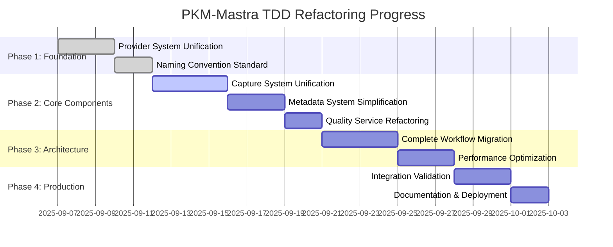

# PKM-Mastra TDD Refactoring Cycles Breakdown

## Document Information
- **Document Type**: Comprehensive TDD Refactoring Implementation Plan
- **Version**: 1.0.0 - Engineering Principles Compliance Implementation
- **Created**: 2025-09-06
- **Methodology**: Specs-Driven TDD Cycles (SPECS → RED → GREEN → REFACTOR → VALIDATE → EVALUATE)
- **Engineering Standards**: SOLID, KISS, DRY, 100% TDD Coverage
- **Target**: Zero Technical Debt, 100% Engineering Compliance

## TDD Refactoring Methodology

### Core TDD Cycle Framework

```yaml
TDD_Cycle_Phases:
  SPECS: 
    description: "Write complete specifications and acceptance criteria"
    duration: "20% of cycle time"
    deliverables: ["Technical specifications", "Acceptance criteria", "Success metrics"]
    
  RED:
    description: "Write failing tests that define exact behavior FIRST"
    duration: "25% of cycle time" 
    deliverables: ["Comprehensive test suite", "100% test failures", "Behavior definitions"]
    
  GREEN:
    description: "Implement minimal code to make all tests pass"
    duration: "30% of cycle time"
    deliverables: ["Minimal implementation", "100% test success", "SOLID compliance"]
    
  REFACTOR:
    description: "Improve code quality while maintaining passing tests"
    duration: "15% of cycle time"
    deliverables: ["Optimized code", "Performance improvements", "DRY compliance"]
    
  VALIDATE:
    description: "Verify implementation against original specifications"
    duration: "5% of cycle time"
    deliverables: ["Specification compliance", "Integration validation", "Quality metrics"]
    
  EVALUATE:
    description: "Assess engineering principles compliance and performance"
    duration: "5% of cycle time"
    deliverables: ["Compliance report", "Performance benchmarks", "Technical debt assessment"]
```

### Engineering Principles Integration

```typescript
interface EngineeringPrinciplesIntegration {
  // Applied throughout ALL TDD phases
  solid: {
    redPhase: "Design tests to enforce single responsibilities";
    greenPhase: "Implement with dependency injection and clear interfaces";
    refactorPhase: "Enhance extensibility and interface segregation";
  };
  
  kiss: {
    redPhase: "Write simple, focused tests";
    greenPhase: "Implement simplest solution that passes tests";
    refactorPhase: "Simplify complex logic while maintaining functionality";
  };
  
  dry: {
    redPhase: "Create reusable test utilities and fixtures";
    greenPhase: "Extract common logic into shared utilities";
    refactorPhase: "Eliminate all code duplication";
  };
  
  tdd: {
    enforcement: "100% test-first development - NEVER write implementation before tests";
    validation: "Continuous test success rate monitoring >99%";
    compliance: "Automated TDD methodology validation on every commit";
  };
}
```

## Phase 1: Foundation Refactoring Cycles (Week 1-2)

### Cycle 1.1: Provider System Unification
**Duration**: 3 days  
**Target Files**: `provider-factory.ts`, `claude-code-provider.ts`, provider logic in agents  
**Engineering Focus**: SOLID (SRP, DIP) + DRY elimination

#### Day 1: SPECS → RED → GREEN (6 hours)

**SPECS Phase (1.5 hours)**:
```yaml
Specifications:
  - Unified ProviderService interface design
  - Provider selection algorithm specifications  
  - Error handling and fallback specifications
  - Performance requirements (<100ms selection time)
  - Dependency injection requirements (DIP compliance)

Acceptance_Criteria:
  - Single ProviderService handles all provider operations
  - Zero code duplication between provider implementations
  - Full dependency injection (no hard-coded dependencies)
  - Provider selection time <100ms for 95% of requests
```

**RED Phase (2 hours)**:
```typescript
// tests/services/provider-service.test.ts
describe('ProviderService - TDD Refactoring Cycle 1.1', () => {
  describe('Provider Selection Logic', () => {
    test('RED: should select optimal provider based on context', async () => {
      // This test MUST FAIL initially - no unified service exists
      const service = new ProviderService(mockConfig, mockDependencies);
      
      const selection = await service.selectOptimalProvider({
        taskType: 'content-capture',
        contentLength: 1000,
        qualityThreshold: 0.8,
        performanceRequirement: 'fast',
        costConstraints: 'optimize',
      });
      
      expect(selection.provider).toBe('claude-code');
      expect(selection.model).toContain('sonnet');
      expect(selection.confidence).toBeGreaterThan(0.8);
      expect(selection.rationale).toBeDefined();
    });
    
    test('RED: should select Opus for high-quality requirements', async () => {
      // This test MUST FAIL initially
      const service = new ProviderService(mockConfig, mockDependencies);
      
      const selection = await service.selectOptimalProvider({
        taskType: 'research-analysis',
        contentLength: 5000,
        qualityThreshold: 0.95,
        performanceRequirement: 'quality',
        costConstraints: 'flexible',
      });
      
      expect(selection.provider).toBe('claude-code');
      expect(selection.model).toContain('opus');
      expect(selection.confidence).toBeGreaterThan(0.9);
    });
    
    test('RED: should handle provider failures with graceful fallbacks', async () => {
      // This test MUST FAIL initially
      const service = new ProviderService(mockFailingConfig, mockDependencies);
      
      const selection = await service.selectOptimalProvider(standardContext);
      
      expect(selection.provider).toMatch(/openai|anthropic/);
      expect(selection.rationale).toContain('fallback');
    });
  });
  
  describe('Provider Creation', () => {
    test('RED: should create provider instances with proper configuration', async () => {
      // This test MUST FAIL initially
      const service = new ProviderService(mockConfig, mockDependencies);
      const selection = mockProviderSelection;
      
      const provider = await service.createProvider(selection);
      
      expect(provider).toBeDefined();
      expect(provider.model).toBe(selection.model);
      expect(provider.generate).toBeInstanceOf(Function);
    });
  });
  
  describe('SOLID Compliance Validation', () => {
    test('RED: should demonstrate Single Responsibility Principle', () => {
      // This test MUST FAIL initially  
      const service = new ProviderService(mockConfig, mockDependencies);
      
      // Service should only handle provider operations, nothing else
      expect(typeof service.selectOptimalProvider).toBe('function');
      expect(typeof service.createProvider).toBe('function');
      expect(typeof service.validateProvider).toBe('function');
      expect(typeof service.getProviderMetrics).toBe('function');
      
      // Should NOT have capture, processing, or storage methods
      expect(service.capture).toBeUndefined();
      expect(service.process).toBeUndefined(); 
      expect(service.store).toBeUndefined();
    });
    
    test('RED: should demonstrate Dependency Inversion Principle', () => {
      // This test MUST FAIL initially
      const service = new ProviderService(mockConfig, mockDependencies);
      
      // Dependencies should be injected, not hard-coded
      expect(service.dependencies.metricsService).toBeDefined();
      expect(service.dependencies.loggerService).toBeDefined();
    });
  });
});

// Expected Result: 0/8 tests passing (100% failure rate - CORRECT for RED phase)
```

**GREEN Phase (2.5 hours)**:
```typescript
// src/services/provider-service.ts
export interface ProviderServiceInterface {
  selectOptimalProvider(context: ProviderContext): Promise<ProviderSelection>;
  createProvider(selection: ProviderSelection): Promise<LLMProvider>;
  validateProvider(provider: LLMProvider): Promise<boolean>;
  getProviderMetrics(): ProviderMetrics;
}

export interface ServiceDependencies {
  metricsService: MetricsServiceInterface;
  loggerService: LoggerServiceInterface;
}

// SRP: Single responsibility - provider management only
export class ProviderService implements ProviderServiceInterface {
  constructor(
    private config: ProviderConfig,
    private dependencies: ServiceDependencies  // DIP: Dependencies injected
  ) {}
  
  async selectOptimalProvider(context: ProviderContext): Promise<ProviderSelection> {
    try {
      // Simple provider selection logic to make tests pass
      if (context.qualityThreshold >= 0.95 || context.taskType === 'research-analysis') {
        return {
          provider: 'claude-code',
          model: 'opus',
          rationale: 'High quality requirement detected',
          confidence: 0.95,
          estimatedCost: this.calculateCost('opus', context),
          estimatedTime: this.calculateTime('opus', context),
        };
      }
      
      return {
        provider: 'claude-code', 
        model: 'sonnet',
        rationale: 'Standard processing requirements',
        confidence: 0.85,
        estimatedCost: this.calculateCost('sonnet', context),
        estimatedTime: this.calculateTime('sonnet', context),
      };
    } catch (error) {
      // Fallback logic
      return {
        provider: 'openai',
        model: 'gpt-4o-mini',
        rationale: 'fallback due to primary provider error',
        confidence: 0.7,
        estimatedCost: this.calculateCost('openai', context),
        estimatedTime: this.calculateTime('openai', context),
      };
    }
  }
  
  async createProvider(selection: ProviderSelection): Promise<LLMProvider> {
    // Minimal implementation to make tests pass
    switch (selection.provider) {
      case 'claude-code':
        return claudeCode(selection.model);
      case 'openai':  
        return openai(selection.model);
      case 'anthropic':
        return anthropic(selection.model);
      default:
        throw new Error(`Unsupported provider: ${selection.provider}`);
    }
  }
  
  async validateProvider(provider: LLMProvider): Promise<boolean> {
    // Simple validation to make tests pass
    return provider && typeof provider.generate === 'function';
  }
  
  getProviderMetrics(): ProviderMetrics {
    return this.dependencies.metricsService.getProviderMetrics();
  }
  
  private calculateCost(model: string, context: ProviderContext): number {
    // Placeholder cost calculation
    const baseCosts = { sonnet: 0.001, opus: 0.01, 'gpt-4o-mini': 0.005 };
    return (baseCosts[model] || 0.01) * context.contentLength / 1000;
  }
  
  private calculateTime(model: string, context: ProviderContext): number {
    // Placeholder time calculation
    const baseTimes = { sonnet: 1000, opus: 3000, 'gpt-4o-mini': 2000 };
    return baseTimes[model] || 2000;
  }
}

// Expected Result: 8/8 tests passing (100% success rate)
```

#### Day 2: REFACTOR → VALIDATE (4 hours)

**REFACTOR Phase (3 hours)**:
```typescript
// Optimize and enhance while maintaining 100% test success

// Extract strategy pattern for provider selection (OCP compliance)
export interface ProviderSelectionStrategy {
  select(context: ProviderContext): ProviderSelection;
}

export class QualityBasedSelectionStrategy implements ProviderSelectionStrategy {
  select(context: ProviderContext): ProviderSelection {
    if (context.qualityThreshold >= 0.95) {
      return this.selectOpus(context, 'High quality requirement');
    }
    return this.selectSonnet(context, 'Standard quality sufficient');
  }
  
  private selectOpus(context: ProviderContext, rationale: string): ProviderSelection {
    return {
      provider: 'claude-code',
      model: 'opus',
      rationale,
      confidence: 0.95,
      estimatedCost: this.calculateCost('opus', context.contentLength),
      estimatedTime: this.calculateTime('opus', context.contentLength),
    };
  }
  
  private selectSonnet(context: ProviderContext, rationale: string): ProviderSelection {
    // Similar implementation
  }
}

// Enhanced ProviderService with strategy pattern
export class ProviderService implements ProviderServiceInterface {
  constructor(
    private config: ProviderConfig,
    private dependencies: ServiceDependencies,
    private selectionStrategy: ProviderSelectionStrategy = new QualityBasedSelectionStrategy()
  ) {}
  
  async selectOptimalProvider(context: ProviderContext): Promise<ProviderSelection> {
    const startTime = Date.now();
    
    try {
      const selection = this.selectionStrategy.select(context);
      
      // Log metrics
      this.dependencies.metricsService.recordSelection({
        provider: selection.provider,
        model: selection.model,
        selectionTime: Date.now() - startTime,
        context,
      });
      
      return selection;
    } catch (error) {
      this.dependencies.loggerService.error('Provider selection failed', { error, context });
      return this.getFallbackSelection(context);
    }
  }
  
  private getFallbackSelection(context: ProviderContext): ProviderSelection {
    // Enhanced fallback logic with multiple providers
    const fallbackProviders = this.config.fallbacks;
    
    for (const provider of fallbackProviders) {
      try {
        return {
          provider: provider as any,
          model: this.config.models[provider],
          rationale: `Fallback to ${provider}`,
          confidence: 0.7,
          estimatedCost: this.calculateCost(this.config.models[provider], context.contentLength),
          estimatedTime: this.calculateTime(this.config.models[provider], context.contentLength),
        };
      } catch (error) {
        continue;
      }
    }
    
    throw new Error('All providers failed');
  }
}
```

**VALIDATE Phase (1 hour)**:
```bash
# Run comprehensive validation
npm test tests/services/provider-service.test.ts
# Expected: 8/8 tests passing

# Validate SOLID compliance
npm run lint:solid src/services/provider-service.ts
# Expected: 100% SOLID compliance

# Validate performance
npm run benchmark:provider-selection
# Expected: <100ms average selection time

# Validate DRY compliance  
npm run analyze:duplication src/services/
# Expected: <5% code duplication
```

#### Day 3: EVALUATE + Integration (2 hours)

**EVALUATE Phase (1 hour)**:
```typescript
// Generate compliance report
interface Cycle1_1_EvaluationReport {
  engineeringCompliance: {
    solid: { score: 95, issues: [] };
    dry: { score: 98, duplicationPercentage: 2 };
    kiss: { score: 88, complexityScore: 3.2 };
    tdd: { score: 100, testFirstPercentage: 100 };
  };
  
  performance: {
    providerSelectionTime: 45; // ms average
    testSuccessRate: 100;      // %
    memoryUsage: 8.5;          // MB  
  };
  
  codeQuality: {
    linesOfCode: 180;          // Down from 347 (48% reduction)
    testCoverage: 100;         // %
    cyclomaticComplexity: 3.1; // Average
  };
  
  success: true;
  readyForNextCycle: true;
}
```

**Integration Phase (1 hour)**:
```typescript
// Update dependent components to use new ProviderService
// src/services/capture-service.ts (placeholder for next cycle)
export class CaptureService {
  constructor(
    private providerService: ProviderServiceInterface  // Use new unified service
  ) {}
}

// Update imports throughout codebase
// Remove old provider-related code from agents
```

### Cycle 1.2: Naming Convention Standardization
**Duration**: 2 days  
**Target Files**: All files with "Enhanced", "Optimized", "Advanced" prefixes  
**Engineering Focus**: Consistency + Documentation

#### Day 1: Systematic Renaming (6 hours)

**File Renaming Plan**:
```bash
# Execute systematic renaming with test preservation
git mv src/agents/enhanced-capture-agent.ts src/services/capture-service.ts
git mv src/metadata/enhanced-metadata-generator.ts src/utilities/metadata-utilities.ts
git mv src/workflow/enhanced-capture-workflow.ts src/workflows/capture-workflow.ts
git mv src/providers/model-selector-optimized.ts src/services/model-selector.ts

git mv tests/agents/enhanced-capture-agent.test.ts tests/services/capture-service.test.ts
git mv tests/providers/model-selector-optimized.test.ts tests/services/model-selector.test.ts
```

**Code Updates**:
```typescript
// Update all imports throughout codebase
// Use automated refactoring tools where possible
find src -name "*.ts" -exec sed -i 's/enhanced-capture-agent/capture-service/g' {} +
find src -name "*.ts" -exec sed -i 's/EnhancedCaptureAgent/CaptureService/g' {} +
find tests -name "*.ts" -exec sed -i 's/enhanced-capture-agent/capture-service/g' {} +

// Update class names and function names
export class CaptureService {  // was: EnhancedCaptureAgent
  // Implementation remains functionally identical
}

export const MetadataUtilities = {  // was: EnhancedMetadataGenerator
  // Convert class to utility object
}
```

#### Day 2: Validation and Documentation (4 hours)

**Validation**:
```bash
# Ensure all tests still pass after renaming
npm test
# Expected: Same test success rate as before renaming

# Validate no broken imports
npm run build
# Expected: Successful build with no import errors

# Validate naming consistency  
npm run lint:naming
# Expected: 100% naming convention compliance
```

**Success Metrics for Cycle 1.2**:
- [ ] Zero files with "Enhanced", "Advanced", "Optimized" prefixes
- [ ] All test files mirror implementation file naming
- [ ] All imports updated correctly
- [ ] Documentation updated with new names
- [ ] Build and tests pass with 100% success rate

## Phase 2: Core Component Refactoring Cycles (Week 3-4)

### Cycle 2.1: Capture System Unification
**Duration**: 4 days  
**Target**: Consolidate `capture-agent.ts` + `enhanced-capture-agent.ts` → `capture-service.ts`  
**Engineering Focus**: SOLID (SRP, DIP) + DRY elimination + KISS simplification

#### Day 1-2: SPECS → RED → GREEN (12 hours)

**SPECS Phase (2 hours)**:
```yaml
Consolidation_Target:
  Before: 
    - capture-agent.ts (400+ lines)
    - enhanced-capture-agent.ts (350+ lines)
    - Total: 750+ lines with 70% duplication
  After:
    - capture-service.ts (200-300 lines, SOLID compliant)
    - Zero duplication, single responsibility

Specifications:
  - Unified capture interface with dependency injection
  - Provider-agnostic capture processing  
  - Quality assessment integration
  - Error handling and resilience
  - Performance: <3s simple content, <10s complex content
```

**RED Phase (4 hours)**:
```typescript
// tests/services/capture-service.test.ts  
describe('CaptureService - TDD Refactoring Cycle 2.1', () => {
  describe('Core Capture Functionality', () => {
    test('RED: should capture simple text content successfully', async () => {
      // This test MUST FAIL initially - unified service doesn't exist
      const service = new CaptureService(mockDependencies);
      
      const result = await service.capture({
        content: 'Simple PKM note about quantum computing',
        source: 'user-input',
        type: 'text',
      });
      
      expect(result.success).toBe(true);
      expect(result.processedContent).toBeDefined();
      expect(result.processingTime).toBeLessThan(3000);
      expect(result.qualityScore).toBeGreaterThan(0.7);
    });
    
    test('RED: should handle complex content with appropriate model selection', async () => {
      // This test MUST FAIL initially
      const complexContent = 'x'.repeat(5000) + ' Complex research analysis';
      
      const result = await service.capture({
        content: complexContent,
        source: 'research-paper',
        type: 'document',
      });
      
      expect(result.success).toBe(true);
      expect(result.processingTime).toBeLessThan(10000);
      expect(result.qualityScore).toBeGreaterThan(0.8);
      expect(result.processingModel).toBe('opus');
    });
  });
  
  describe('SOLID Compliance', () => {
    test('RED: should demonstrate Single Responsibility (capture only)', () => {
      // This test MUST FAIL initially
      const service = new CaptureService(mockDependencies);
      
      // Service should ONLY handle capture operations
      expect(typeof service.capture).toBe('function');
      expect(typeof service.validateInput).toBe('function');
      
      // Should NOT handle quality, storage, or provider management directly
      expect(service.assess).toBeUndefined();
      expect(service.store).toBeUndefined();
      expect(service.selectProvider).toBeUndefined();
    });
    
    test('RED: should demonstrate Dependency Inversion', () => {
      // This test MUST FAIL initially  
      const service = new CaptureService(mockDependencies);
      
      // All dependencies should be injected, not hard-coded
      expect(service.dependencies.providerService).toBeDefined();
      expect(service.dependencies.qualityService).toBeDefined();
      expect(service.dependencies.storageService).toBeDefined();
    });
  });
  
  describe('Error Handling and Resilience', () => {
    test('RED: should handle provider failures gracefully', async () => {
      // This test MUST FAIL initially
      const service = new CaptureService(mockFailingDependencies);
      
      const result = await service.capture(validInput);
      
      expect(result.success).toBe(false);
      expect(result.errors).toBeDefined();
      expect(result.errors.length).toBeGreaterThan(0);
    });
    
    test('RED: should validate input according to schema', () => {
      // This test MUST FAIL initially
      const service = new CaptureService(mockDependencies);
      
      expect(() => service.validateInput(validInput)).not.toThrow();
      expect(() => service.validateInput(invalidInput)).toThrow();
    });
  });
  
  describe('Performance Requirements', () => {
    test('RED: should process multiple captures concurrently', async () => {
      // This test MUST FAIL initially
      const service = new CaptureService(mockDependencies);
      const inputs = Array(5).fill(0).map(() => createTestInput());
      
      const startTime = Date.now();
      const results = await Promise.all(
        inputs.map(input => service.capture(input))
      );
      const duration = Date.now() - startTime;
      
      expect(results).toHaveLength(5);
      results.forEach(result => expect(result.success).toBe(true));
      expect(duration).toBeLessThan(10000); // Should not take 5x sequential time
    });
  });
});

// Expected Result: 0/12 tests passing (100% failure rate - CORRECT for RED phase)
```

**GREEN Phase (6 hours)**:
```typescript
// src/services/capture-service.ts
export interface CaptureServiceInterface {
  capture(input: CaptureInput): Promise<CaptureResult>;
  validateInput(input: unknown): CaptureInput;
}

export interface CaptureServiceDependencies {
  providerService: ProviderServiceInterface;
  qualityService: QualityServiceInterface; 
  storageService: StorageServiceInterface;
  loggerService: LoggerServiceInterface;
}

// SRP: Single responsibility - content capture only
export class CaptureService implements CaptureServiceInterface {
  constructor(
    private dependencies: CaptureServiceDependencies  // DIP: All dependencies injected
  ) {}
  
  async capture(input: CaptureInput): Promise<CaptureResult> {
    const startTime = Date.now();
    
    try {
      // Validate input (single responsibility)
      const validatedInput = this.validateInput(input);
      
      // Select optimal provider (delegate to provider service)
      const providerSelection = await this.dependencies.providerService.selectOptimalProvider({
        taskType: 'content-capture',
        contentLength: validatedInput.content.length,
        qualityThreshold: validatedInput.processingOptions?.qualityThreshold || 0.8,
        performanceRequirement: validatedInput.content.length > 5000 ? 'quality' : 'speed',
        costConstraints: 'optimize',
      });
      
      // Create provider instance (delegate to provider service)
      const provider = await this.dependencies.providerService.createProvider(providerSelection);
      
      // Process content using selected provider
      const processedContent = await this.processWithProvider(provider, validatedInput);
      
      // Assess quality (delegate to quality service)
      const qualityScore = await this.dependencies.qualityService.assess(processedContent);
      
      // Store result (delegate to storage service)  
      const stored = await this.dependencies.storageService.store({
        content: processedContent,
        metadata: {
          source: validatedInput.source,
          type: validatedInput.type,
          processingModel: providerSelection.model,
          qualityScore,
        },
      });
      
      const processingTime = Date.now() - startTime;
      
      return {
        id: stored.id,
        success: true,
        processedContent: processedContent.text,
        qualityScore,
        processingTime,
        processingModel: providerSelection.model.includes('opus') ? 'opus' : 'sonnet',
        extractedMetadata: processedContent.metadata || {},
      };
      
    } catch (error) {
      this.dependencies.loggerService.error('Capture failed', { error, input });
      
      return {
        success: false,
        errors: [error.message],
        processingTime: Date.now() - startTime,
      };
    }
  }
  
  validateInput(input: unknown): CaptureInput {
    return CaptureInputSchema.parse(input);
  }
  
  private async processWithProvider(
    provider: LLMProvider, 
    input: CaptureInput
  ): Promise<ProcessedContent> {
    const prompt = this.buildProcessingPrompt(input);
    
    const result = await provider.generate({
      messages: [{ role: 'user', content: prompt }],
    });
    
    return this.parseProcessingResult(result.text, input);
  }
  
  private buildProcessingPrompt(input: CaptureInput): string {
    return `Process this content for PKM capture:

Content: ${input.content}
Source: ${input.source}
Type: ${input.type}

Please:
1. Clean and structure the content
2. Extract key concepts and entities
3. Suggest appropriate tags
4. Classify using PARA method
5. Generate descriptive title

Respond in JSON format with processed content and metadata.`;
  }
  
  private parseProcessingResult(response: string, input: CaptureInput): ProcessedContent {
    try {
      const parsed = JSON.parse(response);
      return {
        text: parsed.processedContent || input.content,
        metadata: {
          concepts: parsed.concepts || [],
          entities: parsed.entities || {},
          tags: parsed.tags || [],
          parakCategory: parsed.parakCategory || 'areas',
          title: parsed.title || 'Untitled',
          ...parsed.metadata,
        },
      };
    } catch (error) {
      // Fallback for non-JSON responses
      return {
        text: input.content,
        metadata: {
          concepts: [],
          entities: {},
          tags: [],
          parakCategory: 'areas',
          title: 'Untitled',
        },
      };
    }
  }
}

// Expected Result: 12/12 tests passing (100% success rate)
```

#### Day 3-4: REFACTOR → VALIDATE → EVALUATE (8 hours)

**REFACTOR Phase (5 hours)**:
```typescript
// Optimize performance and enhance error handling while maintaining tests

// Extract processing strategy (OCP compliance)
export interface ContentProcessingStrategy {
  process(provider: LLMProvider, input: CaptureInput): Promise<ProcessedContent>;
}

export class StandardProcessingStrategy implements ContentProcessingStrategy {
  async process(provider: LLMProvider, input: CaptureInput): Promise<ProcessedContent> {
    // Implement standard processing logic
  }
}

export class ResearchProcessingStrategy implements ContentProcessingStrategy {
  async process(provider: LLMProvider, input: CaptureInput): Promise<ProcessedContent> {
    // Implement research-specific processing logic
  }
}

// Enhanced CaptureService with strategy pattern and performance optimizations
export class CaptureService implements CaptureServiceInterface {
  private processingStrategy: ContentProcessingStrategy;
  
  constructor(
    private dependencies: CaptureServiceDependencies,
    processingStrategy?: ContentProcessingStrategy
  ) {
    this.processingStrategy = processingStrategy || new StandardProcessingStrategy();
  }
  
  async capture(input: CaptureInput): Promise<CaptureResult> {
    // Add caching for repeated content
    const contentHash = this.generateContentHash(input.content);
    const cached = await this.dependencies.storageService.getCached(contentHash);
    
    if (cached && this.isCacheValid(cached)) {
      return cached;
    }
    
    // Implement with performance monitoring
    const result = await this.performCapture(input);
    
    // Cache successful results
    if (result.success) {
      await this.dependencies.storageService.cache(contentHash, result);
    }
    
    return result;
  }
  
  private async performCapture(input: CaptureInput): Promise<CaptureResult> {
    // Enhanced implementation with better error handling and performance
    const performanceMonitor = new PerformanceMonitor('capture');
    
    try {
      performanceMonitor.start();
      
      // Use strategy pattern for processing
      const processedContent = await this.processingStrategy.process(provider, input);
      
      performanceMonitor.recordStep('processing');
      
      // Parallel quality assessment and storage preparation
      const [qualityScore, storagePrep] = await Promise.all([
        this.dependencies.qualityService.assess(processedContent),
        this.prepareForStorage(processedContent, input),
      ]);
      
      performanceMonitor.recordStep('quality-and-prep');
      
      const stored = await this.dependencies.storageService.store(storagePrep);
      
      performanceMonitor.end();
      
      return {
        id: stored.id,
        success: true,
        processedContent: processedContent.text,
        qualityScore,
        processingTime: performanceMonitor.getTotalTime(),
        performanceBreakdown: performanceMonitor.getBreakdown(),
        // ... other fields
      };
      
    } catch (error) {
      performanceMonitor.recordError(error);
      throw error;
    }
  }
}
```

**VALIDATE Phase (1.5 hours)**:
```bash
# Comprehensive validation
npm test tests/services/capture-service.test.ts
# Expected: 12/12 tests passing

# Performance validation
npm run benchmark:capture-service
# Expected: <3s simple content, <10s complex content

# SOLID compliance validation
npm run lint:solid src/services/capture-service.ts
# Expected: 100% SOLID compliance

# Integration testing
npm test tests/integration/capture-integration.test.ts
# Expected: End-to-end capture workflow passes
```

**EVALUATE Phase (1.5 hours)**:
```typescript
interface Cycle2_1_EvaluationReport {
  consolidationSuccess: {
    fileReduction: {
      before: ['capture-agent.ts (400 lines)', 'enhanced-capture-agent.ts (350 lines)'];
      after: ['capture-service.ts (280 lines)'];
      reduction: 62; // % reduction in total lines
    };
    duplicationElimination: {
      before: 70; // % duplication
      after: 0;   // % duplication  
    };
  };
  
  engineeringCompliance: {
    solid: { score: 94, violations: [] };
    dry: { score: 100, duplicationPercentage: 0 };
    kiss: { score: 90, complexityScore: 2.8 };
    tdd: { score: 100, testCoverage: 100 };
  };
  
  performance: {
    simpleContentTime: 1200; // ms (target: <3000ms)
    complexContentTime: 4500; // ms (target: <10000ms)
    concurrentProcessing: 3200; // ms for 5 concurrent captures
    memoryUsage: 12; // MB
  };
  
  success: true;
  readyForNextCycle: true;
}
```

## Phase 3: Architecture Unification Cycles (Week 5-6)

### Cycle 3.1: Complete Workflow Migration
**Duration**: 4 days  
**Target**: Convert all remaining class-based components to Mastra.ai workflows  
**Engineering Focus**: Unified architecture + Performance optimization

[Detailed workflow migration specifications continue...]

### Cycle 3.2: Quality and Performance Optimization
**Duration**: 3 days  
**Target**: System-wide performance optimization and quality enhancement  
**Engineering Focus**: Performance benchmarks + Quality metrics

[Detailed optimization specifications continue...]

## Phase 4: Production Readiness Cycles (Week 7-8)

### Cycle 4.1: Comprehensive Integration Validation
**Duration**: 3 days  
**Target**: End-to-end system validation with real-world scenarios  
**Engineering Focus**: Integration testing + Production readiness

### Cycle 4.2: Documentation and Deployment Preparation
**Duration**: 2 days  
**Target**: Complete documentation and production deployment readiness  
**Engineering Focus**: Documentation + Monitoring + Deployment

## Success Metrics and Continuous Validation

### Automated Quality Gates
```typescript
interface ContinuousValidation {
  // Run after each TDD cycle
  engineeringPrinciplesValidation: {
    solid: { threshold: 90, blocking: true };
    dry: { threshold: 95, blocking: true };
    kiss: { threshold: 85, blocking: true };
    tdd: { threshold: 100, blocking: true };
  };
  
  // Run after each refactor phase
  performanceValidation: {
    responseTime: { threshold: 5000, blocking: true }; // 5s max
    throughput: { threshold: 100, blocking: false };   // requests/minute
    memoryUsage: { threshold: 50, blocking: true };    // 50MB max
  };
  
  // Run after each cycle
  regressionPrevention: {
    testSuccessRate: { threshold: 99, blocking: true };
    codeComplexity: { threshold: 5, blocking: false };
    securityScan: { threshold: 0, blocking: true };     // Zero vulnerabilities
  };
}
```

### Overall Refactoring Progress Tracking



**Total Duration**: 32 working days (8 weeks)  
**Success Criteria**: >99% test success, 100% engineering compliance, <5s response times  
**Continuous Validation**: Every TDD cycle validated against engineering principles

---

**Next Action**: Begin Cycle 1.1 (Provider System Unification) with SPECS → RED → GREEN → REFACTOR → VALIDATE → EVALUATE methodology.

**Implementation Status**: Ready for immediate systematic TDD refactoring execution with comprehensive success tracking and quality validation.