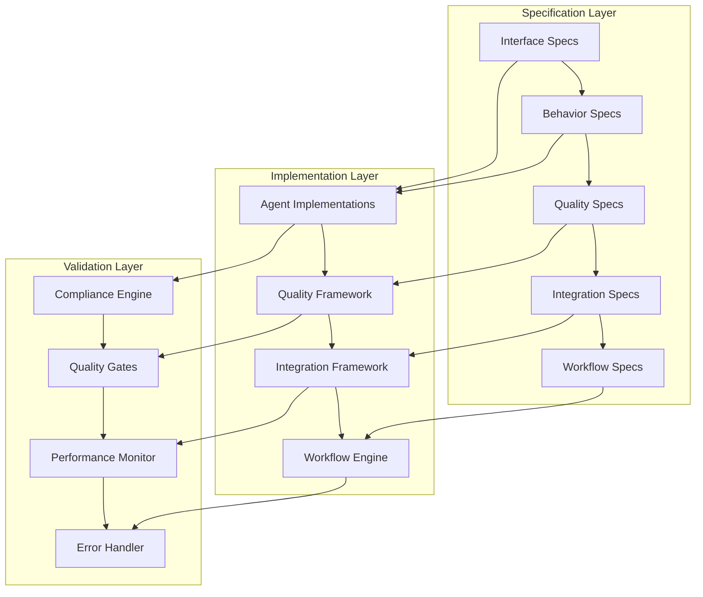
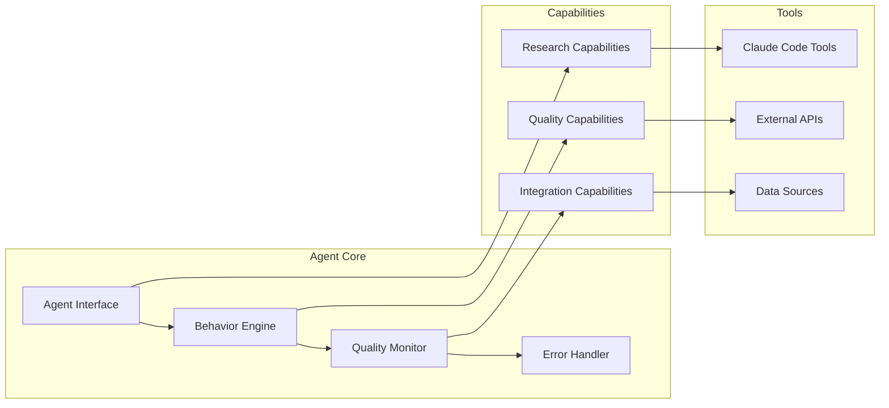
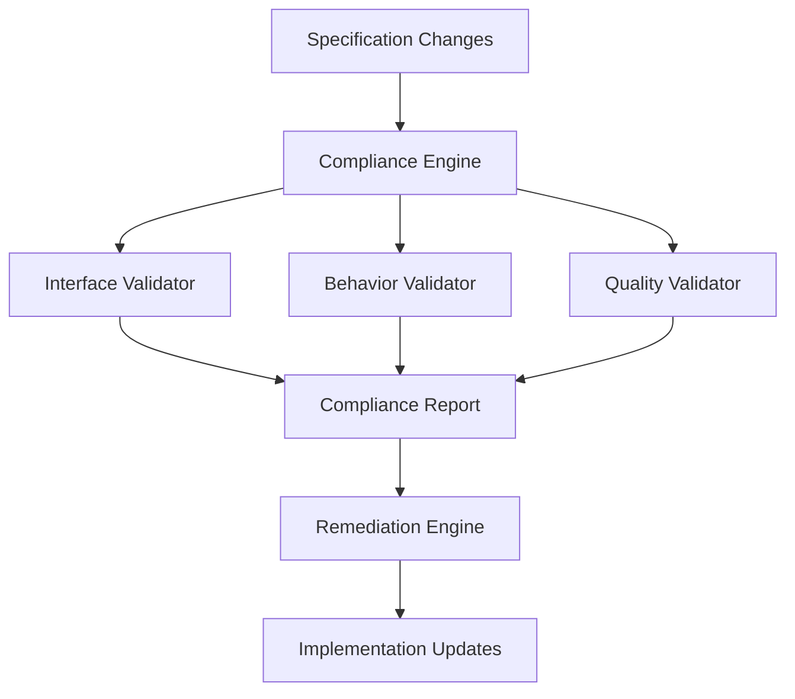
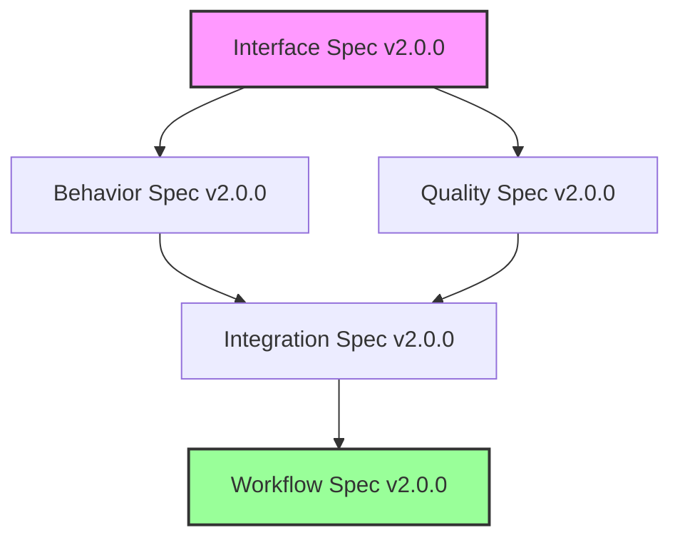
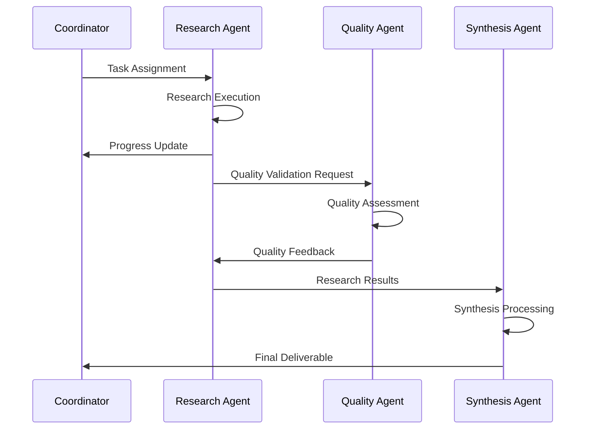
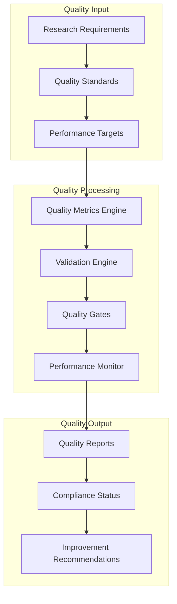

# System Architecture Documentation
## Claude Code Multi-Agent Research System

### Table of Contents
1. [Architecture Overview](#architecture-overview)
2. [Component Design](#component-design)
3. [Specification Framework](#specification-framework)
4. [Integration Patterns](#integration-patterns)
5. [Quality Assurance Architecture](#quality-assurance-architecture)
6. [Scalability Design](#scalability-design)
7. [Security Architecture](#security-architecture)
8. [Deployment Architecture](#deployment-architecture)

## Architecture Overview

### System Philosophy
The Claude Code multi-agent research system implements a **Specification-Driven Development (SDD) architecture** that ensures enterprise-grade quality, maintainability, and scalability through formal specifications and automated validation.



### Core Design Principles

1. **Specification-First Development**
   - All implementation decisions trace back to formal specifications
   - Automated validation ensures continuous compliance
   - Clear separation between specification and implementation

2. **Quality-Driven Architecture**
   - Built-in quality metrics and validation at every layer
   - Progressive quality refinement through multi-stage gates
   - Real-time quality monitoring and feedback

3. **Modular Component Design**
   - Loosely coupled components with well-defined interfaces
   - Independent deployability and testability
   - Extensible architecture supporting future enhancements

4. **Enterprise Scalability**
   - Horizontal scaling through multi-agent coordination
   - Vertical scaling through workflow optimization
   - Resource efficiency and performance optimization

## Component Design

### 1. Specification Framework

#### Interface Specifications
```json
{
  "component": "Agent Interface Specification",
  "purpose": "Define formal contracts and communication protocols",
  "format": "JSON Schema",
  "location": ".claude/specifications/interfaces/",
  "compliance": "Automated validation via JSON Schema"
}
```

#### Behavior Specifications
```yaml
component: "Agent Behavior Specification"
purpose: "Define workflow patterns and decision logic"
format: "YAML with behavior trees"
location: ".claude/specifications/behaviors/"
compliance: "Behavioral pattern validation"
```

#### Quality Specifications
```yaml
component: "Quality Assurance Specification"
purpose: "Define quality metrics and validation rules"
format: "YAML with metric definitions"
location: ".claude/specifications/quality/"
compliance: "Quality metric validation"
```

### 2. Implementation Framework

#### Agent Architecture


#### Deep Research Agent v2.0 Architecture
```yaml
component_structure:
  interface_layer:
    - command_processor
    - message_handler
    - validation_engine
  
  behavior_layer:
    - workflow_orchestrator
    - stage_manager
    - adaptive_strategy_engine
  
  quality_layer:
    - quality_assessor
    - bias_detector
    - performance_monitor
  
  integration_layer:
    - coordination_manager
    - communication_handler
    - resource_allocator
```

### 3. Validation Framework

#### Compliance Architecture


#### Quality Gate Architecture
```yaml
quality_gates:
  stage_1_planning:
    validators: [methodology_validator, resource_validator]
    threshold: 0.85
    remediation: [methodology_adjustment, resource_reallocation]
  
  stage_2_collection:
    validators: [source_validator, diversity_validator]
    threshold: 0.90
    remediation: [source_expansion, diversity_improvement]
  
  stage_3_analysis:
    validators: [bias_validator, integration_validator]
    threshold: 0.88
    remediation: [bias_mitigation, integration_enhancement]
  
  stage_4_validation:
    validators: [peer_review_validator, reproducibility_validator]
    threshold: 0.95
    remediation: [review_integration, reproducibility_enhancement]
```

## Specification Framework

### Specification Hierarchy
```
📁 Specifications/
├── 🎯 Core Specifications
│   ├── Agent Interface Specification (JSON Schema)
│   ├── Behavior Specification (YAML)
│   ├── Quality Specification (YAML)
│   ├── Integration Specification (YAML)
│   └── Workflow Specification (YAML)
├── 🔧 Implementation Guidance
│   ├── Development Methodology
│   ├── Best Practices
│   ├── Code Templates
│   └── Validation Tools
└── 📊 Compliance Framework
    ├── Validation Rules
    ├── Quality Gates
    ├── Reporting Standards
    └── Audit Procedures
```

### Specification Versioning
```yaml
versioning_strategy:
  semantic_versioning: "MAJOR.MINOR.PATCH"
  breaking_changes: "MAJOR increment"
  feature_additions: "MINOR increment"
  bug_fixes: "PATCH increment"
  
compatibility_matrix:
  v2.0.0:
    interface_spec: "2.0.0"
    behavior_spec: "2.0.0"
    quality_spec: "2.0.0"
    integration_spec: "2.0.0"
    workflow_spec: "2.0.0"
```

### Specification Dependencies


## Integration Patterns

### Multi-Agent Coordination
```yaml
coordination_patterns:
  hierarchical:
    structure: "Primary Coordinator → Specialist Agents"
    use_cases: ["Complex Research", "Quality Assurance", "High Stakes"]
    communication: "Command-Response with Progress Updates"
  
  peer_collaboration:
    structure: "Equal Agents with Consensus"
    use_cases: ["Exploratory Research", "Cross-Domain", "Collaborative Analysis"]
    communication: "Consensus-Based Decision Making"
  
  expert_panel:
    structure: "Expert Consultation Network"
    use_cases: ["Domain Expertise", "Quality Validation", "Complex Domains"]
    communication: "Consultation Requests and Expert Input"
```

### Communication Architecture


### Error Handling and Recovery
```yaml
error_handling_architecture:
  error_classification:
    recoverable:
      - source_unavailable
      - quality_threshold_not_met
      - resource_constraint_violation
    non_recoverable:
      - invalid_research_topic
      - system_resource_exhaustion
  
  recovery_strategies:
    retry_mechanisms:
      exponential_backoff: true
      max_retries: 3
      fallback_strategies: ["alternative_sources", "scope_adjustment"]
    
    graceful_degradation:
      quality_reduction: "controlled"
      scope_prioritization: "stakeholder_guided"
      notification_protocols: "immediate_stakeholder_alert"
```

## Quality Assurance Architecture

### Quality Framework Overview


### Multi-Dimensional Quality Assessment
```yaml
quality_dimensions:
  research_quality:
    accuracy_metrics:
      factual_accuracy: {target: 0.97, minimum: 0.90}
      citation_accuracy: {target: 0.98, minimum: 0.95}
      contextual_accuracy: {target: 0.90, minimum: 0.80}
    
    completeness_metrics:
      coverage_breadth: {target: 0.90, minimum: 0.80}
      depth_adequacy: {target: 0.85, minimum: 0.75}
      gap_identification: {target: 0.90, minimum: 0.80}
  
  process_quality:
    efficiency_metrics:
      workflow_efficiency: {target: 0.89, minimum: 0.75}
      resource_utilization: {target: 0.85, minimum: 0.70}
      timeline_adherence: {target: 0.92, minimum: 0.80}
    
    collaboration_metrics:
      stakeholder_satisfaction: {target: 4.7, minimum: 4.0}
      team_coordination: {target: 0.90, minimum: 0.80}
      communication_effectiveness: {target: 0.88, minimum: 0.75}
```

### Quality Gate Implementation
```yaml
quality_gate_architecture:
  gate_types:
    mandatory: ["initiation", "collection", "analysis", "validation"]
    conditional: ["intermediate_review", "expert_consultation"]
    adaptive: ["discovery_significance", "quality_trend"]
  
  validation_process:
    criteria_evaluation: "multi_dimensional"
    consensus_building: "weighted_stakeholder"
    decision_matrix: "evidence_based"
    escalation_paths: "defined_hierarchy"
```

## Scalability Design

### Horizontal Scaling
```yaml
horizontal_scaling:
  agent_scaling:
    load_balancing: "capability_based"
    resource_allocation: "dynamic"
    coordination_overhead: "minimized"
  
  workflow_parallelization:
    stage_parallelization: "collection_analysis"
    task_distribution: "intelligent"
    synchronization_points: "quality_gates"
```

### Vertical Scaling
```yaml
vertical_scaling:
  performance_optimization:
    algorithm_efficiency: "continuously_improved"
    resource_utilization: "optimized"
    caching_strategies: "intelligent"
  
  capability_enhancement:
    model_upgrades: "seamless"
    tool_integration: "modular"
    knowledge_expansion: "incremental"
```

### System Performance Targets
```yaml
performance_targets:
  response_time:
    simple_queries: "< 30 seconds"
    complex_research: "< 4 hours"
    quality_validation: "< 15 minutes"
  
  throughput:
    concurrent_requests: "> 10"
    daily_research_capacity: "> 50"
    quality_assessments: "> 100"
  
  resource_efficiency:
    cpu_utilization: "< 80%"
    memory_usage: "< 4GB per agent"
    storage_efficiency: "> 85%"
```

## Security Architecture

### Security Framework
```yaml
security_architecture:
  authentication:
    agent_identity: "cryptographic_certificates"
    user_authentication: "multi_factor"
    api_security: "token_based"
  
  authorization:
    role_based_access: "implemented"
    capability_restrictions: "enforced"
    resource_permissions: "granular"
  
  data_protection:
    encryption_at_rest: "AES_256"
    encryption_in_transit: "TLS_1.3"
    data_anonymization: "automatic"
```

### Compliance and Privacy
```yaml
compliance_framework:
  data_governance:
    retention_policies: "defined"
    deletion_procedures: "automated"
    audit_trails: "comprehensive"
  
  privacy_protection:
    data_minimization: "implemented"
    consent_management: "explicit"
    anonymization: "default"
```

## Deployment Architecture

### Environment Configuration
```yaml
deployment_environments:
  development:
    specification_validation: "continuous"
    quality_gates: "relaxed"
    monitoring: "detailed"
  
  staging:
    specification_validation: "strict"
    quality_gates: "standard"
    monitoring: "production_like"
  
  production:
    specification_validation: "enforced"
    quality_gates: "strict"
    monitoring: "comprehensive"
```

### Infrastructure Requirements
```yaml
infrastructure:
  compute_requirements:
    cpu: "4+ cores per agent"
    memory: "8GB+ per agent"
    storage: "100GB+ for knowledge base"
  
  network_requirements:
    bandwidth: "high_speed_internet"
    latency: "< 100ms to major data sources"
    reliability: "99.9% uptime"
  
  external_dependencies:
    claude_code_platform: "required"
    data_sources: "configurable"
    monitoring_tools: "optional"
```

This architecture provides a comprehensive foundation for building, deploying, and maintaining the multi-agent research system while ensuring enterprise-grade quality, security, and scalability.