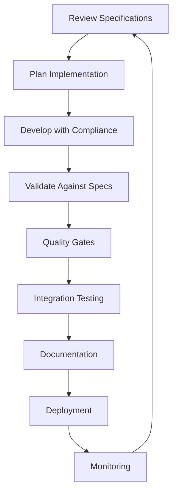

# Specification Framework Overview
## Formal Specification System for Multi-Agent Research

### Table of Contents
1. [Framework Introduction](#framework-introduction)
2. [Specification Types](#specification-types)
3. [Specification Structure](#specification-structure)
4. [Version Management](#version-management)
5. [Compliance Validation](#compliance-validation)
6. [Implementation Guidance](#implementation-guidance)
7. [Best Practices](#best-practices)
8. [Evolution and Maintenance](#evolution-and-maintenance)

## Framework Introduction

### Purpose and Philosophy

The Specification Framework provides a **formal, systematic approach** to defining, implementing, and maintaining the multi-agent research system through comprehensive specifications that serve as the single source of truth for system behavior, interfaces, and quality standards.

### Core Principles

1. **Specification Authority**: Formal specifications are the authoritative source for all system behavior
2. **Implementation Traceability**: Every implementation decision must trace back to a specification requirement
3. **Compliance Validation**: Continuous validation ensures implementation remains specification-compliant
4. **Evolutionary Design**: Specifications support system growth and adaptation over time

### Framework Benefits

✅ **Consistency**: Standardized behavior across all system components  
✅ **Quality**: Built-in quality assurance through formal validation  
✅ **Maintainability**: Clear specifications enable easier system maintenance  
✅ **Scalability**: Framework supports system growth and evolution  
✅ **Compliance**: Automated validation ensures specification adherence  

## Specification Types

### 1. Agent Interface Specifications (AIS)

**Purpose**: Define formal interfaces and contracts for agent communication  
**Format**: JSON Schema with YAML documentation  
**Location**: `.claude/specifications/interfaces/`  
**Scope**: Input/output schemas, command interfaces, message formats  

```json
{
  "$schema": "https://json-schema.org/draft/2020-12/schema",
  "title": "Agent Interface Specification",
  "description": "Formal interface specification for Claude Code research agents",
  "version": "2.0.0",
  "definitions": {
    "agent_metadata": {
      "type": "object",
      "properties": {
        "agent_id": {"type": "string", "pattern": "^[a-z][a-z0-9-]*[a-z0-9]$"},
        "capabilities": {"type": "array", "items": {"type": "string"}},
        "supported_commands": {"type": "array", "items": {"type": "string"}}
      }
    }
  }
}
```

### 2. Agent Behavior Specifications (ABS)

**Purpose**: Define expected behavior patterns and workflows  
**Format**: YAML with behavior trees and state machines  
**Location**: `.claude/specifications/behaviors/`  
**Scope**: Decision logic, workflow states, error handling  

```yaml
behavior_patterns:
  multi_stage_research_workflow:
    description: "Four-stage research process with quality gates"
    stages:
      planning:
        sequence_id: 1
        duration_percentage: "10-15%"
        quality_gate: "methodology_validation"
        behaviors:
          context_analysis:
            description: "Analyze research domain complexity"
            validation: "complexity_score >= 0.7"
```

### 3. Quality Assurance Specifications (QAS)

**Purpose**: Define quality metrics, validation rules, and acceptance criteria  
**Format**: YAML with metrics definitions and validation rules  
**Location**: `.claude/specifications/quality/`  
**Scope**: Performance targets, quality gates, compliance requirements  

```yaml
quality_metrics:
  research_quality:
    accuracy_metrics:
      factual_accuracy:
        target_threshold: 0.97
        minimum_threshold: 0.90
        measurement_method: "cross_reference_validation"
      citation_accuracy:
        target_threshold: 0.98
        minimum_threshold: 0.95
        measurement_method: "citation_verification"
```

### 4. Integration Specifications (IS)

**Purpose**: Define agent interaction patterns and coordination protocols  
**Format**: YAML with protocol definitions and sequence diagrams  
**Location**: `.claude/specifications/integration/`  
**Scope**: Multi-agent workflows, message passing, synchronization  

```yaml
coordination_patterns:
  hierarchical_coordination:
    description: "Primary coordinator delegates tasks to specialized agents"
    communication_protocol:
      task_assignment:
        message_type: "task_assignment"
        message_structure:
          - task_specification
          - quality_requirements
          - timeline_constraints
```

### 5. Workflow Specifications (WS)

**Purpose**: Define end-to-end research workflows and orchestration  
**Format**: YAML with workflow definitions and validation criteria  
**Location**: `.claude/specifications/workflows/`  
**Scope**: Research processes, quality gates, deliverable specifications  

```yaml
workflow_definitions:
  standard_research_workflow:
    workflow_id: "standard_research_v2.0"
    workflow_type: "linear_sequential_workflow"
    stages:
      1_initiation:
        stage_name: "research_initiation"
        duration_estimate: "5-10% of total timeline"
        quality_gate:
          gate_name: "initiation_completion_gate"
          validation_requirements:
            - all_planning_activities_completed
            - quality_criteria_met
```

## Specification Structure

### Standard Specification Format

All specifications follow a consistent structure to ensure uniformity and ease of use:

```yaml
---
# Specification Metadata
metadata:
  specification_type: "specification_category"
  specification_name: "unique_specification_name"
  version: "semantic_version"
  release_date: "YYYY-MM-DD"
  status: "draft|review|stable|deprecated"
  maintainer: "responsible_team"
  compatibility: ["dependency_specifications"]
  description: "specification_purpose_and_scope"

# Core Specification Content
specification_content:
  # Specification-specific structure varies by type
  # But all include validation criteria and examples

# Validation Rules
validation_rules:
  # Rules for validating compliance with this specification

# Testing Framework
testing_framework:
  # Test cases and validation procedures

# Change History
change_history:
  # Version history and change documentation
---
```

### Metadata Standards

#### Required Metadata Fields
- **specification_type**: Category of specification (interface, behavior, quality, etc.)
- **specification_name**: Unique identifier for the specification
- **version**: Semantic version following MAJOR.MINOR.PATCH format
- **release_date**: Release date in ISO format
- **status**: Current lifecycle status
- **description**: Clear purpose and scope description

#### Optional Metadata Fields
- **maintainer**: Team or individual responsible for maintenance
- **compatibility**: Dependencies and compatibility requirements
- **deprecated_date**: If status is deprecated, when deprecation occurs
- **replacement**: If deprecated, what replaces this specification

### Content Structure Standards

#### Hierarchical Organization
```yaml
# Level 1: Major Categories
major_category:
  # Level 2: Subcategories
  subcategory:
    # Level 3: Specific Items
    specific_item:
      description: "Clear description"
      validation_criteria: "Measurable criteria"
      examples: ["practical_examples"]
```

#### Validation Integration
```yaml
# Each specification element includes validation
element_name:
  description: "What this element does"
  inputs: ["required_inputs"]
  outputs: ["expected_outputs"]
  validation: "validation_criteria"
  error_handling: "error_response_pattern"
```

## Version Management

### Semantic Versioning

All specifications use semantic versioning (MAJOR.MINOR.PATCH):

- **MAJOR**: Breaking changes to interfaces or behaviors
- **MINOR**: Backward-compatible feature additions
- **PATCH**: Bug fixes and clarifications

### Version Compatibility

#### Compatibility Matrix
```yaml
# Example compatibility requirements
specification_compatibility:
  agent_interface_spec:
    current_version: "2.0.0"
    compatible_with:
      behavior_spec: ">=2.0.0"
      quality_spec: ">=2.0.0"
      integration_spec: ">=2.0.0"
```

#### Breaking Change Management
```yaml
breaking_change_process:
  identification:
    - interface_modifications
    - behavior_changes
    - quality_requirement_changes
  
  communication:
    - advance_notice: "30_days_minimum"
    - migration_guide: "provided"
    - support_period: "6_months"
  
  implementation:
    - parallel_versioning: "supported"
    - gradual_migration: "encouraged"
    - validation_tools: "updated"
```

### Change Management Process

#### Specification Updates
1. **Proposal**: Formal change proposal with impact analysis
2. **Review**: Stakeholder review and feedback integration
3. **Approval**: Formal approval from specification owners
4. **Implementation**: Specification update with version increment
5. **Communication**: Stakeholder notification and documentation
6. **Validation**: Updated validation tools and procedures

#### Implementation Updates
1. **Impact Assessment**: Analysis of specification changes on implementation
2. **Migration Planning**: Plan for updating implementation to new specifications
3. **Implementation**: Code changes to maintain specification compliance
4. **Validation**: Compliance testing with updated specifications
5. **Deployment**: Rollout of updated implementation

## Compliance Validation

### Automated Validation Framework

#### Validation Levels
```yaml
validation_levels:
  syntax_validation:
    purpose: "Schema compliance and format checking"
    tools: ["jsonschema", "yaml_validator"]
    frequency: "continuous"
  
  semantic_validation:
    purpose: "Behavior consistency and logic verification"
    tools: ["behavior_validator", "logic_checker"]
    frequency: "on_change"
  
  integration_validation:
    purpose: "Cross-component compatibility testing"
    tools: ["integration_tester", "compatibility_checker"]
    frequency: "pre_release"
  
  quality_validation:
    purpose: "Performance and quality metric compliance"
    tools: ["quality_auditor", "performance_validator"]
    frequency: "continuous"
```

#### Validation Tools
```python
# Example validation tool integration
class SpecificationValidator:
    def __init__(self, spec_path: str):
        self.spec_path = spec_path
        self.loaded_specs = self._load_specifications()
    
    def validate_interface_compliance(self, implementation):
        """Validate against interface specification"""
        interface_spec = self.loaded_specs["interface"]
        return self._validate_schema(implementation, interface_spec)
    
    def validate_behavior_compliance(self, implementation):
        """Validate against behavior specification"""
        behavior_spec = self.loaded_specs["behavior"]
        return self._validate_patterns(implementation, behavior_spec)
```

### Compliance Reporting

#### Real-Time Compliance Dashboard
```yaml
compliance_dashboard:
  overall_score: "percentage_compliance"
  component_scores:
    interface_compliance: "percentage"
    behavior_compliance: "percentage"
    quality_compliance: "percentage"
  
  trend_analysis:
    compliance_history: "30_day_trend"
    improvement_trajectory: "projected_compliance"
  
  issue_tracking:
    critical_issues: "immediate_attention_required"
    warnings: "should_be_addressed"
    recommendations: "improvement_suggestions"
```

#### Compliance Reports
```yaml
compliance_report_structure:
  executive_summary:
    overall_compliance_score: "percentage"
    key_achievements: "bullet_points"
    critical_issues: "immediate_actions_required"
  
  detailed_analysis:
    component_compliance: "per_specification_analysis"
    trend_analysis: "historical_compliance_data"
    risk_assessment: "compliance_risk_evaluation"
  
  recommendations:
    immediate_actions: "critical_fixes"
    improvement_opportunities: "enhancement_suggestions"
    best_practices: "compliance_optimization"
```

## Implementation Guidance

### Development Workflow

#### Specification-First Development


#### Implementation Steps
1. **Specification Analysis**: Understand applicable specifications
2. **Design Planning**: Design implementation to meet specifications
3. **Development**: Implement with built-in compliance validation
4. **Testing**: Verify compliance through automated testing
5. **Documentation**: Document specification compliance decisions
6. **Deployment**: Deploy with compliance monitoring
7. **Maintenance**: Maintain compliance through ongoing validation

### Code Integration Patterns

#### Specification References
```python
# Example: Specification-driven implementation
class SpecificationCompliantAgent:
    """
    Agent implementation following:
    - Interface Specification v2.0.0
    - Behavior Specification v2.0.0
    - Quality Specification v2.0.0
    """
    
    def __init__(self, spec_version="2.0.0"):
        # Load specifications for validation
        self.interface_spec = InterfaceSpec.load(spec_version)
        self.behavior_spec = BehaviorSpec.load(spec_version)
        self.quality_spec = QualitySpec.load(spec_version)
        
        # Validate initialization compliance
        self._validate_initialization()
```

#### Validation Integration
```python
# Example: Built-in compliance validation
def execute_research_command(self, command, parameters):
    """Execute research command with specification compliance"""
    
    # Pre-execution validation
    self._validate_command_interface(command, parameters)
    
    # Execute with behavior compliance
    result = self._execute_with_behavior_compliance(command, parameters)
    
    # Post-execution quality validation
    self._validate_quality_compliance(result)
    
    return result
```

## Best Practices

### Specification Development

#### Writing Effective Specifications
1. **Clarity**: Use clear, unambiguous language
2. **Completeness**: Cover all necessary aspects thoroughly
3. **Consistency**: Maintain consistent terminology and structure
4. **Testability**: Include measurable validation criteria
5. **Examples**: Provide concrete examples and use cases

#### Specification Review Process
1. **Stakeholder Input**: Gather input from all affected stakeholders
2. **Technical Review**: Ensure technical accuracy and feasibility
3. **Consistency Check**: Verify consistency with existing specifications
4. **Impact Analysis**: Assess impact on existing implementations
5. **Approval Process**: Formal approval from specification owners

### Implementation Best Practices

#### Compliance-Driven Development
```yaml
development_checklist:
  pre_development:
    - [ ] Review applicable specifications
    - [ ] Understand compliance requirements
    - [ ] Plan implementation approach
  
  during_development:
    - [ ] Implement with built-in validation
    - [ ] Test compliance continuously
    - [ ] Document specification decisions
  
  post_development:
    - [ ] Validate full compliance
    - [ ] Update documentation
    - [ ] Deploy with monitoring
```

#### Quality Assurance Integration
```yaml
qa_integration:
  automated_testing:
    - specification_compliance_tests
    - integration_compatibility_tests
    - performance_validation_tests
  
  manual_review:
    - specification_alignment_review
    - code_quality_assessment
    - documentation_completeness_check
  
  continuous_monitoring:
    - real_time_compliance_tracking
    - performance_metric_monitoring
    - quality_trend_analysis
```

## Evolution and Maintenance

### Specification Lifecycle

#### Lifecycle Stages
```yaml
specification_lifecycle:
  draft:
    description: "Under development, not ready for implementation"
    validation: "syntax_and_structure_only"
    usage: "development_and_testing_only"
  
  review:
    description: "Ready for stakeholder review and feedback"
    validation: "comprehensive_review_process"
    usage: "limited_pilot_implementations"
  
  stable:
    description: "Approved and ready for production implementation"
    validation: "full_compliance_required"
    usage: "production_implementations"
  
  deprecated:
    description: "Superseded by newer version, scheduled for removal"
    validation: "migration_path_provided"
    usage: "maintenance_mode_only"
  
  retired:
    description: "No longer supported, removed from active use"
    validation: "historical_reference_only"
    usage: "not_recommended"
```

### Continuous Improvement

#### Feedback Integration
```yaml
improvement_process:
  feedback_collection:
    - implementation_experience
    - usage_analytics
    - stakeholder_feedback
    - industry_best_practices
  
  analysis_and_planning:
    - gap_identification
    - improvement_prioritization
    - impact_assessment
    - resource_planning
  
  implementation:
    - specification_updates
    - tool_improvements
    - process_enhancements
    - training_updates
  
  validation:
    - effectiveness_measurement
    - stakeholder_satisfaction
    - compliance_improvement
    - quality_enhancement
```

#### Evolution Strategy
```yaml
evolution_strategy:
  incremental_improvement:
    - regular_minor_updates
    - continuous_refinement
    - feedback_integration
  
  major_enhancements:
    - significant_capability_additions
    - architectural_improvements
    - technology_upgrades
  
  ecosystem_expansion:
    - new_specification_types
    - integration_frameworks
    - tool_ecosystem_growth
```

This specification framework provides a comprehensive foundation for building, maintaining, and evolving the multi-agent research system while ensuring consistency, quality, and compliance across all components.