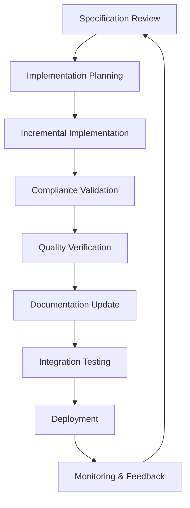

# Specification-Driven Development Implementation Guide

## Overview

This guide provides practical implementation guidance for Specification-Driven Development (SDD) in the Claude Code multi-agent research system. SDD ensures that all implementation decisions are grounded in formal specifications, creating a traceable, compliant, and maintainable system architecture.

## SDD Implementation Methodology

### Core Principles

1. **Specification Authority**: Formal specifications are the single source of truth for system behavior
2. **Implementation Traceability**: Every implementation decision must trace back to a specification requirement
3. **Compliance Validation**: Continuous validation ensures implementation remains specification-compliant
4. **Incremental Conformance**: Progressive implementation with validation at each step

### Implementation Workflow



## Phase 1: Specification Analysis and Planning

### 1.1 Specification Review Process

**Step 1: Specification Inventory**
```bash
# Review all applicable specifications
find .claude/specifications -name "*.yaml" -o -name "*.json" | sort
```

**Step 2: Dependency Mapping**
- Map specification dependencies using compatibility matrices
- Identify implementation order based on dependencies
- Plan incremental implementation phases

**Step 3: Gap Analysis**
```yaml
# Example gap analysis template
gap_analysis:
  current_implementation:
    agent_interface: "v1.0 (incomplete)"
    behavior_patterns: "v0.5 (draft)"
    quality_metrics: "not_implemented"
  
  target_specifications:
    agent_interface: "v2.0.0"
    behavior_patterns: "v2.0.0" 
    quality_metrics: "v2.0.0"
  
  implementation_gaps:
    - "Multi-parameter command interface"
    - "Adaptive behavior framework"
    - "Comprehensive quality metrics"
```

### 1.2 Implementation Architecture Design

**Component Mapping**
```python
# Example specification-to-implementation mapping
class SpecificationMapping:
    def __init__(self):
        self.mappings = {
            "agent_interface_spec": {
                "implementation_module": "agents.interface",
                "validation_module": "validation.interface_validator",
                "test_module": "tests.test_interface_compliance"
            },
            "behavior_spec": {
                "implementation_module": "agents.behavior",
                "validation_module": "validation.behavior_validator", 
                "test_module": "tests.test_behavior_compliance"
            }
        }
```

**Architecture Validation**
- Ensure architecture supports all specification requirements
- Plan for specification evolution and backward compatibility
- Design validation hooks and compliance monitoring

## Phase 2: Incremental Implementation

### 2.1 Specification-First Implementation Pattern

**Implementation Template**
```python
from typing import Dict, Any
from .specifications import AgentInterfaceSpec
from .validation import SpecificationValidator

class SpecDrivenAgent:
    """Agent implementation following specification-driven pattern"""
    
    def __init__(self, spec_version: str = "2.0.0"):
        self.spec = AgentInterfaceSpec.load(spec_version)
        self.validator = SpecificationValidator(self.spec)
        self._validate_initialization()
    
    def _validate_initialization(self):
        """Validate initialization against specification"""
        if not self.validator.validate_agent_metadata(self.metadata):
            raise SpecificationViolationError("Agent metadata non-compliant")
    
    def execute_command(self, command: str, parameters: Dict[str, Any]) -> Dict[str, Any]:
        """Execute command with specification validation"""
        # Pre-execution validation
        self.validator.validate_command_interface(command, parameters)
        
        # Execute with specification compliance
        result = self._execute_with_spec_compliance(command, parameters)
        
        # Post-execution validation
        self.validator.validate_response_format(result)
        
        return result
```

### 2.2 Compliance-Driven Development Process

**Development Checklist**
- [ ] Specification requirements identified and documented
- [ ] Implementation design reviewed against specifications
- [ ] Code implements all required specification elements
- [ ] Validation tests written for specification compliance
- [ ] Integration tests verify specification adherence
- [ ] Documentation updated to reflect specification compliance

**Validation Integration**
```bash
# Pre-commit hook for specification compliance
#!/bin/bash
# .claude/hooks/spec_compliance_check.sh

echo "Running specification compliance checks..."

# Validate against interface specification
python -m validation.interface_validator --spec-version 2.0.0

# Validate against behavior specification
python -m validation.behavior_validator --spec-version 2.0.0

# Validate against quality specification
python -m validation.quality_validator --spec-version 2.0.0

if [ $? -ne 0 ]; then
    echo "❌ Specification compliance check failed"
    exit 1
fi

echo "✅ Specification compliance verified"
```

### 2.3 Quality Gate Implementation

**Quality Gate Framework**
```python
class QualityGate:
    """Implements specification-defined quality gates"""
    
    def __init__(self, gate_specification: Dict[str, Any]):
        self.spec = gate_specification
        self.validation_criteria = gate_specification['validation_requirements']
    
    def evaluate(self, implementation_artifact: Any) -> bool:
        """Evaluate artifact against quality gate criteria"""
        results = {}
        
        for criterion, threshold in self.validation_criteria.items():
            metric_value = self._measure_criterion(implementation_artifact, criterion)
            results[criterion] = {
                'value': metric_value,
                'threshold': threshold,
                'passed': self._evaluate_threshold(metric_value, threshold)
            }
        
        return all(result['passed'] for result in results.values())
    
    def _measure_criterion(self, artifact: Any, criterion: str) -> float:
        """Measure specific quality criterion"""
        # Implementation specific to criterion type
        pass
    
    def _evaluate_threshold(self, value: float, threshold: str) -> bool:
        """Evaluate value against threshold specification"""
        # Parse threshold specification (e.g., ">= 0.85")
        pass
```

## Phase 3: Validation and Compliance

### 3.1 Automated Compliance Validation

**Specification Validator Implementation**
```python
import json
import yaml
from typing import Dict, List, Any
from jsonschema import validate, ValidationError

class SpecificationValidator:
    """Validates implementation against formal specifications"""
    
    def __init__(self, specifications_path: str = ".claude/specifications"):
        self.specs_path = specifications_path
        self.loaded_specs = {}
        self._load_specifications()
    
    def _load_specifications(self):
        """Load all specifications for validation"""
        spec_files = [
            "interfaces/agent-interface-specification.json",
            "behaviors/research-behavior-specification.yaml",
            "quality/quality-assurance-specification.yaml",
            "integration/agent-coordination-specification.yaml",
            "workflows/research-workflow-specification.yaml"
        ]
        
        for spec_file in spec_files:
            spec_path = f"{self.specs_path}/{spec_file}"
            if spec_file.endswith('.json'):
                with open(spec_path, 'r') as f:
                    self.loaded_specs[spec_file] = json.load(f)
            elif spec_file.endswith('.yaml'):
                with open(spec_path, 'r') as f:
                    self.loaded_specs[spec_file] = yaml.safe_load(f)
    
    def validate_agent_interface(self, agent_implementation: Any) -> bool:
        """Validate agent against interface specification"""
        interface_spec = self.loaded_specs["interfaces/agent-interface-specification.json"]
        
        try:
            # Validate agent metadata
            validate(instance=agent_implementation.metadata, 
                    schema=interface_spec["definitions"]["agent_metadata"])
            
            # Validate command interfaces
            for command in agent_implementation.supported_commands:
                self._validate_command_interface(command, interface_spec)
            
            return True
        except ValidationError as e:
            print(f"❌ Interface validation failed: {e.message}")
            return False
    
    def validate_behavior_compliance(self, agent_behavior: Any) -> bool:
        """Validate agent behavior against specification"""
        behavior_spec = self.loaded_specs["behaviors/research-behavior-specification.yaml"]
        
        # Validate behavior patterns implementation
        required_patterns = behavior_spec["behavior_patterns"].keys()
        implemented_patterns = agent_behavior.get_implemented_patterns()
        
        missing_patterns = set(required_patterns) - set(implemented_patterns)
        if missing_patterns:
            print(f"❌ Missing behavior patterns: {missing_patterns}")
            return False
        
        return True
    
    def validate_quality_metrics(self, quality_implementation: Any) -> bool:
        """Validate quality metrics against specification"""
        quality_spec = self.loaded_specs["quality/quality-assurance-specification.yaml"]
        
        # Validate quality metrics implementation
        required_metrics = quality_spec["quality_metrics"].keys()
        implemented_metrics = quality_implementation.get_implemented_metrics()
        
        missing_metrics = set(required_metrics) - set(implemented_metrics)
        if missing_metrics:
            print(f"❌ Missing quality metrics: {missing_metrics}")
            return False
        
        return True
```

### 3.2 Continuous Compliance Monitoring

**Monitoring Framework**
```python
class ComplianceMonitor:
    """Continuous monitoring of specification compliance"""
    
    def __init__(self, monitoring_config: Dict[str, Any]):
        self.config = monitoring_config
        self.validator = SpecificationValidator()
        self.compliance_history = []
    
    def run_compliance_check(self) -> Dict[str, Any]:
        """Execute comprehensive compliance check"""
        results = {
            "timestamp": datetime.now().isoformat(),
            "compliance_score": 0.0,
            "detailed_results": {},
            "violations": [],
            "recommendations": []
        }
        
        # Interface compliance
        interface_compliance = self._check_interface_compliance()
        results["detailed_results"]["interface"] = interface_compliance
        
        # Behavior compliance
        behavior_compliance = self._check_behavior_compliance()
        results["detailed_results"]["behavior"] = behavior_compliance
        
        # Quality compliance
        quality_compliance = self._check_quality_compliance()
        results["detailed_results"]["quality"] = quality_compliance
        
        # Calculate overall compliance score
        results["compliance_score"] = self._calculate_compliance_score(results["detailed_results"])
        
        self.compliance_history.append(results)
        return results
    
    def generate_compliance_report(self) -> str:
        """Generate compliance report for stakeholders"""
        latest_results = self.compliance_history[-1] if self.compliance_history else None
        
        if not latest_results:
            return "No compliance data available"
        
        report = f"""
# Specification Compliance Report

## Overall Compliance Score: {latest_results['compliance_score']:.2f}

### Interface Compliance: {latest_results['detailed_results']['interface']['score']:.2f}
- Required capabilities: {latest_results['detailed_results']['interface']['capabilities_check']}
- Command interfaces: {latest_results['detailed_results']['interface']['commands_check']}
- Message formats: {latest_results['detailed_results']['interface']['messages_check']}

### Behavior Compliance: {latest_results['detailed_results']['behavior']['score']:.2f}
- Workflow patterns: {latest_results['detailed_results']['behavior']['patterns_check']}
- Quality gates: {latest_results['detailed_results']['behavior']['gates_check']}
- Error handling: {latest_results['detailed_results']['behavior']['error_handling_check']}

### Quality Compliance: {latest_results['detailed_results']['quality']['score']:.2f}
- Metrics implementation: {latest_results['detailed_results']['quality']['metrics_check']}
- Validation rules: {latest_results['detailed_results']['quality']['validation_check']}
- Performance targets: {latest_results['detailed_results']['quality']['performance_check']}

## Violations Detected
{chr(10).join(['- ' + violation for violation in latest_results['violations']])}

## Recommendations
{chr(10).join(['- ' + rec for rec in latest_results['recommendations']])}
"""
        return report
```

## Phase 4: Documentation and Maintenance

### 4.1 Specification-Implementation Mapping

**Traceability Documentation**
```yaml
# .claude/documentation/specification-traceability.yaml
traceability_matrix:
  agent_interface_specification:
    version: "2.0.0"
    implementation_files:
      - "agents/interface/agent_interface.py"
      - "agents/interface/command_processor.py"
      - "agents/interface/message_handler.py"
    validation_files:
      - "validation/interface_validator.py"
      - "tests/test_interface_compliance.py"
    specification_sections:
      agent_metadata:
        implementation: "agents.interface.agent_interface.AgentMetadata"
        validation: "validation.interface_validator.validate_agent_metadata"
      command_interface:
        implementation: "agents.interface.command_processor.CommandProcessor"
        validation: "validation.interface_validator.validate_command_interface"
```

### 4.2 Maintenance Procedures

**Specification Update Process**
1. **Change Detection**: Monitor specification repository for updates
2. **Impact Analysis**: Analyze impact of specification changes on implementation
3. **Migration Planning**: Plan implementation updates to maintain compliance
4. **Implementation Update**: Update implementation to match new specifications
5. **Validation**: Verify updated implementation maintains compliance
6. **Documentation**: Update traceability and documentation

**Compliance Drift Prevention**
```python
class ComplianceDriftDetector:
    """Detects drift between implementation and specifications"""
    
    def __init__(self):
        self.baseline_compliance = None
        self.drift_threshold = 0.05  # 5% drift threshold
    
    def detect_drift(self, current_compliance: Dict[str, float]) -> List[str]:
        """Detect compliance drift from baseline"""
        if not self.baseline_compliance:
            self.baseline_compliance = current_compliance
            return []
        
        drift_alerts = []
        for component, score in current_compliance.items():
            baseline_score = self.baseline_compliance.get(component, 0.0)
            drift = abs(score - baseline_score)
            
            if drift > self.drift_threshold:
                drift_alerts.append(f"Compliance drift detected in {component}: {drift:.3f}")
        
        return drift_alerts
```

## Best Practices and Guidelines

### Implementation Best Practices

1. **Start Small**: Begin with core specifications and expand incrementally
2. **Validate Early**: Implement validation alongside functionality
3. **Document Decisions**: Maintain clear traceability to specifications
4. **Monitor Continuously**: Use automated compliance monitoring
5. **Plan for Evolution**: Design for specification updates and changes

### Common Pitfalls and Solutions

**Pitfall 1: Specification Interpretation Ambiguity**
- Solution: Clarify ambiguities with specification authors before implementation
- Prevention: Use concrete examples and test cases in specifications

**Pitfall 2: Compliance Validation Overhead**
- Solution: Implement efficient validation with caching and optimization
- Prevention: Design validation to be lightweight and fast

**Pitfall 3: Specification Drift**
- Solution: Implement automated drift detection and alerting
- Prevention: Use version control and change management for specifications

### Quality Assurance Integration

**SDD Quality Checklist**
- [ ] All requirements traced to specifications
- [ ] Implementation validates against specifications
- [ ] Quality gates enforce specification compliance
- [ ] Documentation maintains specification traceability
- [ ] Monitoring detects specification drift

This specification-driven development approach ensures that the multi-agent research system remains compliant, maintainable, and aligned with formal specifications throughout its lifecycle.