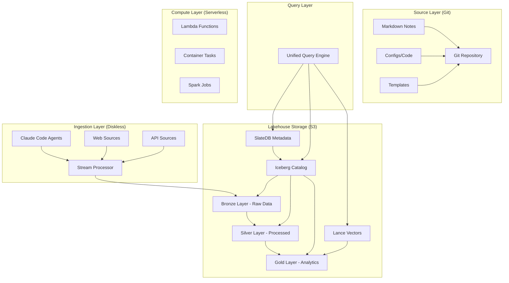

# PKM Lakehouse Architecture

## Executive Summary

This document defines a modern, diskless lakehouse architecture for the PKM system, combining the flexibility of data lakes with the reliability of data warehouses. Using Apache Iceberg for table management, SlateDB for metadata, Lance for vectors, and S3 as the unified storage layer, this architecture eliminates local disk dependencies while providing ACID transactions, time travel, and unified analytics.

## Architecture Overview



## Core Components

### 1. Apache Iceberg Catalog

#### Table Organization
```python
class IcebergCatalog:
    """
    Manages PKM tables with ACID guarantees and time travel
    """
    
    def __init__(self, catalog_uri: str):
        self.catalog = load_catalog(
            "pkm_catalog",
            **{
                "type": "glue",  # or "rest", "hive"
                "uri": catalog_uri,
                "warehouse": "s3://pkm-lakehouse/warehouse",
                "io-impl": "org.apache.iceberg.aws.s3.S3FileIO",
                "s3.endpoint": "https://s3.amazonaws.com"
            }
        )
    
    def create_tables(self):
        # Notes table with versioning
        notes_schema = Schema(
            NestedField(1, "note_id", StringType(), required=True),
            NestedField(2, "content", StringType(), required=True),
            NestedField(3, "embedding", ListType(4, FloatType())),
            NestedField(4, "metadata", StructType([
                NestedField(5, "created_at", TimestampType()),
                NestedField(6, "modified_at", TimestampType()),
                NestedField(7, "type", StringType()),
                NestedField(8, "tags", ListType(9, StringType())),
                NestedField(9, "quality_score", FloatType())
            ])),
            NestedField(10, "relationships", MapType(11, 12, StringType(), StringType())),
            NestedField(11, "processing_stage", StringType()),
            NestedField(12, "partition_date", DateType())
        )
        
        # Create partitioned table
        self.catalog.create_table(
            "pkm.bronze.notes",
            schema=notes_schema,
            partition_spec=PartitionSpec(
                PartitionField("partition_date", "day", "day")
            ),
            properties={
                "write.format.default": "parquet",
                "write.parquet.compression-codec": "snappy",
                "write.metadata.compression-codec": "gzip",
                "history.expire.max-snapshot-age-ms": "604800000",  # 7 days
                "write.object-storage.enabled": "true",
                "write.object-storage.path": "s3://pkm-lakehouse/bronze/notes"
            }
        )
```

#### Lakehouse Layers

```yaml
lakehouse_layers:
  bronze:
    purpose: Raw data ingestion
    tables:
      - raw_notes: Unprocessed markdown content
      - raw_media: Binary media files
      - raw_web_clips: Web content captures
      - raw_imports: External system imports
    format: Iceberg tables with Parquet files
    retention: 90 days
    
  silver:
    purpose: Cleaned and enriched data
    tables:
      - processed_notes: Parsed and validated notes
      - extracted_concepts: NLP-extracted entities
      - knowledge_graph: Relationships and connections
      - user_events: Processed activity streams
    format: Iceberg tables with optimized Parquet
    retention: 1 year
    
  gold:
    purpose: Analytics-ready aggregates
    tables:
      - note_metrics: Aggregated statistics
      - insights: Generated insights
      - summaries: Multi-level summaries
      - teaching_materials: Generated content
    format: Iceberg + Lance for vectors
    retention: Indefinite
```

### 2. SlateDB Metadata Layer

```python
import slatedb
from typing import Dict, Any, Optional
import json

class SlateDBMetadata:
    """
    Diskless metadata store using SlateDB over S3
    """
    
    def __init__(self, s3_bucket: str, prefix: str):
        self.db = slatedb.open(
            path=f"s3://{s3_bucket}/{prefix}",
            config={
                "flush_interval": 1000,  # ms
                "object_store": {
                    "type": "s3",
                    "bucket": s3_bucket,
                    "region": "us-east-1",
                    "prefix": prefix
                },
                "cache": {
                    "block_cache_size": 64 * 1024 * 1024,  # 64MB
                    "page_cache_size": 16 * 1024 * 1024     # 16MB
                },
                "compaction": {
                    "l0_compaction_threshold": 4,
                    "l1_compaction_threshold": 4,
                    "max_compaction_size": 2 * 1024 * 1024 * 1024  # 2GB
                }
            }
        )
    
    def store_note_metadata(self, note_id: str, metadata: Dict[str, Any]):
        """
        Store note metadata in SlateDB
        """
        key = f"note:{note_id}".encode()
        value = json.dumps({
            "id": note_id,
            "metadata": metadata,
            "indexed_at": datetime.now().isoformat(),
            "version": 1
        }).encode()
        
        self.db.put(key, value)
    
    def get_note_metadata(self, note_id: str) -> Optional[Dict]:
        """
        Retrieve note metadata
        """
        key = f"note:{note_id}".encode()
        value = self.db.get(key)
        
        if value:
            return json.loads(value.decode())
        return None
    
    def store_processing_state(self, job_id: str, state: Dict):
        """
        Store processing job state
        """
        key = f"job:{job_id}".encode()
        value = json.dumps({
            "job_id": job_id,
            "state": state,
            "timestamp": datetime.now().isoformat()
        }).encode()
        
        self.db.put(key, value)
    
    def list_notes_by_prefix(self, prefix: str) -> List[Dict]:
        """
        List all notes with a given prefix
        """
        results = []
        start_key = f"note:{prefix}".encode()
        
        for key, value in self.db.scan(start_key):
            if not key.startswith(b"note:"):
                break
            results.append(json.loads(value.decode()))
        
        return results
```

### 3. Diskless Data Pipeline

#### Ingestion Pipeline
```python
class DisklessIngestionPipeline:
    """
    Completely diskless ingestion using streaming and S3
    """
    
    def __init__(self, config: Dict):
        self.iceberg = IcebergCatalog(config['iceberg_uri'])
        self.slatedb = SlateDBMetadata(config['s3_bucket'], 'metadata')
        self.s3_client = boto3.client('s3')
        self.buffer = io.BytesIO()  # In-memory buffer
    
    async def ingest_note(self, content: str, source: str) -> str:
        """
        Ingest note without touching disk
        """
        # Generate unique ID
        note_id = str(uuid.uuid4())
        timestamp = datetime.now()
        
        # Process in memory
        processed_data = {
            'note_id': note_id,
            'content': content,
            'source': source,
            'ingested_at': timestamp.isoformat(),
            'processing_stage': 'bronze'
        }
        
        # Write directly to S3 (Bronze layer)
        s3_key = f"bronze/notes/year={timestamp.year}/month={timestamp.month:02d}/day={timestamp.day:02d}/{note_id}.parquet"
        
        # Create Parquet in memory
        df = pd.DataFrame([processed_data])
        parquet_buffer = io.BytesIO()
        df.to_parquet(parquet_buffer, engine='pyarrow', compression='snappy')
        
        # Upload to S3
        self.s3_client.put_object(
            Bucket=self.config['s3_bucket'],
            Key=s3_key,
            Body=parquet_buffer.getvalue(),
            ContentType='application/octet-stream',
            Metadata={
                'note_id': note_id,
                'stage': 'bronze',
                'timestamp': timestamp.isoformat()
            }
        )
        
        # Register with Iceberg
        self.iceberg.catalog.load_table("pkm.bronze.notes").append(df)
        
        # Store metadata in SlateDB
        await self.slatedb.store_note_metadata(note_id, {
            'source': source,
            'ingested_at': timestamp.isoformat(),
            's3_location': s3_key,
            'size_bytes': len(parquet_buffer.getvalue())
        })
        
        return note_id
    
    async def stream_process(self, note_id: str):
        """
        Stream processing without local storage
        """
        # Read from Bronze
        bronze_df = self.iceberg.catalog.load_table("pkm.bronze.notes").scan(
            filter=f"note_id = '{note_id}'"
        ).to_pandas()
        
        # Process in memory
        processed = await self.process_note(bronze_df.iloc[0])
        
        # Write to Silver
        silver_key = f"silver/notes/{note_id}.parquet"
        silver_df = pd.DataFrame([processed])
        
        parquet_buffer = io.BytesIO()
        silver_df.to_parquet(parquet_buffer)
        
        self.s3_client.put_object(
            Bucket=self.config['s3_bucket'],
            Key=silver_key,
            Body=parquet_buffer.getvalue()
        )
        
        # Update Iceberg
        self.iceberg.catalog.load_table("pkm.silver.notes").append(silver_df)
        
        # Update metadata
        await self.slatedb.store_processing_state(note_id, {
            'stage': 'silver',
            'processed_at': datetime.now().isoformat()
        })
```

### 4. Enhanced Lance Integration

```python
class LakehouseLanceVectorStore:
    """
    Lance vector store integrated with Iceberg lakehouse
    """
    
    def __init__(self, s3_path: str, iceberg_catalog):
        self.lance_path = s3_path
        self.iceberg = iceberg_catalog
        self.datasets = {}
    
    def create_vector_table(self, table_name: str):
        """
        Create Lance table linked to Iceberg catalog
        """
        # Define schema matching Iceberg
        schema = pa.schema([
            pa.field("note_id", pa.string()),
            pa.field("embedding", pa.list_(pa.float32(), 768)),
            pa.field("model", pa.string()),
            pa.field("created_at", pa.timestamp('us')),
            pa.field("iceberg_snapshot_id", pa.int64()),  # Link to Iceberg
            pa.field("metadata", pa.struct([
                pa.field("source_table", pa.string()),
                pa.field("processing_stage", pa.string()),
                pa.field("quality_score", pa.float32())
            ]))
        ])
        
        # Create Lance dataset
        dataset_path = f"{self.lance_path}/{table_name}"
        lance.write_dataset(
            [],
            dataset_path,
            schema=schema,
            mode="create"
        )
        
        # Register in Iceberg as external table
        self.iceberg.catalog.register_table(
            f"pkm.vectors.{table_name}",
            metadata_location=f"{dataset_path}/_metadata",
            properties={
                "table_type": "EXTERNAL",
                "format": "lance",
                "location": dataset_path
            }
        )
    
    def add_embeddings_with_lineage(self, embeddings: List[Dict], 
                                   iceberg_snapshot_id: int):
        """
        Add embeddings with Iceberg lineage tracking
        """
        # Add Iceberg snapshot reference
        for emb in embeddings:
            emb['iceberg_snapshot_id'] = iceberg_snapshot_id
        
        # Convert to Arrow table
        table = pa.table(embeddings)
        
        # Append to Lance
        lance.write_dataset(
            table,
            self.lance_path,
            mode="append"
        )
```

### 5. Unified Query Layer

```python
class UnifiedLakehouseQuery:
    """
    Unified query interface across Iceberg, Lance, and SlateDB
    """
    
    def __init__(self, config: Dict):
        self.iceberg = IcebergCatalog(config['iceberg_uri'])
        self.lance = LakehouseLanceVectorStore(config['lance_path'], self.iceberg)
        self.slatedb = SlateDBMetadata(config['s3_bucket'], 'metadata')
        
        # Initialize query engines
        self.spark = self._init_spark()
        self.duckdb_conn = self._init_duckdb()
    
    def _init_spark(self):
        """
        Initialize Spark with Iceberg support
        """
        return SparkSession.builder \
            .appName("PKM-Lakehouse") \
            .config("spark.sql.extensions", "org.apache.iceberg.spark.extensions.IcebergSparkSessionExtensions") \
            .config("spark.sql.catalog.pkm", "org.apache.iceberg.spark.SparkCatalog") \
            .config("spark.sql.catalog.pkm.type", "glue") \
            .config("spark.sql.catalog.pkm.warehouse", "s3://pkm-lakehouse/warehouse") \
            .config("spark.sql.defaultCatalog", "pkm") \
            .getOrCreate()
    
    def _init_duckdb(self):
        """
        Initialize DuckDB for analytical queries
        """
        conn = duckdb.connect(':memory:')
        
        # Install and load extensions
        conn.execute("INSTALL iceberg")
        conn.execute("LOAD iceberg")
        conn.execute("INSTALL httpfs")
        conn.execute("LOAD httpfs")
        
        # Configure S3
        conn.execute(f"""
            SET s3_region='us-east-1';
            SET s3_access_key_id='{os.environ['AWS_ACCESS_KEY_ID']}';
            SET s3_secret_access_key='{os.environ['AWS_SECRET_ACCESS_KEY']}';
        """)
        
        return conn
    
    def time_travel_query(self, table: str, timestamp: datetime) -> pd.DataFrame:
        """
        Query table at specific point in time
        """
        # Use Iceberg time travel
        snapshot_id = self.iceberg.catalog.load_table(table).history().loc[
            lambda x: x['committed_at'] <= timestamp
        ].iloc[-1]['snapshot_id']
        
        # Query with Spark
        df = self.spark.read \
            .option("snapshot-id", snapshot_id) \
            .table(table)
        
        return df.toPandas()
    
    def vector_similarity_search(self, query_vector: np.ndarray, 
                                table: str, k: int = 10) -> pd.DataFrame:
        """
        Combined vector search with metadata from Iceberg
        """
        # Vector search in Lance
        lance_results = self.lance.vector_search(table, query_vector, k)
        
        # Get note IDs
        note_ids = [r['note_id'] for r in lance_results]
        
        # Join with Iceberg metadata
        iceberg_df = self.spark.sql(f"""
            SELECT * FROM pkm.gold.notes
            WHERE note_id IN ({','.join([f"'{id}'" for id in note_ids])})
        """).toPandas()
        
        # Merge results
        results_df = pd.DataFrame(lance_results)
        return results_df.merge(iceberg_df, on='note_id')
    
    def analytical_query(self, sql: str) -> pd.DataFrame:
        """
        Run analytical SQL across lakehouse
        """
        # Register Iceberg tables in DuckDB
        for table in ['bronze.notes', 'silver.notes', 'gold.notes']:
            self.duckdb_conn.execute(f"""
                CREATE OR REPLACE VIEW {table.replace('.', '_')} AS
                SELECT * FROM iceberg_scan('s3://pkm-lakehouse/warehouse/{table}')
            """)
        
        # Execute query
        return self.duckdb_conn.execute(sql).fetchdf()
```

### 6. Claude Code Integration

```python
class ClaudeCodeLakehouseAgent:
    """
    Claude Code agent for lakehouse operations
    """
    
    def __init__(self):
        self.lakehouse = UnifiedLakehouseQuery(self.load_config())
        self.pipeline = DisklessIngestionPipeline(self.load_config())
    
    async def process_command(self, command: str, params: Dict) -> Dict:
        """
        Process Claude Code commands
        """
        if command == "/pkm-ingest":
            # Ingest from Git
            content = self.read_git_file(params['file'])
            note_id = await self.pipeline.ingest_note(content, 'git')
            
            # Trigger processing
            await self.pipeline.stream_process(note_id)
            
            return {"status": "success", "note_id": note_id}
        
        elif command == "/pkm-query":
            # Analytical query
            results = self.lakehouse.analytical_query(params['sql'])
            return {"results": results.to_dict()}
        
        elif command == "/pkm-search":
            # Vector similarity search
            embedding = await self.generate_embedding(params['query'])
            results = self.lakehouse.vector_similarity_search(
                embedding, 
                'gold.note_embeddings',
                params.get('k', 10)
            )
            return {"results": results.to_dict()}
        
        elif command == "/pkm-timetravel":
            # Time travel query
            results = self.lakehouse.time_travel_query(
                params['table'],
                params['timestamp']
            )
            return {"results": results.to_dict()}
```

## Diskless Architecture Benefits

### 1. Separation of Storage and Compute
```yaml
benefits:
  scalability:
    - Infinite storage with S3
    - Elastic compute with Lambda/Containers
    - Independent scaling of storage and compute
  
  cost:
    - No idle compute costs
    - S3 storage 10x cheaper than EBS
    - Automatic tiering reduces costs further
  
  reliability:
    - S3 provides 11 9's durability
    - No disk failures to manage
    - Automatic replication
```

### 2. ACID Transactions with Iceberg
```yaml
iceberg_features:
  transactions:
    - Atomic commits
    - Consistent reads
    - Isolation between writers
    - Durable to S3
  
  schema_evolution:
    - Add/drop/rename columns
    - Partition evolution
    - Type promotions
  
  time_travel:
    - Query historical versions
    - Rollback capabilities
    - Audit trail
```

### 3. Unified Analytics
```yaml
analytics_capabilities:
  sql_engines:
    - Spark for large-scale processing
    - DuckDB for interactive queries
    - Presto/Trino for federation
  
  ml_integration:
    - Direct Lance vector queries
    - PyTorch/TensorFlow data loaders
    - Feature store capabilities
  
  streaming:
    - Real-time ingestion
    - CDC support
    - Event processing
```

## Implementation Architecture

### Phase 1: Foundation
```python
# 1. Set up Iceberg catalog
iceberg_config = {
    "catalog_type": "glue",
    "warehouse": "s3://pkm-lakehouse/warehouse",
    "database": "pkm"
}

# 2. Initialize SlateDB
slatedb_config = {
    "s3_bucket": "pkm-lakehouse",
    "prefix": "metadata",
    "cache_size": "128MB"
}

# 3. Configure Lance
lance_config = {
    "s3_path": "s3://pkm-lakehouse/vectors",
    "index_type": "IVF_PQ",
    "metric": "cosine"
}
```

### Phase 2: Migration
```yaml
migration_strategy:
  step1:
    action: Export Git markdown to Bronze layer
    format: Parquet files in Iceberg tables
    
  step2:
    action: Process Bronze to Silver
    transformations:
      - Parse markdown
      - Extract metadata
      - Generate embeddings
    
  step3:
    action: Create Gold layer aggregates
    outputs:
      - Analytics tables
      - Vector indices
      - Summaries
```

### Phase 3: Operations
```yaml
operational_model:
  ingestion:
    - Lambda functions for event-driven processing
    - Batch jobs for bulk imports
    - Streaming for real-time updates
  
  processing:
    - Spark jobs for heavy ETL
    - Container tasks for NLP
    - Serverless for light processing
  
  serving:
    - API Gateway for queries
    - CloudFront for caching
    - Lambda for compute
```

## Cost Optimization

### Storage Costs
```python
class LakehouseCostOptimizer:
    """
    Optimize lakehouse storage costs
    """
    
    def calculate_monthly_cost(self, data_size_gb: float) -> Dict:
        costs = {
            "s3_standard": data_size_gb * 0.023,  # First TB
            "s3_intelligent_tiering": data_size_gb * 0.0125,
            "glacier_instant": data_size_gb * 0.004,
            "request_costs": 1000 * 0.0004,  # PUT requests
            "data_transfer": min(data_size_gb * 0.09, 100),  # Capped
        }
        
        # Iceberg metadata overhead (~1%)
        costs["iceberg_metadata"] = costs["s3_standard"] * 0.01
        
        # SlateDB overhead (~2%)
        costs["slatedb_metadata"] = costs["s3_standard"] * 0.02
        
        # Lance indices (~5% of data)
        costs["lance_indices"] = data_size_gb * 0.05 * 0.023
        
        return costs
    
    def optimize_partitioning(self, table_name: str):
        """
        Optimize table partitioning for cost
        """
        # Analyze access patterns
        access_patterns = self.analyze_access_patterns(table_name)
        
        # Recommend partitioning strategy
        if access_patterns['time_based']:
            return "PARTITION BY day(timestamp)"
        elif access_patterns['category_based']:
            return "PARTITION BY category, BUCKET(16, user_id)"
        else:
            return "PARTITION BY BUCKET(32, note_id)"
```

## Performance Optimization

### Query Performance
```python
class LakehousePerformanceOptimizer:
    """
    Optimize lakehouse query performance
    """
    
    def optimize_table(self, table_name: str):
        """
        Optimize Iceberg table for queries
        """
        table = self.iceberg.catalog.load_table(table_name)
        
        # Compact small files
        table.compact_files(target_file_size_bytes=134217728)  # 128MB
        
        # Optimize write order
        table.rewrite_data_files(
            sort_order=SortOrder(
                SortField("partition_date", SortDirection.ASC),
                SortField("created_at", SortDirection.DESC)
            )
        )
        
        # Update statistics
        table.update_statistics()
        
        # Expire old snapshots
        table.expire_snapshots(
            older_than=datetime.now() - timedelta(days=7)
        )
    
    def create_materialized_view(self, view_name: str, query: str):
        """
        Create materialized view for fast queries
        """
        # Create as Iceberg table
        self.spark.sql(f"""
            CREATE TABLE pkm.gold.{view_name}
            USING iceberg
            AS {query}
        """)
        
        # Schedule refresh
        self.schedule_refresh(view_name, "0 */6 * * *")  # Every 6 hours
```

## Monitoring and Observability

### Metrics Collection
```yaml
monitoring:
  metrics:
    ingestion:
      - records_per_second
      - latency_p99
      - error_rate
      - data_volume
    
    storage:
      - table_sizes
      - file_counts
      - partition_counts
      - snapshot_counts
    
    query:
      - query_latency
      - cache_hit_rate
      - scan_bytes
      - shuffle_bytes
    
    cost:
      - s3_api_calls
      - data_scanned
      - compute_hours
      - storage_gb
  
  alerting:
    - pipeline_failures
    - cost_anomalies
    - performance_degradation
    - data_quality_issues
```

## Security Model

### Access Control
```python
class LakehouseSecurity:
    """
    Implement lakehouse security
    """
    
    def setup_access_control(self):
        """
        Configure fine-grained access control
        """
        # Table-level permissions
        self.iceberg.catalog.grant(
            principal="claude_agent",
            privilege="SELECT",
            table="pkm.gold.notes"
        )
        
        # Column-level masking
        self.iceberg.catalog.add_column_mask(
            table="pkm.silver.notes",
            column="sensitive_data",
            mask_function="REDACT"
        )
        
        # Row-level security
        self.iceberg.catalog.add_row_filter(
            table="pkm.bronze.notes",
            filter="user_id = current_user()"
        )
```

## Disaster Recovery

### Backup Strategy
```yaml
disaster_recovery:
  backups:
    iceberg_snapshots:
      retention: 30 days
      cross_region: true
    
    slatedb_checkpoints:
      frequency: hourly
      retention: 7 days
    
    lance_snapshots:
      frequency: daily
      retention: 7 days
  
  recovery:
    rto: 1 hour
    rpo: 15 minutes
    procedures:
      - Restore Iceberg catalog
      - Rebuild SlateDB from checkpoints
      - Restore Lance indices
      - Validate data integrity
```

---

*PKM Lakehouse Architecture v1.0 - A modern, diskless data platform for knowledge management*