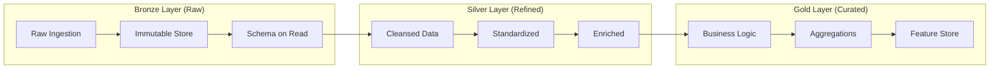

# Lakehouse Best Practices and Industry References

## Executive Summary

This document consolidates industry best practices from leading data lakehouse implementations including Databricks Delta Lake, Netflix's Iceberg adoption, Uber's data platform, and other modern architectures. These patterns inform the PKM system's lakehouse design.

## Medallion Architecture Pattern

### Industry Standard: Bronze, Silver, Gold



### Databricks Delta Lake Approach

#### Key Principles
1. **Bronze Layer**
   - Append-only raw data ingestion
   - Minimal transformations (only for corruption handling)
   - Preserve original data fidelity
   - Partition by ingestion date

2. **Silver Layer**
   - Data quality rules enforcement
   - Deduplication and cleansing
   - Schema enforcement and validation
   - SCD Type 2 for dimension tracking

3. **Gold Layer**
   - Business-level aggregations
   - Denormalized for query performance
   - Materialized views for dashboards
   - ML feature engineering

#### Reference Implementation
```python
# Databricks Delta Lake Pattern
class MedallionArchitecture:
    """
    Reference: Databricks Medallion Architecture
    Source: https://www.databricks.com/glossary/medallion-architecture
    """
    
    def bronze_ingestion(self, source_data):
        """
        Bronze: Raw data ingestion with minimal processing
        """
        return (
            spark.readStream
            .format("json")
            .schema(self.get_bronze_schema())
            .option("maxFilesPerTrigger", 1000)
            .load(source_data)
            .withColumn("ingestion_timestamp", current_timestamp())
            .withColumn("source_file", input_file_name())
            .writeStream
            .format("delta")
            .outputMode("append")
            .option("checkpointLocation", "/bronze/checkpoint")
            .partitionBy("date")
            .table("bronze.raw_events")
        )
    
    def silver_transformation(self):
        """
        Silver: Cleaned and conformed data
        """
        return (
            spark.readStream
            .table("bronze.raw_events")
            .where("quality_check = true")
            .dropDuplicates(["event_id"])
            .withColumn("processed_timestamp", current_timestamp())
            .writeStream
            .format("delta")
            .outputMode("append")
            .option("checkpointLocation", "/silver/checkpoint")
            .table("silver.cleaned_events")
        )
    
    def gold_aggregation(self):
        """
        Gold: Business-ready aggregates
        """
        return (
            spark.table("silver.cleaned_events")
            .groupBy(window("event_timestamp", "1 hour"), "category")
            .agg(
                count("*").alias("event_count"),
                avg("value").alias("avg_value"),
                max("value").alias("max_value")
            )
            .write
            .format("delta")
            .mode("overwrite")
            .partitionBy("date")
            .table("gold.hourly_metrics")
        )
```

## Netflix's Iceberg Implementation

### Production Lessons Learned

#### Architecture Decisions
1. **Catalog Choice**: AWS Glue for metadata management
2. **File Format**: Parquet with Zstandard compression
3. **Partitioning**: Hidden partitioning for user transparency
4. **Compaction**: Automatic small file compaction

#### Best Practices from Netflix
```yaml
# Reference: Netflix Technology Blog - Apache Iceberg at Netflix
# Source: https://netflixtechblog.com/apache-iceberg-at-netflix-1c2e8d8565a7

iceberg_configuration:
  table_properties:
    write.format.default: parquet
    write.parquet.compression-codec: zstd
    write.parquet.compression-level: 3
    write.target-file-size-bytes: 536870912  # 512MB
    write.metadata.compression-codec: gzip
    
  maintenance:
    expire_snapshots:
      older_than_days: 7
      retain_last: 10
    
    compact_files:
      target_size_mb: 512
      min_file_count: 5
      max_concurrent_file_group_rewrites: 5
    
    rewrite_manifests:
      use_caching: true
      target_manifest_size_mb: 8
  
  performance:
    read.split.target-size: 134217728  # 128MB
    read.parquet.vectorization.enabled: true
    read.parquet.vectorization.batch-size: 5000
```

### Netflix's Data Quality Framework
```python
class IcebergDataQuality:
    """
    Reference: Netflix's Iceberg Data Quality Patterns
    """
    
    def validate_schema_evolution(self, table):
        """
        Ensure backward compatibility
        """
        current_schema = table.schema()
        
        # Check for breaking changes
        for field in current_schema.fields:
            if field.is_required and field.field_id not in previous_schema:
                raise ValueError(f"Cannot add required field: {field.name}")
        
        # Validate type promotions
        type_promotions = {
            "int": ["long"],
            "float": ["double"],
            "decimal": ["decimal with higher precision"]
        }
        
        return validation_result
    
    def implement_row_level_quality(self):
        """
        Row-level quality checks using Iceberg metadata
        """
        quality_checks = {
            "null_check": "value IS NOT NULL",
            "range_check": "value BETWEEN 0 AND 100",
            "format_check": "email RLIKE '^[A-Za-z0-9+_.-]+@[A-Za-z0-9.-]+$'",
            "referential_integrity": "user_id IN (SELECT id FROM users)"
        }
        
        # Write quality results to metadata
        table.update_properties()
            .set("quality.last_check", str(datetime.now()))
            .set("quality.passed_rows", str(passed_count))
            .set("quality.failed_rows", str(failed_count))
            .commit()
```

## Uber's Data Platform Architecture

### Uber's Lakehouse Principles

#### Reference Architecture
```yaml
# Reference: Uber Engineering - Uber's Lakehouse Architecture
# Source: https://www.uber.com/blog/uber-big-data-platform/

uber_lakehouse:
  ingestion:
    kafka_streams: 4_trillion_messages_daily
    schema_registry: Confluent
    format: Avro_to_Parquet
    
  storage_layers:
    raw_data:
      location: HDFS_and_S3
      format: Parquet
      compression: Snappy
      partition: hourly
      
    processed_data:
      location: S3
      format: Iceberg_tables
      optimization: Z-ordering
      compaction: automatic
      
    serving_layer:
      online: Cassandra
      offline: Presto
      feature_store: Michelangelo
  
  compute:
    batch: Apache_Spark
    streaming: Apache_Flink
    sql: Presto_and_Spark_SQL
    ml: XGBoost_and_TensorFlow
```

### Uber's Data Freshness Tiers
```python
class UberDataFreshness:
    """
    Reference: Uber's Multi-Temperature Data Architecture
    """
    
    FRESHNESS_TIERS = {
        "real_time": {
            "latency": "< 1 second",
            "technology": "Kafka + Flink",
            "use_case": "Fraud detection, surge pricing"
        },
        "near_real_time": {
            "latency": "1-5 minutes",
            "technology": "Spark Streaming",
            "use_case": "Driver matching, ETA calculation"
        },
        "micro_batch": {
            "latency": "5-15 minutes",
            "technology": "Spark Batch",
            "use_case": "Metrics, dashboards"
        },
        "batch": {
            "latency": "> 1 hour",
            "technology": "Spark + Hive",
            "use_case": "ML training, analytics"
        }
    }
```

## LinkedIn's Lakehouse Patterns

### Metadata Management
```yaml
# Reference: LinkedIn's DataHub
# Source: https://github.com/datahub-project/datahub

metadata_management:
  discovery:
    - Automated schema inference
    - Lineage tracking
    - Impact analysis
    - Usage analytics
    
  governance:
    - Data classification
    - PII detection
    - Access control
    - Compliance tracking
    
  quality:
    - Profiling statistics
    - Anomaly detection
    - Freshness monitoring
    - Completeness tracking
```

## Airbnb's Minerva Architecture

### Metrics Layer Design
```python
class MinervaMetricsLayer:
    """
    Reference: Airbnb's Minerva Metrics Platform
    Source: https://medium.com/airbnb-engineering/how-airbnb-achieved-metric-consistency-at-scale
    """
    
    def define_metric(self):
        return {
            "metric_name": "booking_rate",
            "description": "Conversion rate from search to booking",
            "formula": "bookings / searches",
            "dimensions": ["market", "property_type", "date"],
            "grain": "daily",
            "owner": "analytics_team",
            "tier": "tier_1",  # Critical metric
            "sla": {
                "freshness": "6 hours",
                "accuracy": "99.9%"
            }
        }
    
    def create_certified_dataset(self):
        """
        Create certified, reusable datasets
        """
        return spark.sql("""
            CREATE OR REPLACE TABLE gold.certified_bookings AS
            WITH validated_bookings AS (
                SELECT *
                FROM silver.bookings
                WHERE data_quality_score > 0.95
            )
            SELECT 
                date,
                market,
                COUNT(*) as booking_count,
                SUM(revenue) as total_revenue,
                AVG(nights) as avg_nights
            FROM validated_bookings
            GROUP BY date, market
        """)
```

## Modern Lakehouse Best Practices

### 1. Schema Management

#### Schema Evolution Strategy
```python
class SchemaEvolutionBestPractices:
    """
    Industry best practices for schema evolution
    """
    
    EVOLUTION_RULES = {
        "allowed": [
            "Add nullable columns",
            "Widen numeric types (int → long)",
            "Increase string length",
            "Add new partition columns"
        ],
        "forbidden": [
            "Delete columns in production",
            "Narrow types",
            "Change column names",
            "Modify partition columns"
        ],
        "requires_migration": [
            "Change from nullable to required",
            "Type changes (string → int)",
            "Restructure nested fields"
        ]
    }
    
    def safe_schema_evolution(self, table_name, new_column):
        """
        Implement safe schema evolution
        """
        # Step 1: Add column as nullable
        alter_query = f"""
        ALTER TABLE {table_name} 
        ADD COLUMN {new_column.name} {new_column.type}
        """
        
        # Step 2: Backfill historical data
        backfill_query = f"""
        UPDATE {table_name}
        SET {new_column.name} = {new_column.default_value}
        WHERE {new_column.name} IS NULL
        """
        
        # Step 3: Add not-null constraint if needed
        if new_column.required:
            constraint_query = f"""
            ALTER TABLE {table_name}
            ALTER COLUMN {new_column.name} SET NOT NULL
            """
```

### 2. Partitioning Strategies

```yaml
partitioning_best_practices:
  temporal_data:
    strategy: "Date-based partitioning"
    format: "year/month/day or year/month/day/hour"
    example: "year=2024/month=01/day=20"
    
  categorical_data:
    strategy: "Hash or list partitioning"
    cardinality: "< 1000 distinct values"
    example: "region=us-east/category=electronics"
    
  hybrid:
    strategy: "Combine temporal and categorical"
    example: "date=2024-01-20/region=us-east"
    
  hidden_partitioning:  # Iceberg feature
    strategy: "Partition without exposing in queries"
    benefit: "User-friendly queries"
    example: "Partition by day(timestamp) but query by timestamp"
```

### 3. Compaction and Optimization

```python
class CompactionStrategy:
    """
    Industry-standard compaction strategies
    """
    
    def adaptive_compaction(self, table):
        """
        Netflix-inspired adaptive compaction
        """
        file_stats = table.get_file_statistics()
        
        # Small file problem threshold
        if file_stats.avg_file_size < 128 * 1024 * 1024:  # 128MB
            self.compact_small_files(table)
        
        # Z-order optimization for query patterns
        if table.query_patterns.involves_range_scans:
            self.z_order_optimize(table, columns=["date", "user_id"])
        
        # Bin-packing for cost optimization
        if file_stats.total_size > 10 * 1024 * 1024 * 1024:  # 10GB
            self.bin_pack_optimization(table, target_size="512MB")
```

### 4. Cost Optimization Patterns

```yaml
cost_optimization_patterns:
  storage:
    - Use Zstandard compression (30% better than Snappy)
    - Implement data lifecycle policies
    - Use S3 Intelligent Tiering
    - Delete expired snapshots
    
  compute:
    - Partition pruning via predicate pushdown
    - Column pruning via projection pushdown
    - Use spot instances for batch jobs
    - Cache hot partitions in memory
    
  query:
    - Materialize common aggregations
    - Use incremental processing
    - Implement query result caching
    - Optimize join strategies
```

## PKM-Specific Adaptations

### Applying Lakehouse Patterns to PKM

```python
class PKMLakehousePatterns:
    """
    Adapting industry patterns for PKM system
    """
    
    def medallion_for_knowledge(self):
        return {
            "bronze": {
                "purpose": "Raw knowledge capture",
                "content": ["markdown_files", "web_clips", "imports"],
                "quality": "As-is, no validation",
                "retention": "Forever (source of truth)"
            },
            "silver": {
                "purpose": "Processed atomic notes",
                "content": ["parsed_notes", "extracted_concepts", "embeddings"],
                "quality": "Validated, deduplicated, linked",
                "retention": "Active + 1 year archive"
            },
            "gold": {
                "purpose": "Knowledge products",
                "content": ["summaries", "insights", "teaching_materials"],
                "quality": "Human-validated, publication-ready",
                "retention": "Permanent"
            }
        }
    
    def freshness_tiers_for_pkm(self):
        return {
            "immediate": {
                "latency": "< 1 second",
                "use_case": "Note search, quick capture",
                "technology": "SlateDB + cache"
            },
            "near_real_time": {
                "latency": "< 1 minute",
                "use_case": "Link suggestions, tag generation",
                "technology": "Lambda + Kinesis"
            },
            "batch_enrichment": {
                "latency": "< 1 hour",
                "use_case": "Concept extraction, embedding generation",
                "technology": "Spark on EMR"
            },
            "deep_analysis": {
                "latency": "Daily",
                "use_case": "Pattern recognition, insight generation",
                "technology": "Scheduled Spark jobs"
            }
        }
```

## Implementation Checklist

### Phase 1: Foundation (Based on Industry Standards)
- [ ] Implement Bronze layer with append-only ingestion (Databricks pattern)
- [ ] Set up Iceberg catalog with Glue (Netflix approach)
- [ ] Configure hidden partitioning (Netflix pattern)
- [ ] Implement SlateDB for metadata (Modern diskless pattern)

### Phase 2: Data Quality (Industry Best Practices)
- [ ] Row-level quality checks (Netflix pattern)
- [ ] Schema evolution governance (LinkedIn DataHub pattern)
- [ ] Data profiling and statistics (Airbnb pattern)
- [ ] Lineage tracking (Uber pattern)

### Phase 3: Optimization (Production Patterns)
- [ ] Adaptive file compaction (Netflix)
- [ ] Z-ordering for query optimization (Databricks)
- [ ] Materialized views for common queries (Airbnb)
- [ ] Multi-temperature storage tiers (Uber)

### Phase 4: Analytics (Modern Patterns)
- [ ] Metrics layer implementation (Airbnb Minerva)
- [ ] Feature store for ML (Uber Michelangelo)
- [ ] Certified datasets (Airbnb pattern)
- [ ] Self-service analytics (Databricks pattern)

## References and Further Reading

### Academic Papers
1. **Lakehouse: A New Generation of Open Platforms** (2021)
   - Authors: Armbrust et al. (Databricks)
   - Key insight: Combining data lake flexibility with warehouse reliability

2. **Apache Iceberg: An Open Table Format for Huge Analytic Datasets** (2022)
   - Authors: Netflix & Apple Teams
   - Key insight: Time travel and schema evolution at scale

3. **Delta Lake: High-Performance ACID Table Storage over Cloud Object Stores** (2020)
   - Authors: Databricks Team
   - Key insight: ACID transactions on object storage

### Industry Blog Posts
1. **Databricks**: "The Medallion Architecture" - Comprehensive guide to Bronze/Silver/Gold
2. **Netflix**: "Apache Iceberg at Netflix" - Production lessons at scale
3. **Uber**: "Uber's Lakehouse Architecture" - Multi-petabyte platform design
4. **Airbnb**: "How Airbnb Achieved Metric Consistency at Scale" - Metrics layer design
5. **LinkedIn**: "DataHub: A Generalized Metadata Search & Discovery Tool" - Metadata management

### Open Source Projects
1. **Apache Iceberg**: https://iceberg.apache.org/
2. **Delta Lake**: https://delta.io/
3. **Apache Hudi**: https://hudi.apache.org/
4. **DataHub**: https://datahub.io/
5. **dbt**: https://www.getdbt.com/

### Books
1. **"The Data Warehouse Toolkit"** by Kimball & Ross - Dimensional modeling fundamentals
2. **"Designing Data-Intensive Applications"** by Martin Kleppmann - Distributed systems patterns
3. **"Fundamentals of Data Engineering"** by Reis & Housley - Modern data stack

---

*This document synthesizes industry best practices to inform the PKM lakehouse architecture design.*