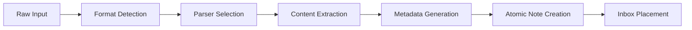
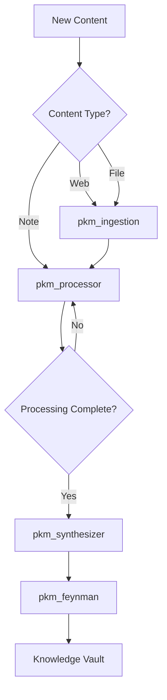
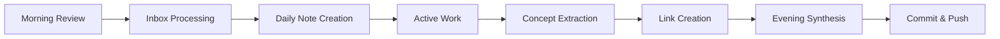

# Markdown-Based Personal Knowledge Management System Architecture

## Executive Summary

A comprehensive, first-principles-based Personal Knowledge Management (PKM) system built on markdown, Git, and agentic tools. This architecture combines proven PKM methodologies with Feynman learning techniques and cognitive science principles to create a powerful, extensible knowledge ecosystem.

## Core Philosophy

### First Principles Foundation
1. **Knowledge is atomic** - Every piece of knowledge can be broken down to irreducible units
2. **Understanding requires explanation** - True comprehension comes from teaching ability  
3. **Connections create insight** - Knowledge value multiplies through relationships
4. **Simplicity enables complexity** - Complex understanding emerges from simple, well-connected ideas
5. **Version control is memory** - Knowledge evolution tracking enables learning from past thinking

### Feynman Integration
- Every complex concept must have an ELI5 (Explain Like I'm 5) representation
- Knowledge gaps are identified through failed explanation attempts
- Progressive complexity layers from simple to advanced understanding
- Teaching-oriented documentation as primary knowledge format

## System Architecture

### Layer 1: Storage Foundation (Git + Markdown)

```
pkm-system/
├── .pkm/                      # PKM configuration and metadata
│   ├── config.yaml           # System configuration
│   ├── schemas/              # Knowledge schemas
│   └── templates/            # Note templates
├── vault/                     # Primary knowledge vault
│   ├── 00-inbox/            # Capture zone (unsorted)
│   ├── 01-daily/            # Daily notes and logs
│   ├── 02-projects/         # Active project knowledge
│   ├── 03-areas/            # Life areas (ongoing)
│   ├── 04-resources/        # Reference materials
│   ├── 05-archives/         # Inactive knowledge
│   └── 06-meta/             # System documentation
├── synthesis/                 # Generated insights
│   ├── maps/                # Knowledge maps
│   ├── summaries/           # Progressive summaries
│   └── insights/            # Extracted patterns
├── feynman/                  # Simplified explanations
│   ├── eli5/                # Basic explanations
│   ├── analogies/           # Concept analogies
│   └── visuals/             # Diagrams and sketches
└── agents/                   # Agent configurations
    ├── ingestion/           # Data ingestion agents
    ├── processing/          # Knowledge processing
    ├── extraction/          # Pattern extraction
    └── generation/          # Content generation
```

### Layer 2: Knowledge Processing Pipeline

#### 2.1 Data Ingestion


**Supported Input Formats:**
- Plain text, Markdown, HTML
- PDFs, EPUBs, DOCs
- Web pages (via web clipper)
- API responses (JSON/XML)
- Audio/Video transcripts
- Images (with OCR)

#### 2.2 Processing Pipeline
```yaml
pipeline:
  stages:
    - capture:
        location: "00-inbox/"
        automation: "auto-timestamp, source-tracking"
    - process:
        actions:
          - "atomic-breakdown"
          - "concept-extraction"
          - "link-suggestion"
          - "tag-generation"
    - organize:
        method: "PARA + Johnny Decimal"
        automation: "smart-filing"
    - connect:
        strategies:
          - "bidirectional-linking"
          - "concept-mapping"
          - "cluster-analysis"
    - refine:
        techniques:
          - "progressive-summarization"
          - "spaced-repetition"
          - "feynman-simplification"
```

### Layer 3: Knowledge Extraction Framework

#### 3.1 Concept Extraction Engine
```python
class ConceptExtractor:
    """
    Extracts atomic concepts from notes using NLP and pattern recognition
    """
    
    def extract_concepts(self, note_content):
        # 1. Named Entity Recognition
        # 2. Key phrase extraction
        # 3. Relationship identification
        # 4. Concept hierarchy building
        # 5. Cross-reference detection
        pass
    
    def generate_concept_map(self, concepts):
        # Build knowledge graph
        # Identify central concepts
        # Map relationships
        # Calculate concept importance
        pass
```

#### 3.2 Pattern Recognition System
- **Temporal patterns**: Trends over time in daily notes
- **Conceptual patterns**: Recurring themes across domains
- **Structural patterns**: Common organizational structures
- **Insight patterns**: Breakthrough moments and connections

### Layer 4: Content Generation System

#### 4.1 Synthesis Engine
```yaml
synthesis_types:
  - summary_generation:
      methods: ["progressive", "hierarchical", "thematic"]
      outputs: ["executive_summary", "detailed_summary", "eli5"]
  
  - insight_extraction:
      techniques: ["pattern_analysis", "anomaly_detection", "trend_identification"]
      outputs: ["insights_report", "connection_map", "emergence_log"]
  
  - knowledge_compilation:
      formats: ["tutorial", "guide", "reference", "course"]
      customization: ["audience_level", "learning_style", "use_case"]
```

#### 4.2 Feynman Generator
Automatically creates simplified explanations:
1. Identifies complex concepts in notes
2. Breaks down to fundamental components
3. Generates progressive explanation layers
4. Creates analogies and examples
5. Produces visual representations

### Layer 5: Agent Integration

#### 5.1 Claude Code Agents

```yaml
agents:
  pkm_ingestion:
    description: "Intelligent data ingestion and initial processing"
    capabilities:
      - format_detection
      - content_extraction
      - metadata_generation
      - atomic_note_creation
    tools: ["Read", "Write", "WebFetch", "WebSearch"]
  
  pkm_processor:
    description: "Knowledge processing and organization"
    capabilities:
      - concept_extraction
      - link_generation
      - tag_suggestion
      - smart_filing
    tools: ["Read", "Write", "Edit", "Grep"]
  
  pkm_synthesizer:
    description: "Knowledge synthesis and insight generation"
    capabilities:
      - pattern_recognition
      - summary_generation
      - insight_extraction
      - connection_mapping
    tools: ["Read", "Write", "Task"]
  
  pkm_feynman:
    description: "Simplification and teaching-oriented content"
    capabilities:
      - eli5_generation
      - analogy_creation
      - visual_explanation
      - gap_identification
    tools: ["Read", "Write", "Edit"]
```

#### 5.2 Agent Workflows



## Implementation Components

### 1. Core Modules

#### 1.1 Markdown Extensions
```yaml
extensions:
  - wikilinks: "[[]]"
  - tags: "#tag"
  - dataview: "inline queries"
  - frontmatter: "YAML metadata"
  - callouts: "!!! note"
  - mermaid: "diagrams"
  - math: "LaTeX"
  - footnotes: "[^1]"
```

#### 1.2 Metadata Schema
```yaml
# Standard note frontmatter
---
id: "unique-identifier"
created: "2024-01-20T10:00:00Z"
modified: "2024-01-20T10:00:00Z"
type: "concept|project|area|resource|daily"
status: "seed|budding|evergreen"
tags: []
aliases: []
sources: []
related: []
feynman_level: "0-5"
understanding: "0-100"
---
```

### 2. Processing Rules

#### 2.1 Atomic Note Principles
1. One concept per note
2. Self-contained understanding
3. Densely linked to related concepts
4. Source attribution mandatory
5. Progressive refinement tracked

#### 2.2 Linking Strategy
```yaml
link_types:
  - conceptual: "[[related-concept]]"
  - hierarchical: "[[parent-concept]]"
  - sequential: "[[previous-note]]"
  - source: "[[original-source]]"
  - contradiction: "[[opposing-view]]"
```

### 3. Quality Assurance

#### 3.1 Validation Pipeline
```python
class QualityValidator:
    def validate_note(self, note):
        checks = [
            self.check_atomic_principle(),
            self.check_link_density(),
            self.check_source_attribution(),
            self.check_feynman_clarity(),
            self.check_metadata_completeness()
        ]
        return all(checks)
```

#### 3.2 Knowledge Health Metrics
- **Coverage**: Breadth of knowledge domains
- **Depth**: Levels of understanding per concept
- **Connectivity**: Average links per note
- **Currency**: Recency of updates
- **Clarity**: Feynman simplification score

## Integration Specifications

### 1. Git Workflow
```bash
# Automated commits
- Daily automatic commits
- Change-triggered commits
- Semantic commit messages
- Branch per major topic
- Regular synthesis merges
```

### 2. CI/CD Pipeline
```yaml
# .github/workflows/pkm-pipeline.yml
name: PKM Pipeline
on:
  push:
    paths:
      - 'vault/**'
      - 'synthesis/**'

jobs:
  process:
    steps:
      - validate_markdown
      - extract_concepts
      - generate_links
      - update_indices
      - create_summaries
      - check_quality
```

### 3. Publishing System
```yaml
publishing:
  static_site:
    generator: "MkDocs/Hugo/Obsidian Publish"
    themes: ["knowledge-graph", "zettelkasten", "digital-garden"]
  
  api:
    endpoints:
      - "/search"
      - "/concepts"
      - "/connections"
      - "/insights"
  
  exports:
    formats: ["PDF", "EPUB", "Anki", "Roam", "Notion"]
```

## Operational Workflows

### Daily Workflow


### Weekly Workflow
1. **Monday**: Inbox zero, project planning
2. **Wednesday**: Concept map review, gap analysis
3. **Friday**: Weekly synthesis, insight extraction
4. **Sunday**: Knowledge pruning, archive management

### Monthly Workflow
- Full vault backup
- Comprehensive link analysis
- Knowledge coverage assessment
- Feynman simplification review
- System optimization

## Performance Metrics

### System KPIs
```yaml
metrics:
  capture:
    - notes_per_day: ">= 5"
    - inbox_processing_time: "< 24h"
  
  processing:
    - atomic_note_ratio: "> 80%"
    - average_links_per_note: "> 3"
  
  synthesis:
    - insights_per_week: ">= 1"
    - synthesis_notes_ratio: "> 10%"
  
  quality:
    - feynman_coverage: "> 50%"
    - source_attribution: "100%"
```

## Security & Privacy

### Data Protection
```yaml
security:
  encryption:
    at_rest: "AES-256"
    in_transit: "TLS 1.3"
  
  access_control:
    authentication: "multi-factor"
    authorization: "role-based"
  
  privacy:
    personal_info: "redacted"
    sensitive_data: "encrypted"
  
  backup:
    frequency: "daily"
    retention: "30 days"
    locations: ["local", "cloud", "offline"]
```

## Future Enhancements

### Phase 1: Foundation (Current)
- Basic ingestion and processing
- Manual organization with agent assistance
- Simple synthesis and summarization

### Phase 2: Intelligence
- ML-powered concept extraction
- Automated knowledge graph generation
- Predictive linking suggestions
- Anomaly detection in thinking patterns

### Phase 3: Augmentation
- AR/VR knowledge visualization
- Voice-driven knowledge capture
- Real-time collaboration features
- Cross-vault knowledge federation

### Phase 4: Autonomy
- Self-organizing knowledge structures
- Autonomous insight generation
- Predictive knowledge needs
- Personalized learning paths

## Conclusion

This PKM architecture provides a robust, scalable foundation for personal knowledge management that combines the best of established methodologies with cutting-edge automation. By building on markdown and Git, we ensure longevity and portability while enabling powerful processing through agentic tools.

The system grows with the user, starting simple but enabling sophisticated knowledge operations as expertise develops. The Feynman-first approach ensures deep understanding while the first-principles architecture guarantees flexibility and adaptability to changing needs.

---

*Next Steps: Create detailed implementation specifications and steering documents for each component.*