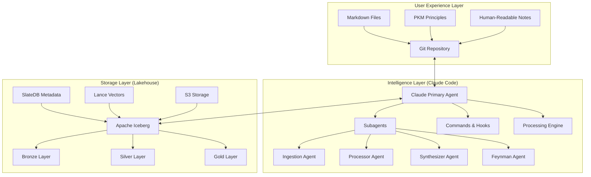
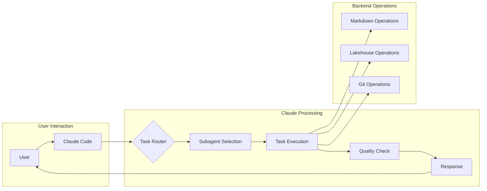
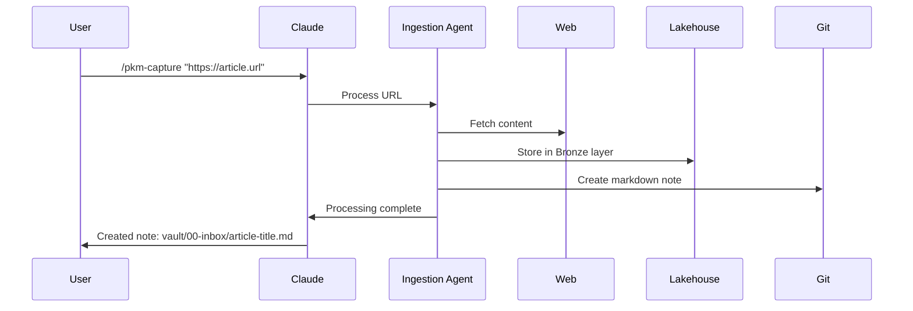
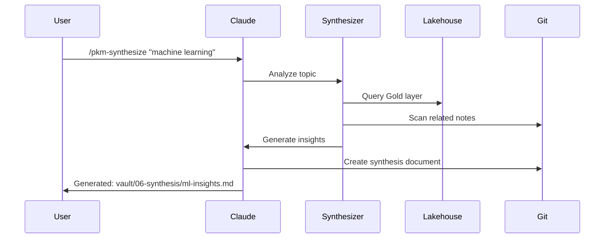

# Claude-Orchestrated Personal Knowledge Management System Architecture

## Executive Summary

A comprehensive, first-principles-based Personal Knowledge Management (PKM) system orchestrated by Claude Code as the primary intelligence interface. This architecture maintains PKM principles at the business layer (markdown + Git) while leveraging a modern diskless lakehouse for storage and Claude Code agents for all intelligence operations. Claude Code serves as the bridge between human-friendly markdown and powerful data processing capabilities.

## Core Philosophy

### First Principles Foundation
1. **Knowledge is atomic** - Every piece of knowledge can be broken down to irreducible units
2. **Understanding requires explanation** - True comprehension comes from teaching ability  
3. **Connections create insight** - Knowledge value multiplies through relationships
4. **Simplicity enables complexity** - Complex understanding emerges from simple, well-connected ideas
5. **Version control is memory** - Knowledge evolution tracking enables learning from past thinking

### Feynman Integration
- Every complex concept must have an ELI5 (Explain Like I'm 5) representation
- Knowledge gaps are identified through failed explanation attempts
- Progressive complexity layers from simple to advanced understanding
- Teaching-oriented documentation as primary knowledge format

## Three-Layer System Architecture

### Overview: Claude Code as Central Orchestrator



### Layer 1: User Experience (Business Domain)

**Purpose**: Maintain familiar PKM workflows with markdown and Git

```
vault/                         # What users see and interact with
├── .claude/                   # Claude Code configuration
│   ├── agents/               # Agent specifications
│   ├── hooks/                # Automation hooks
│   └── settings.json         # Claude settings
├── .pkm/                      # PKM configuration
│   ├── config.yaml           # System configuration
│   ├── schemas/              # Knowledge schemas
│   └── templates/            # Note templates
├── 00-inbox/                  # Capture zone (unsorted)
├── 01-daily/                  # Daily notes and logs
├── 02-projects/               # Active project knowledge
├── 03-areas/                  # Life areas (ongoing)
├── 04-resources/              # Reference materials
├── 05-archives/               # Inactive knowledge
└── 06-synthesis/              # Generated insights
```

**Key Principles**:
- Users work with familiar markdown files
- Git provides version control and history
- PKM methodologies (Zettelkasten, PARA, etc.) remain unchanged
- All complexity hidden behind Claude Code interface

### Layer 2: Intelligence (Claude Code Orchestration)

**Purpose**: Claude Code acts as the brain, doing all heavy lifting

```yaml
claude_orchestration:
  primary_agent:
    role: "Master Orchestrator"
    responsibilities:
      - User interaction interface
      - Task delegation to subagents
      - Workflow coordination
      - Quality assurance
  
  subagents:
    pkm-ingestion:
      triggers: ["/ingest", "new files", "web clips"]
      actions:
        - Parse any format
        - Extract content
        - Create atomic notes
        - Store in lakehouse Bronze layer
    
    pkm-processor:
      triggers: ["/process", "note updates", "scheduled"]
      actions:
        - NLP analysis
        - Concept extraction
        - Link generation
        - Update Silver layer
    
    pkm-synthesizer:
      triggers: ["/synthesize", "pattern detection"]
      actions:
        - Cross-reference notes
        - Generate insights
        - Create summaries
        - Populate Gold layer
    
    pkm-feynman:
      triggers: ["/simplify", "complexity threshold"]
      actions:
        - Create ELI5 versions
        - Identify knowledge gaps
        - Generate analogies
  
  commands:
    user_commands:
      - "/pkm-capture": Ingest new content
      - "/pkm-process": Process inbox items
      - "/pkm-search": Semantic search
      - "/pkm-synthesize": Generate insights
      - "/pkm-teach": Create teaching materials
    
  hooks:
    automation:
      - on_file_create: Auto-process new notes
      - on_commit: Update lakehouse
      - on_schedule: Daily synthesis
      - on_pattern: Trigger insights
```

### Layer 3: Storage (Diskless Lakehouse)

**Purpose**: Powerful backend storage invisible to users

```yaml
lakehouse_storage:
  implementation: "Completely Diskless"
  user_visibility: "Hidden - Claude Code handles all interactions"
  
  data_flow:
    bronze_layer:
      source: "Raw markdown from Git"
      format: "Iceberg tables on S3"
      processing: "Claude ingestion agent"
      retention: "90 days"
    
    silver_layer:
      source: "Processed Bronze data"
      format: "Iceberg + SlateDB metadata"
      processing: "Claude processor agent"
      features:
        - Extracted concepts
        - Generated embeddings
        - Validated links
    
    gold_layer:
      source: "Refined Silver data"
      format: "Iceberg + Lance vectors"
      processing: "Claude synthesizer agent"
      features:
        - Knowledge graph
        - Semantic search index
        - Generated insights
```

## Claude Code Orchestration Patterns

### Primary Interface Pattern



### Intelligence Implementation

```yaml
claude_intelligence_layer:
  primary_capabilities:
    natural_language_interface:
      - Understands context and intent
      - Translates requests to operations
      - Provides conversational feedback
      - Handles ambiguity gracefully
    
    orchestration_engine:
      - Routes tasks to appropriate subagents
      - Manages parallel processing
      - Coordinates multi-step workflows
      - Ensures consistency across layers
    
    quality_assurance:
      - Validates all operations
      - Ensures PKM principles adherence
      - Maintains data integrity
      - Provides error recovery
  
  subagent_specializations:
    ingestion:
      capability: "Universal format processing"
      implementation:
        - Claude reads any format
        - Extracts semantic content
        - Creates atomic notes
        - Maintains source attribution
    
    processing:
      capability: "Deep content analysis"
      implementation:
        - NLP via Claude's language model
        - Concept extraction without external tools
        - Relationship inference
        - Quality scoring
    
    synthesis:
      capability: "Cross-domain integration"
      implementation:
        - Pattern recognition across notes
        - Insight generation
        - Summary creation at multiple levels
        - Teaching material generation
    
    feynman:
      capability: "Simplification and validation"
      implementation:
        - Complexity assessment
        - Progressive simplification
        - Gap identification
        - Analogy generation
```

### User Workflow Examples

#### Example 1: Knowledge Capture


#### Example 2: Knowledge Synthesis


#### 2.2 Processing Pipeline
```yaml
pipeline:
  stages:
    - capture:
        location: "00-inbox/"
        automation: "auto-timestamp, source-tracking"
    - process:
        actions:
          - "atomic-breakdown"
          - "concept-extraction"
          - "link-suggestion"
          - "tag-generation"
    - organize:
        method: "PARA + Johnny Decimal"
        automation: "smart-filing"
    - connect:
        strategies:
          - "bidirectional-linking"
          - "concept-mapping"
          - "cluster-analysis"
    - refine:
        techniques:
          - "progressive-summarization"
          - "spaced-repetition"
          - "feynman-simplification"
```

### Layer 3: Knowledge Extraction Framework

#### 3.1 Concept Extraction Engine
```python
class ConceptExtractor:
    """
    Extracts atomic concepts from notes using NLP and pattern recognition
    """
    
    def extract_concepts(self, note_content):
        # 1. Named Entity Recognition
        # 2. Key phrase extraction
        # 3. Relationship identification
        # 4. Concept hierarchy building
        # 5. Cross-reference detection
        pass
    
    def generate_concept_map(self, concepts):
        # Build knowledge graph
        # Identify central concepts
        # Map relationships
        # Calculate concept importance
        pass
```

#### 3.2 Pattern Recognition System
- **Temporal patterns**: Trends over time in daily notes
- **Conceptual patterns**: Recurring themes across domains
- **Structural patterns**: Common organizational structures
- **Insight patterns**: Breakthrough moments and connections

### Layer 4: Content Generation System

#### 4.1 Synthesis Engine
```yaml
synthesis_types:
  - summary_generation:
      methods: ["progressive", "hierarchical", "thematic"]
      outputs: ["executive_summary", "detailed_summary", "eli5"]
  
  - insight_extraction:
      techniques: ["pattern_analysis", "anomaly_detection", "trend_identification"]
      outputs: ["insights_report", "connection_map", "emergence_log"]
  
  - knowledge_compilation:
      formats: ["tutorial", "guide", "reference", "course"]
      customization: ["audience_level", "learning_style", "use_case"]
```

#### 4.2 Feynman Generator
Automatically creates simplified explanations:
1. Identifies complex concepts in notes
2. Breaks down to fundamental components
3. Generates progressive explanation layers
4. Creates analogies and examples
5. Produces visual representations

### Layer 5: Agent Integration

#### 5.1 Claude Code Agents

```yaml
agents:
  pkm_ingestion:
    description: "Intelligent data ingestion and initial processing"
    capabilities:
      - format_detection
      - content_extraction
      - metadata_generation
      - atomic_note_creation
    tools: ["Read", "Write", "WebFetch", "WebSearch"]
  
  pkm_processor:
    description: "Knowledge processing and organization"
    capabilities:
      - concept_extraction
      - link_generation
      - tag_suggestion
      - smart_filing
    tools: ["Read", "Write", "Edit", "Grep"]
  
  pkm_synthesizer:
    description: "Knowledge synthesis and insight generation"
    capabilities:
      - pattern_recognition
      - summary_generation
      - insight_extraction
      - connection_mapping
    tools: ["Read", "Write", "Task"]
  
  pkm_feynman:
    description: "Simplification and teaching-oriented content"
    capabilities:
      - eli5_generation
      - analogy_creation
      - visual_explanation
      - gap_identification
    tools: ["Read", "Write", "Edit"]
```

#### 5.2 Agent Workflows


## Implementation Components

### 1. Core Modules

#### 1.1 Markdown Extensions
```yaml
extensions:
  - wikilinks: "[[]]"
  - tags: "#tag"
  - dataview: "inline queries"
  - frontmatter: "YAML metadata"
  - callouts: "!!! note"
  - mermaid: "diagrams"
  - math: "LaTeX"
  - footnotes: "[^1]"
```

#### 1.2 Metadata Schema
```yaml
# Standard note frontmatter
---
id: "unique-identifier"
created: "2024-01-20T10:00:00Z"
modified: "2024-01-20T10:00:00Z"
type: "concept|project|area|resource|daily"
status: "seed|budding|evergreen"
tags: []
aliases: []
sources: []
related: []
feynman_level: "0-5"
understanding: "0-100"
---
```

### 2. Processing Rules

#### 2.1 Atomic Note Principles
1. One concept per note
2. Self-contained understanding
3. Densely linked to related concepts
4. Source attribution mandatory
5. Progressive refinement tracked

#### 2.2 Linking Strategy
```yaml
link_types:
  - conceptual: "[[related-concept]]"
  - hierarchical: "[[parent-concept]]"
  - sequential: "[[previous-note]]"
  - source: "[[original-source]]"
  - contradiction: "[[opposing-view]]"
```

### 3. Quality Assurance

#### 3.1 Validation Pipeline
```python
class QualityValidator:
    def validate_note(self, note):
        checks = [
            self.check_atomic_principle(),
            self.check_link_density(),
            self.check_source_attribution(),
            self.check_feynman_clarity(),
            self.check_metadata_completeness()
        ]
        return all(checks)
```

#### 3.2 Knowledge Health Metrics
- **Coverage**: Breadth of knowledge domains
- **Depth**: Levels of understanding per concept
- **Connectivity**: Average links per note
- **Currency**: Recency of updates
- **Clarity**: Feynman simplification score

## Integration Specifications

### 1. Git Workflow
```bash
# Automated commits
- Daily automatic commits
- Change-triggered commits
- Semantic commit messages
- Branch per major topic
- Regular synthesis merges
```

### 2. CI/CD Pipeline
```yaml
# .github/workflows/pkm-pipeline.yml
name: PKM Pipeline
on:
  push:
    paths:
      - 'vault/**'
      - 'synthesis/**'

jobs:
  process:
    steps:
      - validate_markdown
      - extract_concepts
      - generate_links
      - update_indices
      - create_summaries
      - check_quality
```

### 3. Publishing System
```yaml
publishing:
  static_site:
    generator: "MkDocs/Hugo/Obsidian Publish"
    themes: ["knowledge-graph", "zettelkasten", "digital-garden"]
  
  api:
    endpoints:
      - "/search"
      - "/concepts"
      - "/connections"
      - "/insights"
  
  exports:
    formats: ["PDF", "EPUB", "Anki", "Roam", "Notion"]
```

## Operational Workflows

### Daily Workflow


### Weekly Workflow
1. **Monday**: Inbox zero, project planning
2. **Wednesday**: Concept map review, gap analysis
3. **Friday**: Weekly synthesis, insight extraction
4. **Sunday**: Knowledge pruning, archive management

### Monthly Workflow
- Full vault backup
- Comprehensive link analysis
- Knowledge coverage assessment
- Feynman simplification review
- System optimization

## Performance Metrics

### System KPIs
```yaml
metrics:
  capture:
    - notes_per_day: ">= 5"
    - inbox_processing_time: "< 24h"
  
  processing:
    - atomic_note_ratio: "> 80%"
    - average_links_per_note: "> 3"
  
  synthesis:
    - insights_per_week: ">= 1"
    - synthesis_notes_ratio: "> 10%"
  
  quality:
    - feynman_coverage: "> 50%"
    - source_attribution: "100%"
```

## Security & Privacy

### Data Protection
```yaml
security:
  encryption:
    at_rest: "AES-256"
    in_transit: "TLS 1.3"
  
  access_control:
    authentication: "multi-factor"
    authorization: "role-based"
  
  privacy:
    personal_info: "redacted"
    sensitive_data: "encrypted"
  
  backup:
    frequency: "daily"
    retention: "30 days"
    locations: ["local", "cloud", "offline"]
```

## Key Benefits of Claude-Orchestrated Architecture

### For Users
1. **Simplicity**: Work with familiar markdown files, no new tools to learn
2. **Intelligence**: Claude handles all complex operations transparently
3. **Flexibility**: Natural language commands for any operation
4. **Reliability**: Claude ensures data integrity and recovery

### For System
1. **Scalability**: Lakehouse backend handles unlimited data
2. **Performance**: Distributed processing via Claude subagents
3. **Maintainability**: Clear separation of concerns
4. **Extensibility**: Easy to add new Claude capabilities

### Architecture Advantages

```yaml
separation_of_concerns:
  user_layer:
    focus: "PKM principles and markdown"
    complexity: "Hidden"
    learning_curve: "Minimal"
  
  intelligence_layer:
    focus: "Claude does the heavy lifting"
    complexity: "Managed by Claude"
    capabilities: "Unlimited via LLM"
  
  storage_layer:
    focus: "Enterprise-grade data platform"
    complexity: "Invisible to users"
    scalability: "Infinite with S3"

unified_interface:
  single_point_of_interaction: "Claude Code"
  natural_language: "No complex commands"
  context_aware: "Claude understands intent"
  error_handling: "Claude provides guidance"
```

## Implementation Strategy

### Phase 1: Claude Interface Setup (Weeks 1-4) ✅
- Configure Claude as primary agent
- Define subagent specifications
- Implement basic commands
- Set up automation hooks

### Phase 2: Intelligence Layer (Weeks 5-12) 🔄
- Deploy Claude orchestration patterns
- Implement subagent workflows
- Create command handlers
- Enable hook automation

### Phase 3: Storage Integration (Weeks 13-20)
- Connect Claude to lakehouse
- Implement data flow pipelines
- Enable transparent operations
- Hide complexity from users

### Phase 4: Advanced Features (Weeks 21-28)
- Enhanced Claude capabilities
- Multi-agent collaboration
- Advanced synthesis patterns
- Predictive operations

## Conclusion

This Claude-orchestrated PKM architecture represents a paradigm shift in knowledge management. By positioning Claude Code as the central intelligence layer, we achieve:

1. **User-Friendly Interface**: Natural language interaction with complex systems
2. **Powerful Backend**: Enterprise-grade lakehouse invisible to users
3. **PKM Principles**: Maintained at the business layer with markdown and Git
4. **Unlimited Intelligence**: Claude's capabilities grow with each update
5. **Future-Proof Design**: Clean separation allows independent evolution of each layer

The system provides the simplicity of working with text files while delivering the power of modern data platforms, all orchestrated seamlessly by Claude Code.

---

*Next Steps: Create detailed implementation specifications and steering documents for each component.*