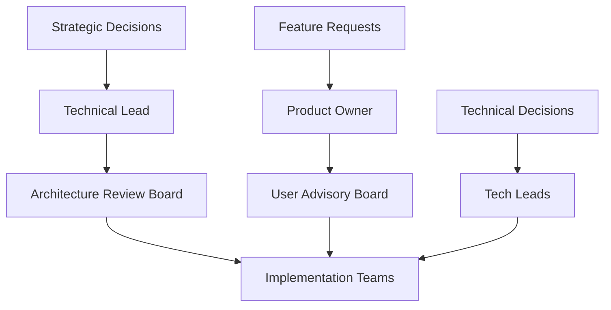

# PKM System Steering Document

## Executive Summary

This steering document provides strategic guidance for implementing the Markdown-Based Personal Knowledge Management (PKM) System. It defines principles, priorities, decision frameworks, and governance structures to ensure successful development and deployment.

## Vision and Mission

### Vision
To create the most intelligent, user-friendly, and effective personal knowledge management system that transforms information into wisdom through first-principles thinking and Feynman-based learning techniques.

### Mission
Build a comprehensive PKM system that:
- Captures knowledge effortlessly from any source
- Processes information using cognitive science principles
- Generates insights through pattern recognition
- Facilitates deep understanding via simplification
- Evolves with user needs and technological advances

## Strategic Principles

### Core Principles

1. **User-Centric Design**
   - Minimize cognitive load
   - Maximize knowledge value
   - Adapt to individual workflows
   - Provide immediate value

2. **Technical Excellence**
   - Build on proven technologies (Markdown, Git)
   - Ensure data portability and longevity
   - Maintain high performance standards
   - Enable extensibility and customization

3. **Knowledge-First Architecture**
   - Atomic note principles
   - Bidirectional linking
   - Progressive summarization
   - Feynman simplification

4. **Continuous Evolution**
   - Learn from user behavior
   - Incorporate new research
   - Adapt to emerging technologies
   - Maintain backwards compatibility

## Implementation Strategy

### Phase 1: Foundation (Months 1-3)
**Goal**: Establish core infrastructure and basic functionality

#### Priorities
1. **Core Infrastructure**
   - Vault structure setup
   - Git integration
   - Basic markdown processing
   - File management system

2. **Essential Features**
   - Note creation and editing
   - Basic linking system
   - Simple search functionality
   - Template system

3. **Initial Agents**
   - Basic ingestion agent
   - Simple processing agent
   - Markdown validation

#### Success Criteria
- [ ] Functional vault structure
- [ ] Git commit automation
- [ ] 100+ test notes processed
- [ ] Basic agent integration working

### Phase 2: Intelligence (Months 4-6)
**Goal**: Add intelligent processing and extraction capabilities

#### Priorities
1. **Advanced Processing**
   - NLP integration
   - Concept extraction
   - Entity recognition
   - Pattern detection

2. **Knowledge Graph**
   - Graph database setup
   - Relationship mapping
   - Visualization tools
   - Query interface

3. **Enhanced Agents**
   - Intelligent extraction agent
   - Synthesis agent
   - Feynman processor

#### Success Criteria
- [ ] 80% concept extraction accuracy
- [ ] Functional knowledge graph
- [ ] Pattern detection operational
- [ ] Feynman simplification working

### Phase 3: Generation (Months 7-9)
**Goal**: Enable content generation and insight synthesis

#### Priorities
1. **Content Generation**
   - Summary generation
   - Insight synthesis
   - Teaching material creation
   - Visual generation

2. **Advanced Features**
   - Cross-domain synthesis
   - Contradiction detection
   - Gap analysis
   - Predictive insights

3. **User Experience**
   - Interactive interfaces
   - Customizable workflows
   - Performance optimization
   - Mobile support

#### Success Criteria
- [ ] Multi-level summarization
- [ ] 10+ insights per week generated
- [ ] Teaching materials validated
- [ ] User satisfaction > 4.5/5

### Phase 4: Optimization (Months 10-12)
**Goal**: Optimize performance and user experience

#### Priorities
1. **Performance**
   - Query optimization
   - Caching strategies
   - Parallel processing
   - Resource management

2. **Quality**
   - Comprehensive testing
   - User feedback integration
   - Documentation completion
   - Security hardening

3. **Ecosystem**
   - Plugin architecture
   - API finalization
   - Integration tools
   - Community building

#### Success Criteria
- [ ] < 100ms response time
- [ ] 99.9% uptime
- [ ] Complete documentation
- [ ] Active user community

## Technical Decisions

### Technology Stack

```yaml
core:
  language: Python 3.11+
  framework: FastAPI
  database: PostgreSQL + Neo4j
  search: Elasticsearch
  cache: Redis

frontend:
  framework: Next.js
  ui_library: Tailwind CSS
  visualization: D3.js
  editor: CodeMirror

nlp:
  primary: spaCy
  embeddings: Sentence Transformers
  llm: Claude API
  classification: scikit-learn

infrastructure:
  containerization: Docker
  orchestration: Kubernetes
  ci_cd: GitHub Actions
  monitoring: Prometheus + Grafana
```

### Architecture Decisions

1. **Microservices vs Monolith**
   - Decision: Modular monolith initially, microservices later
   - Rationale: Faster development, easier debugging, natural boundaries

2. **Storage Strategy**
   - Decision: Multi-tier storage with specialized backends
   - Components:
     - Local/Git: Markdown notes and version control
     - S3: Media files, backups, and archives
     - Lance: Vector embeddings and similarity search
     - Parquet: Analytics and structured data
   - Rationale: Optimized for each data type, scalability, cost-efficiency

3. **Processing Model**
   - Decision: Event-driven with queues
   - Rationale: Scalability, resilience, async processing

4. **Agent Architecture**
   - Decision: Plugin-based with standardized interfaces
   - Rationale: Extensibility, maintainability, community contributions

5. **Vector Storage**
   - Decision: Lance format for embeddings
   - Rationale: Columnar format, optimized for ML workloads, efficient updates

6. **Analytics Storage**
   - Decision: Parquet format with S3 backend
   - Rationale: Industry standard, excellent compression, query performance

## Quality Standards

### Code Quality

```yaml
standards:
  test_coverage: >= 80%
  code_review: required
  linting: black + flake8
  type_checking: mypy
  documentation: comprehensive
  
practices:
  - Test-driven development
  - Continuous integration
  - Automated deployment
  - Performance profiling
  - Security scanning
```

### Knowledge Quality

```yaml
metrics:
  atomicity: >= 90%
  link_density: >= 3 per note
  source_attribution: 100%
  feynman_clarity: >= 0.8
  
validation:
  - Automated quality checks
  - Peer review system
  - User feedback loops
  - Continuous improvement
```

## Risk Management

### Technical Risks

| Risk | Probability | Impact | Mitigation |
|------|-------------|--------|------------|
| Scalability issues | Medium | High | Early performance testing, caching strategies |
| NLP accuracy | High | Medium | Multiple models, user correction feedback |
| Data loss | Low | Critical | Automated backups, version control |
| Integration failures | Medium | Medium | Comprehensive testing, fallback mechanisms |

### Operational Risks

| Risk | Probability | Impact | Mitigation |
|------|-------------|--------|------------|
| User adoption | Medium | High | Intuitive UX, comprehensive onboarding |
| Maintenance burden | High | Medium | Automation, monitoring, documentation |
| Security breaches | Low | Critical | Encryption, access controls, auditing |
| Feature creep | High | Medium | Strict prioritization, user research |

## Governance Structure

### Decision Making



### Roles and Responsibilities

1. **Technical Lead**
   - Overall architecture decisions
   - Technology selection
   - Quality standards enforcement
   - Risk assessment

2. **Product Owner**
   - Feature prioritization
   - User requirement gathering
   - Release planning
   - Stakeholder communication

3. **Development Teams**
   - Feature implementation
   - Testing and quality assurance
   - Documentation
   - Support and maintenance

4. **User Advisory Board**
   - Feature validation
   - Usability testing
   - Feedback provision
   - Community representation

## Success Metrics

### System Metrics

```yaml
performance:
  response_time: < 100ms (p95)
  throughput: > 1000 notes/hour
  availability: > 99.9%
  error_rate: < 0.1%

quality:
  bug_rate: < 5 per 1000 LOC
  test_coverage: > 80%
  documentation: 100% public APIs
  security_score: A rating

adoption:
  daily_active_users: > 1000
  retention_rate: > 80%
  user_satisfaction: > 4.5/5
  community_size: > 5000 members
```

### Knowledge Metrics

```yaml
capture:
  notes_per_user_day: > 5
  source_diversity: > 3 types
  processing_success: > 95%
  
organization:
  avg_links_per_note: > 3
  orphan_rate: < 5%
  folder_utilization: > 80%
  
synthesis:
  insights_per_week: > 1
  summary_quality: > 0.8
  teaching_effectiveness: > 0.85
```

## Communication Plan

### Internal Communication
- Weekly team standups
- Bi-weekly architecture reviews
- Monthly steering committee meetings
- Quarterly retrospectives

### External Communication
- Monthly user newsletters
- Quarterly feature releases
- Community forums
- Documentation updates
- Video tutorials

## Compliance and Standards

### Data Protection
- GDPR compliance
- CCPA compliance
- SOC 2 certification (future)
- ISO 27001 alignment

### Accessibility
- WCAG 2.1 Level AA
- Keyboard navigation
- Screen reader support
- Multi-language support

### Open Source
- MIT License for core
- Contributor guidelines
- Code of conduct
- Security policy

## Budget Considerations

### Development Resources
- 4-6 developers
- 1-2 DevOps engineers
- 1 UX designer
- 1 technical writer

### Infrastructure Costs
- Cloud hosting: $500-1000/month
- API services: $200-500/month
- Development tools: $300/month
- Monitoring tools: $200/month

### Timeline
- Phase 1: 3 months
- Phase 2: 3 months
- Phase 3: 3 months
- Phase 4: 3 months
- Total: 12 months to v1.0

## Evolution Path

### Near-term (6-12 months)
- Core PKM functionality
- Basic AI integration
- Desktop application
- Community plugins

### Medium-term (1-2 years)
- Advanced AI capabilities
- Mobile applications
- Collaboration features
- Enterprise version

### Long-term (2-5 years)
- AR/VR interfaces
- Voice-first interaction
- Autonomous knowledge agents
- Federated knowledge networks

## Decision Log

| Date | Decision | Rationale | Impact |
|------|----------|-----------|--------|
| 2024-01-20 | Use markdown as primary format | Portability, simplicity, Git-friendly | High |
| 2024-01-20 | Implement Feynman technique | Proven learning effectiveness | High |
| 2024-01-20 | Event-driven architecture | Scalability, flexibility | Medium |
| 2024-01-20 | Plugin-based agents | Extensibility, community | High |

## Review and Update Process

This steering document should be reviewed and updated:
- Quarterly for minor adjustments
- Annually for major revisions
- As needed for critical decisions

Review participants:
- Technical leadership
- Product management
- User representatives
- Key stakeholders

## Conclusion

This PKM system represents a significant advancement in personal knowledge management, combining proven methodologies with cutting-edge technology. Success depends on maintaining focus on user value, technical excellence, and continuous evolution.

The steering committee commits to regular review and adjustment of these guidelines to ensure the project remains aligned with user needs and technological capabilities.

---

*Document Version: 1.0*
*Last Updated: 2024-01-20*
*Next Review: 2024-04-20*