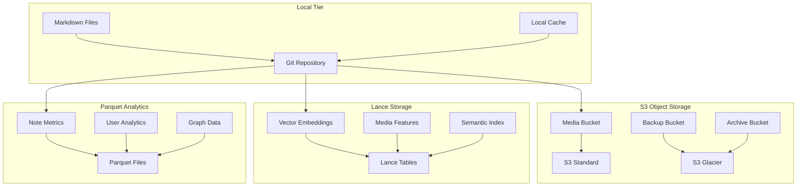

# PKM Storage Architecture

## Executive Summary

This document defines the multi-tier storage architecture for the PKM system, leveraging S3 for object storage, Lance for vector and multimedia data, and Parquet for analytics. This hybrid approach optimizes for performance, scalability, and cost while maintaining data integrity and accessibility.

## Storage Tier Overview



## S3 Object Storage Layer

### Bucket Architecture

```yaml
s3_architecture:
  buckets:
    pkm-vault-primary:
      purpose: Active storage
      regions: [us-east-1, eu-west-1]
      replication: cross-region
      
    pkm-vault-media:
      purpose: Media files
      cdn: CloudFront
      storage_classes:
        - STANDARD: 0-30 days
        - STANDARD_IA: 30-90 days
        - GLACIER_IR: 90+ days
    
    pkm-vault-backup:
      purpose: Backup and recovery
      versioning: enabled
      lifecycle: 
        - Daily backups: 30 days
        - Weekly backups: 12 weeks
        - Monthly backups: 7 years
    
    pkm-vault-analytics:
      purpose: Analytics data
      format: Parquet
      partitioning: by date and type
```

### S3 Storage Classes Strategy

```python
class S3StorageOptimizer:
    """
    Optimizes S3 storage class selection based on access patterns
    """
    
    def determine_storage_class(self, file_metadata):
        age_days = (datetime.now() - file_metadata.created).days
        access_frequency = file_metadata.access_count / age_days if age_days > 0 else float('inf')
        
        if access_frequency > 1:  # Accessed more than once per day
            return "STANDARD"
        elif access_frequency > 0.1:  # Accessed weekly
            return "STANDARD_IA"
        elif access_frequency > 0.01:  # Accessed monthly
            return "GLACIER_INSTANT_RETRIEVAL"
        elif file_metadata.is_backup:
            return "GLACIER_DEEP_ARCHIVE"
        else:
            return "GLACIER_FLEXIBLE_RETRIEVAL"
    
    def lifecycle_rules(self):
        return {
            "rules": [
                {
                    "id": "optimize-media",
                    "status": "Enabled",
                    "transitions": [
                        {"days": 30, "storage_class": "STANDARD_IA"},
                        {"days": 90, "storage_class": "GLACIER_IR"},
                        {"days": 365, "storage_class": "GLACIER"}
                    ]
                },
                {
                    "id": "backup-lifecycle",
                    "status": "Enabled",
                    "transitions": [
                        {"days": 1, "storage_class": "GLACIER_IR"},
                        {"days": 90, "storage_class": "DEEP_ARCHIVE"}
                    ]
                }
            ]
        }
```

### S3 Implementation

```python
import boto3
from botocore.config import Config
import hashlib
from typing import Optional, Dict, Any

class S3StorageManager:
    """
    Manages S3 storage operations for PKM system
    """
    
    def __init__(self, config: Dict[str, Any]):
        self.config = Config(
            region_name=config['region'],
            signature_version='v4',
            retries={'max_attempts': 3, 'mode': 'adaptive'}
        )
        self.s3_client = boto3.client('s3', config=self.config)
        self.bucket_prefix = config['bucket_prefix']
    
    def upload_file(self, file_path: str, file_type: str) -> str:
        """
        Upload file with intelligent routing
        """
        # Determine bucket and key
        bucket, key = self.route_file(file_path, file_type)
        
        # Calculate hash for deduplication
        file_hash = self.calculate_hash(file_path)
        
        # Check if file already exists
        if self.file_exists(bucket, file_hash):
            return f"s3://{bucket}/{file_hash}"
        
        # Multipart upload for large files
        file_size = os.path.getsize(file_path)
        if file_size > 100 * 1024 * 1024:  # 100MB
            return self.multipart_upload(file_path, bucket, key)
        
        # Standard upload with metadata
        metadata = self.extract_metadata(file_path)
        self.s3_client.upload_file(
            file_path, bucket, key,
            ExtraArgs={
                'Metadata': metadata,
                'ServerSideEncryption': 'AES256',
                'StorageClass': self.determine_storage_class(file_type)
            }
        )
        
        return f"s3://{bucket}/{key}"
    
    def create_presigned_url(self, s3_url: str, expiration: int = 3600) -> str:
        """
        Generate presigned URL for secure access
        """
        bucket, key = self.parse_s3_url(s3_url)
        return self.s3_client.generate_presigned_url(
            'get_object',
            Params={'Bucket': bucket, 'Key': key},
            ExpiresIn=expiration
        )
```

## Lance Vector Storage Layer

### Lance Architecture

```yaml
lance_architecture:
  datasets:
    note_embeddings:
      schema:
        - note_id: string (primary key)
        - embedding: vector<float32>[768]
        - model_name: string
        - created_at: timestamp
        - metadata: struct
      indices:
        - type: IVF_PQ
          metric: cosine
          nlist: 1000
          nprobe: 10
    
    media_embeddings:
      schema:
        - media_id: string
        - embedding: vector<float32>[2048]
        - media_type: enum(image, audio, video)
        - features: struct
        - extracted_at: timestamp
      indices:
        - type: HNSW
          metric: L2
          M: 16
          ef_construction: 200
    
    semantic_search:
      schema:
        - query_id: string
        - query_embedding: vector<float32>[768]
        - result_ids: list<string>
        - scores: list<float32>
        - timestamp: timestamp
```

### Lance Implementation

```python
import lance
import pyarrow as pa
import numpy as np
from typing import List, Dict, Any

class LanceVectorStore:
    """
    Manages Lance vector storage for embeddings and multimedia
    """
    
    def __init__(self, s3_path: str):
        self.base_path = s3_path
        self.datasets = {}
    
    def create_embedding_dataset(self, name: str) -> lance.Dataset:
        """
        Create a new Lance dataset for embeddings
        """
        schema = pa.schema([
            pa.field("id", pa.string()),
            pa.field("embedding", pa.list_(pa.float32(), 768)),
            pa.field("model", pa.string()),
            pa.field("timestamp", pa.timestamp('us')),
            pa.field("metadata", pa.struct([
                pa.field("note_type", pa.string()),
                pa.field("quality_score", pa.float32()),
                pa.field("links", pa.list_(pa.string()))
            ]))
        ])
        
        dataset_path = f"{self.base_path}/{name}"
        dataset = lance.write_dataset(
            [],
            dataset_path,
            schema=schema,
            mode="create"
        )
        
        # Create vector index
        dataset.create_index(
            "embedding",
            index_type="IVF_PQ",
            metric="cosine",
            num_partitions=100,
            num_sub_vectors=96
        )
        
        self.datasets[name] = dataset
        return dataset
    
    def add_embeddings(self, dataset_name: str, 
                       embeddings: List[Dict[str, Any]]) -> None:
        """
        Add embeddings to Lance dataset
        """
        dataset = self.datasets.get(dataset_name)
        if not dataset:
            dataset = lance.dataset(f"{self.base_path}/{dataset_name}")
        
        # Convert to Arrow table
        table = pa.table({
            "id": [e["id"] for e in embeddings],
            "embedding": [e["embedding"] for e in embeddings],
            "model": [e["model"] for e in embeddings],
            "timestamp": [e["timestamp"] for e in embeddings],
            "metadata": [e["metadata"] for e in embeddings]
        })
        
        # Append to dataset
        lance.write_dataset(
            table,
            dataset.uri,
            mode="append"
        )
    
    def vector_search(self, dataset_name: str, 
                     query_vector: np.ndarray, 
                     k: int = 10) -> List[Dict]:
        """
        Perform vector similarity search
        """
        dataset = self.datasets.get(dataset_name)
        if not dataset:
            dataset = lance.dataset(f"{self.base_path}/{dataset_name}")
        
        results = dataset.to_table(
            nearest={
                "column": "embedding",
                "q": query_vector.tolist(),
                "k": k,
                "metric": "cosine"
            }
        ).to_pandas()
        
        return results.to_dict('records')
    
    def create_media_features_dataset(self) -> lance.Dataset:
        """
        Create dataset for multimedia features
        """
        schema = pa.schema([
            pa.field("media_id", pa.string()),
            pa.field("media_type", pa.string()),
            pa.field("features", pa.struct([
                pa.field("visual", pa.list_(pa.float32(), 2048)),
                pa.field("audio", pa.list_(pa.float32(), 128)),
                pa.field("text", pa.list_(pa.float32(), 768))
            ])),
            pa.field("metadata", pa.struct([
                pa.field("format", pa.string()),
                pa.field("size_bytes", pa.int64()),
                pa.field("duration_seconds", pa.float32()),
                pa.field("dimensions", pa.struct([
                    pa.field("width", pa.int32()),
                    pa.field("height", pa.int32())
                ]))
            ])),
            pa.field("extracted_at", pa.timestamp('us'))
        ])
        
        dataset_path = f"{self.base_path}/media_features"
        return lance.write_dataset(
            [],
            dataset_path,
            schema=schema,
            mode="create"
        )
```

### Lance Optimization

```python
class LanceOptimizer:
    """
    Optimizes Lance storage and queries
    """
    
    def optimize_dataset(self, dataset: lance.Dataset):
        """
        Optimize dataset for better performance
        """
        # Compact dataset files
        dataset.compact_files()
        
        # Optimize indices
        dataset.optimize_indices()
        
        # Update statistics
        dataset.update_statistics()
    
    def create_optimized_index(self, dataset: lance.Dataset, 
                              column: str, 
                              vector_dim: int):
        """
        Create optimized index based on dataset size
        """
        num_rows = dataset.count_rows()
        
        if num_rows < 10000:
            # Small dataset: use flat index
            index_type = "FLAT"
            params = {}
        elif num_rows < 100000:
            # Medium dataset: use IVF
            index_type = "IVF_FLAT"
            params = {"num_partitions": int(np.sqrt(num_rows))}
        else:
            # Large dataset: use IVF_PQ
            index_type = "IVF_PQ"
            params = {
                "num_partitions": int(np.sqrt(num_rows)),
                "num_sub_vectors": min(vector_dim // 8, 96)
            }
        
        dataset.create_index(
            column,
            index_type=index_type,
            metric="cosine",
            **params
        )
```

## Parquet Analytics Layer

### Parquet Schema Design

```python
import pyarrow as pa
import pyarrow.parquet as pq
from datetime import datetime, timedelta

class ParquetSchemas:
    """
    Defines Parquet schemas for analytics data
    """
    
    @staticmethod
    def note_metrics_schema():
        return pa.schema([
            pa.field("note_id", pa.string()),
            pa.field("created_at", pa.timestamp('us')),
            pa.field("modified_at", pa.timestamp('us')),
            pa.field("type", pa.string()),
            pa.field("metrics", pa.struct([
                pa.field("word_count", pa.int32()),
                pa.field("char_count", pa.int32()),
                pa.field("link_count", pa.int32()),
                pa.field("tag_count", pa.int32()),
                pa.field("complexity_score", pa.float32()),
                pa.field("quality_score", pa.float32()),
                pa.field("completeness", pa.float32())
            ])),
            pa.field("relationships", pa.struct([
                pa.field("backlinks", pa.list_(pa.string())),
                pa.field("forward_links", pa.list_(pa.string())),
                pa.field("related_notes", pa.list_(pa.string()))
            ])),
            pa.field("processing", pa.struct([
                pa.field("nlp_processed", pa.bool_()),
                pa.field("embeddings_generated", pa.bool_()),
                pa.field("synthesis_included", pa.bool_())
            ]))
        ])
    
    @staticmethod
    def user_analytics_schema():
        return pa.schema([
            pa.field("timestamp", pa.timestamp('us')),
            pa.field("user_id", pa.string()),
            pa.field("session_id", pa.string()),
            pa.field("action", pa.string()),
            pa.field("details", pa.struct([
                pa.field("note_id", pa.string()),
                pa.field("action_type", pa.string()),
                pa.field("duration_ms", pa.int32()),
                pa.field("word_count_delta", pa.int32())
            ])),
            pa.field("context", pa.struct([
                pa.field("device", pa.string()),
                pa.field("location", pa.string()),
                pa.field("app_version", pa.string())
            ]))
        ])
    
    @staticmethod
    def knowledge_graph_schema():
        return pa.schema([
            pa.field("edge_id", pa.string()),
            pa.field("source_id", pa.string()),
            pa.field("target_id", pa.string()),
            pa.field("relationship", pa.struct([
                pa.field("type", pa.string()),
                pa.field("strength", pa.float32()),
                pa.field("confidence", pa.float32()),
                pa.field("bidirectional", pa.bool_())
            ])),
            pa.field("metadata", pa.struct([
                pa.field("created_at", pa.timestamp('us')),
                pa.field("updated_at", pa.timestamp('us')),
                pa.field("auto_generated", pa.bool_()),
                pa.field("validation_status", pa.string())
            ]))
        ])
```

### Parquet Storage Manager

```python
class ParquetAnalytics:
    """
    Manages Parquet-based analytics storage
    """
    
    def __init__(self, s3_path: str):
        self.base_path = s3_path
        self.schemas = ParquetSchemas()
    
    def write_partitioned_data(self, 
                               data: pa.Table, 
                               dataset_name: str,
                               partition_cols: List[str]):
        """
        Write data with partitioning for efficient queries
        """
        # Add partition columns if needed
        if 'year' in partition_cols and 'year' not in data.column_names:
            timestamps = data['timestamp'].to_pandas()
            data = data.append_column(
                'year', 
                pa.array([t.year for t in timestamps])
            )
        
        if 'month' in partition_cols and 'month' not in data.column_names:
            timestamps = data['timestamp'].to_pandas()
            data = data.append_column(
                'month',
                pa.array([t.month for t in timestamps])
            )
        
        if 'day' in partition_cols and 'day' not in data.column_names:
            timestamps = data['timestamp'].to_pandas()
            data = data.append_column(
                'day',
                pa.array([t.day for t in timestamps])
            )
        
        # Write with partitioning
        pq.write_to_dataset(
            data,
            root_path=f"{self.base_path}/{dataset_name}",
            partition_cols=partition_cols,
            compression='snappy',
            use_dictionary=True,
            version='2.6'
        )
    
    def read_analytics(self, 
                       dataset_name: str,
                       filters: Optional[List] = None,
                       columns: Optional[List] = None) -> pa.Table:
        """
        Read analytics data with filtering
        """
        dataset = pq.ParquetDataset(
            f"{self.base_path}/{dataset_name}",
            filters=filters,
            use_legacy_dataset=False
        )
        
        return dataset.read(columns=columns)
    
    def aggregate_metrics(self, dataset_name: str, 
                         time_range: tuple) -> Dict:
        """
        Perform aggregations on metrics data
        """
        # Read data with time filter
        filters = [
            ('timestamp', '>=', time_range[0]),
            ('timestamp', '<=', time_range[1])
        ]
        
        data = self.read_analytics(dataset_name, filters=filters)
        df = data.to_pandas()
        
        # Perform aggregations
        aggregations = {
            'total_notes': df['note_id'].nunique(),
            'total_words': df['metrics.word_count'].sum(),
            'avg_quality': df['metrics.quality_score'].mean(),
            'avg_complexity': df['metrics.complexity_score'].mean(),
            'total_links': df['metrics.link_count'].sum(),
            'link_density': df['metrics.link_count'].sum() / len(df)
        }
        
        return aggregations
    
    def optimize_parquet_files(self, dataset_name: str):
        """
        Optimize Parquet files for better performance
        """
        dataset_path = f"{self.base_path}/{dataset_name}"
        
        # Read all data
        dataset = pq.ParquetDataset(dataset_path)
        table = dataset.read()
        
        # Rewrite with optimization
        pq.write_table(
            table,
            f"{dataset_path}_optimized",
            compression='snappy',
            use_dictionary=True,
            data_page_size=1024 * 1024,  # 1MB pages
            write_statistics=True,
            version='2.6'
        )
```

## Storage Integration Layer

### Unified Storage Interface

```python
class UnifiedStorageManager:
    """
    Unified interface for all storage backends
    """
    
    def __init__(self, config: Dict[str, Any]):
        self.s3_manager = S3StorageManager(config['s3'])
        self.lance_store = LanceVectorStore(config['lance']['path'])
        self.parquet_analytics = ParquetAnalytics(config['parquet']['path'])
        self.config = config
    
    def store_note(self, note: Dict[str, Any]) -> Dict[str, str]:
        """
        Store note across all appropriate backends
        """
        storage_paths = {}
        
        # Store markdown in local/git (handled separately)
        storage_paths['markdown'] = note['local_path']
        
        # Store media in S3
        if note.get('media'):
            for media_file in note['media']:
                s3_url = self.s3_manager.upload_file(
                    media_file['path'],
                    media_file['type']
                )
                storage_paths[f"media_{media_file['name']}"] = s3_url
        
        # Store embeddings in Lance
        if note.get('embedding'):
            self.lance_store.add_embeddings('note_embeddings', [{
                'id': note['id'],
                'embedding': note['embedding'],
                'model': note['embedding_model'],
                'timestamp': datetime.now(),
                'metadata': {
                    'note_type': note['type'],
                    'quality_score': note.get('quality_score', 0.0),
                    'links': note.get('links', [])
                }
            }])
            storage_paths['embedding'] = f"lance://note_embeddings/{note['id']}"
        
        # Store analytics in Parquet
        metrics_data = self.extract_metrics(note)
        self.store_metrics(metrics_data)
        storage_paths['metrics'] = f"parquet://note_metrics/{note['id']}"
        
        return storage_paths
    
    def retrieve_note(self, note_id: str) -> Dict[str, Any]:
        """
        Retrieve note from all storage backends
        """
        note_data = {}
        
        # Get markdown from local/git
        note_data['content'] = self.read_local_note(note_id)
        
        # Get media from S3
        note_data['media_urls'] = self.get_media_urls(note_id)
        
        # Get embeddings from Lance
        note_data['embedding'] = self.get_embedding(note_id)
        
        # Get analytics from Parquet
        note_data['metrics'] = self.get_metrics(note_id)
        
        return note_data
    
    def search_similar(self, query_embedding: np.ndarray, 
                      k: int = 10) -> List[Dict]:
        """
        Search for similar notes using Lance
        """
        results = self.lance_store.vector_search(
            'note_embeddings',
            query_embedding,
            k=k
        )
        
        # Enrich results with metadata
        enriched_results = []
        for result in results:
            note_data = self.retrieve_note(result['id'])
            enriched_results.append({
                **result,
                **note_data
            })
        
        return enriched_results
```

## Performance Optimization

### Caching Strategy

```python
class StorageCache:
    """
    Multi-level caching for storage operations
    """
    
    def __init__(self):
        self.memory_cache = {}  # In-memory cache
        self.disk_cache_path = "/tmp/pkm_cache"
        self.cache_ttl = {
            'embeddings': 3600,      # 1 hour
            'media_urls': 86400,     # 24 hours
            'metrics': 300,          # 5 minutes
            'search_results': 600    # 10 minutes
        }
    
    def get(self, key: str, cache_type: str) -> Optional[Any]:
        """
        Get from cache with TTL check
        """
        if key in self.memory_cache:
            entry = self.memory_cache[key]
            if datetime.now() - entry['timestamp'] < timedelta(seconds=self.cache_ttl[cache_type]):
                return entry['data']
        
        # Check disk cache
        disk_path = f"{self.disk_cache_path}/{cache_type}/{key}"
        if os.path.exists(disk_path):
            with open(disk_path, 'rb') as f:
                entry = pickle.load(f)
                if datetime.now() - entry['timestamp'] < timedelta(seconds=self.cache_ttl[cache_type]):
                    # Promote to memory cache
                    self.memory_cache[key] = entry
                    return entry['data']
        
        return None
    
    def set(self, key: str, value: Any, cache_type: str):
        """
        Set cache with TTL
        """
        entry = {
            'data': value,
            'timestamp': datetime.now()
        }
        
        # Memory cache
        self.memory_cache[key] = entry
        
        # Disk cache
        disk_path = f"{self.disk_cache_path}/{cache_type}/{key}"
        os.makedirs(os.path.dirname(disk_path), exist_ok=True)
        with open(disk_path, 'wb') as f:
            pickle.dump(entry, f)
```

### Query Optimization

```python
class QueryOptimizer:
    """
    Optimizes queries across storage backends
    """
    
    def optimize_vector_search(self, dataset: lance.Dataset):
        """
        Optimize vector search performance
        """
        # Pre-warm index
        dataset.load_index("embedding")
        
        # Enable query caching
        dataset.enable_cache(size_mb=1024)
        
        # Optimize based on query patterns
        query_stats = dataset.get_query_statistics()
        if query_stats['avg_k'] > 50:
            # Rebuild index for larger k
            dataset.create_index(
                "embedding",
                index_type="HNSW",
                M=32,
                ef_construction=400
            )
    
    def optimize_parquet_queries(self, dataset_path: str):
        """
        Optimize Parquet query performance
        """
        # Enable column statistics
        dataset = pq.ParquetDataset(dataset_path)
        
        # Create column indices for frequently queried columns
        frequent_columns = ['note_id', 'timestamp', 'type']
        for column in frequent_columns:
            self.create_column_index(dataset_path, column)
        
        # Enable predicate pushdown
        dataset.enable_pushdown_predicates = True
```

## Cost Management

### Storage Cost Optimization

```yaml
cost_optimization:
  s3_strategies:
    - intelligent_tiering: automatic
    - lifecycle_policies: aggressive
    - deduplication: content_hash
    - compression: 
        text: gzip
        media: format_specific
  
  lance_strategies:
    - quantization: int8_for_large_datasets
    - pruning: remove_old_versions
    - compaction: weekly
  
  parquet_strategies:
    - partitioning: by_time_and_type
    - compression: snappy
    - column_encoding: dictionary
    - file_size: optimize_for_s3
  
  monitoring:
    - storage_usage: daily
    - access_patterns: weekly
    - cost_analysis: monthly
    - optimization_recommendations: quarterly
```

## Disaster Recovery

### Backup and Recovery Strategy

```python
class DisasterRecovery:
    """
    Manages backup and recovery operations
    """
    
    def backup_strategy(self):
        return {
            'local': {
                'frequency': 'continuous',
                'method': 'git',
                'retention': 'unlimited'
            },
            's3': {
                'frequency': 'hourly',
                'method': 'incremental',
                'retention': '30_days',
                'cross_region': True
            },
            'lance': {
                'frequency': 'daily',
                'method': 'snapshot',
                'retention': '7_days'
            },
            'parquet': {
                'frequency': 'weekly',
                'method': 'full_backup',
                'retention': '90_days'
            }
        }
    
    def recovery_procedures(self):
        return {
            'rto': '1_hour',  # Recovery Time Objective
            'rpo': '15_minutes',  # Recovery Point Objective
            'test_frequency': 'monthly',
            'procedures': [
                'restore_from_s3_backup',
                'rebuild_lance_indices',
                'replay_parquet_analytics',
                'validate_data_integrity'
            ]
        }
```

## Security Implementation

### Encryption and Access Control

```python
class StorageSecurity:
    """
    Implements security measures for storage
    """
    
    def encryption_config(self):
        return {
            's3': {
                'at_rest': 'AES-256',
                'in_transit': 'TLS 1.3',
                'kms_key': 'aws/s3'
            },
            'lance': {
                'at_rest': 'AES-256',
                'key_rotation': '90_days'
            },
            'parquet': {
                'encryption': 'AES-GCM-CTR',
                'column_encryption': 'selective'
            }
        }
    
    def access_control(self):
        return {
            's3': {
                'authentication': 'IAM',
                'bucket_policies': 'least_privilege',
                'vpc_endpoint': True
            },
            'lance': {
                'authentication': 'token',
                'row_level_security': True
            },
            'parquet': {
                'authentication': 'IAM',
                'column_masking': 'PII'
            }
        }
```

## Monitoring and Observability

### Storage Metrics

```yaml
monitoring:
  metrics:
    s3:
      - request_count
      - error_rate
      - latency_p99
      - bandwidth_usage
      - storage_size
    
    lance:
      - query_latency
      - index_performance
      - dataset_size
      - compaction_stats
    
    parquet:
      - query_performance
      - file_sizes
      - partition_efficiency
      - compression_ratio
  
  alerting:
    - storage_threshold: 80%
    - error_rate: > 1%
    - latency: > 1s
    - failed_backups: immediate
```

---

*Storage Architecture v1.0 - Scalable, efficient multi-tier storage for PKM*