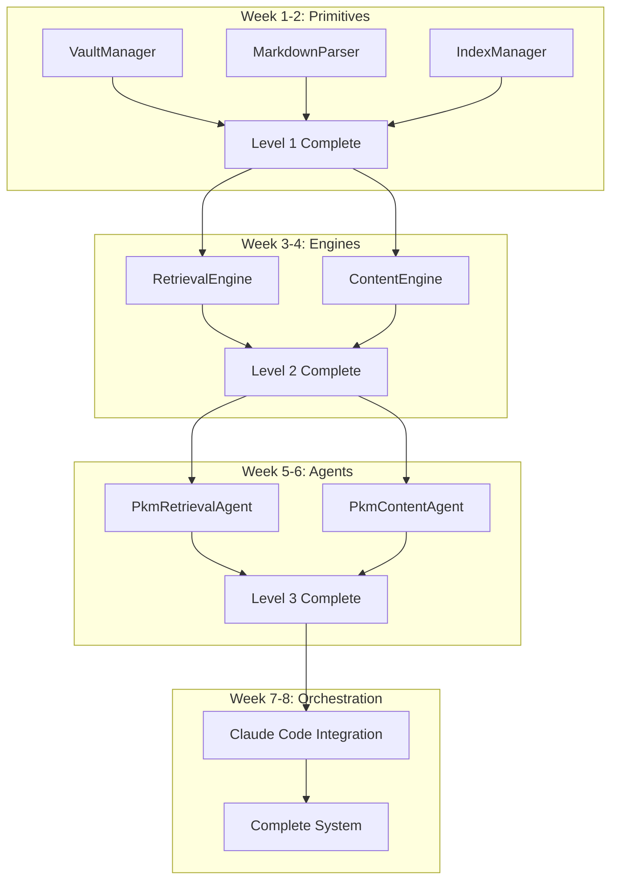

# PKM System: Compound Engineering Implementation Plan

## Executive Summary

**Objective**: Implement the PKM system following **compound engineering principles** where complex systems are built through systematic decomposition, parallel development of independent components, and careful orchestration through Claude Code as the integration layer.

**Compound Engineering Definition**: A methodology that breaks complex systems into smaller, independently developable components that can be composed together to create sophisticated capabilities while maintaining clear interfaces and minimal coupling.

**Claude Code Role**: Serves as the orchestration layer that enables natural language interaction with complex, multi-component systems while hiding implementation complexity from users.

## Compound Engineering Principles Applied to PKM

### 1. Systematic Decomposition
Break the PKM system into independent, composable components:

```yaml
component_hierarchy:
  level_1_primitives:
    - VaultManager: File system operations
    - MarkdownParser: Content parsing and metadata
    - IndexManager: Search and retrieval indices
    - LinkGraph: Relationship management
  
  level_2_engines:
    - RetrievalEngine: Search, get, links operations
    - SynthesisEngine: Pattern recognition and insight extraction
    - FeynmanEngine: Simplification and explanation
    - ContentEngine: Generation and publishing
  
  level_3_agents:
    - pkm-retrieval: Knowledge discovery orchestration
    - pkm-synthesizer: Cross-domain synthesis
    - pkm-feynman: Teaching and simplification
    - pkm-content: Content creation pipeline
  
  level_4_orchestration:
    - Claude Code: Natural language interface
    - Command Router: Intent parsing and dispatch
    - Response Formatter: User-friendly output
```

### 2. Component Independence
Each component operates independently with well-defined interfaces:

```python
# Example: Independent component interfaces
class VaultManager:
    """Level 1: Primitive file operations"""
    def read_note(self, path: str) -> Note: pass
    def write_note(self, note: Note) -> bool: pass
    def list_notes(self, folder: str) -> List[str]: pass

class RetrievalEngine:
    """Level 2: Composed from primitives"""
    def __init__(self, vault: VaultManager, index: IndexManager): pass
    def search(self, query: str) -> List[SearchResult]: pass
    def get(self, identifier: str) -> Union[Note, List[Note]]: pass

class PkmRetrievalAgent:
    """Level 3: Orchestrates engines"""
    def __init__(self, retrieval: RetrievalEngine): pass
    def handle_command(self, command: str) -> str: pass
```

### 3. Parallel Development Strategy
Components can be developed simultaneously by different workstreams:

```yaml
parallel_workstreams:
  workstream_a_primitives:
    duration: 2 weeks
    components: [VaultManager, MarkdownParser, IndexManager]
    team_size: 1
    dependencies: none
  
  workstream_b_retrieval:
    duration: 4 weeks
    components: [RetrievalEngine, PkmRetrievalAgent]
    team_size: 1
    dependencies: workstream_a (week 2+)
  
  workstream_c_content:
    duration: 4 weeks
    components: [ContentEngine, PkmContentAgent]
    team_size: 1
    dependencies: workstream_a (week 2+)
  
  workstream_d_orchestration:
    duration: 6 weeks
    components: [ClaudeCodeIntegration, CommandRouter]
    team_size: 1
    dependencies: workstreams_b_c (week 4+)
```

### 4. Interface-Driven Development
Define interfaces before implementation:

```python
# interfaces/pkm_interfaces.py - DEFINE FIRST
from abc import ABC, abstractmethod
from typing import List, Union, Optional

class VaultInterface(ABC):
    @abstractmethod
    def read_note(self, path: str) -> 'Note': pass
    
    @abstractmethod
    def write_note(self, note: 'Note') -> bool: pass

class RetrievalInterface(ABC):
    @abstractmethod
    def search(self, query: str, method: str = "hybrid") -> List['SearchResult']: pass
    
    @abstractmethod
    def get(self, identifier: str, type: str = "auto") -> Union['Note', List['Note']]: pass

class ContentInterface(ABC):
    @abstractmethod
    def generate_content(self, topic: str, audience: str, format: str) -> 'Content': pass
    
    @abstractmethod
    def adapt_content(self, content: str, audience: str) -> str: pass
```

### 5. Incremental Assembly
Build complexity gradually through composition:



## Claude Code as Orchestration Layer

### Design Philosophy
Claude Code serves as the **intelligent orchestration layer** that:
- **Hides Complexity**: Users interact with natural language, not APIs
- **Manages Coordination**: Orchestrates multiple agents seamlessly
- **Provides Context**: Maintains conversation state and user intent
- **Enables Composition**: Combines simple operations into complex workflows

### Claude Code Integration Architecture

```yaml
claude_code_layers:
  user_interface:
    natural_language: "Search for machine learning papers and create a tutorial"
    intent_parsing: "search + content_generation workflow"
    parameter_extraction: "topic=machine_learning, format=tutorial"
  
  orchestration_layer:
    command_routing: "Route to pkm-retrieval then pkm-content"
    agent_coordination: "Coordinate multi-agent workflow"
    state_management: "Maintain workflow context"
  
  agent_execution:
    pkm_retrieval: "Search and gather relevant papers"
    pkm_content: "Generate tutorial from search results"
    result_synthesis: "Combine outputs into coherent response"
  
  response_layer:
    result_formatting: "Present tutorial with sources"
    user_interaction: "Offer refinement options"
    workflow_completion: "Save tutorial to vault"
```

### Multi-Agent Workflows

#### Example 1: Research-to-Content Workflow
```yaml
workflow_research_to_content:
  user_input: "/create-tutorial machine-learning --audience=students"
  
  step_1_retrieval:
    agent: pkm-retrieval
    action: "search machine-learning --method=hybrid --limit=20"
    output: "List of relevant notes and research"
  
  step_2_synthesis:
    agent: pkm-synthesizer
    action: "extract key concepts and create structure"
    input: "search results from step 1"
    output: "Structured outline with key concepts"
  
  step_3_simplification:
    agent: pkm-feynman
    action: "adapt complexity for students"
    input: "outline and concepts from step 2"
    output: "Student-appropriate explanations"
  
  step_4_generation:
    agent: pkm-content
    action: "generate tutorial with format=tutorial"
    input: "simplified content from step 3"
    output: "Complete tutorial document"
  
  step_5_completion:
    action: "save to vault and present to user"
    output: "Tutorial saved, summary provided"
```

#### Example 2: Knowledge Discovery Workflow
```yaml
workflow_knowledge_discovery:
  user_input: "/explore-connections blockchain cryptocurrency"
  
  step_1_multi_search:
    agent: pkm-retrieval
    action: "search both topics and find intersections"
    output: "Notes related to both concepts"
  
  step_2_link_analysis:
    agent: pkm-retrieval
    action: "analyze link patterns and relationships"
    output: "Connection graph between concepts"
  
  step_3_insight_extraction:
    agent: pkm-synthesizer
    action: "identify novel connections and patterns"
    output: "Insights about blockchain-crypto relationships"
  
  step_4_presentation:
    agent: pkm-content
    action: "create visual map and summary"
    output: "Knowledge map with insights"
```

## Implementation Plan: Compound Engineering Approach

### Phase 2: Component Development (8 weeks)

#### Week 1-2: Foundation Components (Level 1)
**Workstream A: Primitives Development**

##### WS-A-001: VaultManager Implementation
**Component**: File system abstraction layer  
**Interface**: VaultInterface  
**Dependencies**: None  

```python
# tests/unit/test_vault_manager.py - WRITE FIRST
def test_vault_manager_reads_note():
    vault = VaultManager("test_vault")
    note = vault.read_note("test-note.md")
    assert note.title == "Test Note"
    assert note.content is not None

def test_vault_manager_writes_note():
    vault = VaultManager("test_vault")
    note = Note(title="New Note", content="Content")
    result = vault.write_note(note)
    assert result is True
    assert vault.read_note("new-note.md").title == "New Note"
```

##### WS-A-002: MarkdownParser Implementation
**Component**: Markdown processing and metadata extraction  
**Interface**: ParserInterface  
**Dependencies**: None  

```python
# tests/unit/test_markdown_parser.py - WRITE FIRST
def test_parser_extracts_frontmatter():
    parser = MarkdownParser()
    content = "---\ntitle: Test\ntags: [test]\n---\n# Content"
    result = parser.parse(content)
    assert result.frontmatter["title"] == "Test"
    assert result.frontmatter["tags"] == ["test"]

def test_parser_extracts_links():
    parser = MarkdownParser()
    content = "Link to [[other-note]] and [[another-note]]"
    result = parser.parse(content)
    assert "other-note" in result.links
    assert "another-note" in result.links
```

##### WS-A-003: IndexManager Implementation
**Component**: Search indices and metadata management  
**Interface**: IndexInterface  
**Dependencies**: VaultManager, MarkdownParser  

```python
# tests/unit/test_index_manager.py - WRITE FIRST
def test_index_manager_builds_content_index():
    vault = MockVaultManager()
    index = IndexManager(vault)
    index.build_content_index()
    results = index.search_content("machine learning")
    assert len(results) > 0
    assert results[0].relevance_score > 0.5

def test_index_manager_builds_metadata_index():
    vault = MockVaultManager()
    index = IndexManager(vault)
    index.build_metadata_index()
    results = index.search_metadata(tag="research")
    assert len(results) > 0
```

#### Week 3-4: Engine Components (Level 2)
**Workstream B: Retrieval Engine**  
**Workstream C: Content Engine**  

##### WS-B-001: RetrievalEngine Implementation
**Component**: Search, get, and links operations  
**Interface**: RetrievalInterface  
**Dependencies**: VaultManager, IndexManager  

```python
# tests/unit/test_retrieval_engine.py - WRITE FIRST
def test_retrieval_engine_hybrid_search():
    vault = MockVaultManager()
    index = MockIndexManager()
    engine = RetrievalEngine(vault, index)
    results = engine.search("machine learning", method="hybrid")
    assert len(results) <= 10  # default limit
    assert all(r.relevance_score > 0 for r in results)

def test_retrieval_engine_get_by_id():
    vault = MockVaultManager()
    index = MockIndexManager()
    engine = RetrievalEngine(vault, index)
    note = engine.get("note-123", type="id")
    assert note.id == "note-123"
    assert note.content is not None
```

##### WS-C-001: ContentEngine Implementation
**Component**: Content generation and adaptation  
**Interface**: ContentInterface  
**Dependencies**: VaultManager, RetrievalEngine  

```python
# tests/unit/test_content_engine.py - WRITE FIRST
def test_content_engine_generates_blog_post():
    vault = MockVaultManager()
    retrieval = MockRetrievalEngine()
    engine = ContentEngine(vault, retrieval)
    content = engine.generate_content("AI ethics", "general", "blog_post")
    assert content.format == "blog_post"
    assert content.word_count >= 800
    assert content.audience_level == "general"

def test_content_engine_adapts_audience():
    engine = ContentEngine(vault, retrieval)
    expert_content = "Complex technical explanation..."
    adapted = engine.adapt_content(expert_content, "beginner")
    assert adapted != expert_content  # content changed
    assert complexity_score(adapted) < complexity_score(expert_content)
```

#### Week 5-6: Agent Components (Level 3)
**Workstream B: Retrieval Agent**  
**Workstream C: Content Agent**  

##### WS-B-002: PkmRetrievalAgent Implementation
**Component**: Retrieval operations orchestration  
**Interface**: AgentInterface  
**Dependencies**: RetrievalEngine  

```python
# tests/unit/test_pkm_retrieval_agent.py - WRITE FIRST
def test_retrieval_agent_handles_search_command():
    retrieval_engine = MockRetrievalEngine()
    agent = PkmRetrievalAgent(retrieval_engine)
    response = agent.handle_command("/pkm-search machine learning --limit=5")
    assert "Found 5 results" in response
    assert "machine learning" in response.lower()

def test_retrieval_agent_handles_get_command():
    retrieval_engine = MockRetrievalEngine()
    agent = PkmRetrievalAgent(retrieval_engine)
    response = agent.handle_command("/pkm-get note-123 --format=summary")
    assert "note-123" in response
    assert len(response) < 500  # summary format
```

##### WS-C-002: PkmContentAgent Implementation
**Component**: Content creation orchestration  
**Interface**: AgentInterface  
**Dependencies**: ContentEngine, RetrievalEngine  

```python
# tests/unit/test_pkm_content_agent.py - WRITE FIRST
def test_content_agent_creates_content():
    content_engine = MockContentEngine()
    retrieval_engine = MockRetrievalEngine()
    agent = PkmContentAgent(content_engine, retrieval_engine)
    response = agent.handle_command("/content-create AI --audience=students --format=tutorial")
    assert "tutorial" in response.lower()
    assert "created successfully" in response

def test_content_agent_adapts_content():
    content_engine = MockContentEngine()
    agent = PkmContentAgent(content_engine, None)
    response = agent.handle_command("/content-adapt research-paper.md --audience=general")
    assert "adapted for general audience" in response
```

#### Week 7-8: Orchestration Layer (Level 4)
**Workstream D: Claude Code Integration**  

##### WS-D-001: Command Router Implementation
**Component**: Intent parsing and command dispatch  
**Interface**: RouterInterface  
**Dependencies**: All agents  

```python
# tests/unit/test_command_router.py - WRITE FIRST
def test_router_parses_search_intent():
    router = CommandRouter()
    intent = router.parse_intent("Search for machine learning papers")
    assert intent.command == "search"
    assert intent.parameters["query"] == "machine learning papers"
    assert intent.agent == "pkm-retrieval"

def test_router_routes_to_correct_agent():
    retrieval_agent = MockRetrievalAgent()
    content_agent = MockContentAgent()
    router = CommandRouter({"retrieval": retrieval_agent, "content": content_agent})
    response = router.route("/pkm-search machine learning")
    assert response is not None
    assert retrieval_agent.handle_command.called
```

##### WS-D-002: Multi-Agent Workflow Orchestration
**Component**: Complex workflow coordination  
**Interface**: WorkflowInterface  
**Dependencies**: CommandRouter, All agents  

```python
# tests/integration/test_multi_agent_workflows.py - WRITE FIRST
def test_research_to_content_workflow():
    system = PkmSystem()
    result = system.execute_workflow(
        "create tutorial about machine learning for students"
    )
    assert result.content_created is True
    assert result.format == "tutorial"
    assert result.audience == "students"
    assert len(result.sources) > 0  # uses research

def test_knowledge_discovery_workflow():
    system = PkmSystem()
    result = system.execute_workflow(
        "explore connections between blockchain and cryptocurrency"
    )
    assert result.connections_found > 0
    assert result.insights_generated > 0
    assert result.visualization_created is True
```

## Component Integration Strategy

### 1. Interface-First Development
Every component begins with interface definition:

```python
# Step 1: Define interfaces (before any implementation)
# interfaces/
#   ├── vault_interface.py
#   ├── retrieval_interface.py
#   ├── content_interface.py
#   └── agent_interface.py

# Step 2: Create mock implementations for testing
# mocks/
#   ├── mock_vault.py
#   ├── mock_retrieval.py
#   └── mock_content.py

# Step 3: Implement components against interfaces
# implementations/
#   ├── vault_manager.py
#   ├── retrieval_engine.py
#   └── content_engine.py
```

### 2. Dependency Injection Pattern
Components receive dependencies rather than creating them:

```python
class RetrievalEngine:
    def __init__(self, 
                 vault: VaultInterface,
                 index: IndexInterface,
                 parser: ParserInterface):
        self.vault = vault
        self.index = index
        self.parser = parser
    
    # Implementation depends only on interfaces, not concrete classes

# Configuration assembles the system
def create_retrieval_engine(vault_path: str) -> RetrievalEngine:
    vault = VaultManager(vault_path)
    parser = MarkdownParser()
    index = IndexManager(vault, parser)
    return RetrievalEngine(vault, index, parser)
```

### 3. Event-Driven Communication
Components communicate through events rather than direct coupling:

```python
class EventBus:
    def __init__(self):
        self.listeners = {}
    
    def subscribe(self, event_type: str, handler: callable):
        if event_type not in self.listeners:
            self.listeners[event_type] = []
        self.listeners[event_type].append(handler)
    
    def publish(self, event_type: str, data: dict):
        for handler in self.listeners.get(event_type, []):
            handler(data)

# Components subscribe to relevant events
retrieval_engine.subscribe("note_updated", self.invalidate_cache)
content_engine.subscribe("content_generated", self.save_to_vault)
```

## Quality Assurance Strategy

### 1. Component-Level Testing
Each component has comprehensive test suite:

```yaml
testing_pyramid:
  unit_tests:
    coverage: ">95%"
    isolation: "mock all dependencies"
    speed: "<1s per test"
  
  integration_tests:
    coverage: "critical paths"
    real_dependencies: "minimal real components"
    speed: "<10s per test"
  
  system_tests:
    coverage: "end-to-end workflows"
    full_system: "all components integrated"
    speed: "<60s per test"
```

### 2. Interface Compliance Testing
Automated testing ensures interface adherence:

```python
# tests/contracts/test_interface_compliance.py
def test_vault_implementations_comply_with_interface():
    """Test all VaultInterface implementations"""
    implementations = [VaultManager, MockVaultManager]
    for impl_class in implementations:
        impl = impl_class("test_vault")
        assert isinstance(impl, VaultInterface)
        # Test all interface methods work correctly
        note = impl.read_note("test.md")
        assert isinstance(note, Note)
```

### 3. Performance Validation
Each component meets performance requirements:

```python
# tests/performance/test_component_performance.py
def test_retrieval_engine_search_performance():
    engine = RetrievalEngine(vault, index)
    start_time = time.time()
    results = engine.search("test query")
    duration = time.time() - start_time
    assert duration < 0.1  # <100ms requirement
    assert len(results) > 0
```

## Benefits of Compound Engineering Approach

### 1. Parallel Development
- **Multiple workstreams**: Teams can work independently on different components
- **Reduced dependencies**: Clear interfaces minimize blocking
- **Faster delivery**: Parallel work reduces total development time

### 2. Quality Assurance
- **Component isolation**: Issues contained within component boundaries
- **Interface compliance**: Automated testing ensures compatibility
- **Incremental validation**: Quality verified at each composition level

### 3. Maintainability
- **Clear boundaries**: Each component has well-defined responsibilities
- **Easy replacement**: Components can be swapped without system changes
- **Incremental improvement**: Individual components can be optimized independently

### 4. Scalability
- **Horizontal scaling**: Components can be distributed across systems
- **Performance optimization**: Bottlenecks isolated to specific components
- **Resource management**: Components can be sized according to load

### 5. User Experience
- **Claude Code orchestration**: Complex operations hidden behind natural language
- **Seamless integration**: Users interact with unified system, not individual components
- **Progressive complexity**: Simple operations compose into sophisticated workflows

## Risk Management

### Technical Risks
- **Interface evolution**: Managed through versioning and backward compatibility
- **Integration complexity**: Mitigated by thorough integration testing
- **Performance bottlenecks**: Addressed through component-level performance requirements

### Development Risks
- **Coordination overhead**: Managed through clear interfaces and regular integration
- **Component dependencies**: Minimized through dependency injection and event-driven communication
- **Quality consistency**: Ensured through standardized testing and validation

## Success Metrics

### Development Efficiency
- **Parallel development**: >70% of work done in parallel
- **Integration success**: <5% time spent on integration issues
- **Component reuse**: >80% of components used by multiple agents

### System Performance
- **Response time**: <100ms for simple operations, <1s for complex workflows
- **Reliability**: >99% uptime for individual components
- **Scalability**: Linear performance scaling with load

### User Experience
- **Command success**: >95% of natural language commands executed successfully
- **Workflow completion**: >90% of multi-step workflows complete without errors
- **User satisfaction**: Simplified interaction with complex system capabilities

---

**Compound Engineering Status**: ✅ **Ready for Implementation**  
**Development Approach**: Parallel component development with clear interfaces  
**Integration Strategy**: Claude Code orchestration layer with natural language interface  
**Quality Assurance**: Comprehensive testing at component, integration, and system levels

This compound engineering approach transforms the PKM system development from a monolithic challenge into a systematic composition of independently developable, testable, and maintainable components orchestrated through Claude Code's natural language interface.