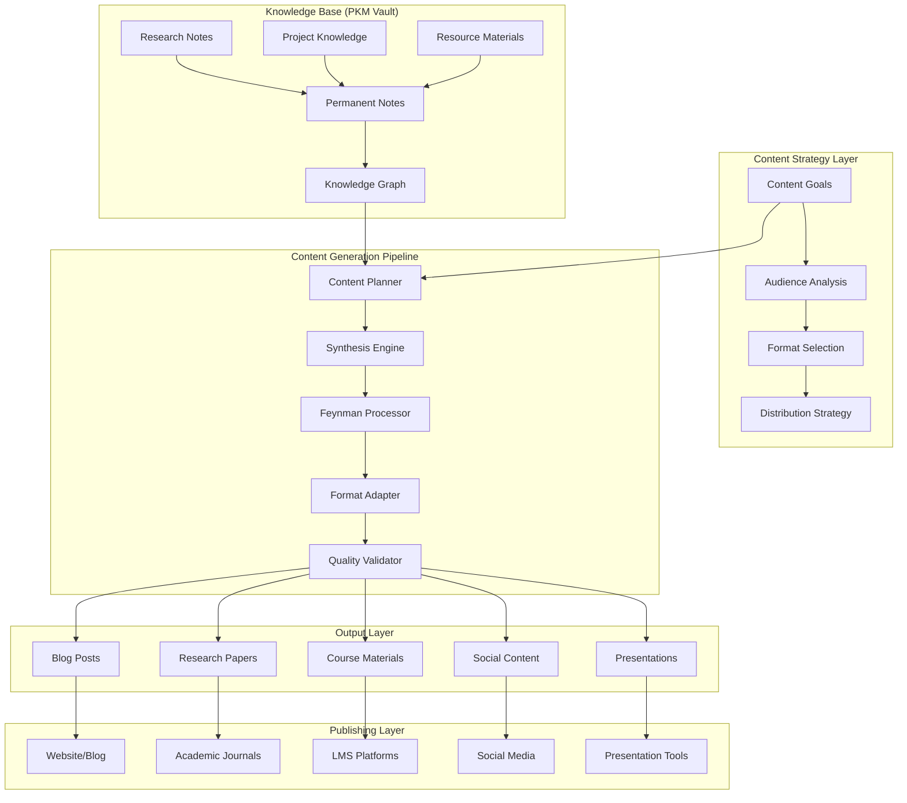

# PKM Content Creation Integration Plan

## Executive Summary

**Objective**: Integrate content creation pipeline into the PKM system that leverages existing knowledge to create audience-adapted content for research, education, marketing, and publishing.

**Current State**: The PKM system has comprehensive content generation architecture designed but not implemented. Existing agents (`pkm-synthesizer`, `pkm-feynman`) provide the foundation for content creation pipeline.

**Target State**: Fully integrated content creation system that transforms PKM knowledge into various content formats optimized for specific audiences and purposes.

## Current State Assessment

### ✅ Existing Content Generation Architecture

#### Architectural Foundation
- **Content Generation System**: Comprehensive specification in `vault/04-resources/architecture/pkm/CONTENT-GENERATION-SYSTEM.md`
- **Synthesis Agent**: Advanced synthesis capabilities for pattern recognition and insight generation
- **Feynman Agent**: Simplification and audience adaptation through ELI5 methodology
- **Knowledge Graph**: Vault structure supporting content relationships and connections

#### Existing Capabilities (Designed)
```yaml
designed_capabilities:
  synthesis_engine:
    - progressive_summarization
    - insight_extraction
    - cross_domain_synthesis
    - teaching_material_generation
    - knowledge_compilation
  
  feynman_processor:
    - eli5_generation
    - analogy_creation
    - gap_identification
    - teaching_validation
    - progressive_complexity
  
  content_formats:
    - summaries (5 levels)
    - insights_reports
    - teaching_materials
    - visual_maps
    - frameworks
```

### 🔄 Implementation Gap Analysis

#### Missing Components
1. **Content Creation Pipeline**: End-to-end workflow from knowledge to published content
2. **Audience Adaptation Engine**: Systematic adjustment for different audiences
3. **Format Templates**: Standardized templates for different content types
4. **Publishing Integration**: Direct publishing to various platforms
5. **Content Strategy Framework**: Strategic approach to content creation

#### Implementation Status
- **Phase 1 (Foundation)**: ✅ Complete - Vault structure and ingestion
- **Phase 2 (Retrieval)**: 🔄 In Progress - Search, get, links functionality
- **Phase 3 (Content Creation)**: 📅 Not Started - Content generation pipeline

## Content Creation Vision

### Integrated Content Pipeline



### Content Creation Use Cases

#### 1. Research-to-Publication Pipeline
```yaml
research_pipeline:
  input: "Research notes and findings in vault"
  process:
    - synthesis_of_findings
    - audience_adaptation
    - format_optimization
    - citation_integration
  output: "Publication-ready research papers"
  
  example:
    source: "vault/02-projects/currency-research/"
    target_audience: "academic_economists"
    format: "journal_article"
    output: "comprehensive_currency_valuation_paper.md"
```

#### 2. Educational Content Creation
```yaml
education_pipeline:
  input: "Complex knowledge from vault"
  process:
    - feynman_simplification
    - progressive_complexity
    - exercise_generation
    - assessment_creation
  output: "Complete educational materials"
  
  example:
    source: "vault/permanent/notes/machine-learning/"
    target_audience: "undergraduate_students"
    format: "course_curriculum"
    output: "ml_fundamentals_course/"
```

#### 3. Content Marketing Pipeline
```yaml
marketing_pipeline:
  input: "Expertise and insights from vault"
  process:
    - insight_extraction
    - story_creation
    - audience_targeting
    - engagement_optimization
  output: "Marketing content across channels"
  
  example:
    source: "vault/04-resources/frameworks/"
    target_audience: "business_professionals"
    format: "linkedin_article_series"
    output: "thought_leadership_content/"
```

## Implementation Plan

### Phase 2B: Content Creation Extension (Parallel to Retrieval)

#### Rationale for Parallel Development
- **Leverage Existing Architecture**: Content generation specs already exist
- **Incremental Value**: Each component provides immediate value
- **User Feedback**: Early content creation enables user validation
- **Foundation Building**: Establishes content pipeline alongside retrieval

#### Content Creation Tasks (2 weeks, parallel to retrieval)

### TASK-CC-001: Content Strategy Framework
**Priority**: 🔴 Critical  
**Effort**: M  
**Dependencies**: None  
**TDD Approach**: Strategy validation tests  

#### Description
Create systematic framework for content strategy, audience analysis, and format selection.

#### Acceptance Criteria
- [ ] Content strategy template with goals, audiences, formats
- [ ] Audience persona definitions with adaptation rules
- [ ] Format specifications for different content types
- [ ] Content planning workflow integration
- [ ] Strategy validation and measurement framework

#### Implementation
```python
# tests/unit/test_content_strategy.py - WRITE FIRST
def test_content_strategy_defines_audience():
    strategy = ContentStrategy()
    strategy.add_audience("researchers", expertise="expert", format_preference="detailed")
    assert strategy.get_audience("researchers").expertise == "expert"

def test_format_selection_for_audience():
    strategy = ContentStrategy()
    format = strategy.select_format("academic_paper", audience="researchers")
    assert format.citation_style == "academic"
    assert format.length_range == (5000, 15000)
```

#### Strategy Framework
```yaml
content_strategy:
  audiences:
    researchers:
      expertise_level: expert
      preferred_formats: [academic_paper, detailed_analysis]
      language_style: formal
      evidence_requirements: high
    
    students:
      expertise_level: beginner_to_intermediate
      preferred_formats: [tutorial, eli5_explanation]
      language_style: conversational
      evidence_requirements: medium
    
    professionals:
      expertise_level: intermediate
      preferred_formats: [executive_summary, practical_guide]
      language_style: professional
      evidence_requirements: medium
    
    general_public:
      expertise_level: beginner
      preferred_formats: [blog_post, infographic]
      language_style: accessible
      evidence_requirements: low
```

### TASK-CC-002: Content Templates and Formats
**Priority**: 🔴 Critical  
**Effort**: L  
**Dependencies**: TASK-CC-001  
**TDD Approach**: Template validation tests  

#### Description
Develop standardized templates for different content formats with audience-specific adaptations.

#### Acceptance Criteria
- [ ] Template library for major content formats
- [ ] Dynamic template selection based on audience
- [ ] Content structure validation
- [ ] Metadata and frontmatter standards
- [ ] Template customization framework

#### Content Format Templates
```yaml
templates:
  academic_paper:
    structure:
      - abstract (150-250 words)
      - introduction (500-1000 words)
      - literature_review (1000-2000 words)
      - methodology (500-1000 words)
      - results (1000-2000 words)
      - discussion (1000-1500 words)
      - conclusion (300-500 words)
      - references (apa_style)
    
    audience_adaptations:
      expert: maximize_technical_depth
      intermediate: balance_detail_accessibility
      beginner: emphasize_background_context
  
  blog_post:
    structure:
      - hook (50-100 words)
      - problem_statement (100-200 words)
      - main_content (800-1500 words)
      - takeaways (100-200 words)
      - call_to_action (50-100 words)
    
    audience_adaptations:
      expert: focus_on_novel_insights
      intermediate: provide_practical_examples
      beginner: include_foundational_concepts
```

### TASK-CC-003: Content Generation Engine
**Priority**: 🔴 Critical  
**Effort**: XL  
**Dependencies**: TASK-CC-002  
**TDD Approach**: Content generation pipeline tests  

#### Description
Implement core content generation engine that transforms PKM knowledge into formatted content.

#### Acceptance Criteria
- [ ] ContentGenerator class with format-specific methods
- [ ] Integration with existing synthesis and feynman agents
- [ ] Content planning and outlining capabilities
- [ ] Automated content assembly from vault knowledge
- [ ] Quality validation and coherence checking

#### Implementation Framework
```python
class ContentGenerator:
    """Core content generation engine"""
    
    def __init__(self, vault_path: str, strategy: ContentStrategy):
        self.vault = VaultManager(vault_path)
        self.strategy = strategy
        self.synthesizer = SynthesizerAgent()
        self.feynman = FeynmanAgent()
    
    def generate_content(self, topic: str, audience: str, format: str) -> Content:
        """Generate content for specific topic, audience, and format"""
        # 1. Knowledge gathering from vault
        # 2. Content planning and outlining
        # 3. Synthesis and adaptation
        # 4. Format-specific generation
        # 5. Quality validation
        pass
    
    def create_outline(self, topic: str, format: str) -> ContentOutline:
        """Create structured outline for content"""
        pass
    
    def adapt_for_audience(self, content: str, audience: str) -> str:
        """Adapt content complexity and style for audience"""
        pass
```

### TASK-CC-004: Audience Adaptation System
**Priority**: 🟠 High  
**Effort**: L  
**Dependencies**: TASK-CC-003  
**TDD Approach**: Adaptation validation tests  

#### Description
Implement systematic audience adaptation that adjusts content complexity, style, and examples.

#### Adaptation Rules
```yaml
adaptation_rules:
  complexity_adjustment:
    expert:
      - preserve_technical_terminology
      - include_advanced_concepts
      - assume_background_knowledge
      - focus_on_novel_insights
    
    beginner:
      - replace_jargon_with_plain_language
      - provide_background_context
      - use_concrete_examples
      - progressive_concept_building
  
  style_adjustment:
    academic:
      - formal_tone
      - third_person_perspective
      - evidence_based_arguments
      - citation_requirements
    
    conversational:
      - approachable_tone
      - second_person_perspective
      - story_based_examples
      - practical_applications
```

### TASK-CC-005: Publishing Integration Framework
**Priority**: 🟡 Medium  
**Effort**: M  
**Dependencies**: TASK-CC-004  
**TDD Approach**: Publishing workflow tests  

#### Description
Create framework for publishing content to various platforms and formats.

#### Publishing Targets
```yaml
publishing_platforms:
  markdown_blog:
    format: markdown
    metadata: frontmatter
    assets: local_images
  
  wordpress:
    format: html
    metadata: custom_fields
    assets: media_library
  
  academic_submission:
    format: latex_or_docx
    metadata: document_properties
    assets: embedded_figures
  
  social_media:
    format: plain_text
    metadata: hashtags
    assets: single_image
```

## Content Creation Commands

### Claude Code Integration
```yaml
content_commands:
  "/content-create":
    description: "Generate content from vault knowledge"
    parameters:
      topic: string (required)
      audience: enum [researchers, students, professionals, general]
      format: enum [academic_paper, blog_post, course_material, social_post]
      source: string (optional, vault path)
    example: "/content-create blockchain --audience=students --format=tutorial"
  
  "/content-adapt":
    description: "Adapt existing content for different audience"
    parameters:
      content_path: string (required)
      target_audience: enum [researchers, students, professionals, general]
      format: enum [same, blog_post, academic_paper, social_post]
    example: "/content-adapt research-paper.md --target-audience=general --format=blog_post"
  
  "/content-outline":
    description: "Create content outline from vault knowledge"
    parameters:
      topic: string (required)
      format: enum [academic_paper, blog_post, course_curriculum]
      depth: enum [shallow, medium, comprehensive]
    example: "/content-outline machine-learning --format=course_curriculum --depth=comprehensive"
  
  "/content-publish":
    description: "Prepare content for publishing platform"
    parameters:
      content_path: string (required)
      platform: enum [blog, wordpress, academic, social]
      publish: boolean (default: false)
    example: "/content-publish ml-tutorial.md --platform=blog --publish=true"
```

## Integration with Existing Architecture

### Phase 2 Parallel Development
```yaml
parallel_development:
  retrieval_agent: "weeks 1-8"
  content_creation: "weeks 3-6"
  
  integration_points:
    - content_generation_uses_retrieval_engine
    - search_functionality_supports_content_research
    - link_discovery_enhances_content_connections
    - vault_structure_optimized_for_both
```

### Enhanced Agent Ecosystem
```yaml
agent_ecosystem:
  pkm_retrieval:
    capabilities: [search, get, links]
    role: "knowledge discovery and access"
  
  pkm_synthesizer:
    capabilities: [pattern_recognition, insight_extraction, cross_domain_synthesis]
    role: "content synthesis and analysis"
  
  pkm_feynman:
    capabilities: [eli5_generation, audience_adaptation, teaching_validation]
    role: "content simplification and education"
  
  pkm_content:
    capabilities: [format_generation, audience_adaptation, publishing_preparation]
    role: "content creation and distribution"
```

## Success Metrics for Content Creation

### Quantitative Metrics
```yaml
success_metrics:
  generation_speed:
    blog_post: "<5 minutes"
    academic_paper: "<30 minutes"
    course_material: "<60 minutes"
  
  quality_measures:
    coherence_score: ">0.85"
    audience_appropriateness: ">0.8"
    factual_accuracy: ">0.95"
    engagement_prediction: ">0.7"
  
  productivity_gains:
    content_creation_time: "50% reduction"
    revision_cycles: "30% reduction"
    research_to_publication: "60% faster"
```

### Qualitative Success Indicators
- Content maintains voice and expertise of original knowledge
- Audience feedback indicates appropriate complexity and style
- Publishing workflow significantly streamlined
- Knowledge reuse across multiple content formats
- Consistent quality across different content types

## Risk Assessment and Mitigation

### Technical Risks
- **Content Quality**: Mitigated by human review workflows and quality gates
- **Audience Misalignment**: Managed through iterative feedback and adaptation
- **Format Limitations**: Addressed by extensible template system
- **Integration Complexity**: Reduced by leveraging existing agent architecture

### Implementation Risks
- **Scope Creep**: Controlled by phased approach and clear boundaries
- **User Adoption**: Managed through gradual rollout and training
- **Content Accuracy**: Ensured by source attribution and fact-checking workflows

## Updated Implementation Timeline

### Phase 2: Enhanced Retrieval + Content Creation (8 weeks)
```yaml
weeks_1_2:
  primary: "Core retrieval engine (RET-001 to RET-005)"
  parallel: "Content strategy framework (CC-001)"

weeks_3_4:
  primary: "CLI interface (RET-006 to RET-010)"
  parallel: "Content templates and generation engine (CC-002, CC-003)"

weeks_5_6:
  primary: "Claude Code integration (RET-011 to RET-015)"
  parallel: "Audience adaptation system (CC-004)"

weeks_7_8:
  primary: "Production deployment (RET-016, RET-017)"
  parallel: "Publishing integration and testing (CC-005)"
```

### Phase 3: Advanced Content Features (Future)
- AI-powered content optimization
- Multi-modal content generation (video, audio, interactive)
- Real-time content personalization
- Advanced analytics and content performance tracking

---

**Content Creation Integration Status**: ✅ Ready for Implementation  
**Integration Approach**: Parallel development with retrieval agent  
**Success Probability**: 🎯 High (leveraging existing architecture)  
**Business Value**: 🚀 Significant content creation productivity gains

*This plan transforms the PKM system from knowledge storage to active content creation platform, enabling systematic leverage of accumulated knowledge for various audiences and purposes.*