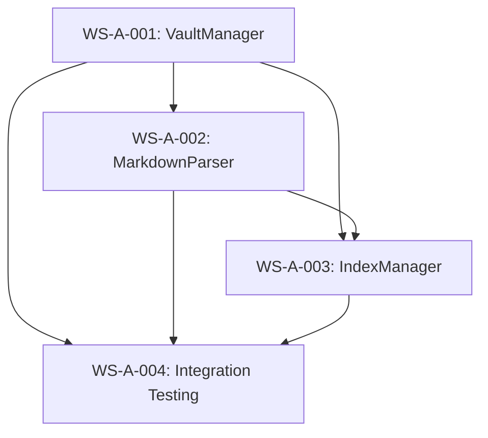
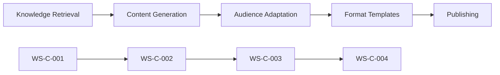
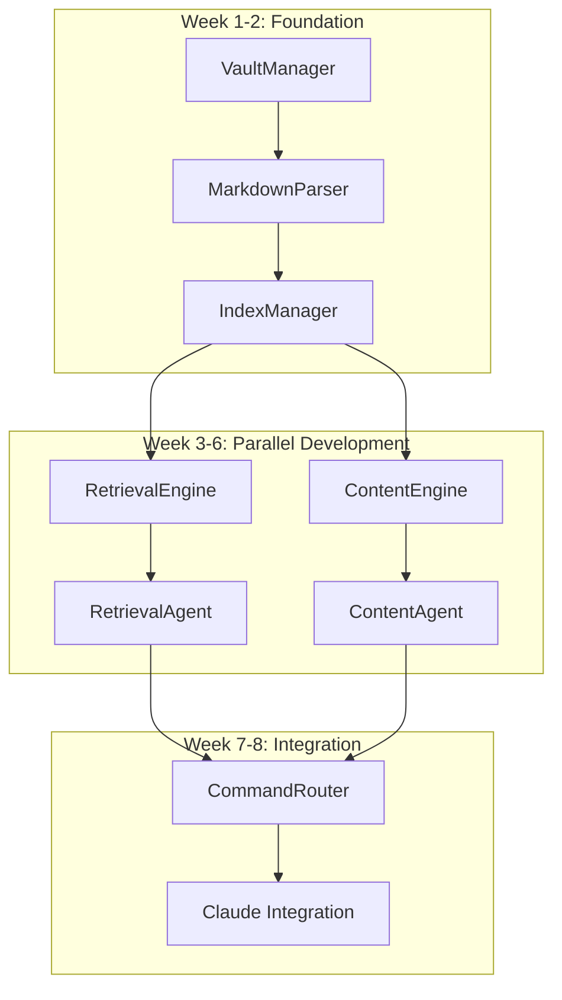

# PKM System Task Prioritization Matrix

## Overview

This document provides systematic task prioritization using compound engineering principles, ensuring optimal resource allocation and maximum parallel development efficiency.

## Prioritization Framework

### Priority Levels
- 🔴 **Critical**: Blocks other work, must complete first
- 🟠 **High**: Enables significant value, complete soon
- 🟡 **Medium**: Important but not blocking, schedule flexibly
- 🟢 **Low**: Nice to have, defer to later phases

### Evaluation Criteria
```yaml
blocking_factor:
  weight: 40%
  description: "How many other tasks depend on this"
  scale: "0 (no dependencies) to 10 (blocks everything)"

user_value:
  weight: 30%
  description: "Direct impact on user capability"
  scale: "0 (no user impact) to 10 (core functionality)"

implementation_risk:
  weight: 20%
  description: "Technical complexity and uncertainty"
  scale: "0 (trivial) to 10 (experimental/unknown)"

effort_efficiency:
  weight: 10%
  description: "Value delivered per unit of effort"
  scale: "0 (very inefficient) to 10 (high ROI)"
```

## Workstream A: Foundation Components (Weeks 1-2)

### Priority Matrix
| Task | Blocking | User Value | Risk | Efficiency | Total | Priority |
|------|----------|------------|------|------------|-------|----------|
| WS-A-001: VaultManager | 10 | 8 | 3 | 9 | 8.4 | 🔴 Critical |
| WS-A-002: MarkdownParser | 9 | 7 | 4 | 8 | 7.9 | 🔴 Critical |
| WS-A-003: IndexManager | 8 | 9 | 6 | 7 | 7.8 | 🔴 Critical |
| WS-A-004: Integration Testing | 7 | 5 | 2 | 8 | 6.0 | 🟠 High |

### Sequential Dependencies


### Implementation Schedule
```yaml
week_1:
  days_1_3: "WS-A-001 VaultManager (Critical path)"
  days_4_5: "WS-A-002 MarkdownParser (Depends on VaultManager)"
  
week_2:
  days_1_4: "WS-A-003 IndexManager (Depends on both)"
  day_5: "WS-A-004 Integration Testing (Validation)"
```

## Workstream B: Retrieval System (Weeks 3-6)

### Priority Matrix
| Task | Blocking | User Value | Risk | Efficiency | Total | Priority |
|------|----------|------------|------|------------|-------|----------|
| WS-B-001: RetrievalEngine Core | 9 | 10 | 5 | 9 | 8.6 | 🔴 Critical |
| WS-B-002: PkmRetrievalAgent | 8 | 9 | 4 | 8 | 7.9 | 🔴 Critical |
| WS-B-003: Advanced Search | 3 | 7 | 7 | 6 | 5.4 | 🟡 Medium |
| WS-B-004: CLI Interface | 5 | 8 | 3 | 7 | 6.4 | 🟠 High |

### Parallel Development Opportunities
```yaml
week_3:
  primary: "WS-B-001 RetrievalEngine (Critical)"
  parallel: "WS-C-001 ContentEngine (Independent)"
  
week_4:
  primary: "WS-B-002 PkmRetrievalAgent"
  parallel: "WS-C-002 PkmContentAgent"
  
weeks_5_6:
  flexible: "WS-B-003 Advanced Search (Medium priority)"
  priority: "WS-B-004 CLI Interface (High priority)"
  parallel: "WS-C-003/004 Content features"
```

## Workstream C: Content System (Weeks 3-6)

### Priority Matrix
| Task | Blocking | User Value | Risk | Efficiency | Total | Priority |
|------|----------|------------|------|------------|-------|----------|
| WS-C-001: ContentEngine Core | 8 | 9 | 6 | 8 | 8.0 | 🔴 Critical |
| WS-C-002: PkmContentAgent | 7 | 8 | 5 | 7 | 7.2 | 🔴 Critical |
| WS-C-003: Publishing Integration | 4 | 6 | 4 | 6 | 5.0 | 🟡 Medium |
| WS-C-004: Content Strategy | 2 | 7 | 3 | 8 | 5.2 | 🟡 Medium |

### Content Creation Value Chain


## Workstream D: Orchestration Layer (Weeks 7-8)

### Priority Matrix
| Task | Blocking | User Value | Risk | Efficiency | Total | Priority |
|------|----------|------------|------|------------|-------|----------|
| WS-D-001: CommandRouter | 10 | 8 | 7 | 8 | 8.5 | 🔴 Critical |
| WS-D-002: System Integration | 9 | 6 | 5 | 7 | 7.2 | 🔴 Critical |
| WS-D-003: Claude Code Integration | 7 | 10 | 6 | 9 | 8.0 | 🔴 Critical |
| WS-D-004: Production Readiness | 5 | 7 | 4 | 6 | 5.8 | 🟠 High |

### Final Integration Dependencies
```yaml
critical_path:
  WS-D-001: "Enables all other orchestration work"
  WS-D-002: "Validates component integration"
  WS-D-003: "Delivers user interface"
  WS-D-004: "Ensures production quality"
  
integration_sequence:
  step_1: "CommandRouter (enables coordination)"
  step_2: "System Integration (validates architecture)"
  step_3: "Claude Code Integration (user interface)"
  step_4: "Production Readiness (deployment preparation)"
```

## Cross-Workstream Dependencies

### Critical Dependency Chain


### Interface Synchronization Points
```yaml
interface_checkpoints:
  week_2_end:
    deliverable: "Foundation interfaces stable"
    impact: "Enables WS-B and WS-C to begin"
    validation: "Interface compliance tests pass"
    
  week_4_end:
    deliverable: "Engine interfaces stable"
    impact: "Enables agent development completion"
    validation: "Integration tests pass"
    
  week_6_end:
    deliverable: "Agent interfaces stable"
    impact: "Enables orchestration layer development"
    validation: "End-to-end agent tests pass"
```

## Resource Allocation Strategy

### Optimal Team Structure
```yaml
team_allocation:
  foundation_phase:
    team_size: 1
    duration: 2_weeks
    focus: "Sequential development with quality gates"
    
  parallel_phase:
    team_size: 2
    duration: 4_weeks
    workstream_a: "Retrieval specialist"
    workstream_b: "Content specialist"
    coordination: "Daily sync, shared interfaces"
    
  integration_phase:
    team_size: 1
    duration: 2_weeks
    focus: "System integration and Claude Code"
```

### Alternative Scaling Options
```yaml
single_developer:
  approach: "Sequential development with careful prioritization"
  timeline: "10-12 weeks (extended but manageable)"
  benefits: "Consistent architecture, deep system knowledge"
  
larger_team:
  approach: "Additional workstreams for advanced features"
  timeline: "6-8 weeks (accelerated with more features)"
  benefits: "Faster delivery, more concurrent features"
```

## Risk-Adjusted Prioritization

### High-Risk Tasks (Require Extra Attention)
```yaml
high_risk_tasks:
  WS-A-003_IndexManager:
    risk_factors: "Search performance, indexing complexity"
    mitigation: "Early prototyping, performance testing"
    priority_adjustment: "Start earlier, allocate buffer time"
    
  WS-C-001_ContentEngine:
    risk_factors: "AI integration, quality validation"
    mitigation: "Incremental development, user testing"
    priority_adjustment: "Parallel prototyping approach"
    
  WS-D-001_CommandRouter:
    risk_factors: "Natural language parsing, intent recognition"
    mitigation: "Fallback to command mode, gradual NL improvement"
    priority_adjustment: "Build simple first, enhance iteratively"
```

### Risk Mitigation Strategies
```yaml
technical_risks:
  performance_bottlenecks:
    early_action: "Performance testing from day 1"
    checkpoints: "Weekly performance validation"
    fallback: "Optimization sprints as needed"
    
  integration_complexity:
    early_action: "Daily integration testing"
    checkpoints: "Interface compliance validation"
    fallback: "Interface versioning and adapters"
    
  user_experience:
    early_action: "User story validation"
    checkpoints: "Usability testing at each milestone"
    fallback: "Improved error messages and help system"
```

## Success Metrics by Priority Level

### Critical Task Success Criteria (🔴)
```yaml
must_achieve:
  functionality: "100% core features working"
  performance: "Meet all performance targets"
  integration: "Seamless component interaction"
  user_interface: "Natural language commands functional"
  
failure_indicators:
  blocking_others: "Dependent tasks cannot proceed"
  core_broken: "Basic system functionality fails"
  performance_miss: "Performance targets significantly missed"
```

### High Priority Task Success Criteria (🟠)
```yaml
should_achieve:
  functionality: "90% intended features working"
  performance: "Acceptable performance with optimization plan"
  integration: "Working integration with minor issues"
  user_experience: "Good usability with clear documentation"
  
acceptable_compromises:
  feature_reduction: "Defer 10% of features to next phase"
  performance_plan: "Performance improvement roadmap in place"
  workaround_documentation: "Clear documentation for known issues"
```

### Medium/Low Priority Task Success Criteria (🟡🟢)
```yaml
nice_to_achieve:
  functionality: "Core features working, advanced features variable"
  performance: "Functional performance, optimization opportunities identified"
  integration: "Basic integration working"
  
acceptable_deferrals:
  advanced_features: "Can defer to next phase without impact"
  optimization: "Can optimize after core system stable"
  polish: "Can improve user experience iteratively"
```

## Implementation Timeline with Prioritization

### Week-by-Week Priority Focus
```yaml
week_1:
  primary_focus: "🔴 VaultManager (Critical path foundation)"
  secondary_focus: "Interface design for dependent components"
  success_gate: "VaultManager complete, interfaces defined"
  
week_2:
  primary_focus: "🔴 MarkdownParser + IndexManager"
  secondary_focus: "🟠 Integration testing and validation"
  success_gate: "Foundation complete, WS-B/C can begin"
  
week_3:
  primary_focus: "🔴 RetrievalEngine + ContentEngine (parallel)"
  secondary_focus: "Engine integration testing"
  success_gate: "Core engines functional"
  
week_4:
  primary_focus: "🔴 Retrieval + Content Agents (parallel)"
  secondary_focus: "🟠 CLI interface development"
  success_gate: "Agents operational, CLI functional"
  
week_5:
  primary_focus: "🟠 CLI completion + system integration"
  secondary_focus: "🟡 Advanced features as time permits"
  success_gate: "Complete subsystems ready for orchestration"
  
week_6:
  primary_focus: "🟡 Advanced features + optimization"
  secondary_focus: "Integration testing and documentation"
  success_gate: "All components ready for orchestration"
  
week_7:
  primary_focus: "🔴 CommandRouter + System Integration"
  secondary_focus: "Integration testing and validation"
  success_gate: "System integration complete"
  
week_8:
  primary_focus: "🔴 Claude Code Integration"
  secondary_focus: "🟠 Production readiness"
  success_gate: "Complete system operational"
```

---

**Task Prioritization Status**: ✅ **Complete Priority Framework**  
**Resource Optimization**: Maximum parallel development with critical path protection  
**Risk Management**: High-risk tasks identified with mitigation strategies  
**Success Framework**: Clear criteria for each priority level with acceptable trade-offs

This prioritization matrix ensures optimal resource allocation while maintaining quality standards and enabling maximum parallel development efficiency throughout the compound engineering implementation.