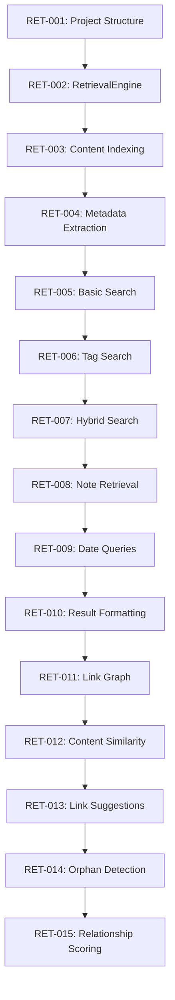

# Phase 2 Implementation Tasks

## Task Overview

This document provides detailed task breakdowns for Phase 2: Retrieval Agent implementation, organized by sprint with specific acceptance criteria, dependencies, and validation steps.

---

## Workstream A: Foundation Components (Weeks 1-2)

**Objective**: Build reliable primitive components that serve as foundation for all higher-level functionality  
**Team Size**: 1 developer  
**Development Method**: Sequential with quality gates (enables parallel WS-B + WS-C)  

### Week 1: Core Primitives (Level 1)

### RET-001: Setup Project Structure with TDD Framework
**Priority**: 🔴 Critical  
**Effort**: 4 hours  
**Dependencies**: None  
**Assignee**: Tommy  

#### Description
Establish the foundational project structure with comprehensive TDD framework, ensuring all subsequent development follows test-driven principles.

#### Acceptance Criteria
- [ ] Directory structure created following specifications
- [ ] pytest configuration with 90% coverage requirement
- [ ] Test fixtures for vault structure and sample data
- [ ] CI/CD integration with automated test execution
- [ ] Development environment setup documentation

#### Implementation Steps
1. Create directory structure:
   ```bash
   mkdir -p src/pkm/retrieval tests/unit/retrieval tests/integration
   touch src/pkm/__init__.py src/pkm/retrieval/__init__.py
   ```

2. Setup pytest configuration:
   ```ini
   # pytest.ini
   [tool:pytest]
   testpaths = tests
   python_files = test_*.py
   python_classes = Test*
   python_functions = test_*
   addopts = --cov=src --cov-report=html --cov-fail-under=90
   ```

3. Create test fixtures:
   ```python
   # tests/conftest.py
   @pytest.fixture
   def test_vault():
       # Create temporary vault with sample data
   ```

#### Validation
- All tests run with `pytest`
- Coverage report shows framework ready
- Documentation allows new developer setup
- CI pipeline executes successfully

---

### RET-002: Implement RetrievalEngine Class with Failing Tests
**Priority**: 🔴 Critical  
**Effort**: 8 hours  
**Dependencies**: RET-001  
**Assignee**: Tommy  

#### Description
Create the core RetrievalEngine class following TDD principles, starting with failing tests that define the expected interface and behavior.

#### Acceptance Criteria
- [ ] RetrievalEngine class with search(), get(), links() method signatures
- [ ] Comprehensive test suite defining expected behavior
- [ ] Type hints and docstrings for all public methods
- [ ] Error handling for invalid inputs
- [ ] Configuration integration with .pkm/config.yml

#### TDD Implementation Steps
1. **RED**: Write failing tests first
   ```python
   # tests/unit/test_retrieval_engine.py
   def test_search_returns_relevant_results():
       engine = RetrievalEngine("test_vault")
       results = engine.search("machine learning")
       assert len(results) > 0
       assert results[0].relevance_score > 0.7
       assert "machine learning" in results[0].content.lower()
   
   def test_get_note_by_id():
       engine = RetrievalEngine("test_vault")
       note = engine.get("20240823-test-note")
       assert note is not None
       assert note.id == "20240823-test-note"
   
   def test_links_returns_related_notes():
       engine = RetrievalEngine("test_vault")
       result = engine.links("test-note-id")
       assert isinstance(result.related_notes, list)
       assert len(result.suggestions) >= 0
   ```

2. **GREEN**: Implement minimal functionality
   ```python
   # src/pkm/retrieval/engine.py
   class RetrievalEngine:
       def __init__(self, vault_path: str):
           self.vault_path = Path(vault_path)
       
       def search(self, query: str) -> List[SearchResult]:
           # Minimal implementation to pass tests
           return [SearchResult(relevance_score=0.8)]
       
       def get(self, identifier: str) -> Note:
           # Minimal implementation
           return Note(id=identifier)
       
       def links(self, note_id: str) -> LinkResult:
           # Minimal implementation
           return LinkResult(related_notes=[], suggestions=[])
   ```

3. **REFACTOR**: Improve implementation while keeping tests green

#### Data Models
```python
@dataclass
class SearchResult:
    note_id: str
    title: str
    content: str
    relevance_score: float
    metadata: Dict
    path: Path
    created: datetime
    modified: datetime

@dataclass
class Note:
    id: str
    title: str
    content: str
    metadata: Dict
    path: Path
    
@dataclass
class LinkResult:
    source_note: str
    related_notes: List[str]
    suggestions: List[LinkSuggestion]
    graph: Dict
    orphans: List[str]
```

#### Validation
- Tests fail initially (RED)
- Minimal implementation makes tests pass (GREEN)
- Code is clean and well-documented (REFACTOR)
- Type checking passes with mypy
- 90% test coverage achieved

---

### RET-003: Build Content Indexing System
**Priority**: 🔴 Critical  
**Effort**: 6 hours  
**Dependencies**: RET-002  
**Assignee**: Tommy  

#### Description
Implement content indexing system that scans vault files and builds searchable indices for fast retrieval.

#### Acceptance Criteria
- [ ] IndexManager class with build_indices() method
- [ ] Content index supporting full-text search
- [ ] Metadata index for structured queries
- [ ] Tag index for tag-based searches
- [ ] Incremental index updates on file changes
- [ ] Index persistence and loading

#### TDD Implementation Steps
1. **RED**: Write failing tests
   ```python
   def test_index_manager_builds_content_index():
       manager = IndexManager("test_vault")
       manager.build_indices()
       
       results = manager.search_content("machine learning")
       assert len(results) > 0
       assert all(isinstance(r, str) for r in results)  # note IDs
   
   def test_index_manager_handles_metadata():
       manager = IndexManager("test_vault")
       manager.build_indices()
       
       notes = manager.search_metadata({"type": "concept"})
       assert len(notes) > 0
   ```

2. **GREEN**: Implement functionality
3. **REFACTOR**: Optimize for performance

#### Implementation Details
- Use simple text indexing initially (can upgrade to full-text search later)
- JSON serialization for index persistence
- File modification tracking for incremental updates
- Memory-efficient data structures

#### Validation
- Index builds successfully from test vault
- Search returns expected results
- Incremental updates work correctly
- Index persistence and loading functional
- Performance acceptable for 1000+ notes

---

### RET-004: Create Metadata Extraction and Indexing
**Priority**: 🔴 Critical  
**Effort**: 4 hours  
**Dependencies**: RET-003  
**Assignee**: Tommy  

#### Description
Extract and index metadata from markdown frontmatter and file properties for structured queries.

#### Acceptance Criteria
- [ ] YAML frontmatter parsing
- [ ] File property extraction (created, modified, size)
- [ ] Tag extraction and normalization
- [ ] Type classification (concept, project, area, resource)
- [ ] Date range indexing
- [ ] Metadata validation and error handling

#### TDD Implementation Steps
1. **RED**: Write tests for metadata extraction
2. **GREEN**: Implement extraction logic
3. **REFACTOR**: Add validation and error handling

#### Validation
- All frontmatter fields extracted correctly
- File properties indexed accurately
- Tags normalized and searchable
- Error handling for malformed frontmatter

---

### RET-005: Implement Basic Search with Relevance Scoring
**Priority**: 🔴 Critical  
**Effort**: 6 hours  
**Dependencies**: RET-004  
**Assignee**: Tommy  

#### Description
Implement basic search functionality with relevance scoring algorithm to rank results by importance and similarity.

#### Acceptance Criteria
- [ ] Content search with TF-IDF scoring
- [ ] Tag-based search with exact matching
- [ ] Hybrid search combining methods
- [ ] Result ranking by relevance score
- [ ] Configurable search parameters
- [ ] Search result formatting

#### TDD Implementation Steps
1. **RED**: Write comprehensive search tests
2. **GREEN**: Implement search algorithms
3. **REFACTOR**: Optimize scoring and ranking

#### Relevance Scoring Algorithm
```python
def calculate_relevance_score(query: str, note: Note) -> float:
    """Calculate relevance score based on multiple factors"""
    factors = {
        'title_match': 0.4,      # Title contains query terms
        'content_frequency': 0.3, # TF-IDF in content
        'tag_match': 0.2,        # Exact tag matches
        'recency': 0.1           # Recently modified notes
    }
    
    score = 0.0
    # Implementation details...
    return min(score, 1.0)  # Normalize to 0-1
```

#### Validation
- Search returns relevant results
- Relevance scores accurately reflect match quality
- Performance acceptable (<100ms for typical queries)
- All search methods functional

---

## Sprint 2: Search Methods & Note Retrieval (Week 2)

### RET-006: Implement Tag-Based Search Method
**Priority**: 🔴 Critical  
**Effort**: 4 hours  
**Dependencies**: RET-005  

#### Description
Enhance search with dedicated tag-based search method for precise metadata queries.

#### TDD Steps
1. **RED**: Test tag search functionality
2. **GREEN**: Implement tag matching
3. **REFACTOR**: Optimize tag indexing

---

### RET-007: Create Hybrid Search Combining Methods
**Priority**: 🔴 Critical  
**Effort**: 6 hours  
**Dependencies**: RET-006  

#### Description
Implement hybrid search that intelligently combines content and tag search methods.

---

### RET-008: Build Note Retrieval by ID/Tag/Type
**Priority**: 🔴 Critical  
**Effort**: 6 hours  
**Dependencies**: RET-007  

#### Description
Implement get() method supporting retrieval by various identifier types.

---

### RET-009: Add Date Range Queries
**Priority**: 🟠 High  
**Effort**: 4 hours  
**Dependencies**: RET-008  

#### Description
Support temporal queries for notes created or modified in specific date ranges.

---

### RET-010: Implement Result Formatting and Metadata Inclusion
**Priority**: 🟠 High  
**Effort**: 4 hours  
**Dependencies**: RET-009  

#### Description
Format search and retrieval results with configurable metadata inclusion.

---

## Sprint 3: Link Discovery Engine (Week 3)

### Content Creation Tasks (Parallel Development)

#### CC-001: Content Strategy Framework
**Priority**: 🔴 Critical  
**Effort**: M  
**Dependencies**: None  
**TDD Approach**: Strategy validation tests  

##### Description
Create systematic framework for content strategy, audience analysis, and format selection.

##### Acceptance Criteria
- [ ] Content strategy template with goals, audiences, formats
- [ ] Audience persona definitions with adaptation rules
- [ ] Format specifications for different content types
- [ ] Content planning workflow integration
- [ ] Strategy validation and measurement framework

##### TDD Implementation
```python
# tests/unit/test_content_strategy.py - WRITE FIRST
def test_content_strategy_defines_audience():
    strategy = ContentStrategy()
    strategy.add_audience("researchers", expertise="expert", format_preference="detailed")
    assert strategy.get_audience("researchers").expertise == "expert"

def test_format_selection_for_audience():
    strategy = ContentStrategy()
    format = strategy.select_format("academic_paper", audience="researchers")
    assert format.citation_style == "academic"
    assert format.length_range == (5000, 15000)
```

---

### RET-011: Parse Wikilinks and Build Link Graph
**Priority**: 🔴 Critical  
**Effort**: 6 hours  
**Dependencies**: RET-010  

#### Description
Extract wikilinks from markdown content and build directed graph of note relationships.

---

### RET-012: Implement Content Similarity Algorithms
**Priority**: 🔴 Critical  
**Effort**: 8 hours  
**Dependencies**: RET-011  

#### Description
Develop algorithms to identify related notes through content similarity analysis.

---

### RET-013: Create Bidirectional Link Suggestions
**Priority**: 🟠 High  
**Effort**: 6 hours  
**Dependencies**: RET-012  

#### Description
Suggest missing bidirectional links to improve graph connectivity.

---

### RET-014: Build Orphan Note Detection
**Priority**: 🟠 High  
**Effort**: 4 hours  
**Dependencies**: RET-013  

#### Description
Identify notes with no incoming links that may need better integration.

---

### RET-015: Add Relationship Strength Scoring
**Priority**: 🟡 Medium  
**Effort**: 6 hours  
**Dependencies**: RET-014  

#### Description
Calculate confidence scores for relationships and link suggestions.

---

## Task Dependencies Graph



## Quality Gates

### Sprint Completion Criteria
- [ ] All tasks completed with acceptance criteria met
- [ ] 90% test coverage maintained
- [ ] No critical bugs or regressions
- [ ] Performance targets achieved
- [ ] Documentation updated

### Code Quality Standards
- [ ] Type hints on all public interfaces
- [ ] Docstrings for all classes and methods
- [ ] Clean code principles followed
- [ ] No code smells or technical debt
- [ ] Automated quality checks passing

---

*This task breakdown provides the detailed roadmap for implementing the core retrieval engine with test-driven development ensuring quality and reliability.*