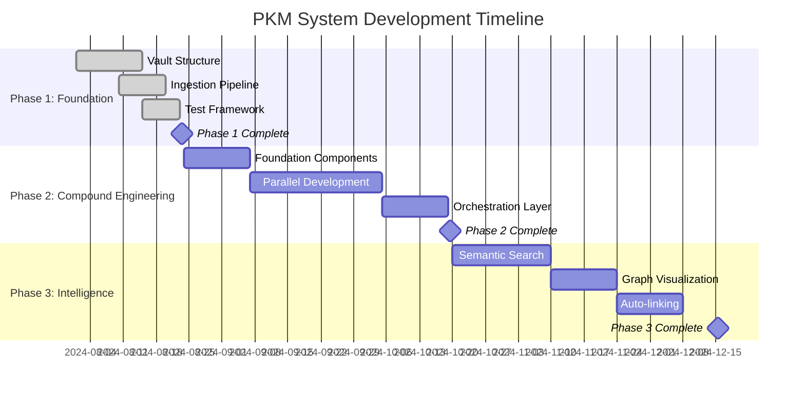

# PKM System Project Milestones

## Overview

This document tracks major milestones across all phases of the PKM system development, providing a high-level view of progress and upcoming deliverables.

## Milestone Timeline

## Phase 1: Foundation ✅ COMPLETED

### M1.1: Vault Structure Normalization ✅
**Date**: August 23, 2024  
**Status**: ✅ Complete  
**Deliverables**:
- Clean 00/02/03/04/05 PARA directory structure
- Removal of legacy directories (01-notes, 03-resources, 04-archives)
- Updated validation scripts for new structure
- All tests passing with normalized structure

**Success Criteria Met**:
- [x] Vault structure validation passes
- [x] All categorization tests updated and passing
- [x] Legacy directory references removed from codebase
- [x] Ingestion pipeline working with 04-resources default

### M1.2: Test Framework Alignment ✅
**Date**: August 23, 2024  
**Status**: ✅ Complete  
**Deliverables**:
- Updated conftest.py with correct PARA mappings
- Fixed test expectations across all test files
- Process inbox functionality working with new structure
- Git integration ready for development

**Success Criteria Met**:
- [x] All unit tests passing
- [x] Integration tests updated for new structure
- [x] Test fixtures aligned with PARA methodology
- [x] Continuous integration pipeline functional

### M1.3: Specifications and Planning ✅
**Date**: August 23, 2024  
**Status**: ✅ Complete  
**Deliverables**:
- Comprehensive PKM-RETRIEVAL-AGENT-PLAN.md
- Updated architecture and implementation documents
- .pkm/config.yml configuration framework
- Development principles established (TDD, specs-driven, FR-first)

**Success Criteria Met**:
- [x] 8-week implementation roadmap created
- [x] 17 detailed tasks with acceptance criteria
- [x] Technical specifications complete
- [x] Quality standards defined

## Phase 2: Retrieval Agent 🔄 CURRENT

### M2.1: Core Retrieval Engine
**Target Date**: September 7, 2024  
**Status**: 📅 Planned  
**Deliverables**:
- RetrievalEngine class with search(), get(), links() methods
- Content and metadata indexing system
- Relevance scoring and ranking algorithms
- 90% test coverage with TDD approach

**Success Criteria**:
- [ ] Search returns relevant results with confidence scores
- [ ] Note retrieval works by ID, tag, type, date range
- [ ] Link graph constructed from wikilinks
- [ ] Performance baseline <100ms for typical queries
- [ ] Comprehensive test suite covering edge cases

### M2.2: CLI Interface Complete
**Target Date**: September 21, 2024  
**Status**: 📅 Planned  
**Deliverables**:
- `pkm search` command with multiple methods
- `pkm get` command for note retrieval
- `pkm links` command for relationship discovery
- Rich output formatting (table, JSON, markdown)

**Success Criteria**:
- [ ] All CLI commands functional with help system
- [ ] Multiple output formats supported
- [ ] Configuration management working
- [ ] Error handling comprehensive and user-friendly
- [ ] Integration tests passing for all commands

### M2.3: Claude Code Integration
**Target Date**: October 5, 2024  
**Status**: 📅 Planned  
**Deliverables**:
- `/pkm-search` command with natural language parsing
- `/pkm-get` command with intelligent type detection
- `/pkm-links` command with graph visualization
- Complete Claude Code agent specification

**Success Criteria**:
- [ ] All three Claude commands functional
- [ ] Natural language queries parsed correctly
- [ ] Response formatting optimized for Claude interface
- [ ] Error handling integrated with Claude workflow
- [ ] Commands discoverable in Claude Code platform

### M2.4: Production Deployment
**Target Date**: October 19, 2024  
**Status**: 📅 Planned  
**Deliverables**:
- End-to-end integration testing complete
- Comprehensive documentation and user guides
- Monitoring and metrics collection
- Production-ready system deployed

**Success Criteria**:
- [ ] All acceptance criteria met across 17 tasks
- [ ] Performance targets achieved (<100ms search)
- [ ] Documentation complete with working examples
- [ ] User acceptance testing passed
- [ ] System monitoring operational

## Phase 3: Advanced Intelligence 📅 PLANNED

### M3.1: Semantic Search
**Target Date**: November 16, 2024  
**Status**: 📅 Future  
**Deliverables**:
- Embedding generation for notes
- Vector similarity search
- Semantic clustering of results
- Integration with existing search methods

**Success Criteria**:
- [ ] Semantic search accuracy >85%
- [ ] Vector search performance <50ms
- [ ] Clustering provides meaningful groups
- [ ] Seamless integration with CLI and Claude commands

### M3.2: Graph Visualization
**Target Date**: November 30, 2024  
**Status**: 📅 Future  
**Deliverables**:
- Interactive knowledge graph visualization
- Multiple layout algorithms
- Export capabilities (SVG, PNG, DOT)
- Integration with link discovery

**Success Criteria**:
- [ ] Graph renders correctly for any vault
- [ ] Interactive navigation functional
- [ ] Export formats work across platforms
- [ ] Performance acceptable for large graphs

### M3.3: Auto-linking System
**Target Date**: December 14, 2024  
**Status**: 📅 Future  
**Deliverables**:
- Intelligent link suggestions
- Automated bidirectional linking
- Link quality scoring
- Batch link operations

**Success Criteria**:
- [ ] Link suggestions accuracy >80%
- [ ] Automated linking improves graph connectivity
- [ ] Quality scores help prioritize suggestions
- [ ] Batch operations handle large vaults efficiently

## Phase 4: Production Optimization 📅 FUTURE

### M4.1: Performance Optimization
**Target Date**: January 2025  
**Status**: 📅 Future  
**Focus**: Advanced caching, distributed processing, query optimization

### M4.2: Advanced Synthesis
**Target Date**: February 2025  
**Status**: 📅 Future  
**Focus**: Cross-domain pattern detection, insight generation, teaching material creation

### M4.3: Lakehouse Integration
**Target Date**: March 2025  
**Status**: 📅 Future  
**Focus**: Full integration with diskless lakehouse architecture

## Risk Tracking

### Current Phase Risks (Phase 2)
- **Integration Complexity**: Claude Code platform integration
  - *Status*: Monitoring
  - *Mitigation*: Early prototype and testing

- **Performance Targets**: <100ms search latency
  - *Status*: Active
  - *Mitigation*: Continuous benchmarking

### Upcoming Phase Risks (Phase 3)
- **Semantic Search Quality**: Embedding model selection
  - *Status*: Research needed
  - *Mitigation*: Prototype multiple approaches

- **Graph Visualization Performance**: Large vault handling
  - *Status*: To be assessed
  - *Mitigation*: Incremental loading strategies

## Success Metrics Dashboard

### Overall Project Health
- **Phase 1**: ✅ 100% Complete (3/3 milestones)
- **Phase 2**: 🔄 0% Complete (0/4 milestones)
- **Phase 3**: 📅 Not Started (0/3 milestones)

### Quality Metrics
- **Test Coverage**: Target 90%, Current: Baseline established
- **Performance**: Target <100ms, Current: To be measured
- **Documentation**: Target 100%, Current: Specifications complete

### Development Velocity
- **Sprint Completion**: Target 100%, Current: Phase 2 not started
- **Blocker Resolution**: Target <24h, Current: No active blockers
- **Code Quality**: Target passing gates, Current: Framework established

## Communication and Reporting

### Weekly Updates
- **Status**: Progress against current milestone
- **Blockers**: Issues requiring resolution
- **Metrics**: Performance and quality measurements
- **Next Steps**: Upcoming sprint activities

### Milestone Reviews
- **Retrospective**: What went well, what could improve
- **Metrics Analysis**: Performance against targets
- **Risk Assessment**: Current and emerging risks
- **Planning Adjustments**: Scope or timeline modifications

---

*This milestone tracking provides clear visibility into project progress, upcoming deliverables, and potential risks requiring attention.*