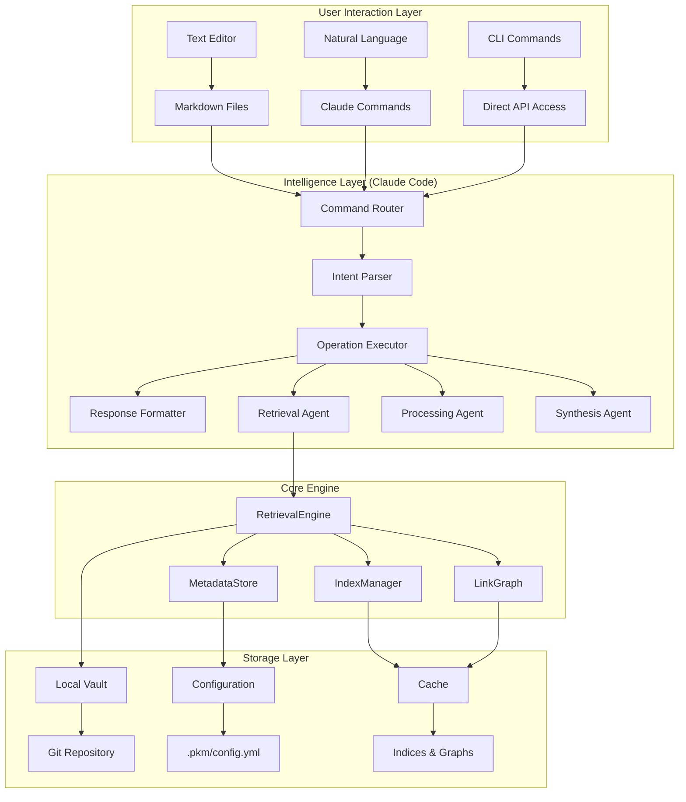
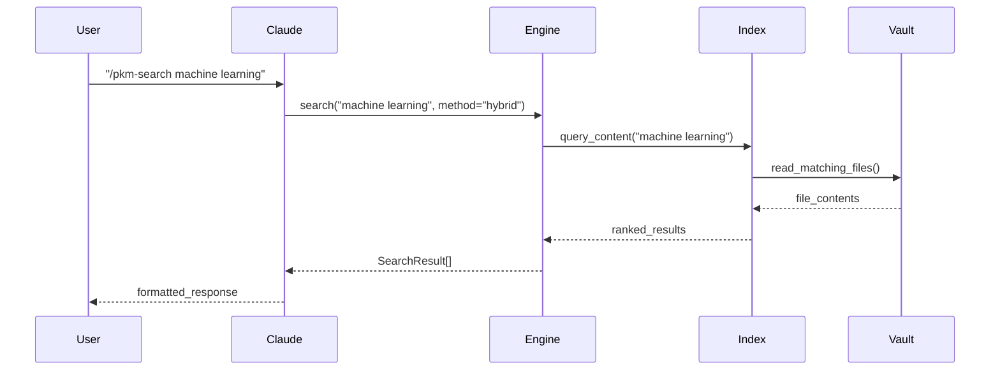
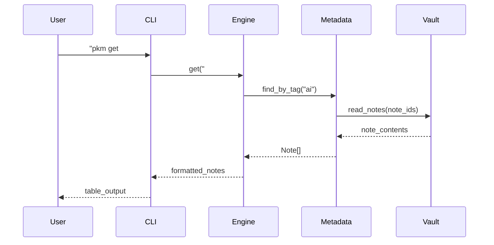
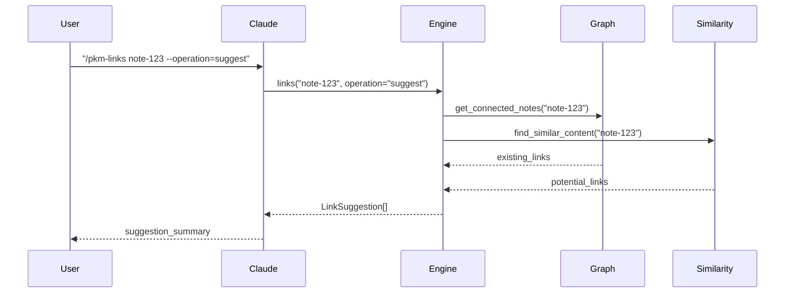

# PKM System Architecture Specification

## System Overview

The PKM (Personal Knowledge Management) system is built on a dual-interface architecture where users interact through both direct text editing and natural language commands, with Claude Code serving as the central intelligence layer orchestrating all operations.

## Architectural Principles

### 1. Separation of Concerns
- **User Layer**: Familiar markdown files and natural language
- **Intelligence Layer**: Claude Code orchestration and automation
- **Storage Layer**: Local Git + future lakehouse integration

### 2. Progressive Disclosure
- **Simple Entry**: Start with basic text editing
- **Advanced Features**: Access through natural language commands
- **Power User**: CLI and direct API access

### 3. Intelligence Integration
- **Claude as Orchestrator**: Central coordination of all PKM operations
- **Transparent Operations**: Complex processing hidden from users
- **Natural Language Interface**: Conversational interaction model

## System Architecture



## Component Specifications

### User Interaction Layer

#### Text Editor Interface
```yaml
text_interface:
  purpose: "Primary content creation and editing"
  user_actions:
    - edit_markdown_files
    - organize_in_folders
    - create_wikilinks
    - add_frontmatter
  
  automatic_triggers:
    on_file_save:
      - validate_syntax
      - extract_metadata
      - update_indices
      - trigger_processing
    
    on_file_create:
      - apply_templates
      - generate_metadata
      - queue_for_processing
    
    on_file_move:
      - update_links
      - adjust_categories
      - maintain_relationships
```

#### Natural Language Interface
```yaml
natural_language:
  purpose: "Conversational interaction with knowledge system"
  capabilities:
    - intent_recognition
    - parameter_extraction
    - context_awareness
    - clarification_requests
  
  command_types:
    search: "/pkm-search [query] [--options]"
    retrieval: "/pkm-get [identifier] [--options]"
    relationships: "/pkm-links [note-id] [--options]"
    
  response_formats:
    - structured_results
    - natural_language_summaries
    - actionable_suggestions
    - follow_up_questions
```

#### CLI Interface
```yaml
cli_interface:
  purpose: "Power user and automation access"
  command_structure:
    base: "pkm"
    subcommands: ["search", "get", "links", "config"]
    
  examples:
    search: "pkm search 'machine learning' --method=semantic"
    get: "pkm get '#ai' --type=tag --format=json"
    links: "pkm links note-id --operation=suggest"
    
  output_formats:
    - table (default)
    - json
    - markdown
    - csv
```

### Intelligence Layer (Claude Code)

#### Command Router
```python
class CommandRouter:
    """Routes user commands to appropriate handlers"""
    
    def route_command(self, command: str, context: dict) -> CommandResult:
        # Parse command type and parameters
        # Select appropriate agent
        # Execute operation
        # Format response
        pass
    
    def register_handler(self, pattern: str, handler: callable):
        # Register command handlers
        pass
```

#### Intent Parser
```python
class IntentParser:
    """Parses natural language into structured operations"""
    
    def parse_intent(self, text: str) -> Intent:
        # Extract operation type (search, get, links)
        # Identify parameters and options
        # Resolve ambiguities
        # Return structured intent
        pass
    
    def extract_parameters(self, text: str, intent_type: str) -> dict:
        # Extract relevant parameters for operation type
        pass
```

#### Agent Specifications
```yaml
retrieval_agent:
  name: "PKM Retrieval Agent"
  capabilities:
    - search_vault_content
    - retrieve_notes
    - discover_relationships
    - suggest_connections
  
  tools: ["Read", "Write", "Grep", "Glob"]
  
  operations:
    search:
      methods: ["content", "tags", "semantic", "hybrid"]
      ranking: "relevance_score"
      filtering: "metadata_based"
    
    retrieval:
      types: ["by_id", "by_tag", "by_type", "by_date"]
      formats: ["summary", "full", "metadata_only"]
    
    relationships:
      discovery: "content_similarity"
      suggestions: "missing_bidirectional"
      validation: "link_quality_scoring"
```

### Core Engine Layer

#### RetrievalEngine
```python
class RetrievalEngine:
    """Core retrieval functionality with search, get, and links operations"""
    
    def __init__(self, vault_path: str, config: dict):
        self.vault_path = Path(vault_path)
        self.config = config
        self.index_manager = IndexManager(vault_path)
        self.link_graph = LinkGraph(vault_path)
        self.metadata_store = MetadataStore(vault_path)
    
    def search(self, query: str, method: str = "hybrid", limit: int = 10) -> List[SearchResult]:
        """Search notes with specified method and return ranked results"""
        pass
    
    def get(self, identifier: str, type: str = "auto") -> Union[Note, List[Note]]:
        """Retrieve specific notes or collections"""
        pass
    
    def links(self, note_id: str, operation: str = "related") -> LinkResult:
        """Discover and manage note relationships"""
        pass
```

#### IndexManager
```python
class IndexManager:
    """Manages content and metadata indices for fast retrieval"""
    
    def __init__(self, vault_path: str):
        self.content_index = {}
        self.metadata_index = {}
        self.tag_index = {}
        self.date_index = {}
    
    def build_indices(self) -> None:
        """Build all indices from vault content"""
        pass
    
    def update_note(self, note_path: str) -> None:
        """Update indices for specific note"""
        pass
    
    def search_content(self, query: str) -> List[str]:
        """Search content index and return note IDs"""
        pass
```

#### LinkGraph
```python
class LinkGraph:
    """Manages note relationships and link discovery"""
    
    def __init__(self, vault_path: str):
        self.graph = {}
        self.wikilinks = {}
        self.backlinks = {}
    
    def build_graph(self) -> None:
        """Build link graph from wikilinks"""
        pass
    
    def find_related(self, note_id: str, depth: int = 2) -> List[str]:
        """Find related notes through graph traversal"""
        pass
    
    def suggest_links(self, note_id: str) -> List[LinkSuggestion]:
        """Suggest missing bidirectional links"""
        pass
    
    def detect_orphans(self) -> List[str]:
        """Find notes with no incoming links"""
        pass
```

### Storage Layer

#### Local Vault Structure
```yaml
vault_storage:
  location: "vault/"
  structure:
    inbox: "00-inbox/"
    projects: "02-projects/"
    areas: "03-areas/"
    resources: "04-resources/"
    archives: "05-archives/"
    synthesis: "06-synthesis/"
    journal: "07-journal/"
    media: "08-media/"
    data: "09-data/"
    permanent: "permanent/"
    templates: "templates/"
  
  file_types:
    notes: "*.md"
    configuration: "*.yml, *.yaml"
    data: "*.json, *.csv"
    media: "*.png, *.jpg, *.pdf"
```

#### Configuration Management
```yaml
configuration:
  primary: ".pkm/config.yml"
  structure:
    vault: "vault paths and structure"
    retrieval: "search and indexing settings"
    cli: "command defaults and formatting"
    claude: "agent and command configurations"
    performance: "caching and optimization"
    logging: "debug and monitoring"
```

#### Caching Strategy
```yaml
caching:
  content_index:
    location: ".pkm/cache/content.json"
    ttl: 3600  # seconds
    invalidation: "on_file_change"
  
  metadata_index:
    location: ".pkm/cache/metadata.json"
    ttl: 3600  # seconds
    invalidation: "on_file_change"
  
  link_graph:
    location: ".pkm/cache/links.json"
    ttl: 7200  # seconds
    invalidation: "on_link_change"
```

## Data Flow Patterns

### Search Operation Flow


### Note Retrieval Flow


### Link Discovery Flow


## Performance Requirements

### Latency Targets
```yaml
performance_targets:
  search:
    simple_query: "<50ms"
    complex_query: "<100ms"
    semantic_search: "<200ms"
  
  retrieval:
    single_note: "<10ms"
    collection: "<50ms"
    large_collection: "<200ms"
  
  links:
    direct_links: "<20ms"
    suggestions: "<100ms"
    graph_traversal: "<500ms"
```

### Scalability Targets
```yaml
scalability:
  vault_size:
    small: "< 1,000 notes"
    medium: "1,000 - 10,000 notes"
    large: "10,000 - 100,000 notes"
  
  memory_usage:
    baseline: "< 50MB"
    with_indices: "< 100MB"
    large_vault: "< 500MB"
  
  concurrent_operations:
    cli_commands: "10 concurrent"
    claude_requests: "5 concurrent"
    index_updates: "background only"
```

## Security and Privacy

### Data Protection
```yaml
security:
  local_access:
    file_permissions: "user_only"
    configuration: "secure_defaults"
    cache_encryption: "optional"
  
  api_access:
    authentication: "local_only"
    rate_limiting: "reasonable_defaults"
    input_validation: "comprehensive"
  
  data_privacy:
    no_external_transmission: "guaranteed"
    local_processing_only: "default"
    opt_in_telemetry: "minimal"
```

## Integration Points

### Claude Code Platform
```yaml
claude_integration:
  agent_specification: ".claude/agents/pkm-retrieval.md"
  command_mappings: ".claude/settings.json"
  
  commands:
    search: "/pkm-search"
    get: "/pkm-get"
    links: "/pkm-links"
  
  response_formats:
    structured: "machine_readable"
    natural: "human_friendly"
    actionable: "next_steps_included"
```

### Future Integrations
```yaml
future_integrations:
  lakehouse:
    storage: "S3 + Iceberg"
    processing: "Spark + Ray"
    vectors: "Lance format"
  
  external_tools:
    obsidian: "vault_import"
    roam: "graph_migration"
    notion: "database_sync"
```

---

*This architecture specification provides the technical foundation for implementing a scalable, intelligent PKM system that grows with user needs while maintaining simplicity at the interface level.*