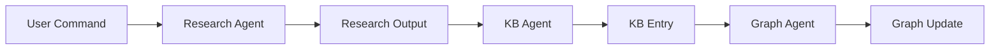
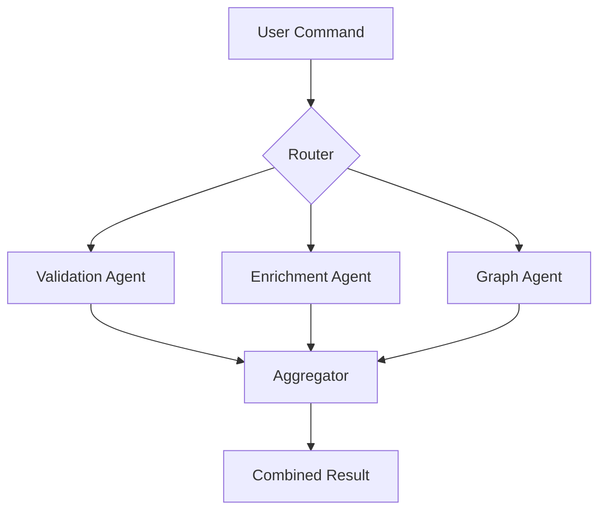

# Claude Code Agent Interaction Architecture

## Executive Summary

Claude Code agents should interact through **orchestrated workflows**, **shared data patterns**, and **event-driven coordination** rather than direct agent-to-agent calls. This document outlines best practices for designing agent interactions that are maintainable, scalable, and aligned with Claude Code's architecture.

## Core Principles

### 1. **Stateless Agent Design**
Each agent invocation is stateless - agents cannot maintain context between calls or communicate directly with other agents during execution.

### 2. **Data-Driven Coordination**
Agents communicate through shared data artifacts (files, structured outputs) rather than direct messaging.

### 3. **Event-Based Orchestration**
Hooks and commands orchestrate multi-agent workflows through sequential or parallel execution patterns.

## Interaction Patterns

### Pattern 1: Sequential Pipeline


**Implementation**:
```bash
# Hook: sequential_pipeline.sh
/research "$1" > /tmp/research.md
/kb-add "$(cat /tmp/research.md)"
/kg-expand "$1"
```

### Pattern 2: Parallel Processing


**Implementation**:
```bash
# Parallel execution with result aggregation
{
    /kc-validate "$1" > /tmp/validation.json &
    /kc-enrich "$1" > /tmp/enrichment.json &
    /kg-expand "$1" > /tmp/graph.json &
    wait
}
# Aggregate results
/synthesize /tmp/*.json
```

### Pattern 3: Event-Driven Chain
```yaml
triggers:
  on_research_complete:
    - /kb-add [output]
    - /kc-validate [entry]
    
  on_validation_fail:
    - /kc-enrich [entry]
    - /kc-validate [enriched]
    
  on_validation_pass:
    - /kg-build [domain]
    - /kb-organize
```

### Pattern 4: Conditional Routing
```bash
# Router with conditional logic
QUALITY=$(/kc-validate "$1" | jq .score)
if [ "$QUALITY" -lt "0.85" ]; then
    /kc-enrich "$1"
    /kc-validate "$1"
else
    /kg-expand "$1"
fi
```

## Data Exchange Formats

### Structured Output Contract
Agents should produce structured outputs that other agents can consume:

```yaml
# Standard agent output format
agent_output:
  metadata:
    agent: "research"
    timestamp: "2024-01-20T10:00:00Z"
    command: "/research AI"
    status: "success"
    
  data:
    primary: { ... }      # Main output
    secondary: [ ... ]    # Supporting data
    relationships: [ ... ] # For graph agents
    
  quality:
    confidence: 0.92
    sources: 5
    validation: "passed"
    
  next_actions:           # Suggested follow-ups
    - command: "/kb-add"
      priority: "high"
    - command: "/kg-expand"
      priority: "medium"
```

### File-Based Communication
```yaml
workspace:
  /tmp/agent-exchange/
    ├── research/         # Research agent outputs
    ├── knowledge/        # KB agent data
    ├── graphs/          # Graph structures
    ├── validation/      # Quality reports
    └── synthesis/       # Combined insights
```

## Command Orchestration Strategies

### 1. **Command Chaining**
```bash
# Direct chaining with pipe
/research "quantum computing" | /kb-add --auto | /kg-expand --immediate

# File-based chaining
/research "ML" --output research.md
/kb-add --input research.md --output kb.json
/kg-build --input kb.json
```

### 2. **Workflow Templates**
```yaml
workflow: comprehensive_research
steps:
  - agent: research
    command: "/research {topic}"
    output: research.md
    
  - agent: knowledge-base
    command: "/kb-add"
    input: research.md
    output: kb_entry.json
    
  - parallel:
    - agent: knowledge-graph
      command: "/kg-expand"
      input: kb_entry.json
      
    - agent: knowledge-curator
      command: "/kc-validate"
      input: kb_entry.json
      
  - agent: synthesis
    command: "/synthesize"
    input: "*.json"
    output: final_report.md
```

### 3. **Hook-Based Coordination**
```json
{
  "hooks": {
    "coordination": {
      "PostToolUse": {
        "tool": "Write",
        "match": "research_*.md",
        "script": "auto_process.sh"
      },
      "UserPromptSubmit": {
        "match": "/workflow",
        "script": "workflow_router.sh"
      }
    }
  }
}
```

## Best Practices

### 1. **Loose Coupling**
- Agents should not depend on specific implementations of other agents
- Use standard data formats for interoperability
- Design agents to handle missing or partial inputs gracefully

### 2. **Error Propagation**
```bash
# Proper error handling in chains
if ! /research "$1" > research.md; then
    echo "Research failed, skipping KB add"
    exit 1
fi

if ! /kb-add < research.md; then
    echo "KB add failed, attempting recovery"
    /kc-enrich "$1" | /kb-add --enriched
fi
```

### 3. **Performance Optimization**
- Use parallel execution where possible
- Cache intermediate results
- Implement progressive enhancement
- Batch operations when appropriate

### 4. **Audit & Monitoring**
```yaml
interaction_log:
  session: "sess_123"
  chain:
    - agent: research
      start: "10:00:00"
      duration: "2.3s"
      status: success
      
    - agent: knowledge-base
      start: "10:00:02"
      duration: "0.4s"
      status: success
      
    - agent: knowledge-graph
      start: "10:00:03"
      duration: "1.8s"
      status: success
      
  total_duration: "4.5s"
  data_transferred: "125KB"
```

## Anti-Patterns to Avoid

### ❌ **Direct Agent Invocation**
```bash
# WRONG: Agents calling other agents directly
# Agent code should not contain:
/other-agent-command
```

### ❌ **Tight Coupling**
```bash
# WRONG: Assuming specific agent output format
RESULT=$(/research "AI" | grep "specific_field")
```

### ❌ **Synchronous Blocking**
```bash
# WRONG: Sequential when parallel is possible
/validate item1
/validate item2  # Blocks unnecessarily
/validate item3
```

### ❌ **State Persistence**
```bash
# WRONG: Trying to maintain state between calls
echo "state" > /tmp/agent_state
/agent --use-state /tmp/agent_state  # Unreliable
```

## Implementation Examples

### Example 1: Research to Knowledge Pipeline
```bash
#!/bin/bash
# research_pipeline.sh

# Step 1: Research with quality threshold
RESEARCH=$(/research "$1")
QUALITY=$(echo "$RESEARCH" | jq -r '.quality_score')

# Step 2: Conditional knowledge base addition
if [ "$QUALITY" -gt "0.8" ]; then
    KB_ID=$(echo "$RESEARCH" | /kb-add --json)
    
    # Step 3: Parallel processing
    {
        echo "$KB_ID" | /kg-expand --async &
        echo "$KB_ID" | /kc-validate --async &
        wait
    }
    
    # Step 4: Synthesis
    /synthesize --kb-id "$KB_ID"
else
    echo "Quality too low, enriching first"
    ENRICHED=$(/kc-enrich "$1")
    echo "$ENRICHED" | /kb-add --enriched
fi
```

### Example 2: Multi-Agent Validation
```bash
#!/bin/bash
# multi_validation.sh

# Parallel validation from multiple perspectives
{
    /kc-validate "$1" --accuracy > /tmp/accuracy.json &
    /kc-validate "$1" --completeness > /tmp/complete.json &
    /kc-validate "$1" --currency > /tmp/currency.json &
    wait
}

# Aggregate scores
jq -s 'add | {
    overall: (.accuracy + .completeness + .currency) / 3,
    details: .
}' /tmp/*.json
```

### Example 3: Event-Driven Workflow
```yaml
# .claude/hooks/event_workflow.yml
events:
  research_complete:
    trigger: "file_created"
    pattern: "research_*.md"
    actions:
      - /kb-add --file {file}
      - /kg-expand --topic {topic}
      
  quality_check:
    trigger: "kb_entry_created"
    condition: "auto_validate == true"
    actions:
      - /kc-validate {entry_id}
      - if: "score < 0.85"
        then: /kc-enrich {entry_id}
        
  graph_update:
    trigger: "kb_modified"
    actions:
      - /kg-build --incremental
      - /kg-cluster --affected-nodes
```

## Architecture Recommendations

### 1. **Use Message Queues for Complex Workflows**
For production systems with complex multi-agent workflows, consider:
- File-based queues for simple cases
- Named pipes for real-time communication
- Structured logs for audit trails

### 2. **Implement Circuit Breakers**
```bash
# Prevent cascade failures
FAILURES=0
MAX_FAILURES=3

for item in "${items[@]}"; do
    if ! /process "$item"; then
        ((FAILURES++))
        if [ $FAILURES -ge $MAX_FAILURES ]; then
            echo "Circuit breaker triggered"
            break
        fi
    else
        FAILURES=0  # Reset on success
    fi
done
```

### 3. **Design for Idempotency**
Ensure operations can be safely retried:
```bash
# Idempotent KB addition
/kb-add --upsert --id "$(echo "$1" | sha256sum)"
```

### 4. **Implement Progressive Enhancement**
Start with basic functionality, enhance with available agents:
```bash
# Basic operation
RESULT=$(/research "$1")

# Progressive enhancement
[ -x /kb-add ] && echo "$RESULT" | /kb-add
[ -x /kg-expand ] && /kg-expand "$1"
[ -x /kc-validate ] && /kc-validate "$1"
```

## Testing Agent Interactions

### Unit Testing Individual Agents
```bash
# Test agent in isolation
echo "test input" | /agent-command
assert_output "expected output"
```

### Integration Testing Workflows
```bash
# Test complete workflow
./workflow.sh "test topic"
assert_file_exists "research.md"
assert_file_exists "kb_entry.json"
assert_graph_updated
```

### Performance Testing
```bash
# Measure workflow performance
time {
    for i in {1..100}; do
        ./pipeline.sh "topic_$i" &
    done
    wait
}
```

## Conclusion

Successful agent interaction in Claude Code relies on:
1. **Loosely coupled design** with standard interfaces
2. **Data-driven coordination** through files and structured outputs
3. **Event-based orchestration** using hooks and routers
4. **Parallel processing** where possible
5. **Proper error handling** and recovery mechanisms

By following these patterns, you can create robust, scalable, and maintainable multi-agent systems that leverage the full power of Claude Code's architecture.