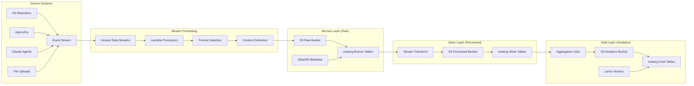

# Diskless Ingestion Pipeline

## Overview

This document defines the completely diskless ingestion pipeline for the PKM lakehouse system. All processing occurs in memory or directly on S3, with no local disk dependencies. The pipeline leverages Apache Iceberg for table management, SlateDB for metadata, and streaming processing for real-time ingestion.

## Pipeline Architecture



## Diskless Processing Components

### 1. Stream-Based Ingestion

```python
import asyncio
import io
from typing import Dict, Any, AsyncIterator
import aioboto3
import pyarrow as pa
import pyarrow.parquet as pq
from dataclasses import dataclass
import hashlib

@dataclass
class IngestionEvent:
    """Event for diskless processing"""
    source_type: str  # git, web, api, upload
    content: bytes    # Raw content
    metadata: Dict[str, Any]
    timestamp: str
    
class DisklessStreamIngestion:
    """
    Completely diskless ingestion using streams
    """
    
    def __init__(self, config: Dict):
        self.config = config
        self.session = aioboto3.Session()
        self.kinesis_client = None
        self.s3_client = None
        
    async def initialize(self):
        """Initialize AWS clients"""
        self.kinesis_client = await self.session.client('kinesis').__aenter__()
        self.s3_client = await self.session.client('s3').__aenter__()
    
    async def ingest_from_git(self, repo_path: str) -> AsyncIterator[str]:
        """
        Stream Git content without cloning to disk
        """
        # Use GitHub API to stream files
        async with aiohttp.ClientSession() as session:
            # Get file list from GitHub API
            api_url = f"https://api.github.com/repos/{repo_path}/contents"
            async with session.get(api_url) as response:
                files = await response.json()
            
            for file_info in files:
                if file_info['type'] == 'file' and file_info['name'].endswith('.md'):
                    # Stream file content directly
                    async with session.get(file_info['download_url']) as file_response:
                        content = await file_response.read()
                        
                        # Create ingestion event
                        event = IngestionEvent(
                            source_type='git',
                            content=content,
                            metadata={
                                'path': file_info['path'],
                                'sha': file_info['sha'],
                                'size': file_info['size'],
                                'repo': repo_path
                            },
                            timestamp=datetime.now().isoformat()
                        )
                        
                        # Send to stream
                        note_id = await self.send_to_stream(event)
                        yield note_id
    
    async def send_to_stream(self, event: IngestionEvent) -> str:
        """
        Send event to Kinesis for processing
        """
        # Generate deterministic ID
        event_id = hashlib.sha256(
            f"{event.timestamp}{event.source_type}{len(event.content)}".encode()
        ).hexdigest()[:16]
        
        # Prepare record
        record = {
            'Data': json.dumps({
                'event_id': event_id,
                'source_type': event.source_type,
                'content_size': len(event.content),
                'metadata': event.metadata,
                'timestamp': event.timestamp,
                's3_key': f"bronze/raw/{event.source_type}/{event_id}"
            }).encode(),
            'PartitionKey': event.source_type
        }
        
        # Write content directly to S3 (no disk)
        await self.s3_client.put_object(
            Bucket=self.config['bronze_bucket'],
            Key=f"bronze/raw/{event.source_type}/{event_id}",
            Body=event.content,
            Metadata=event.metadata
        )
        
        # Send metadata to Kinesis
        await self.kinesis_client.put_record(
            StreamName=self.config['stream_name'],
            **record
        )
        
        return event_id
```

### 2. Lambda-Based Processing

```python
import json
import boto3
import pyarrow as pa
import pyarrow.parquet as pq
from io import BytesIO
import pandas as pd

def lambda_processor(event, context):
    """
    AWS Lambda function for diskless processing
    """
    s3 = boto3.client('s3')
    
    # Process Kinesis records
    for record in event['Records']:
        # Decode Kinesis data
        payload = json.loads(
            base64.b64decode(record['kinesis']['data']).decode('utf-8')
        )
        
        # Read content from S3 (streaming)
        response = s3.get_object(
            Bucket=payload['bronze_bucket'],
            Key=payload['s3_key']
        )
        content = response['Body'].read()
        
        # Process in memory
        processed_data = process_content(content, payload['metadata'])
        
        # Convert to Parquet in memory
        df = pd.DataFrame([processed_data])
        parquet_buffer = BytesIO()
        df.to_parquet(parquet_buffer, engine='pyarrow')
        
        # Write to Silver layer
        silver_key = f"silver/processed/{payload['event_id']}.parquet"
        s3.put_object(
            Bucket=payload['silver_bucket'],
            Key=silver_key,
            Body=parquet_buffer.getvalue()
        )
        
        # Update Iceberg catalog (via Lambda Layer)
        update_iceberg_catalog(payload['event_id'], silver_key)
        
        # Store metadata in SlateDB
        update_slatedb_metadata(payload['event_id'], processed_data)
    
    return {'statusCode': 200, 'records': len(event['Records'])}

def process_content(content: bytes, metadata: dict) -> dict:
    """
    Process content in memory
    """
    # Parse based on content type
    if metadata.get('content_type') == 'markdown':
        parsed = parse_markdown(content.decode('utf-8'))
    elif metadata.get('content_type') == 'json':
        parsed = json.loads(content)
    else:
        parsed = {'raw_text': content.decode('utf-8', errors='ignore')}
    
    # Extract features
    return {
        'content': parsed,
        'word_count': len(parsed.get('text', '').split()),
        'metadata': metadata,
        'processed_at': datetime.now().isoformat(),
        'processing_version': '1.0'
    }
```

### 3. Container-Based Batch Processing

```python
import ray
import pyarrow.dataset as ds
from typing import List, Dict
import fsspec

@ray.remote
class DisklessBatchProcessor:
    """
    Ray-based diskless batch processing
    """
    
    def __init__(self, config: Dict):
        self.config = config
        self.fs = fsspec.filesystem('s3', **config['s3_config'])
    
    def process_batch(self, keys: List[str]) -> List[Dict]:
        """
        Process batch of S3 keys without local storage
        """
        results = []
        
        for key in keys:
            # Read directly from S3
            with self.fs.open(key, 'rb') as f:
                content = f.read()
            
            # Process in memory
            processed = self.process_single(content, key)
            results.append(processed)
        
        return results
    
    def process_single(self, content: bytes, key: str) -> Dict:
        """
        Process single item in memory
        """
        # Extract metadata from key
        parts = key.split('/')
        source_type = parts[2] if len(parts) > 2 else 'unknown'
        
        # Process based on type
        if source_type == 'markdown':
            return self.process_markdown(content)
        elif source_type == 'json':
            return self.process_json(content)
        else:
            return self.process_raw(content)
    
    def process_markdown(self, content: bytes) -> Dict:
        """
        Process markdown content
        """
        import markdown
        import frontmatter
        
        # Parse in memory
        text = content.decode('utf-8')
        post = frontmatter.loads(text)
        
        # Convert to HTML for processing
        md = markdown.Markdown(extensions=['extra', 'codehilite'])
        html = md.convert(post.content)
        
        return {
            'type': 'markdown',
            'metadata': post.metadata,
            'content': post.content,
            'html': html,
            'links': extract_links(html),
            'headers': extract_headers(post.content)
        }

# Initialize Ray cluster for distributed processing
ray.init(address='ray://ray-cluster:10001')

# Create processor pool
processors = [DisklessBatchProcessor.remote(config) for _ in range(10)]

# Distribute work
def process_in_parallel(keys: List[str], batch_size: int = 100):
    """
    Process keys in parallel batches
    """
    batches = [keys[i:i+batch_size] for i in range(0, len(keys), batch_size)]
    
    # Distribute batches to processors
    futures = []
    for i, batch in enumerate(batches):
        processor = processors[i % len(processors)]
        futures.append(processor.process_batch.remote(batch))
    
    # Collect results
    results = ray.get(futures)
    return [item for batch in results for item in batch]
```

### 4. Streaming ETL with Spark

```python
from pyspark.sql import SparkSession
from pyspark.sql.functions import *
from pyspark.sql.types import *
import pyspark.sql.streaming as streaming

class SparkStreamingETL:
    """
    Spark Structured Streaming for diskless ETL
    """
    
    def __init__(self):
        self.spark = SparkSession.builder \
            .appName("PKM-Streaming-ETL") \
            .config("spark.sql.adaptive.enabled", "true") \
            .config("spark.sql.adaptive.coalescePartitions.enabled", "true") \
            .config("spark.streaming.stopGracefullyOnShutdown", "true") \
            .config("spark.sql.extensions", "org.apache.iceberg.spark.extensions.IcebergSparkSessionExtensions") \
            .config("spark.sql.catalog.pkm", "org.apache.iceberg.spark.SparkCatalog") \
            .config("spark.sql.catalog.pkm.type", "glue") \
            .config("spark.sql.catalog.pkm.warehouse", "s3://pkm-lakehouse/warehouse") \
            .getOrCreate()
    
    def create_streaming_pipeline(self):
        """
        Create end-to-end streaming pipeline
        """
        # Read from Kinesis
        source_df = self.spark \
            .readStream \
            .format("kinesis") \
            .option("streamName", "pkm-ingestion-stream") \
            .option("region", "us-east-1") \
            .option("startingPosition", "TRIM_HORIZON") \
            .load()
        
        # Parse Kinesis records
        parsed_df = source_df.select(
            col("data").cast("string").alias("json_data"),
            col("approximateArrivalTimestamp").alias("arrival_time")
        ).select(
            from_json("json_data", self.get_schema()).alias("data"),
            "arrival_time"
        ).select("data.*", "arrival_time")
        
        # Enrich with S3 content (using UDF)
        enriched_df = parsed_df.withColumn(
            "content",
            self.fetch_s3_content_udf(col("s3_key"))
        )
        
        # Process content
        processed_df = enriched_df \
            .withColumn("word_count", size(split(col("content"), " "))) \
            .withColumn("char_count", length(col("content"))) \
            .withColumn("processing_time", current_timestamp()) \
            .withColumn("processing_date", to_date(current_timestamp()))
        
        # Write to Bronze (Iceberg)
        bronze_query = processed_df.writeStream \
            .outputMode("append") \
            .format("iceberg") \
            .option("path", "pkm.bronze.notes") \
            .option("checkpointLocation", "s3://pkm-lakehouse/checkpoints/bronze") \
            .partitionBy("processing_date") \
            .trigger(processingTime="10 seconds") \
            .start()
        
        # Process to Silver (with windowing)
        silver_df = processed_df \
            .withWatermark("arrival_time", "1 minute") \
            .groupBy(
                window("arrival_time", "5 minutes"),
                "source_type"
            ).agg(
                count("*").alias("count"),
                avg("word_count").alias("avg_words"),
                collect_list("event_id").alias("event_ids")
            )
        
        # Write to Silver (Iceberg)
        silver_query = silver_df.writeStream \
            .outputMode("append") \
            .format("iceberg") \
            .option("path", "pkm.silver.metrics") \
            .option("checkpointLocation", "s3://pkm-lakehouse/checkpoints/silver") \
            .trigger(processingTime="30 seconds") \
            .start()
        
        return bronze_query, silver_query
    
    @udf(returnType=StringType())
    def fetch_s3_content_udf(self, s3_key: str) -> str:
        """
        UDF to fetch content from S3
        """
        import boto3
        s3 = boto3.client('s3')
        
        try:
            response = s3.get_object(
                Bucket='pkm-lakehouse',
                Key=s3_key
            )
            return response['Body'].read().decode('utf-8')
        except:
            return ""
    
    def get_schema(self):
        """
        Get schema for JSON parsing
        """
        return StructType([
            StructField("event_id", StringType(), False),
            StructField("source_type", StringType(), False),
            StructField("s3_key", StringType(), False),
            StructField("metadata", MapType(StringType(), StringType()), True),
            StructField("timestamp", StringType(), False)
        ])
```

### 5. NLP Processing Pipeline

```python
import torch
from transformers import AutoTokenizer, AutoModel
import numpy as np
from typing import List, Dict
import asyncio
import aiohttp

class DisklessNLPPipeline:
    """
    Diskless NLP processing for knowledge extraction
    """
    
    def __init__(self, model_name: str = "sentence-transformers/all-mpnet-base-v2"):
        self.tokenizer = AutoTokenizer.from_pretrained(model_name)
        self.model = AutoModel.from_pretrained(model_name)
        self.model.eval()
        
        # Move to GPU if available
        if torch.cuda.is_available():
            self.model = self.model.cuda()
    
    async def process_stream(self, content_stream: AsyncIterator[bytes]) -> AsyncIterator[Dict]:
        """
        Process content stream without disk storage
        """
        async for content in content_stream:
            # Decode content
            text = content.decode('utf-8')
            
            # Generate embedding
            embedding = self.generate_embedding(text)
            
            # Extract entities
            entities = self.extract_entities(text)
            
            # Extract concepts
            concepts = self.extract_concepts(text)
            
            # Yield processed result
            yield {
                'embedding': embedding.tolist(),
                'entities': entities,
                'concepts': concepts,
                'processed_at': datetime.now().isoformat()
            }
    
    def generate_embedding(self, text: str) -> np.ndarray:
        """
        Generate text embedding in memory
        """
        # Tokenize
        inputs = self.tokenizer(
            text,
            padding=True,
            truncation=True,
            max_length=512,
            return_tensors='pt'
        )
        
        # Move to GPU if available
        if torch.cuda.is_available():
            inputs = {k: v.cuda() for k, v in inputs.items()}
        
        # Generate embedding
        with torch.no_grad():
            outputs = self.model(**inputs)
            embeddings = outputs.last_hidden_state.mean(dim=1)
        
        # Move back to CPU and convert to numpy
        return embeddings.cpu().numpy().squeeze()
    
    def extract_entities(self, text: str) -> List[Dict]:
        """
        Extract named entities using transformer model
        """
        from transformers import pipeline
        
        # Use NER pipeline (cached in memory)
        ner = pipeline("ner", model="dbmdz/bert-large-cased-finetuned-conll03-english")
        
        # Process text
        entities = ner(text)
        
        # Group consecutive entities
        grouped = []
        current_entity = None
        
        for entity in entities:
            if current_entity and entity['entity'].startswith('I-'):
                current_entity['word'] += entity['word'].replace('##', '')
                current_entity['end'] = entity['end']
            else:
                if current_entity:
                    grouped.append(current_entity)
                current_entity = {
                    'text': entity['word'],
                    'type': entity['entity'].replace('B-', '').replace('I-', ''),
                    'score': entity['score'],
                    'start': entity['start'],
                    'end': entity['end']
                }
        
        if current_entity:
            grouped.append(current_entity)
        
        return grouped
    
    def extract_concepts(self, text: str) -> List[str]:
        """
        Extract key concepts using KeyBERT
        """
        from keybert import KeyBERT
        
        # Initialize KeyBERT (cached)
        kw_model = KeyBERT(model=self.model)
        
        # Extract keywords
        keywords = kw_model.extract_keywords(
            text,
            keyphrase_ngram_range=(1, 3),
            stop_words='english',
            top_n=10,
            use_mmr=True,
            diversity=0.5
        )
        
        return [kw[0] for kw in keywords]
```

### 6. Vector Processing with Lance

```python
import lance
import pyarrow as pa
import numpy as np
from typing import List, Dict
import asyncio

class DisklessLanceProcessor:
    """
    Diskless vector processing with Lance
    """
    
    def __init__(self, s3_path: str):
        self.s3_path = s3_path
        self.dataset = None
    
    async def initialize(self):
        """
        Initialize Lance dataset on S3
        """
        # Create or open dataset
        try:
            self.dataset = lance.dataset(self.s3_path)
        except:
            # Create new dataset
            schema = pa.schema([
                pa.field("id", pa.string()),
                pa.field("embedding", pa.list_(pa.float32(), 768)),
                pa.field("metadata", pa.struct([
                    pa.field("source", pa.string()),
                    pa.field("timestamp", pa.timestamp('us')),
                    pa.field("processing_version", pa.string())
                ]))
            ])
            
            self.dataset = lance.write_dataset(
                [],
                self.s3_path,
                schema=schema
            )
    
    async def add_embeddings_stream(self, embedding_stream: AsyncIterator[Dict]):
        """
        Add embeddings from stream without local storage
        """
        batch = []
        batch_size = 1000
        
        async for item in embedding_stream:
            batch.append(item)
            
            if len(batch) >= batch_size:
                await self.write_batch(batch)
                batch = []
        
        # Write remaining batch
        if batch:
            await self.write_batch(batch)
    
    async def write_batch(self, batch: List[Dict]):
        """
        Write batch to Lance dataset
        """
        # Convert to Arrow table
        table = pa.table({
            "id": [item['id'] for item in batch],
            "embedding": [item['embedding'] for item in batch],
            "metadata": [item['metadata'] for item in batch]
        })
        
        # Append to dataset (directly to S3)
        lance.write_dataset(
            table,
            self.s3_path,
            mode="append"
        )
    
    async def search_similar(self, query_embedding: np.ndarray, k: int = 10) -> List[Dict]:
        """
        Search similar vectors without loading to disk
        """
        # Perform vector search
        results = self.dataset.to_table(
            nearest={
                "column": "embedding",
                "q": query_embedding.tolist(),
                "k": k,
                "metric": "cosine",
                "use_index": True
            }
        )
        
        # Convert to dict
        return results.to_pylist()
    
    def create_index(self):
        """
        Create vector index for fast search
        """
        self.dataset.create_index(
            "embedding",
            index_type="IVF_PQ",
            num_partitions=256,
            num_sub_vectors=96,
            metric="cosine"
        )
```

## Deployment Configuration

### AWS Infrastructure

```yaml
# infrastructure.yaml
infrastructure:
  kinesis:
    stream_name: pkm-ingestion-stream
    shard_count: 10
    retention_hours: 24
    
  lambda:
    functions:
      - name: pkm-processor
        runtime: python3.9
        memory: 3008
        timeout: 900
        layers:
          - pyarrow
          - pandas
          - iceberg
        environment:
          BRONZE_BUCKET: pkm-lakehouse-bronze
          SILVER_BUCKET: pkm-lakehouse-silver
    
  ecs:
    cluster: pkm-processing
    services:
      - name: batch-processor
        task_definition: pkm-batch
        desired_count: 3
        cpu: 4096
        memory: 8192
        
  emr:
    cluster_name: pkm-spark
    release_label: emr-6.9.0
    instance_types:
      master: m5.xlarge
      core: m5.2xlarge
      task: m5.2xlarge
    instance_count:
      master: 1
      core: 2
      task: 0-10  # Auto-scaling
```

### Monitoring and Alerting

```python
class PipelineMonitor:
    """
    Monitor diskless pipeline health
    """
    
    def __init__(self):
        self.cloudwatch = boto3.client('cloudwatch')
    
    def publish_metrics(self, metrics: Dict):
        """
        Publish custom metrics to CloudWatch
        """
        self.cloudwatch.put_metric_data(
            Namespace='PKM/Pipeline',
            MetricData=[
                {
                    'MetricName': name,
                    'Value': value,
                    'Unit': 'Count',
                    'Timestamp': datetime.now()
                }
                for name, value in metrics.items()
            ]
        )
    
    def check_pipeline_health(self):
        """
        Check pipeline health indicators
        """
        health_checks = {
            'kinesis_iterator_age': self.check_kinesis_lag(),
            'lambda_errors': self.check_lambda_errors(),
            's3_put_latency': self.check_s3_latency(),
            'iceberg_commit_rate': self.check_iceberg_commits()
        }
        
        # Send alerts if thresholds exceeded
        for check, value in health_checks.items():
            if value > self.get_threshold(check):
                self.send_alert(check, value)
        
        return health_checks
```

## Cost Optimization

### Resource Optimization

```yaml
cost_optimization:
  compute:
    - Use Spot instances for batch processing
    - Lambda for light processing (<15 min)
    - Fargate Spot for containerized workloads
    - EMR on EKS for Spark jobs
    
  storage:
    - S3 Intelligent Tiering for automatic optimization
    - Compress all Parquet files with Snappy
    - Partition by date to minimize scan costs
    - Use S3 Select for targeted queries
    
  data_transfer:
    - Process in same region as storage
    - Use VPC endpoints to avoid internet charges
    - Cache frequently accessed data in Redis
    - Use CloudFront for global distribution
```

---

*Diskless Ingestion Pipeline v1.0 - Serverless, scalable knowledge processing*