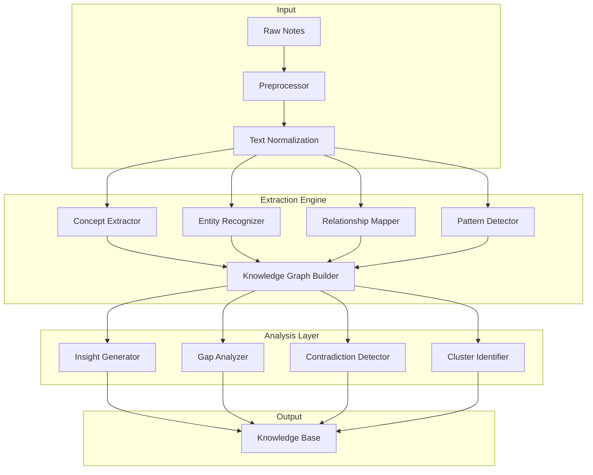

# Knowledge Extraction Framework

## Executive Summary

The Knowledge Extraction Framework is a sophisticated system that transforms raw information into structured, interconnected knowledge using advanced NLP, machine learning, and first-principles analysis. It implements the Feynman technique to ensure deep understanding and identifies patterns, relationships, and insights across the entire knowledge base.

## Core Principles

### First Principles Approach
1. **Decomposition**: Break complex ideas into fundamental components
2. **Analysis**: Understand each component independently  
3. **Synthesis**: Rebuild understanding from basics
4. **Validation**: Test understanding through explanation
5. **Connection**: Link to existing knowledge network

### Extraction Philosophy
- **Explicit Knowledge**: Direct facts and statements
- **Implicit Knowledge**: Inferred relationships and patterns
- **Emergent Knowledge**: Insights from connections
- **Meta-Knowledge**: Knowledge about knowledge structure

## Framework Architecture



## Component Specifications

### 1. Concept Extraction Engine

#### 1.1 Multi-Level Concept Extraction

```python
class ConceptExtractor:
    """
    Extracts concepts at multiple levels of abstraction
    """
    
    def extract_concepts(self, text: str) -> ConceptHierarchy:
        # Level 1: Atomic concepts
        atomic = self.extract_atomic_concepts(text)
        
        # Level 2: Compound concepts
        compound = self.extract_compound_concepts(text, atomic)
        
        # Level 3: Abstract concepts
        abstract = self.extract_abstract_concepts(text, compound)
        
        # Level 4: Meta-concepts
        meta = self.extract_meta_concepts(abstract)
        
        # Build hierarchy
        hierarchy = ConceptHierarchy()
        hierarchy.add_level('atomic', atomic)
        hierarchy.add_level('compound', compound)
        hierarchy.add_level('abstract', abstract)
        hierarchy.add_level('meta', meta)
        
        # Establish relationships
        hierarchy.link_concepts()
        
        return hierarchy
    
    def extract_atomic_concepts(self, text) -> List[AtomicConcept]:
        """
        Extract fundamental, indivisible concepts
        """
        concepts = []
        
        # Named entities
        entities = self.nlp.extract_entities(text)
        
        # Key terms
        terms = self.extract_key_terms(text)
        
        # Domain-specific concepts
        domain_concepts = self.extract_domain_concepts(text)
        
        for item in entities + terms + domain_concepts:
            concept = AtomicConcept(
                text=item.text,
                type=item.type,
                confidence=item.confidence,
                context=item.context
            )
            concepts.append(concept)
        
        return concepts
```

#### 1.2 Concept Properties

```python
@dataclass
class Concept:
    """
    Rich concept representation
    """
    id: str
    text: str
    type: ConceptType
    definition: str
    
    # Semantic properties
    embedding: np.ndarray
    semantic_field: List[str]
    synonyms: List[str]
    antonyms: List[str]
    
    # Structural properties
    parent_concepts: List[str]
    child_concepts: List[str]
    related_concepts: List[str]
    
    # Contextual properties
    domains: List[str]
    importance_score: float
    frequency: int
    
    # Feynman properties
    eli5_explanation: str
    complexity_level: int
    prerequisites: List[str]
    
    # Temporal properties
    first_seen: datetime
    last_updated: datetime
    evolution_history: List[ConceptVersion]
```

### 2. Entity Recognition System

#### 2.1 Advanced Entity Recognition

```python
class EntityRecognizer:
    """
    Recognizes and classifies entities with context
    """
    
    def recognize_entities(self, text: str) -> List[Entity]:
        entities = []
        
        # Standard NER
        standard_entities = self.standard_ner(text)
        
        # Custom entity patterns
        custom_entities = self.custom_patterns(text)
        
        # Contextual entity resolution
        resolved_entities = self.resolve_entities(
            standard_entities + custom_entities
        )
        
        # Entity linking
        linked_entities = self.link_entities(resolved_entities)
        
        # Entity enrichment
        enriched_entities = self.enrich_entities(linked_entities)
        
        return enriched_entities
    
    def custom_patterns(self, text) -> List[Entity]:
        """
        Domain-specific entity patterns
        """
        patterns = {
            'methodology': r'\b(\w+)\s+(method|approach|technique|framework)\b',
            'principle': r'\b(principle|law|rule|theorem)\s+of\s+(\w+)\b',
            'tool': r'\b(tool|software|library|framework):\s*(\w+)\b',
            'concept': r'\b(?:concept|idea|notion)\s+of\s+(\w+)\b'
        }
        
        entities = []
        for entity_type, pattern in patterns.items():
            matches = re.finditer(pattern, text, re.IGNORECASE)
            for match in matches:
                entities.append(Entity(
                    text=match.group(0),
                    type=entity_type,
                    span=match.span()
                ))
        
        return entities
```

#### 2.2 Entity Relationship Mapping

```python
class EntityRelationshipMapper:
    """
    Maps relationships between entities
    """
    
    def map_relationships(self, entities: List[Entity]) -> RelationshipGraph:
        graph = RelationshipGraph()
        
        # Direct relationships
        direct = self.extract_direct_relationships(entities)
        
        # Inferred relationships
        inferred = self.infer_relationships(entities)
        
        # Transitive relationships
        transitive = self.calculate_transitive_relationships(direct + inferred)
        
        # Build graph
        for rel in direct + inferred + transitive:
            graph.add_relationship(rel)
        
        # Calculate relationship strengths
        graph.calculate_strengths()
        
        return graph
    
    def extract_direct_relationships(self, entities) -> List[Relationship]:
        """
        Extract explicitly stated relationships
        """
        relationship_patterns = [
            (r'{E1} is a {E2}', 'is_a'),
            (r'{E1} contains {E2}', 'contains'),
            (r'{E1} causes {E2}', 'causes'),
            (r'{E1} depends on {E2}', 'depends_on'),
            (r'{E1} is similar to {E2}', 'similar_to'),
            (r'{E1} contradicts {E2}', 'contradicts')
        ]
        
        relationships = []
        # Pattern matching logic
        return relationships
```

### 3. Pattern Detection System

#### 3.1 Multi-Dimensional Pattern Detection

```python
class PatternDetector:
    """
    Detects patterns across multiple dimensions
    """
    
    def detect_patterns(self, knowledge_base: KnowledgeBase) -> PatternSet:
        patterns = PatternSet()
        
        # Temporal patterns
        temporal = self.detect_temporal_patterns(knowledge_base)
        patterns.add('temporal', temporal)
        
        # Structural patterns
        structural = self.detect_structural_patterns(knowledge_base)
        patterns.add('structural', structural)
        
        # Semantic patterns
        semantic = self.detect_semantic_patterns(knowledge_base)
        patterns.add('semantic', semantic)
        
        # Behavioral patterns
        behavioral = self.detect_behavioral_patterns(knowledge_base)
        patterns.add('behavioral', behavioral)
        
        # Cross-domain patterns
        cross_domain = self.detect_cross_domain_patterns(knowledge_base)
        patterns.add('cross_domain', cross_domain)
        
        return patterns
    
    def detect_temporal_patterns(self, kb) -> List[TemporalPattern]:
        """
        Detect patterns over time
        """
        patterns = []
        
        # Trend detection
        trends = self.detect_trends(kb.temporal_data)
        
        # Cyclical patterns
        cycles = self.detect_cycles(kb.temporal_data)
        
        # Event sequences
        sequences = self.detect_sequences(kb.temporal_data)
        
        # Growth patterns
        growth = self.detect_growth_patterns(kb.temporal_data)
        
        return patterns
```

#### 3.2 Pattern Types

```python
@dataclass
class Pattern:
    """
    Pattern representation
    """
    id: str
    type: PatternType
    name: str
    description: str
    
    # Pattern properties
    instances: List[PatternInstance]
    frequency: int
    confidence: float
    support: float
    
    # Pattern structure
    template: str
    parameters: Dict[str, Any]
    constraints: List[Constraint]
    
    # Pattern context
    domains: List[str]
    applicable_contexts: List[Context]
    exceptions: List[Exception]
    
    # Pattern relationships
    generalizes: List[str]  # More general patterns
    specializes: List[str]  # More specific patterns
    conflicts_with: List[str]
    
    # Pattern evolution
    first_detected: datetime
    last_confirmed: datetime
    stability_score: float
```

### 4. Knowledge Graph Builder

#### 4.1 Graph Construction

```python
class KnowledgeGraphBuilder:
    """
    Builds comprehensive knowledge graph
    """
    
    def build_graph(self, concepts: List[Concept], 
                   entities: List[Entity],
                   relationships: List[Relationship]) -> KnowledgeGraph:
        
        graph = KnowledgeGraph()
        
        # Add nodes
        for concept in concepts:
            graph.add_node(Node(
                id=concept.id,
                type='concept',
                data=concept
            ))
        
        for entity in entities:
            graph.add_node(Node(
                id=entity.id,
                type='entity',
                data=entity
            ))
        
        # Add edges
        for rel in relationships:
            graph.add_edge(Edge(
                source=rel.source,
                target=rel.target,
                type=rel.type,
                weight=rel.strength
            ))
        
        # Compute graph metrics
        graph.compute_centrality()
        graph.detect_communities()
        graph.calculate_clustering()
        
        return graph
    
    def enrich_graph(self, graph: KnowledgeGraph):
        """
        Enrich graph with computed properties
        """
        # Add inferred edges
        self.add_inferred_edges(graph)
        
        # Calculate node importance
        self.calculate_importance(graph)
        
        # Identify hubs and authorities
        self.identify_hubs_authorities(graph)
        
        # Detect knowledge clusters
        self.detect_clusters(graph)
```

#### 4.2 Graph Analysis

```python
class GraphAnalyzer:
    """
    Analyzes knowledge graph properties
    """
    
    def analyze(self, graph: KnowledgeGraph) -> GraphAnalysis:
        analysis = GraphAnalysis()
        
        # Structural analysis
        analysis.connectivity = self.analyze_connectivity(graph)
        analysis.density = graph.edge_count / (graph.node_count * (graph.node_count - 1))
        analysis.diameter = self.calculate_diameter(graph)
        
        # Centrality measures
        analysis.degree_centrality = nx.degree_centrality(graph)
        analysis.betweenness_centrality = nx.betweenness_centrality(graph)
        analysis.eigenvector_centrality = nx.eigenvector_centrality(graph)
        
        # Community detection
        analysis.communities = self.detect_communities(graph)
        analysis.modularity = self.calculate_modularity(graph, analysis.communities)
        
        # Path analysis
        analysis.shortest_paths = self.analyze_paths(graph)
        analysis.bridges = self.find_bridges(graph)
        
        return analysis
```

### 5. Insight Generation Engine

#### 5.1 Insight Discovery

```python
class InsightGenerator:
    """
    Generates insights from knowledge patterns
    """
    
    def generate_insights(self, graph: KnowledgeGraph, 
                         patterns: PatternSet) -> List[Insight]:
        insights = []
        
        # Connection insights
        connection_insights = self.find_connection_insights(graph)
        insights.extend(connection_insights)
        
        # Pattern insights
        pattern_insights = self.find_pattern_insights(patterns)
        insights.extend(pattern_insights)
        
        # Anomaly insights
        anomaly_insights = self.find_anomalies(graph, patterns)
        insights.extend(anomaly_insights)
        
        # Emergence insights
        emergence_insights = self.find_emergent_properties(graph)
        insights.extend(emergence_insights)
        
        # Cross-domain insights
        cross_domain_insights = self.find_cross_domain_insights(graph)
        insights.extend(cross_domain_insights)
        
        # Rank insights
        ranked_insights = self.rank_insights(insights)
        
        return ranked_insights
    
    def find_connection_insights(self, graph) -> List[Insight]:
        """
        Find insights from unexpected connections
        """
        insights = []
        
        # Find bridge concepts
        bridges = self.find_bridge_concepts(graph)
        for bridge in bridges:
            insights.append(Insight(
                type='bridge_concept',
                description=f"{bridge} connects disparate knowledge areas",
                importance=bridge.centrality,
                evidence=bridge.connections
            ))
        
        # Find missing links
        missing = self.predict_missing_links(graph)
        for link in missing:
            insights.append(Insight(
                type='missing_link',
                description=f"Potential connection between {link.source} and {link.target}",
                confidence=link.probability,
                suggestion=link.reasoning
            ))
        
        return insights
```

#### 5.2 Insight Types

```python
@dataclass
class Insight:
    """
    Structured insight representation
    """
    id: str
    type: InsightType
    title: str
    description: str
    
    # Insight properties
    importance: float  # 0-1
    confidence: float  # 0-1
    novelty: float     # 0-1
    actionability: float  # 0-1
    
    # Supporting evidence
    evidence: List[Evidence]
    supporting_patterns: List[Pattern]
    related_concepts: List[Concept]
    
    # Insight context
    domains: List[str]
    prerequisites: List[str]
    implications: List[str]
    
    # Validation
    validation_status: ValidationStatus
    peer_review_score: Optional[float]
    
    # Temporal
    discovered: datetime
    last_validated: datetime
    expiration: Optional[datetime]

class InsightType(Enum):
    CONNECTION = "connection"       # New connection discovered
    PATTERN = "pattern"             # Pattern identified
    ANOMALY = "anomaly"             # Unusual observation
    GAP = "knowledge_gap"           # Missing knowledge identified
    CONTRADICTION = "contradiction" # Conflicting information
    EMERGENCE = "emergence"         # Emergent property
    PREDICTION = "prediction"       # Future possibility
    SYNTHESIS = "synthesis"         # Combined understanding
```

### 6. Gap Analysis System

#### 6.1 Knowledge Gap Detection

```python
class GapAnalyzer:
    """
    Identifies gaps in knowledge
    """
    
    def analyze_gaps(self, graph: KnowledgeGraph) -> List[KnowledgeGap]:
        gaps = []
        
        # Structural gaps
        structural = self.find_structural_gaps(graph)
        gaps.extend(structural)
        
        # Conceptual gaps
        conceptual = self.find_conceptual_gaps(graph)
        gaps.extend(conceptual)
        
        # Prerequisite gaps
        prerequisite = self.find_prerequisite_gaps(graph)
        gaps.extend(prerequisite)
        
        # Coverage gaps
        coverage = self.find_coverage_gaps(graph)
        gaps.extend(coverage)
        
        # Understanding gaps
        understanding = self.find_understanding_gaps(graph)
        gaps.extend(understanding)
        
        return self.prioritize_gaps(gaps)
    
    def find_conceptual_gaps(self, graph) -> List[KnowledgeGap]:
        """
        Find missing conceptual knowledge
        """
        gaps = []
        
        # Undefined references
        undefined = self.find_undefined_references(graph)
        
        # Incomplete definitions
        incomplete = self.find_incomplete_definitions(graph)
        
        # Missing intermediates
        intermediates = self.find_missing_intermediates(graph)
        
        for item in undefined + incomplete + intermediates:
            gap = KnowledgeGap(
                type='conceptual',
                description=item.description,
                severity=item.severity,
                suggested_action=item.action
            )
            gaps.append(gap)
        
        return gaps
```

### 7. Contradiction Detection

#### 7.1 Contradiction Identifier

```python
class ContradictionDetector:
    """
    Detects contradictions in knowledge base
    """
    
    def detect_contradictions(self, graph: KnowledgeGraph) -> List[Contradiction]:
        contradictions = []
        
        # Direct contradictions
        direct = self.find_direct_contradictions(graph)
        contradictions.extend(direct)
        
        # Logical contradictions
        logical = self.find_logical_contradictions(graph)
        contradictions.extend(logical)
        
        # Temporal contradictions
        temporal = self.find_temporal_contradictions(graph)
        contradictions.extend(temporal)
        
        # Source contradictions
        source = self.find_source_contradictions(graph)
        contradictions.extend(source)
        
        return self.validate_contradictions(contradictions)
    
    def find_logical_contradictions(self, graph) -> List[Contradiction]:
        """
        Find logical inconsistencies
        """
        contradictions = []
        
        # A implies B, B implies C, C implies not A
        cycles = self.find_implication_cycles(graph)
        
        # Mutually exclusive properties
        exclusives = self.find_mutual_exclusives(graph)
        
        # Violated constraints
        violations = self.find_constraint_violations(graph)
        
        return contradictions
```

### 8. Cluster Identification

#### 8.1 Knowledge Clustering

```python
class ClusterIdentifier:
    """
    Identifies knowledge clusters and themes
    """
    
    def identify_clusters(self, graph: KnowledgeGraph) -> List[KnowledgeCluster]:
        # Multiple clustering approaches
        
        # Topic-based clustering
        topic_clusters = self.topic_clustering(graph)
        
        # Semantic clustering
        semantic_clusters = self.semantic_clustering(graph)
        
        # Structural clustering
        structural_clusters = self.structural_clustering(graph)
        
        # Temporal clustering
        temporal_clusters = self.temporal_clustering(graph)
        
        # Merge and reconcile clusters
        merged_clusters = self.merge_clusters([
            topic_clusters,
            semantic_clusters,
            structural_clusters,
            temporal_clusters
        ])
        
        # Characterize clusters
        characterized = self.characterize_clusters(merged_clusters)
        
        return characterized
    
    def semantic_clustering(self, graph) -> List[Cluster]:
        """
        Cluster based on semantic similarity
        """
        # Get embeddings for all nodes
        embeddings = self.get_node_embeddings(graph)
        
        # Apply clustering algorithm
        clusters = self.apply_clustering(embeddings, method='spectral')
        
        # Refine clusters
        refined = self.refine_clusters(clusters, graph)
        
        return refined
```

## Extraction Pipelines

### 1. Real-Time Extraction Pipeline

```python
class RealTimeExtractor:
    """
    Extracts knowledge in real-time as notes are created
    """
    
    def process_note(self, note: Note) -> ExtractedKnowledge:
        # Quick extraction for immediate feedback
        
        # Fast concept extraction
        concepts = self.fast_concept_extraction(note)
        
        # Rapid entity recognition
        entities = self.quick_entity_recognition(note)
        
        # Immediate link suggestions
        links = self.suggest_immediate_links(note)
        
        # Quick validation
        validation = self.quick_validate(note)
        
        return ExtractedKnowledge(
            concepts=concepts,
            entities=entities,
            links=links,
            validation=validation,
            processing_time=self.elapsed_time()
        )
```

### 2. Batch Extraction Pipeline

```python
class BatchExtractor:
    """
    Batch processing for comprehensive extraction
    """
    
    def process_batch(self, notes: List[Note]) -> BatchExtraction:
        # Comprehensive extraction with cross-note analysis
        
        # Parallel processing
        with ProcessPoolExecutor() as executor:
            # Individual note processing
            individual_results = executor.map(self.process_note, notes)
        
        # Cross-note analysis
        cross_analysis = self.cross_note_analysis(notes)
        
        # Pattern detection across batch
        patterns = self.detect_batch_patterns(notes)
        
        # Collective insights
        insights = self.generate_collective_insights(individual_results)
        
        return BatchExtraction(
            individual=individual_results,
            cross_analysis=cross_analysis,
            patterns=patterns,
            insights=insights
        )
```

## Quality Assurance

### Extraction Quality Metrics

```python
class ExtractionQualityMetrics:
    """
    Measures extraction quality
    """
    
    def evaluate_extraction(self, extracted: ExtractedKnowledge, 
                           ground_truth: Optional[GroundTruth] = None) -> QualityScore:
        
        metrics = {}
        
        # Precision and recall (if ground truth available)
        if ground_truth:
            metrics['precision'] = self.calculate_precision(extracted, ground_truth)
            metrics['recall'] = self.calculate_recall(extracted, ground_truth)
            metrics['f1'] = 2 * (metrics['precision'] * metrics['recall']) / (metrics['precision'] + metrics['recall'])
        
        # Concept quality
        metrics['concept_coherence'] = self.measure_concept_coherence(extracted.concepts)
        metrics['concept_coverage'] = self.measure_concept_coverage(extracted.concepts)
        
        # Relationship quality
        metrics['relationship_validity'] = self.validate_relationships(extracted.relationships)
        metrics['relationship_completeness'] = self.measure_relationship_completeness(extracted.relationships)
        
        # Pattern quality
        metrics['pattern_significance'] = self.measure_pattern_significance(extracted.patterns)
        metrics['pattern_stability'] = self.measure_pattern_stability(extracted.patterns)
        
        # Overall score
        metrics['overall'] = self.calculate_overall_score(metrics)
        
        return QualityScore(metrics)
```

## Configuration

### Extraction Configuration

```yaml
# .pkm/extraction.config.yaml
extraction:
  concept_extraction:
    min_confidence: 0.7
    max_concepts_per_note: 10
    extraction_methods:
      - nlp_entities
      - keyword_extraction
      - topic_modeling
      - semantic_analysis
  
  entity_recognition:
    models:
      - spacy_large
      - custom_domain_model
    entity_types:
      - person
      - organization
      - concept
      - method
      - tool
      - principle
  
  pattern_detection:
    min_support: 0.05
    min_confidence: 0.8
    pattern_types:
      - temporal
      - structural
      - semantic
      - behavioral
  
  insight_generation:
    min_importance: 0.6
    max_insights_per_session: 10
    insight_types:
      - connections
      - patterns
      - anomalies
      - gaps
  
  quality_thresholds:
    min_extraction_confidence: 0.7
    min_concept_coherence: 0.8
    min_relationship_validity: 0.75
```

## Integration with PKM System

### Agent Integration

```python
class ExtractionAgent:
    """
    Claude Code agent for knowledge extraction
    """
    
    def __init__(self):
        self.extractor = KnowledgeExtractor()
        self.analyzer = GraphAnalyzer()
        self.generator = InsightGenerator()
    
    async def process_request(self, request: ExtractionRequest) -> ExtractionResponse:
        # Extract knowledge
        extracted = await self.extractor.extract(request.content)
        
        # Analyze relationships
        analysis = await self.analyzer.analyze(extracted)
        
        # Generate insights
        insights = await self.generator.generate(analysis)
        
        return ExtractionResponse(
            extracted=extracted,
            analysis=analysis,
            insights=insights
        )
```

## Performance Optimization

### Optimization Strategies

```python
class ExtractionOptimizer:
    """
    Optimizes extraction performance
    """
    
    def optimize(self):
        # Model optimization
        self.optimize_models()
        
        # Caching strategies
        self.implement_caching()
        
        # Parallel processing
        self.setup_parallel_processing()
        
        # Incremental processing
        self.enable_incremental_updates()
    
    def optimize_models(self):
        # Model quantization
        # Model pruning
        # Distillation
        # Hardware acceleration
        pass
```

---

*This Knowledge Extraction Framework provides comprehensive capabilities for transforming information into structured, actionable knowledge following first principles and PKM best practices.*