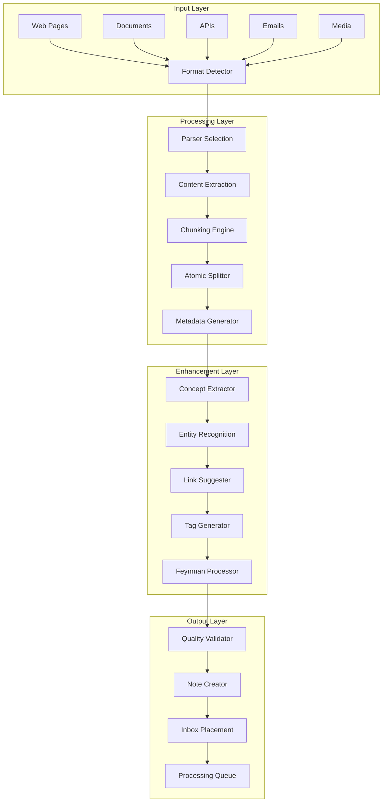

# Data Ingestion and Processing Pipeline

## Overview

The PKM Data Ingestion and Processing Pipeline is a sophisticated system designed to transform diverse information sources into atomic, interconnected knowledge notes. This pipeline implements first principles thinking by breaking down complex information into fundamental units and rebuilding understanding through connections.

## Pipeline Architecture



## Stage 1: Input Collection

### 1.1 Web Content Ingestion

```python
class WebIngester:
    """
    Ingests web content with intelligent extraction
    """
    
    def ingest_url(self, url: str) -> RawContent:
        # 1. Fetch content with browser automation if needed
        # 2. Extract main content using readability algorithms
        # 3. Preserve metadata (author, date, tags)
        # 4. Download linked resources (images, PDFs)
        # 5. Create source attribution
        
        return RawContent(
            content=extracted_text,
            metadata=page_metadata,
            resources=linked_resources,
            source=SourceInfo(url, timestamp)
        )
    
    def ingest_feed(self, feed_url: str) -> List[RawContent]:
        # Process RSS/Atom feeds
        # Track already-ingested items
        # Handle incremental updates
        pass
```

### 1.2 Document Processing

```yaml
document_processors:
  pdf:
    method: "pdfplumber + OCR fallback"
    features:
      - text_extraction
      - table_preservation
      - image_extraction
      - annotation_capture
  
  epub:
    method: "ebooklib"
    features:
      - chapter_splitting
      - metadata_extraction
      - navigation_preservation
  
  docx:
    method: "python-docx"
    features:
      - style_preservation
      - comment_extraction
      - track_changes_handling
  
  markdown:
    method: "python-markdown"
    features:
      - frontmatter_parsing
      - link_extraction
      - code_block_preservation
```

### 1.3 API Integration

```python
class APIIngester:
    """
    Ingests data from various APIs
    """
    
    supported_apis = {
        'github': GitHubIngester,
        'twitter': TwitterIngester,
        'notion': NotionIngester,
        'readwise': ReadwiseIngester,
        'hypothesis': HypothesisIngester,
        'zotero': ZoteroIngester
    }
    
    def ingest_from_api(self, api_name: str, config: dict) -> List[RawContent]:
        ingester = self.supported_apis[api_name](config)
        
        # Fetch data with pagination
        # Transform to common format
        # Handle rate limiting
        # Manage incremental sync
        
        return ingester.fetch_all()
```

## Stage 2: Content Processing

### 2.1 Format Detection and Parsing

```python
class FormatDetector:
    """
    Detects content format and selects appropriate parser
    """
    
    def detect_format(self, content: bytes, hint: str = None) -> str:
        # Magic number detection
        # MIME type analysis
        # Extension matching
        # Content analysis
        
        detectors = [
            MagicDetector(),
            MimeDetector(),
            ExtensionDetector(),
            ContentAnalyzer()
        ]
        
        for detector in detectors:
            format = detector.detect(content, hint)
            if format:
                return format
        
        return 'text/plain'  # Fallback
    
    def get_parser(self, format: str) -> Parser:
        parsers = {
            'text/html': HTMLParser(),
            'application/pdf': PDFParser(),
            'text/markdown': MarkdownParser(),
            'application/json': JSONParser(),
            # ... more parsers
        }
        return parsers.get(format, PlainTextParser())
```

### 2.2 Content Extraction

```python
class ContentExtractor:
    """
    Extracts structured content from parsed documents
    """
    
    def extract(self, parsed_content: ParsedContent) -> ExtractedContent:
        # Main content extraction
        main_text = self.extract_main_content(parsed_content)
        
        # Metadata extraction
        metadata = self.extract_metadata(parsed_content)
        
        # Structure preservation
        structure = self.extract_structure(parsed_content)
        
        # Code block extraction
        code_blocks = self.extract_code(parsed_content)
        
        # Media extraction
        media = self.extract_media(parsed_content)
        
        return ExtractedContent(
            text=main_text,
            metadata=metadata,
            structure=structure,
            code=code_blocks,
            media=media
        )
    
    def extract_main_content(self, content) -> str:
        # Remove navigation, ads, footers
        # Identify main article/content area
        # Preserve important formatting
        pass
```

### 2.3 Intelligent Chunking

```python
class ChunkingEngine:
    """
    Splits content into optimal chunks for processing
    """
    
    def chunk_content(self, content: ExtractedContent) -> List[Chunk]:
        strategies = [
            SemanticChunker(),      # Based on meaning
            StructuralChunker(),    # Based on document structure
            SentenceChunker(),      # Based on sentences
            TokenChunker()          # Based on token count
        ]
        
        # Select strategy based on content type
        strategy = self.select_strategy(content)
        
        # Apply chunking with overlap
        chunks = strategy.chunk(
            content,
            max_size=1000,      # tokens
            overlap=100,        # tokens
            preserve_context=True
        )
        
        # Post-process chunks
        chunks = self.post_process(chunks)
        
        return chunks
    
    def select_strategy(self, content) -> ChunkingStrategy:
        # Analyze content characteristics
        # Select optimal chunking approach
        pass
```

## Stage 3: Atomic Note Creation

### 3.1 Atomic Splitter

```python
class AtomicSplitter:
    """
    Splits chunks into atomic notes following single-concept principle
    """
    
    def split_to_atomic(self, chunk: Chunk) -> List[AtomicNote]:
        # Identify distinct concepts
        concepts = self.identify_concepts(chunk)
        
        atomic_notes = []
        for concept in concepts:
            # Extract concept-specific content
            content = self.extract_concept_content(chunk, concept)
            
            # Create atomic note
            note = AtomicNote(
                concept=concept,
                content=content,
                context=chunk.context,
                source=chunk.source
            )
            
            # Validate atomicity
            if self.is_atomic(note):
                atomic_notes.append(note)
            else:
                # Further split if needed
                sub_notes = self.split_to_atomic(note)
                atomic_notes.extend(sub_notes)
        
        return atomic_notes
    
    def identify_concepts(self, chunk) -> List[Concept]:
        # NLP analysis for concept extraction
        # Key phrase identification
        # Topic modeling
        pass
    
    def is_atomic(self, note) -> bool:
        # Check single concept principle
        # Verify self-contained nature
        # Ensure appropriate granularity
        pass
```

### 3.2 Metadata Generation

```python
class MetadataGenerator:
    """
    Generates comprehensive metadata for each note
    """
    
    def generate_metadata(self, note: AtomicNote) -> NoteMetadata:
        metadata = NoteMetadata()
        
        # Basic metadata
        metadata.id = self.generate_id()
        metadata.created = datetime.now()
        metadata.type = self.determine_type(note)
        
        # Content-based metadata
        metadata.title = self.generate_title(note)
        metadata.summary = self.generate_summary(note)
        metadata.keywords = self.extract_keywords(note)
        
        # Feynman metadata
        metadata.complexity_level = self.assess_complexity(note)
        metadata.prerequisite_concepts = self.identify_prerequisites(note)
        
        # Quality metadata
        metadata.completeness = self.assess_completeness(note)
        metadata.clarity_score = self.calculate_clarity(note)
        
        # Source tracking
        metadata.source = note.source
        metadata.extraction_confidence = self.calculate_confidence(note)
        
        return metadata
    
    def generate_id(self) -> str:
        # Timestamp-based ID with random component
        # Format: YYYYMMDD-HHMMSS-XXXX
        pass
    
    def determine_type(self, note) -> NoteType:
        # Classify as concept, fact, question, etc.
        pass
```

## Stage 4: Enhancement Pipeline

### 4.1 Concept Extraction

```python
class ConceptExtractor:
    """
    Extracts and identifies key concepts using NLP
    """
    
    def extract_concepts(self, note: AtomicNote) -> List[Concept]:
        # Load NLP model
        nlp = self.load_model('en_core_web_lg')
        
        # Process text
        doc = nlp(note.content)
        
        concepts = []
        
        # Extract named entities
        entities = self.extract_entities(doc)
        concepts.extend(entities)
        
        # Extract noun phrases
        noun_phrases = self.extract_noun_phrases(doc)
        concepts.extend(noun_phrases)
        
        # Extract key terms using TF-IDF
        key_terms = self.extract_key_terms(doc)
        concepts.extend(key_terms)
        
        # Deduplicate and rank
        concepts = self.deduplicate_and_rank(concepts)
        
        return concepts[:10]  # Top 10 concepts
    
    def extract_entities(self, doc) -> List[Concept]:
        # Named entity recognition
        # Filter relevant entity types
        pass
    
    def extract_noun_phrases(self, doc) -> List[Concept]:
        # Identify significant noun phrases
        # Filter by relevance
        pass
```

### 4.2 Link Suggestion

```python
class LinkSuggester:
    """
    Suggests relevant links to other notes
    """
    
    def suggest_links(self, note: AtomicNote, vault: Vault) -> List[LinkSuggestion]:
        suggestions = []
        
        # Semantic similarity search
        similar_notes = self.find_similar_notes(note, vault)
        suggestions.extend(self.create_suggestions(similar_notes, 'similar'))
        
        # Concept matching
        concept_matches = self.find_concept_matches(note, vault)
        suggestions.extend(self.create_suggestions(concept_matches, 'concept'))
        
        # Citation links
        citation_matches = self.find_citations(note, vault)
        suggestions.extend(self.create_suggestions(citation_matches, 'citation'))
        
        # Temporal proximity
        temporal_matches = self.find_temporal_matches(note, vault)
        suggestions.extend(self.create_suggestions(temporal_matches, 'temporal'))
        
        # Rank and filter
        suggestions = self.rank_suggestions(suggestions)
        
        return suggestions[:5]  # Top 5 suggestions
    
    def find_similar_notes(self, note, vault) -> List[Note]:
        # Compute embeddings
        # Find nearest neighbors
        # Filter by threshold
        pass
```

### 4.3 Tag Generation

```python
class TagGenerator:
    """
    Automatically generates relevant tags
    """
    
    def generate_tags(self, note: AtomicNote) -> List[str]:
        tags = []
        
        # Topic-based tags
        topics = self.extract_topics(note)
        tags.extend([f"topic/{topic}" for topic in topics])
        
        # Type-based tags
        note_type = self.determine_note_type(note)
        tags.append(f"type/{note_type}")
        
        # Source-based tags
        source_tags = self.extract_source_tags(note)
        tags.extend([f"source/{tag}" for tag in source_tags])
        
        # Complexity tags
        complexity = self.assess_complexity(note)
        tags.append(f"level/{complexity}")
        
        # Status tags
        tags.append("status/unprocessed")
        
        # Custom rules
        custom_tags = self.apply_custom_rules(note)
        tags.extend(custom_tags)
        
        return list(set(tags))  # Deduplicate
    
    def extract_topics(self, note) -> List[str]:
        # LDA topic modeling
        # Keyword extraction
        # Category classification
        pass
```

## Stage 5: Feynman Processing

### 5.1 Simplification Engine

```python
class FeynmanProcessor:
    """
    Applies Feynman technique for understanding validation
    """
    
    def process(self, note: AtomicNote) -> FeynmanNote:
        feynman_note = FeynmanNote(original=note)
        
        # Generate ELI5 version
        feynman_note.eli5 = self.generate_eli5(note)
        
        # Create teaching outline
        feynman_note.teaching_outline = self.create_teaching_outline(note)
        
        # Identify knowledge gaps
        feynman_note.gaps = self.identify_gaps(note)
        
        # Generate analogies
        feynman_note.analogies = self.generate_analogies(note)
        
        # Create visual representation
        feynman_note.visual = self.create_visual(note)
        
        # Assess understanding level
        feynman_note.understanding_level = self.assess_understanding(note)
        
        return feynman_note
    
    def generate_eli5(self, note) -> str:
        # Simplify vocabulary
        # Remove jargon
        # Use concrete examples
        # Create simple explanation
        pass
    
    def identify_gaps(self, note) -> List[KnowledgeGap]:
        # Find undefined terms
        # Identify missing prerequisites
        # Detect logical jumps
        # Mark areas needing clarification
        pass
```

## Stage 6: Quality Validation

### 6.1 Quality Validator

```python
class QualityValidator:
    """
    Validates note quality before storage
    """
    
    def validate(self, note: ProcessedNote) -> ValidationResult:
        checks = []
        
        # Atomicity check
        checks.append(self.check_atomicity(note))
        
        # Completeness check
        checks.append(self.check_completeness(note))
        
        # Clarity check
        checks.append(self.check_clarity(note))
        
        # Source attribution check
        checks.append(self.check_sources(note))
        
        # Link quality check
        checks.append(self.check_links(note))
        
        # Feynman validation
        checks.append(self.check_feynman(note))
        
        # Calculate overall score
        score = self.calculate_score(checks)
        
        return ValidationResult(
            passed=score >= 0.7,
            score=score,
            checks=checks,
            suggestions=self.generate_suggestions(checks)
        )
    
    def check_atomicity(self, note) -> Check:
        # Verify single concept
        # Check self-containment
        # Assess granularity
        pass
```

## Stage 7: Storage and Indexing

### 7.1 Note Storage

```python
class NoteStorage:
    """
    Stores processed notes in the vault
    """
    
    def store(self, note: ValidatedNote) -> StorageResult:
        # Generate file path
        file_path = self.generate_path(note)
        
        # Format as markdown
        markdown_content = self.format_markdown(note)
        
        # Write to file system
        self.write_file(file_path, markdown_content)
        
        # Update indices
        self.update_indices(note)
        
        # Trigger Git commit
        self.commit_to_git(note)
        
        # Send notifications
        self.notify_subscribers(note)
        
        return StorageResult(
            path=file_path,
            id=note.id,
            timestamp=datetime.now()
        )
    
    def generate_path(self, note) -> Path:
        # Determine folder based on type
        # Generate filename from title/id
        # Ensure uniqueness
        pass
    
    def format_markdown(self, note) -> str:
        # Add frontmatter
        # Format content
        # Add links
        # Include Feynman section
        pass
```

### 7.2 Index Management

```python
class IndexManager:
    """
    Maintains various indices for fast retrieval
    """
    
    def update_indices(self, note: Note):
        # Update content index
        self.update_content_index(note)
        
        # Update concept index
        self.update_concept_index(note)
        
        # Update link graph
        self.update_link_graph(note)
        
        # Update tag index
        self.update_tag_index(note)
        
        # Update temporal index
        self.update_temporal_index(note)
        
        # Update search index
        self.update_search_index(note)
    
    def update_content_index(self, note):
        # Full-text search index
        # Update Elasticsearch/Meilisearch
        pass
    
    def update_link_graph(self, note):
        # Update graph database
        # Recalculate centrality metrics
        pass
```

## Pipeline Configuration

### Configuration Schema

```yaml
# .pkm/pipeline.config.yaml
pipeline:
  ingestion:
    sources:
      web:
        enabled: true
        user_agent: "PKM-Bot/1.0"
        timeout: 30
        max_retries: 3
      
      documents:
        enabled: true
        max_file_size: 100MB
        supported_formats: [pdf, epub, docx, md]
      
      apis:
        enabled: true
        rate_limit: 100/hour
        credentials_path: ~/.pkm/credentials
    
  processing:
    chunking:
      strategy: semantic
      max_chunk_size: 1000
      overlap: 100
    
    atomicity:
      strict_mode: true
      max_concepts_per_note: 1
    
    enhancement:
      nlp_model: en_core_web_lg
      embedding_model: sentence-transformers/all-mpnet-base-v2
  
  validation:
    quality_threshold: 0.7
    required_checks:
      - atomicity
      - sources
      - clarity
    
  storage:
    vault_path: ~/pkm-vault
    inbox_folder: 00-inbox
    auto_commit: true
    commit_message: "Auto: Added {count} notes via ingestion pipeline"
```

### Performance Optimization

```yaml
optimization:
  parallelization:
    max_workers: 4
    batch_size: 10
  
  caching:
    enabled: true
    cache_size: 1GB
    ttl: 3600
  
  resource_limits:
    max_memory: 4GB
    max_cpu: 80%
    timeout: 300s
```

## Monitoring and Metrics

### Pipeline Metrics

```python
class PipelineMetrics:
    """
    Tracks pipeline performance and health
    """
    
    metrics = {
        'ingestion_rate': 'notes/minute',
        'processing_time': 'seconds/note',
        'validation_pass_rate': 'percentage',
        'error_rate': 'errors/hour',
        'queue_length': 'notes',
        'storage_rate': 'MB/hour'
    }
    
    def collect_metrics(self):
        # Collect from each stage
        # Aggregate statistics
        # Send to monitoring system
        pass
    
    def generate_dashboard(self):
        # Real-time pipeline status
        # Historical trends
        # Bottleneck identification
        pass
```

## Error Handling

### Error Recovery Strategies

```python
class ErrorHandler:
    """
    Handles pipeline errors gracefully
    """
    
    def handle_error(self, error: Exception, context: dict):
        # Log error details
        self.log_error(error, context)
        
        # Determine recovery strategy
        strategy = self.select_strategy(error)
        
        # Apply recovery
        if strategy == 'retry':
            return self.retry_with_backoff(context)
        elif strategy == 'skip':
            return self.skip_and_continue(context)
        elif strategy == 'fallback':
            return self.apply_fallback(context)
        elif strategy == 'manual':
            return self.queue_for_manual_review(context)
        
        # Alert if critical
        if self.is_critical(error):
            self.send_alert(error, context)
    
    def select_strategy(self, error) -> str:
        # Analyze error type
        # Check retry count
        # Assess impact
        pass
```

## Integration Points

### Agent Hooks

```python
class AgentIntegration:
    """
    Integration points for Claude Code agents
    """
    
    hooks = {
        'pre_ingestion': [],
        'post_extraction': [],
        'pre_atomization': [],
        'post_enhancement': [],
        'pre_validation': [],
        'post_storage': []
    }
    
    def register_hook(self, stage: str, agent: Agent):
        self.hooks[stage].append(agent)
    
    def execute_hooks(self, stage: str, data: any):
        for agent in self.hooks[stage]:
            data = agent.process(data)
        return data
```

## Testing Framework

### Pipeline Testing

```python
class PipelineTests:
    """
    Comprehensive pipeline testing
    """
    
    def test_ingestion(self):
        # Test various input formats
        # Verify extraction accuracy
        # Check error handling
        pass
    
    def test_processing(self):
        # Test chunking strategies
        # Verify atomicity
        # Check enhancement quality
        pass
    
    def test_validation(self):
        # Test quality checks
        # Verify scoring accuracy
        # Check edge cases
        pass
    
    def test_end_to_end(self):
        # Full pipeline test
        # Performance benchmarks
        # Stress testing
        pass
```

---

*This pipeline specification provides a comprehensive framework for transforming any information into high-quality, atomic, interconnected knowledge notes following PKM best practices and Feynman principles.*