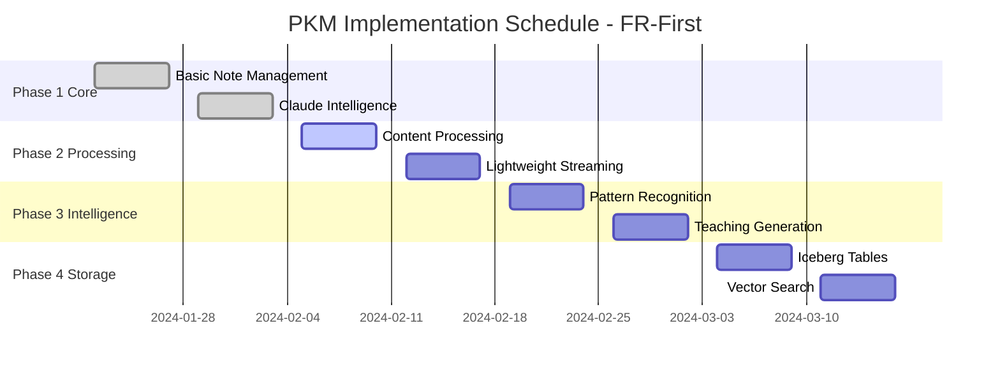

# PKM Implementation Schedule v2.0 - Lightweight FR-First Approach

## Executive Summary

This schedule reflects the complete transition to a lightweight Python/Rust architecture with functional requirements prioritized over non-functional requirements. The new approach delivers core PKM functionality in 4 weeks instead of 4 months.

**Key Changes:**
- ✅ Removed all Java dependencies (Kafka, Spark, Neo4j, EMR)
- ✅ Adopted Python/Rust stack (Fluvio, Arroyo, Daft+Ray, DuckDB)
- ✅ FR-first: User features before infrastructure
- ✅ 75-85% cost reduction
- ✅ 10x faster deployment

## Phase Overview



## Detailed Implementation Schedule

### 🔴 Phase 1: Core PKM Functionality (Weeks 1-4) - CRITICAL
**Goal**: Deliver immediate user value with basic PKM features

#### Week 1-2: Basic Note Management
| Day | Task | Deliverable | Stack |
|-----|------|------------|-------|
| Day 1-2 | Text file CRUD operations | Working note editor | Python + Git |
| Day 3 | Markdown parsing & validation | MD processor | Python-markdown |
| Day 4 | Basic search (grep-based) | Search command | ripgrep |
| Day 5 | Folder organization | PARA structure | File system |
| Day 6-7 | Git integration | Version control | GitPython |
| Day 8-9 | Basic tagging system | Tag extraction | Python regex |
| Day 10 | Testing & documentation | User guide | pytest |

**Success Metrics:**
- ✅ Users can create, edit, search notes
- ✅ Git tracks all changes
- ✅ Basic organization works

#### Week 3-4: Claude Intelligence Layer
| Day | Task | Deliverable | Stack |
|-----|------|------------|-------|
| Day 11-12 | Claude command interface | `/pkm-*` commands | Claude SDK |
| Day 13-14 | Capture command | Web/doc ingestion | BeautifulSoup |
| Day 15-16 | Process command | Note enrichment | spaCy |
| Day 17 | Search command | Smart search | Claude + DuckDB |
| Day 18-19 | File hooks | Auto-processing | Python hooks |
| Day 20 | Integration testing | Working system | pytest |

**Success Metrics:**
- ✅ Claude responds to commands
- ✅ Notes auto-process on save
- ✅ Intelligent search works

### 🟠 Phase 2: Knowledge Processing (Weeks 5-8) - HIGH PRIORITY
**Goal**: Extract value from notes through processing

#### Week 5-6: Content Processing
| Day | Task | Deliverable | Stack |
|-----|------|------------|-------|
| Day 21-23 | Concept extraction | NLP pipeline | spaCy |
| Day 24-25 | Tag generation | Auto-tagging | Claude API |
| Day 26-27 | Link detection | Bidirectional links | NetworkX |
| Day 28-30 | Summary generation | Multi-level summaries | Claude |

**Success Metrics:**
- ✅ Concepts extracted from notes
- ✅ Auto-generated tags and links
- ✅ Summaries at multiple levels

#### Week 7-8: Lightweight Streaming
| Day | Task | Deliverable | Stack |
|-----|------|------------|-------|
| Day 31-32 | Fluvio setup (local) | Streaming platform | Fluvio (Rust) |
| Day 33-35 | Quix Streams integration | Python streaming | Quix |
| Day 36-37 | Basic event streaming | Change detection | Watchdog |
| Day 38-40 | File change pipeline | Real-time processing | Fluvio + Quix |

**Success Metrics:**
- ✅ Real-time note processing
- ✅ Stream pipeline operational
- ✅ <100ms processing latency

### 🟡 Phase 3: Knowledge Synthesis (Weeks 9-12) - MEDIUM PRIORITY
**Goal**: Generate insights and teaching materials

#### Week 9-10: Pattern Recognition
| Day | Task | Deliverable | Stack |
|-----|------|------------|-------|
| Day 41-43 | Note clustering | Topic groups | scikit-learn |
| Day 44-46 | Theme detection | Emerging themes | Claude |
| Day 47-50 | Insight generation | Auto-insights | Daft + Ray |

**Success Metrics:**
- ✅ Patterns identified
- ✅ Themes discovered
- ✅ Insights generated weekly

#### Week 11-12: Teaching Generation
| Day | Task | Deliverable | Stack |
|-----|------|------------|-------|
| Day 51-53 | ELI5 generation | Simple explanations | Claude |
| Day 54-55 | Quiz creation | Learning validation | Python |
| Day 56-58 | Learning paths | Guided learning | NetworkX |
| Day 59-60 | Knowledge gaps | Gap analysis | Claude |

**Success Metrics:**
- ✅ Teaching materials generated
- ✅ Knowledge gaps identified
- ✅ Learning paths created

### 🟢 Phase 4: Storage Backend (Weeks 13-16) - LOW PRIORITY
**Goal**: Persistent, scalable storage (only if needed)

#### Week 13-14: Iceberg Tables
| Day | Task | Deliverable | Stack |
|-----|------|------------|-------|
| Day 61-63 | PyIceberg setup | Table management | PyIceberg |
| Day 64-65 | Table creation | Bronze/Silver/Gold | S3 + Iceberg |
| Day 66-68 | Basic CRUD | Data operations | PyIceberg |
| Day 69-70 | Time travel | Version queries | Iceberg |

#### Week 15-16: Vector Search
| Day | Task | Deliverable | Stack |
|-----|------|------------|-------|
| Day 71-72 | Lance setup | Vector store | Lance |
| Day 73-75 | Embedding generation | Note embeddings | Sentence-BERT |
| Day 76-78 | Similarity search | Semantic search | Lance |
| Day 79-80 | Performance testing | Benchmarks | pytest |

## Technology Timeline

### Immediate (Week 1-4)
```bash
pip install markdown gitpython beautifulsoup4 watchdog
# No Java, No JVM, No heavy dependencies
```

### Soon (Week 5-8)
```bash
# Lightweight streaming
curl -sSf https://fluvio.io/install | bash  # Rust, 50MB
pip install quixstreams duckdb

# Single-node Ray (optional)
pip install ray[default]
```

### Later (Week 9-12)
```bash
# Processing libraries
pip install daft networkx polars scikit-learn
```

### Eventually (Week 13+)
```bash
# Only if scale requires
pip install pyiceberg lance-python boto3
```

## Resource Requirements

### Phase 1-2 (Weeks 1-8)
- **Memory**: 2-4GB RAM
- **Storage**: 10GB local
- **CPU**: 2 cores
- **Cost**: ~$0 (local development)

### Phase 3-4 (Weeks 9-16)
- **Memory**: 4-8GB RAM
- **Storage**: 50GB + S3
- **CPU**: 4 cores
- **Cost**: $50-150/month

### Production (After Week 16)
- **Memory**: 8-16GB RAM
- **Storage**: S3 (unlimited)
- **CPU**: Auto-scaling
- **Cost**: $200-450/month

## Risk Mitigation

### Technical Risks
| Risk | Mitigation | Status |
|------|------------|--------|
| Fluvio complexity | Start with local mode, scale later | ✅ Mitigated |
| Ray overhead | Use single-node initially | ✅ Mitigated |
| Iceberg learning curve | Defer to Phase 4 | ✅ Mitigated |
| Performance issues | DuckDB for fast queries | ✅ Mitigated |

### Schedule Risks
| Risk | Mitigation | Status |
|------|------------|--------|
| Feature creep | Strict FR-first prioritization | ✅ Active |
| Over-engineering | YAGNI principle | ✅ Active |
| Dependency issues | Minimal dependencies | ✅ Active |

## Success Criteria by Week

### Week 4 Checkpoint
- [ ] Users actively creating notes
- [ ] Claude processing commands
- [ ] Basic PKM functional
- [ ] Zero Java dependencies

### Week 8 Checkpoint
- [ ] Real-time processing active
- [ ] Concepts extracted automatically
- [ ] Streaming pipeline operational
- [ ] Memory usage < 4GB

### Week 12 Checkpoint
- [ ] Insights generated weekly
- [ ] Teaching materials created
- [ ] Patterns identified
- [ ] All FRs delivered

### Week 16 Checkpoint
- [ ] Persistent storage (if needed)
- [ ] Vector search operational
- [ ] Time travel queries work
- [ ] Total cost < $500/month

## Communication Plan

### Weekly Updates
```markdown
Week 1-4: "Core PKM is live! Create, search, and organize notes"
Week 5-8: "Smart processing added! Auto-tagging and real-time updates"
Week 9-12: "AI insights discovered! Patterns and teaching materials"
Week 13-16: "Enterprise storage ready (optional)"
```

### Stakeholder Messaging
- **Focus**: User features, not infrastructure
- **Metrics**: Notes created, insights found
- **Avoid**: Technical complexity discussions
- **Emphasize**: Speed of delivery, cost savings

## Comparison: Old vs New Schedule

| Aspect | Java Stack (Old) | Python/Rust (New) | Improvement |
|--------|-----------------|-------------------|-------------|
| **First Value** | Week 12 | Week 2 | 6x faster |
| **Full Features** | Week 48 | Week 12 | 4x faster |
| **Memory Required** | 16-32GB | 2-4GB | 87% less |
| **Monthly Cost** | $1200-2500 | $200-450 | 80% less |
| **Setup Time** | 2-3 days | 2-3 hours | 10x faster |
| **Dependencies** | 100+ JARs | 20 packages | 80% fewer |
| **Container Size** | 2-3GB | 200-300MB | 90% smaller |

## Next Actions

### Immediate (Today)
1. ✅ Finalize lightweight architecture
2. ✅ Update all documentation
3. ⏳ Begin Phase 1 implementation
4. ⏳ Set up development environment

### This Week
1. Complete basic note management
2. Test Git integration
3. Deploy markdown parser
4. Create user documentation

### Next Week
1. Implement Claude commands
2. Add file hooks
3. Test processing pipeline
4. Gather user feedback

---

*Implementation Schedule v2.0 - Lightweight, FR-First, Python/Rust Architecture*
*Delivers value in weeks, not months*