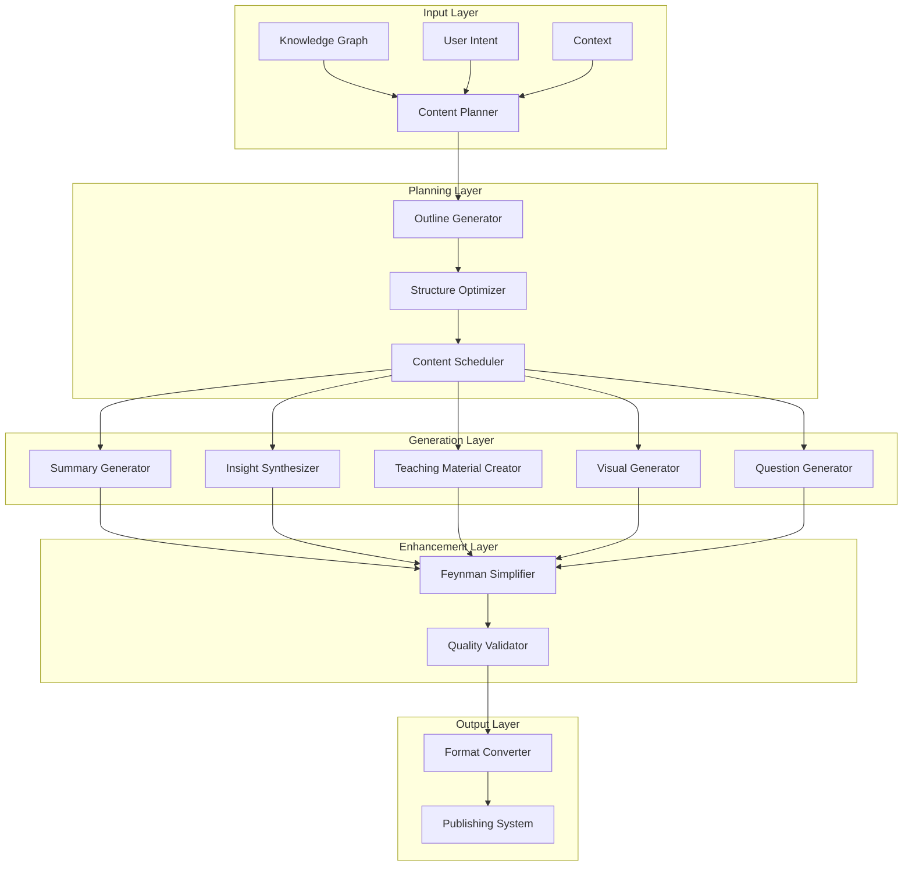

# Content Generation System

## Overview

The Content Generation System transforms raw knowledge into various formats optimized for learning, teaching, and insight discovery. It implements Feynman-based simplification, progressive summarization, and intelligent synthesis to create content that enhances understanding and retention.

## Core Generation Principles

### First Principles Content Creation
1. **Clarity First**: Every piece of generated content must be understandable
2. **Progressive Complexity**: Build from simple to complex
3. **Context Preservation**: Maintain relationships and connections
4. **Purpose-Driven**: Each output serves a specific learning goal
5. **Validation Through Teaching**: Content must be teachable

### Feynman-Driven Generation
- **Simplification Without Loss**: Preserve core meaning while reducing complexity
- **Analogy Construction**: Create relatable comparisons
- **Gap Identification**: Highlight what's missing
- **Iterative Refinement**: Continuously improve explanations

## System Architecture



## Generation Components

### 1. Summary Generation Engine

#### 1.1 Progressive Summarization

```python
class ProgressiveSummarizer:
    """
    Creates multi-level summaries with increasing detail
    """
    
    def generate_summaries(self, content: KnowledgeContent) -> ProgressiveSummary:
        summary = ProgressiveSummary()
        
        # Level 1: One-liner (10-15 words)
        summary.one_liner = self.generate_one_liner(content)
        
        # Level 2: Abstract (50-100 words)
        summary.abstract = self.generate_abstract(content)
        
        # Level 3: Executive Summary (200-300 words)
        summary.executive = self.generate_executive_summary(content)
        
        # Level 4: Detailed Summary (500-1000 words)
        summary.detailed = self.generate_detailed_summary(content)
        
        # Level 5: Comprehensive Review (2000+ words)
        summary.comprehensive = self.generate_comprehensive_review(content)
        
        # Ensure coherence across levels
        summary = self.ensure_coherence(summary)
        
        # Add navigation hints
        summary.add_navigation_hints()
        
        return summary
    
    def generate_one_liner(self, content) -> str:
        """
        Generate ultra-concise summary
        """
        # Extract core message
        core = self.extract_core_message(content)
        
        # Compress to essential
        compressed = self.compress_message(core)
        
        # Validate clarity
        if not self.is_clear(compressed):
            compressed = self.simplify_further(compressed)
        
        return compressed
```

#### 1.2 Thematic Summarization

```python
class ThematicSummarizer:
    """
    Generates summaries organized by themes
    """
    
    def generate_thematic_summary(self, notes: List[Note]) -> ThematicSummary:
        # Identify themes
        themes = self.identify_themes(notes)
        
        summary = ThematicSummary()
        
        for theme in themes:
            # Group notes by theme
            theme_notes = self.filter_by_theme(notes, theme)
            
            # Generate theme summary
            theme_summary = ThemeSummary(
                theme=theme,
                description=self.describe_theme(theme),
                key_points=self.extract_key_points(theme_notes),
                insights=self.extract_theme_insights(theme_notes),
                examples=self.select_examples(theme_notes),
                connections=self.map_theme_connections(theme)
            )
            
            summary.add_theme(theme_summary)
        
        # Add cross-theme analysis
        summary.cross_theme_analysis = self.analyze_across_themes(themes)
        
        return summary
```

### 2. Insight Synthesis Engine

#### 2.1 Insight Generator

```python
class InsightSynthesizer:
    """
    Synthesizes insights from knowledge patterns
    """
    
    def synthesize_insights(self, graph: KnowledgeGraph, 
                           patterns: PatternSet) -> InsightDocument:
        
        document = InsightDocument()
        
        # Connection-based insights
        connection_insights = self.synthesize_connections(graph)
        document.add_section("Unexpected Connections", connection_insights)
        
        # Pattern-based insights
        pattern_insights = self.synthesize_patterns(patterns)
        document.add_section("Recurring Patterns", pattern_insights)
        
        # Emergence insights
        emergence_insights = self.synthesize_emergence(graph)
        document.add_section("Emergent Properties", emergence_insights)
        
        # Contradiction insights
        contradiction_insights = self.synthesize_contradictions(graph)
        document.add_section("Contradictions & Tensions", contradiction_insights)
        
        # Predictive insights
        predictive_insights = self.synthesize_predictions(graph, patterns)
        document.add_section("Future Implications", predictive_insights)
        
        # Meta-insights
        meta_insights = self.synthesize_meta_insights(document)
        document.add_section("Meta-Level Observations", meta_insights)
        
        return document
    
    def synthesize_connections(self, graph) -> List[ConnectionInsight]:
        """
        Generate insights from graph connections
        """
        insights = []
        
        # Find bridge concepts
        bridges = self.find_bridge_concepts(graph)
        for bridge in bridges:
            insight = ConnectionInsight(
                title=f"{bridge.name}: A Bridge Concept",
                description=self.describe_bridge_role(bridge),
                connected_domains=bridge.connected_domains,
                implications=self.analyze_implications(bridge),
                visual=self.create_bridge_diagram(bridge)
            )
            insights.append(insight)
        
        # Find hidden connections
        hidden = self.find_hidden_connections(graph)
        for connection in hidden:
            insight = ConnectionInsight(
                title=f"Hidden Link: {connection.source} ↔ {connection.target}",
                description=self.explain_connection(connection),
                evidence=connection.supporting_evidence,
                strength=connection.confidence,
                applications=self.suggest_applications(connection)
            )
            insights.append(insight)
        
        return insights
```

#### 2.2 Cross-Domain Synthesis

```python
class CrossDomainSynthesizer:
    """
    Synthesizes knowledge across different domains
    """
    
    def synthesize_across_domains(self, domains: List[Domain]) -> CrossDomainSynthesis:
        synthesis = CrossDomainSynthesis()
        
        # Identify common patterns
        common_patterns = self.find_common_patterns(domains)
        synthesis.common_patterns = self.describe_patterns(common_patterns)
        
        # Find analogies
        analogies = self.find_analogies(domains)
        synthesis.analogies = self.create_analogy_descriptions(analogies)
        
        # Transfer learning opportunities
        transfer_opportunities = self.identify_transfer_learning(domains)
        synthesis.transfer_opportunities = transfer_opportunities
        
        # Unified framework
        framework = self.create_unified_framework(domains)
        synthesis.unified_framework = framework
        
        # Novel combinations
        combinations = self.suggest_novel_combinations(domains)
        synthesis.novel_ideas = combinations
        
        return synthesis
```

### 3. Teaching Material Generator

#### 3.1 Curriculum Builder

```python
class CurriculumBuilder:
    """
    Builds structured learning curricula
    """
    
    def build_curriculum(self, topic: str, 
                        knowledge_base: KnowledgeBase,
                        learner_profile: LearnerProfile) -> Curriculum:
        
        curriculum = Curriculum(topic=topic)
        
        # Identify learning objectives
        objectives = self.define_objectives(topic, learner_profile)
        curriculum.objectives = objectives
        
        # Map prerequisite knowledge
        prerequisites = self.map_prerequisites(topic, knowledge_base)
        curriculum.prerequisites = prerequisites
        
        # Create learning path
        path = self.create_learning_path(
            start=learner_profile.current_knowledge,
            target=objectives,
            knowledge_base=knowledge_base
        )
        curriculum.learning_path = path
        
        # Generate modules
        for step in path:
            module = self.create_module(step, knowledge_base)
            curriculum.add_module(module)
        
        # Add assessments
        curriculum.assessments = self.create_assessments(objectives)
        
        # Include practice materials
        curriculum.practice = self.generate_practice_materials(topic)
        
        return curriculum
    
    def create_module(self, step: LearningStep, kb: KnowledgeBase) -> Module:
        """
        Create a learning module
        """
        module = Module(
            title=step.title,
            learning_outcomes=step.outcomes,
            estimated_time=step.estimated_time
        )
        
        # Introduction
        module.introduction = self.generate_introduction(step)
        
        # Core content
        module.content = self.generate_core_content(step, kb)
        
        # Examples
        module.examples = self.select_examples(step, kb)
        
        # Exercises
        module.exercises = self.create_exercises(step)
        
        # Summary
        module.summary = self.generate_module_summary(step)
        
        # Further reading
        module.references = self.suggest_references(step, kb)
        
        return module
```

#### 3.2 Exercise Generator

```python
class ExerciseGenerator:
    """
    Generates exercises and practice problems
    """
    
    def generate_exercises(self, concept: Concept, 
                          difficulty: str) -> List[Exercise]:
        exercises = []
        
        # Comprehension questions
        comprehension = self.generate_comprehension_questions(concept)
        exercises.extend(comprehension)
        
        # Application problems
        application = self.generate_application_problems(concept, difficulty)
        exercises.extend(application)
        
        # Analysis tasks
        analysis = self.generate_analysis_tasks(concept)
        exercises.extend(analysis)
        
        # Synthesis challenges
        synthesis = self.generate_synthesis_challenges(concept)
        exercises.extend(synthesis)
        
        # Reflection prompts
        reflection = self.generate_reflection_prompts(concept)
        exercises.extend(reflection)
        
        return exercises
    
    def generate_application_problems(self, concept, difficulty) -> List[Exercise]:
        """
        Generate practical application problems
        """
        problems = []
        
        # Real-world scenarios
        scenarios = self.create_scenarios(concept, difficulty)
        
        for scenario in scenarios:
            problem = Exercise(
                type='application',
                difficulty=difficulty,
                prompt=scenario.description,
                hints=self.generate_hints(scenario),
                solution=self.create_solution(scenario),
                explanation=self.create_explanation(scenario)
            )
            problems.append(problem)
        
        return problems
```

### 4. Visual Content Generator

#### 4.1 Diagram Generator

```python
class DiagramGenerator:
    """
    Generates visual representations of knowledge
    """
    
    def generate_diagram(self, content: KnowledgeContent, 
                        diagram_type: str) -> Diagram:
        
        if diagram_type == 'concept_map':
            return self.generate_concept_map(content)
        elif diagram_type == 'flowchart':
            return self.generate_flowchart(content)
        elif diagram_type == 'timeline':
            return self.generate_timeline(content)
        elif diagram_type == 'hierarchy':
            return self.generate_hierarchy(content)
        elif diagram_type == 'network':
            return self.generate_network_diagram(content)
        elif diagram_type == 'venn':
            return self.generate_venn_diagram(content)
        else:
            return self.auto_select_diagram(content)
    
    def generate_concept_map(self, content) -> ConceptMap:
        """
        Generate concept map visualization
        """
        map = ConceptMap()
        
        # Extract concepts
        concepts = self.extract_concepts(content)
        
        # Add nodes
        for concept in concepts:
            map.add_node(
                id=concept.id,
                label=concept.name,
                size=concept.importance,
                color=self.get_concept_color(concept)
            )
        
        # Add relationships
        relationships = self.extract_relationships(concepts)
        for rel in relationships:
            map.add_edge(
                source=rel.source,
                target=rel.target,
                label=rel.type,
                weight=rel.strength
            )
        
        # Optimize layout
        map.optimize_layout()
        
        # Generate Mermaid/GraphViz code
        map.code = self.generate_visualization_code(map)
        
        return map
```

#### 4.2 Infographic Creator

```python
class InfographicCreator:
    """
    Creates informative infographics
    """
    
    def create_infographic(self, data: KnowledgeData, 
                          style: str = 'modern') -> Infographic:
        
        infographic = Infographic(style=style)
        
        # Title section
        infographic.title = self.create_title_section(data)
        
        # Key statistics
        infographic.statistics = self.extract_key_statistics(data)
        
        # Visual elements
        infographic.visuals = self.create_visual_elements(data)
        
        # Text blocks
        infographic.text_blocks = self.create_text_blocks(data)
        
        # Color scheme
        infographic.colors = self.select_color_scheme(style)
        
        # Layout
        infographic.layout = self.optimize_layout(infographic)
        
        # Generate SVG/HTML
        infographic.render = self.render_infographic(infographic)
        
        return infographic
```

### 5. Question Generation System

#### 5.1 Socratic Question Generator

```python
class SocraticQuestionGenerator:
    """
    Generates Socratic questions for deep thinking
    """
    
    def generate_socratic_questions(self, topic: Topic) -> List[SocraticQuestion]:
        questions = []
        
        # Clarification questions
        clarification = self.generate_clarification_questions(topic)
        questions.extend(clarification)
        
        # Assumption questions
        assumptions = self.generate_assumption_questions(topic)
        questions.extend(assumptions)
        
        # Evidence questions
        evidence = self.generate_evidence_questions(topic)
        questions.extend(evidence)
        
        # Perspective questions
        perspectives = self.generate_perspective_questions(topic)
        questions.extend(perspectives)
        
        # Implication questions
        implications = self.generate_implication_questions(topic)
        questions.extend(implications)
        
        # Meta questions
        meta = self.generate_meta_questions(topic)
        questions.extend(meta)
        
        return questions
    
    def generate_assumption_questions(self, topic) -> List[SocraticQuestion]:
        """
        Questions that challenge assumptions
        """
        questions = []
        
        # Identify assumptions
        assumptions = self.identify_assumptions(topic)
        
        for assumption in assumptions:
            questions.append(SocraticQuestion(
                category='assumption',
                question=f"What assumptions underlie {assumption}?",
                follow_ups=[
                    f"How do you know {assumption} is true?",
                    f"What if {assumption} were false?",
                    f"What evidence supports {assumption}?"
                ],
                purpose="Challenge underlying assumptions",
                cognitive_level='analysis'
            ))
        
        return questions
```

### 6. Feynman Simplification Engine

#### 6.1 ELI5 Generator

```python
class ELI5Generator:
    """
    Generates "Explain Like I'm 5" content
    """
    
    def generate_eli5(self, concept: Concept) -> ELI5Explanation:
        explanation = ELI5Explanation()
        
        # Core explanation
        explanation.main = self.create_simple_explanation(concept)
        
        # Everyday analogy
        explanation.analogy = self.find_everyday_analogy(concept)
        
        # Story format
        explanation.story = self.create_story_explanation(concept)
        
        # Visual metaphor
        explanation.visual = self.create_visual_metaphor(concept)
        
        # Interactive example
        explanation.interactive = self.create_interactive_example(concept)
        
        # Common misconceptions
        explanation.misconceptions = self.address_misconceptions(concept)
        
        # "Why should I care?"
        explanation.relevance = self.explain_relevance(concept)
        
        return explanation
    
    def create_simple_explanation(self, concept) -> str:
        """
        Create ultra-simple explanation
        """
        # Remove jargon
        simplified = self.remove_jargon(concept.description)
        
        # Use basic vocabulary
        basic = self.use_basic_vocabulary(simplified)
        
        # Short sentences
        short = self.shorten_sentences(basic)
        
        # Add concrete examples
        with_examples = self.add_concrete_examples(short)
        
        # Validate comprehension level
        if not self.is_eli5_appropriate(with_examples):
            with_examples = self.simplify_further(with_examples)
        
        return with_examples
```

## Content Templates

### 1. Summary Templates

```markdown
# Progressive Summary Template

## One-Liner
{10-15 word summary}

## Key Insight
{Single most important takeaway}

## Abstract (100 words)
{High-level overview covering:}
- Main topic
- Key findings
- Implications
- Relevance

## Executive Summary (300 words)
### Overview
{Context and importance}

### Key Points
1. {Point 1}
2. {Point 2}
3. {Point 3}

### Implications
{What this means}

### Recommendations
{Next steps or actions}

## Detailed Summary (1000 words)
[Comprehensive coverage with examples and evidence]
```

### 2. Insight Report Template

```markdown
# Insight Report: {Title}

## Discovery Context
- **Date**: {timestamp}
- **Source**: {knowledge sources}
- **Confidence**: {0-100%}
- **Impact**: {Low|Medium|High}

## The Insight
{Clear statement of the insight}

## Supporting Evidence
1. {Evidence 1}
2. {Evidence 2}
3. {Evidence 3}

## Implications
### Immediate
- {Implication 1}
- {Implication 2}

### Long-term
- {Implication 1}
- {Implication 2}

## Connections
- Related to: {concept links}
- Contradicts: {if any}
- Supports: {existing knowledge}

## Action Items
- [ ] {Action 1}
- [ ] {Action 2}

## Validation
- [ ] Peer reviewed
- [ ] Evidence verified
- [ ] Implications assessed
```

### 3. Teaching Module Template

```markdown
# Module: {Title}

## Learning Objectives
By the end of this module, you will:
- [ ] {Objective 1}
- [ ] {Objective 2}
- [ ] {Objective 3}

## Prerequisites
- {Prerequisite 1}
- {Prerequisite 2}

## Introduction
{Hook and context - why this matters}

## Core Concepts

### Concept 1: {Name}
**Definition**: {Simple definition}
**Example**: {Concrete example}
**Why it matters**: {Relevance}

### Concept 2: {Name}
[Similar structure]

## Deep Dive
{Detailed explanation with examples}

## Practice Exercises

### Exercise 1: {Title}
**Difficulty**: ⭐⭐☆☆☆
**Task**: {Description}
**Hint**: {If needed}

### Exercise 2: {Title}
[Similar structure]

## Check Your Understanding
1. {Question 1}
2. {Question 2}
3. {Question 3}

## Summary
{Key takeaways}

## Further Exploration
- 📚 {Resource 1}
- 🔗 {Resource 2}
- 🎥 {Resource 3}

## Reflection
- What surprised you?
- How does this connect to what you already know?
- Where can you apply this?
```

## Output Formats

### 1. Markdown Outputs

```python
class MarkdownFormatter:
    """
    Formats content as markdown
    """
    
    def format(self, content: GeneratedContent) -> str:
        markdown = []
        
        # Add frontmatter
        markdown.append(self.generate_frontmatter(content))
        
        # Add title
        markdown.append(f"# {content.title}\n")
        
        # Add metadata badges
        markdown.append(self.generate_badges(content))
        
        # Format sections
        for section in content.sections:
            markdown.append(self.format_section(section))
        
        # Add navigation
        markdown.append(self.generate_navigation(content))
        
        # Add references
        markdown.append(self.format_references(content.references))
        
        return '\n'.join(markdown)
```

### 2. Interactive Outputs

```python
class InteractiveFormatter:
    """
    Creates interactive content
    """
    
    def create_interactive(self, content: GeneratedContent) -> InteractiveContent:
        interactive = InteractiveContent()
        
        # Add interactive elements
        interactive.add_toggles(self.create_toggles(content))
        interactive.add_tabs(self.create_tabs(content))
        interactive.add_accordions(self.create_accordions(content))
        
        # Add quizzes
        interactive.add_quizzes(self.create_quizzes(content))
        
        # Add visualizations
        interactive.add_visualizations(self.create_visualizations(content))
        
        # Add code playgrounds
        interactive.add_playgrounds(self.create_playgrounds(content))
        
        return interactive
```

## Quality Validation

### Content Quality Metrics

```python
class ContentQualityValidator:
    """
    Validates generated content quality
    """
    
    def validate(self, content: GeneratedContent) -> ValidationReport:
        report = ValidationReport()
        
        # Readability check
        report.readability = self.check_readability(content)
        
        # Accuracy check
        report.accuracy = self.verify_accuracy(content)
        
        # Completeness check
        report.completeness = self.check_completeness(content)
        
        # Coherence check
        report.coherence = self.check_coherence(content)
        
        # Feynman test
        report.feynman_score = self.feynman_test(content)
        
        # Pedagogical effectiveness
        report.teaching_effectiveness = self.assess_teaching_value(content)
        
        return report
    
    def feynman_test(self, content) -> float:
        """
        Test if content can be understood by a layperson
        """
        score = 1.0
        
        # Check for jargon
        jargon_ratio = self.calculate_jargon_ratio(content)
        score *= (1 - jargon_ratio)
        
        # Check explanation clarity
        clarity = self.assess_clarity(content)
        score *= clarity
        
        # Check for examples
        example_quality = self.assess_examples(content)
        score *= example_quality
        
        # Check logical flow
        flow = self.assess_logical_flow(content)
        score *= flow
        
        return score
```

## Configuration

### Generation Configuration

```yaml
# .pkm/generation.config.yaml
generation:
  summary:
    progressive_levels: 5
    min_compression_ratio: 0.1
    preserve_key_insights: true
    
  insights:
    min_confidence: 0.7
    max_insights_per_session: 10
    insight_ranking: importance
    
  teaching:
    default_difficulty: intermediate
    include_exercises: true
    include_solutions: true
    adaptive_difficulty: true
    
  visuals:
    default_format: mermaid
    include_alt_text: true
    max_complexity: medium
    
  feynman:
    target_age: 12
    max_jargon_ratio: 0.05
    require_examples: true
    require_analogies: true
    
  quality:
    min_readability_score: 60
    min_accuracy: 0.95
    min_completeness: 0.9
    min_feynman_score: 0.8
```

## Performance Optimization

### Generation Optimization

```python
class GenerationOptimizer:
    """
    Optimizes content generation performance
    """
    
    def optimize(self):
        # Template caching
        self.cache_templates()
        
        # Parallel generation
        self.enable_parallel_generation()
        
        # Incremental updates
        self.enable_incremental_generation()
        
        # Model optimization
        self.optimize_language_models()
```

---

*This Content Generation System provides comprehensive capabilities for transforming knowledge into various formats optimized for learning, understanding, and insight discovery.*