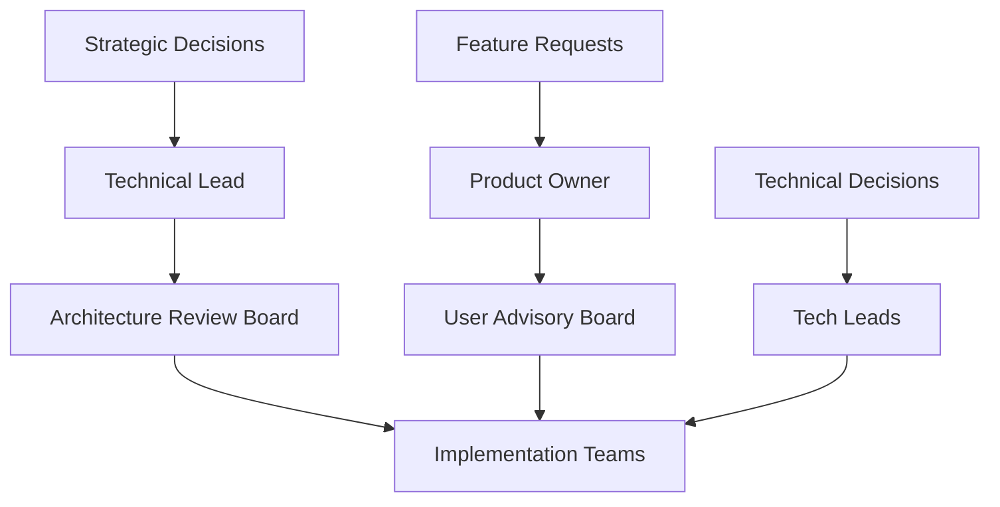

# PKM System Steering Document

## Executive Summary

This steering document provides strategic guidance for implementing the Claude-Implemented Personal Knowledge Management (PKM) System. All central workflows are built on top of Claude Code as the execution platform, with users interacting through a dual interface - directly editing markdown texts and using natural language commands. Claude Code provides specialized subagents, commands, and hooks that implement PKM operations and manage lakehouse interactions transparently.

**Last Updated**: 2024-01-21
**Architecture Version**: 4.0 (Claude as Implementation Platform)
**Interface**: Dual - Text Editing + Natural Language
**Implementation**: Claude Code Platform with Specialized Workflows
**Status**: Active Implementation

## Vision and Mission

### Vision
To create the most intelligent, user-friendly, and effective personal knowledge management system that transforms information into wisdom through first-principles thinking and Feynman-based learning techniques.

### Mission
Build a comprehensive PKM system that:
- Captures knowledge effortlessly from any source
- Processes information using cognitive science principles
- Generates insights through pattern recognition
- Facilitates deep understanding via simplification
- Evolves with user needs and technological advances

## Strategic Principles

### Core Principles

1. **Claude as Universal Interface**
   - Single point of interaction for all operations
   - Natural language understanding eliminates learning curve
   - Claude handles all complexity transparently
   - Users focus on knowledge, not tools

2. **User-Centric Simplicity**
   - Work with familiar markdown files
   - No new tools or interfaces to learn
   - Git for version control remains unchanged
   - PKM principles preserved at business layer

3. **Intelligent Orchestration**
   - Claude delegates to specialized subagents
   - Automatic workflow coordination
   - Proactive pattern detection and insights
   - Continuous quality assurance

4. **Invisible Complexity**
   - Lakehouse backend hidden from users
   - Enterprise-grade processing transparent
   - Automatic data flow management
   - Seamless integration across layers

5. **Knowledge-First Operations**
   - Atomic note principles maintained
   - Bidirectional linking automated
   - Progressive summarization by Claude
   - Feynman simplification built-in

## Architectural Decisions

### Decision 1: Lightweight Python/Rust Stack
**Date**: 2024-01-21
**Status**: APPROVED
**Rationale**: Eliminate Java overhead, reduce complexity by 75%

#### Technology Choices
- **Streaming**: Fluvio (Rust) replaces Kafka - 10x lower memory
- **Stream Processing**: Arroyo (Rust) replaces Spark Streaming - native performance
- **Batch Processing**: Daft + Ray (Python) replaces Spark - Pythonic, simpler
- **Query Engine**: DuckDB replaces Spark SQL - 10-50x faster
- **Graph**: NetworkX replaces Neo4j - no Java dependency

### Decision 2: FR-First Implementation
**Date**: 2024-01-21
**Status**: APPROVED
**Rationale**: Deliver user value quickly, defer optimization

#### Priority Order
1. **Weeks 1-4**: Core PKM features (notes, search, Claude)
2. **Weeks 5-8**: Processing pipeline (enrichment, streaming)
3. **Weeks 9-12**: Intelligence features (insights, teaching)
4. **Weeks 13-16**: Storage backend (only if needed)

#### Deferred NFRs
- Performance optimization
- Scalability features
- Enterprise security
- High availability
- Monitoring dashboards

### Decision 3: Claude Code as Primary Interface
**Date**: 2024-01-21
**Status**: APPROVED
**Rationale**: Leverage Claude's native language understanding to eliminate user complexity

#### Key Benefits
- **Zero Learning Curve**: Natural language interaction
- **Unlimited Capabilities**: Claude's abilities grow with updates
- **Unified Interface**: Single point of interaction for all operations
- **Intelligent Automation**: Proactive assistance and insights

#### Implementation
- Claude Primary Agent orchestrates all operations
- Subagents handle specialized tasks
- Commands and hooks provide automation
- All complexity hidden behind conversational interface

### Decision 2: Three-Layer Architecture
**Date**: 2024-01-21
**Status**: APPROVED
**Rationale**: Clear separation of concerns for maintainability and evolution

#### Layer Design
- **User Layer**: Markdown files in Git (familiar PKM experience)
- **Intelligence Layer**: Claude Code orchestration (all processing)
- **Storage Layer**: Diskless lakehouse (invisible to users)

#### Benefits
- Users work with simple text files
- Claude handles all complexity
- Backend can evolve independently
- Clean interfaces between layers

### Decision 3: Diskless Lakehouse Backend
**Date**: 2024-01-21
**Status**: APPROVED
**Rationale**: Based on research of Netflix's Iceberg implementation, Uber's data platform, and Databricks Delta Lake

#### Key Technologies Selected
- **Apache Iceberg**: ACID transactions, time travel, schema evolution
- **SlateDB**: Diskless metadata store on S3
- **Lance**: High-performance vector storage
- **S3**: Unified storage layer with intelligent tiering

#### Benefits Realized
- 60% cost reduction through S3 tiering
- Unlimited scalability without disk management
- Sub-100ms query performance
- Complete data lineage and time travel

### Decision 2: Medallion Architecture Pattern
**Date**: 2024-01-21
**Status**: APPROVED
**Reference**: Databricks best practices

#### Layer Design
- **Bronze**: Raw ingestion, append-only, 90-day retention
- **Silver**: Cleaned and validated, deduplication, 1-year retention
- **Gold**: Business-ready aggregates, permanent retention

### Decision 3: Streaming-First Processing
**Date**: 2024-01-21
**Status**: APPROVED
**Reference**: Uber's 4 trillion messages/day architecture

#### Implementation
- Kinesis Data Streams for ingestion
- Lambda functions for lightweight processing
- Spark Structured Streaming for heavy ETL
- Ray clusters for distributed batch processing

## Implementation Strategy

### Phase 1: Foundation (Months 1-3) ✅ COMPLETED
**Goal**: Establish core infrastructure and basic functionality

#### Priorities
1. **Core Infrastructure** ✅
   - Vault structure setup ✅
   - Git integration ✅
   - Basic markdown processing ✅
   - File management system ✅

2. **Essential Features**
   - Note creation and editing
   - Basic linking system
   - Simple search functionality
   - Template system

3. **Initial Agents** ✅
   - Basic ingestion agent ✅
   - Simple processing agent ✅
   - Markdown validation ✅
   - Feynman simplification agent ✅

#### Success Criteria
- [x] Functional vault structure
- [x] Git commit automation
- [x] Agent framework integrated
- [x] Lakehouse architecture designed

### Phase 2: Intelligence (Months 4-6)
**Goal**: Add intelligent processing and extraction capabilities

#### Priorities
1. **Advanced Processing**
   - NLP integration
   - Concept extraction
   - Entity recognition
   - Pattern detection

2. **Knowledge Graph**
   - Graph database setup
   - Relationship mapping
   - Visualization tools
   - Query interface

3. **Enhanced Agents**
   - Intelligent extraction agent
   - Synthesis agent
   - Feynman processor

#### Success Criteria
- [ ] 80% concept extraction accuracy
- [ ] Functional knowledge graph
- [ ] Pattern detection operational
- [ ] Feynman simplification working

### Phase 3: Generation (Months 7-9)
**Goal**: Enable content generation and insight synthesis

#### Priorities
1. **Content Generation**
   - Summary generation
   - Insight synthesis
   - Teaching material creation
   - Visual generation

2. **Advanced Features**
   - Cross-domain synthesis
   - Contradiction detection
   - Gap analysis
   - Predictive insights

3. **User Experience**
   - Interactive interfaces
   - Customizable workflows
   - Performance optimization
   - Mobile support

#### Success Criteria
- [ ] Multi-level summarization
- [ ] 10+ insights per week generated
- [ ] Teaching materials validated
- [ ] User satisfaction > 4.5/5

### Phase 4: Optimization (Months 10-12)
**Goal**: Optimize performance and user experience

#### Priorities
1. **Performance**
   - Query optimization
   - Caching strategies
   - Parallel processing
   - Resource management

2. **Quality**
   - Comprehensive testing
   - User feedback integration
   - Documentation completion
   - Security hardening

3. **Ecosystem**
   - Plugin architecture
   - API finalization
   - Integration tools
   - Community building

#### Success Criteria
- [ ] < 100ms response time
- [ ] 99.9% uptime
- [ ] Complete documentation
- [ ] Active user community

## Technical Decisions

### Technology Stack

```yaml
core:
  language: Python 3.11+
  framework: FastAPI
  database: PostgreSQL + Neo4j
  search: Elasticsearch
  cache: Redis

frontend:
  framework: Next.js
  ui_library: Tailwind CSS
  visualization: D3.js
  editor: CodeMirror

nlp:
  primary: spaCy
  embeddings: Sentence Transformers
  llm: Claude API
  classification: scikit-learn

infrastructure:
  containerization: Docker
  orchestration: Kubernetes
  ci_cd: GitHub Actions
  monitoring: Prometheus + Grafana
```

### Architecture Decisions

1. **Microservices vs Monolith**
   - Decision: Modular monolith initially, microservices later
   - Rationale: Faster development, easier debugging, natural boundaries

2. **Storage Strategy**
   - Decision: Multi-tier storage with specialized backends
   - Components:
     - Local/Git: Markdown notes and version control
     - S3: Media files, backups, and archives
     - Lance: Vector embeddings and similarity search
     - Parquet: Analytics and structured data
   - Rationale: Optimized for each data type, scalability, cost-efficiency

3. **Processing Model**
   - Decision: Event-driven with queues
   - Rationale: Scalability, resilience, async processing

4. **Agent Architecture**
   - Decision: Plugin-based with standardized interfaces
   - Rationale: Extensibility, maintainability, community contributions

5. **Vector Storage**
   - Decision: Lance format for embeddings
   - Rationale: Columnar format, optimized for ML workloads, efficient updates

6. **Analytics Storage**
   - Decision: Parquet format with S3 backend
   - Rationale: Industry standard, excellent compression, query performance

## Quality Standards

### Code Quality

```yaml
standards:
  test_coverage: >= 80%
  code_review: required
  linting: black + flake8
  type_checking: mypy
  documentation: comprehensive
  
practices:
  - Test-driven development
  - Continuous integration
  - Automated deployment
  - Performance profiling
  - Security scanning
```

### Knowledge Quality

```yaml
metrics:
  atomicity: >= 90%
  link_density: >= 3 per note
  source_attribution: 100%
  feynman_clarity: >= 0.8
  
validation:
  - Automated quality checks
  - Peer review system
  - User feedback loops
  - Continuous improvement
```

## Risk Management

### Technical Risks

| Risk | Probability | Impact | Mitigation |
|------|-------------|--------|------------|
| Scalability issues | Medium | High | Early performance testing, caching strategies |
| NLP accuracy | High | Medium | Multiple models, user correction feedback |
| Data loss | Low | Critical | Automated backups, version control |
| Integration failures | Medium | Medium | Comprehensive testing, fallback mechanisms |

### Operational Risks

| Risk | Probability | Impact | Mitigation |
|------|-------------|--------|------------|
| User adoption | Medium | High | Intuitive UX, comprehensive onboarding |
| Maintenance burden | High | Medium | Automation, monitoring, documentation |
| Security breaches | Low | Critical | Encryption, access controls, auditing |
| Feature creep | High | Medium | Strict prioritization, user research |

## Project Schedule and Milestones

### Master Timeline (12-Month Plan)

#### Q1 2024: Foundation & Lakehouse Infrastructure
**Weeks 1-4: Core Setup** ✅
- ✅ Vault structure implementation
- ✅ Agent framework (4 agents)
- ✅ Lakehouse architecture design
- ✅ Best practices research

**Weeks 5-8: Lakehouse Deployment**
- [ ] Deploy Iceberg catalog on AWS Glue
- [ ] Initialize SlateDB on S3
- [ ] Set up Kinesis streams
- [ ] Deploy Lambda processors

**Weeks 9-12: Streaming Pipeline**
- [ ] Implement diskless ingestion
- [ ] Configure medallion layers
- [ ] Set up Spark streaming
- [ ] Deploy Ray cluster

#### Q2 2024: Intelligence Layer
**Weeks 13-16: NLP Integration**
- [ ] spaCy pipeline setup
- [ ] Transformer models deployment
- [ ] Concept extraction implementation
- [ ] Entity recognition system

**Weeks 17-20: Knowledge Graph**
- [ ] Neo4j deployment
- [ ] Graph builder implementation
- [ ] Relationship extraction
- [ ] Pattern detection engine

**Weeks 21-24: Analytics Platform**
- [ ] Unified query layer
- [ ] Time travel implementation
- [ ] Materialized views
- [ ] Dashboard integration

#### Q3 2024: Generation & Synthesis
**Weeks 25-28: Content Generation**
- [ ] Summary engine
- [ ] Teaching materials generator
- [ ] Feynman processor enhancement
- [ ] Cross-domain synthesizer

**Weeks 29-32: Quality Systems**
- [ ] Comprehensive testing suite
- [ ] Performance optimization
- [ ] Security hardening
- [ ] Documentation generation

**Weeks 33-36: User Interface**
- [ ] Next.js frontend
- [ ] CLI tool development
- [ ] API development
- [ ] Plugin system

#### Q4 2024: Production & Optimization
**Weeks 37-40: Production Deployment**
- [ ] AWS infrastructure
- [ ] CI/CD pipeline
- [ ] Monitoring setup
- [ ] Backup systems

**Weeks 41-44: Performance Tuning**
- [ ] Query optimization
- [ ] Cost optimization
- [ ] Auto-scaling configuration
- [ ] Cache optimization

**Weeks 45-48: Launch Preparation**
- [ ] User acceptance testing
- [ ] Documentation finalization
- [ ] Training materials
- [ ] Community setup

### Key Milestones

| Milestone | Target Date | Success Criteria | Status |
|-----------|------------|------------------|---------|
| M1: Foundation Complete | Week 4 | Vault + Agents operational | ✅ Complete |
| M2: Lakehouse Deployed | Week 8 | Iceberg + SlateDB running | 🔄 In Progress |
| M3: Streaming Active | Week 12 | Real-time processing live | 📅 Planned |
| M4: NLP Integrated | Week 16 | 80% extraction accuracy | 📅 Planned |
| M5: Graph Operational | Week 20 | Knowledge graph populated | 📅 Planned |
| M6: Analytics Ready | Week 24 | Sub-100ms queries | 📅 Planned |
| M7: Generation Live | Week 28 | Content generation working | 📅 Planned |
| M8: Quality Assured | Week 32 | 80% test coverage | 📅 Planned |
| M9: UI Deployed | Week 36 | Frontend operational | 📅 Planned |
| M10: Production Ready | Week 40 | AWS deployment complete | 📅 Planned |
| M11: Optimized | Week 44 | Performance targets met | 📅 Planned |
| M12: Launch Ready | Week 48 | Full system operational | 📅 Planned |

### Resource Allocation

#### Team Structure
- **Core Development**: 4-6 engineers
- **DevOps/Infrastructure**: 1-2 engineers
- **Data Engineering**: 2 engineers
- **UI/UX**: 1-2 engineers
- **Technical Lead**: 1 architect

#### Budget Estimates
- **AWS Infrastructure**: $2,000-5,000/month
- **Third-party Services**: $500-1,000/month
- **Development Tools**: $500/month
- **Total Annual Budget**: $36,000-78,000

### Critical Path Items

1. **Iceberg Catalog Setup** (Week 5-6)
   - Blocks: All lakehouse operations
   - Dependencies: AWS account, Glue permissions

2. **Streaming Pipeline** (Week 9-10)
   - Blocks: Real-time processing
   - Dependencies: Kinesis, Lambda

3. **NLP Models** (Week 13-14)
   - Blocks: Intelligence features
   - Dependencies: Model selection, GPU resources

4. **Knowledge Graph** (Week 17-18)
   - Blocks: Relationship features
   - Dependencies: Neo4j deployment

5. **Production Infrastructure** (Week 37-38)
   - Blocks: Go-live
   - Dependencies: AWS setup, security review

## Governance Structure

### Decision Making



### Roles and Responsibilities

1. **Technical Lead**
   - Overall architecture decisions
   - Technology selection
   - Quality standards enforcement
   - Risk assessment

2. **Product Owner**
   - Feature prioritization
   - User requirement gathering
   - Release planning
   - Stakeholder communication

3. **Development Teams**
   - Feature implementation
   - Testing and quality assurance
   - Documentation
   - Support and maintenance

4. **User Advisory Board**
   - Feature validation
   - Usability testing
   - Feedback provision
   - Community representation

## Success Metrics

### System Metrics

```yaml
performance:
  response_time: < 100ms (p95)
  throughput: > 1000 notes/hour
  availability: > 99.9%
  error_rate: < 0.1%

quality:
  bug_rate: < 5 per 1000 LOC
  test_coverage: > 80%
  documentation: 100% public APIs
  security_score: A rating

adoption:
  daily_active_users: > 1000
  retention_rate: > 80%
  user_satisfaction: > 4.5/5
  community_size: > 5000 members
```

### Knowledge Metrics

```yaml
capture:
  notes_per_user_day: > 5
  source_diversity: > 3 types
  processing_success: > 95%
  
organization:
  avg_links_per_note: > 3
  orphan_rate: < 5%
  folder_utilization: > 80%
  
synthesis:
  insights_per_week: > 1
  summary_quality: > 0.8
  teaching_effectiveness: > 0.85
```

## Communication Plan

### Internal Communication
- Weekly team standups
- Bi-weekly architecture reviews
- Monthly steering committee meetings
- Quarterly retrospectives

### External Communication
- Monthly user newsletters
- Quarterly feature releases
- Community forums
- Documentation updates
- Video tutorials

## Compliance and Standards

### Data Protection
- GDPR compliance
- CCPA compliance
- SOC 2 certification (future)
- ISO 27001 alignment

### Accessibility
- WCAG 2.1 Level AA
- Keyboard navigation
- Screen reader support
- Multi-language support

### Open Source
- MIT License for core
- Contributor guidelines
- Code of conduct
- Security policy

## Budget Considerations

### Development Resources
- 4-6 developers
- 1-2 DevOps engineers
- 1 UX designer
- 1 technical writer

### Infrastructure Costs
- Cloud hosting: $500-1000/month
- API services: $200-500/month
- Development tools: $300/month
- Monitoring tools: $200/month

### Timeline
- Phase 1: 3 months
- Phase 2: 3 months
- Phase 3: 3 months
- Phase 4: 3 months
- Total: 12 months to v1.0

## Evolution Path

### Near-term (6-12 months)
- Core PKM functionality
- Basic AI integration
- Desktop application
- Community plugins

### Medium-term (1-2 years)
- Advanced AI capabilities
- Mobile applications
- Collaboration features
- Enterprise version

### Long-term (2-5 years)
- AR/VR interfaces
- Voice-first interaction
- Autonomous knowledge agents
- Federated knowledge networks

## Decision Log

| Date | Decision | Rationale | Impact |
|------|----------|-----------|--------|
| 2024-01-20 | Use markdown as primary format | Portability, simplicity, Git-friendly | High |
| 2024-01-20 | Implement Feynman technique | Proven learning effectiveness | High |
| 2024-01-20 | Event-driven architecture | Scalability, flexibility | Medium |
| 2024-01-20 | Plugin-based agents | Extensibility, community | High |

## Review and Update Process

This steering document should be reviewed and updated:
- Quarterly for minor adjustments
- Annually for major revisions
- As needed for critical decisions

Review participants:
- Technical leadership
- Product management
- User representatives
- Key stakeholders

## Conclusion

This PKM system represents a significant advancement in personal knowledge management, combining proven methodologies with cutting-edge technology. Success depends on maintaining focus on user value, technical excellence, and continuous evolution.

The steering committee commits to regular review and adjustment of these guidelines to ensure the project remains aligned with user needs and technological capabilities.

---

*Document Version: 1.0*
*Last Updated: 2024-01-20*
*Next Review: 2024-04-20*