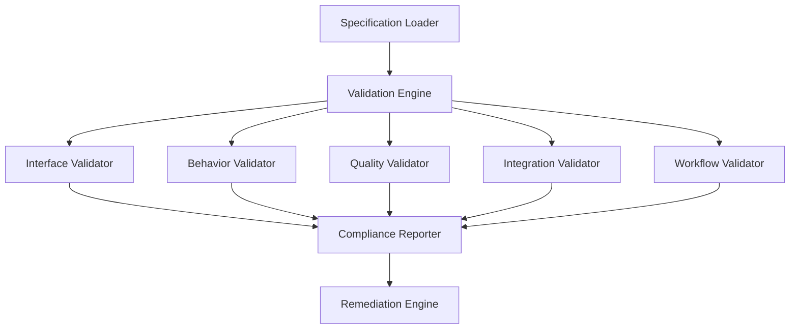

# Specification Validation Framework

## Overview

The Specification Validation Framework provides automated tools and processes for validating implementation compliance with formal specifications. This framework ensures continuous adherence to specification-driven development principles and maintains system quality through systematic validation.

## Framework Architecture

### Validation Components



### Core Validation Principles

1. **Automated Validation**: Comprehensive automated checking against specifications
2. **Continuous Monitoring**: Real-time compliance monitoring during development and runtime
3. **Detailed Reporting**: Clear, actionable compliance reports with remediation guidance
4. **Integration Ready**: Seamless integration with development workflows and CI/CD pipelines

## Implementation Framework

### Base Validation Infrastructure

```python
# File: .claude/validation/base_validator.py
"""
Base validation framework for specification compliance checking.
"""

import abc
import json
import yaml
from typing import Dict, List, Any, Optional, Union
from dataclasses import dataclass
from enum import Enum
import jsonschema
from pathlib import Path

class ValidationSeverity(Enum):
    """Validation result severity levels"""
    INFO = "info"
    WARNING = "warning"
    ERROR = "error"
    CRITICAL = "critical"

@dataclass
class ValidationResult:
    """Individual validation result"""
    validator_name: str
    specification_section: str
    severity: ValidationSeverity
    message: str
    details: Optional[Dict[str, Any]] = None
    remediation_suggestion: Optional[str] = None

@dataclass
class ComplianceReport:
    """Comprehensive compliance validation report"""
    overall_score: float
    validation_timestamp: str
    specification_versions: Dict[str, str]
    validation_results: List[ValidationResult]
    summary: Dict[str, Any]
    recommendations: List[str]

class BaseValidator(abc.ABC):
    """Abstract base class for all specification validators"""
    
    def __init__(self, specification_path: str, specification_version: str = "2.0.0"):
        self.spec_path = specification_path
        self.spec_version = specification_version
        self.specification = self._load_specification()
        self.validation_results: List[ValidationResult] = []
    
    @abc.abstractmethod
    def _load_specification(self) -> Dict[str, Any]:
        """Load the specification document"""
        pass
    
    @abc.abstractmethod
    def validate(self, implementation: Any) -> List[ValidationResult]:
        """Validate implementation against specification"""
        pass
    
    def _add_result(self, section: str, severity: ValidationSeverity, 
                   message: str, details: Optional[Dict[str, Any]] = None,
                   remediation: Optional[str] = None):
        """Add validation result"""
        result = ValidationResult(
            validator_name=self.__class__.__name__,
            specification_section=section,
            severity=severity,
            message=message,
            details=details,
            remediation_suggestion=remediation
        )
        self.validation_results.append(result)
    
    def _validate_schema(self, instance: Any, schema: Dict[str, Any], 
                        section_name: str) -> bool:
        """Validate instance against JSON schema"""
        try:
            jsonschema.validate(instance=instance, schema=schema)
            self._add_result(section_name, ValidationSeverity.INFO, 
                           f"Schema validation passed for {section_name}")
            return True
        except jsonschema.ValidationError as e:
            self._add_result(section_name, ValidationSeverity.ERROR,
                           f"Schema validation failed: {e.message}",
                           details={"validation_error": str(e)},
                           remediation=f"Fix schema compliance issues in {section_name}")
            return False
```

### Interface Specification Validator

```python
# File: .claude/validation/interface_validator.py
"""
Validator for Agent Interface Specification compliance.
"""

import json
from typing import Dict, List, Any
from .base_validator import BaseValidator, ValidationResult, ValidationSeverity

class InterfaceValidator(BaseValidator):
    """Validates agent implementations against interface specification"""
    
    def _load_specification(self) -> Dict[str, Any]:
        """Load interface specification"""
        spec_file = f"{self.spec_path}/interfaces/agent-interface-specification.json"
        with open(spec_file, 'r') as f:
            return json.load(f)
    
    def validate(self, agent_implementation: Any) -> List[ValidationResult]:
        """Validate agent interface compliance"""
        self.validation_results.clear()
        
        # Validate agent metadata
        self._validate_agent_metadata(agent_implementation)
        
        # Validate command interfaces
        self._validate_command_interfaces(agent_implementation)
        
        # Validate message protocols
        self._validate_message_protocols(agent_implementation)
        
        # Validate quality requirements
        self._validate_quality_requirements(agent_implementation)
        
        return self.validation_results
    
    def _validate_agent_metadata(self, agent: Any):
        """Validate agent metadata against specification"""
        if not hasattr(agent, 'metadata'):
            self._add_result("agent_metadata", ValidationSeverity.CRITICAL,
                           "Agent missing required metadata attribute",
                           remediation="Add metadata property to agent implementation")
            return
        
        metadata_schema = self.specification["definitions"]["agent_metadata"]
        self._validate_schema(agent.metadata, metadata_schema, "agent_metadata")
        
        # Validate specific metadata requirements
        self._validate_agent_id(agent.metadata.get('agent_id'))
        self._validate_capabilities(agent.metadata.get('capabilities', []))
        self._validate_supported_commands(agent.metadata.get('supported_commands', []))
    
    def _validate_agent_id(self, agent_id: str):
        """Validate agent ID format"""
        if not agent_id:
            self._add_result("agent_id", ValidationSeverity.ERROR,
                           "Agent ID is required")
            return
        
        # Check ID format compliance
        import re
        if not re.match(r'^[a-z][a-z0-9-]*[a-z0-9]$', agent_id):
            self._add_result("agent_id", ValidationSeverity.ERROR,
                           f"Agent ID '{agent_id}' does not match required pattern",
                           remediation="Use lowercase letters, numbers, and hyphens only")
    
    def _validate_capabilities(self, capabilities: List[str]):
        """Validate agent capabilities"""
        valid_capabilities = self.specification["definitions"]["agent_metadata"]["properties"]["capabilities"]["items"]["enum"]
        
        invalid_capabilities = set(capabilities) - set(valid_capabilities)
        if invalid_capabilities:
            self._add_result("capabilities", ValidationSeverity.ERROR,
                           f"Invalid capabilities declared: {invalid_capabilities}",
                           details={"valid_capabilities": valid_capabilities},
                           remediation="Use only predefined capability values")
    
    def _validate_command_interfaces(self, agent: Any):
        """Validate command interface implementation"""
        if not hasattr(agent, 'supported_commands'):
            self._add_result("command_interfaces", ValidationSeverity.CRITICAL,
                           "Agent missing supported_commands attribute")
            return
        
        for command in agent.supported_commands:
            self._validate_command_format(command)
            self._validate_command_implementation(agent, command)
    
    def _validate_command_format(self, command: str):
        """Validate command format"""
        import re
        if not re.match(r'^/[a-z][a-z0-9-]*$', command):
            self._add_result("command_format", ValidationSeverity.ERROR,
                           f"Command '{command}' does not match required format",
                           remediation="Commands must start with '/' and use lowercase letters")
    
    def _validate_command_implementation(self, agent: Any, command: str):
        """Validate command implementation exists"""
        # Check if agent has method to handle command
        method_name = f"handle_{command[1:].replace('-', '_')}"
        if not hasattr(agent, method_name):
            self._add_result("command_implementation", ValidationSeverity.WARNING,
                           f"No implementation found for command '{command}'",
                           remediation=f"Implement method '{method_name}' to handle command")
    
    def _validate_message_protocols(self, agent: Any):
        """Validate message protocol compliance"""
        if not hasattr(agent, 'message_handler'):
            self._add_result("message_protocols", ValidationSeverity.WARNING,
                           "Agent lacks message handling capability")
            return
        
        # Validate message format support
        required_message_types = ["command_request", "command_response", "progress_update"]
        for msg_type in required_message_types:
            if not agent.message_handler.supports_message_type(msg_type):
                self._add_result("message_protocols", ValidationSeverity.ERROR,
                               f"Message type '{msg_type}' not supported",
                               remediation=f"Add support for {msg_type} messages")
    
    def _validate_quality_requirements(self, agent: Any):
        """Validate quality requirements compliance"""
        if not hasattr(agent, 'quality_metrics'):
            self._add_result("quality_requirements", ValidationSeverity.WARNING,
                           "Agent lacks quality metrics implementation")
            return
        
        required_metrics = ["accuracy_rate", "source_diversity_score", 
                          "bias_mitigation_effectiveness", "reproducibility_score"]
        
        for metric in required_metrics:
            if not agent.quality_metrics.supports_metric(metric):
                self._add_result("quality_requirements", ValidationSeverity.ERROR,
                               f"Quality metric '{metric}' not implemented",
                               remediation=f"Implement {metric} quality metric")
```

### Behavior Specification Validator

```python
# File: .claude/validation/behavior_validator.py
"""
Validator for Agent Behavior Specification compliance.
"""

import yaml
from typing import Dict, List, Any
from .base_validator import BaseValidator, ValidationResult, ValidationSeverity

class BehaviorValidator(BaseValidator):
    """Validates agent behavior against behavior specification"""
    
    def _load_specification(self) -> Dict[str, Any]:
        """Load behavior specification"""
        spec_file = f"{self.spec_path}/behaviors/research-behavior-specification.yaml"
        with open(spec_file, 'r') as f:
            return yaml.safe_load(f)
    
    def validate(self, agent_implementation: Any) -> List[ValidationResult]:
        """Validate behavior pattern compliance"""
        self.validation_results.clear()
        
        # Validate workflow patterns
        self._validate_workflow_patterns(agent_implementation)
        
        # Validate adaptive behaviors
        self._validate_adaptive_behaviors(agent_implementation)
        
        # Validate error handling
        self._validate_error_handling(agent_implementation)
        
        # Validate performance monitoring
        self._validate_performance_monitoring(agent_implementation)
        
        return self.validation_results
    
    def _validate_workflow_patterns(self, agent: Any):
        """Validate workflow pattern implementation"""
        required_patterns = self.specification["behavior_patterns"].keys()
        
        if not hasattr(agent, 'behavior_engine'):
            self._add_result("workflow_patterns", ValidationSeverity.CRITICAL,
                           "Agent missing behavior engine implementation")
            return
        
        implemented_patterns = agent.behavior_engine.get_implemented_patterns()
        missing_patterns = set(required_patterns) - set(implemented_patterns)
        
        if missing_patterns:
            self._add_result("workflow_patterns", ValidationSeverity.ERROR,
                           f"Missing behavior patterns: {missing_patterns}",
                           remediation="Implement all required behavior patterns")
        
        # Validate specific pattern implementations
        for pattern in implemented_patterns:
            self._validate_pattern_implementation(agent, pattern)
    
    def _validate_pattern_implementation(self, agent: Any, pattern: str):
        """Validate specific pattern implementation"""
        pattern_spec = self.specification["behavior_patterns"].get(pattern)
        if not pattern_spec:
            return
        
        # Validate stages implementation
        if "stages" in pattern_spec:
            self._validate_stages_implementation(agent, pattern, pattern_spec["stages"])
        
        # Validate quality gates
        if "quality_gate_criteria" in pattern_spec:
            self._validate_quality_gates(agent, pattern, pattern_spec["quality_gate_criteria"])
    
    def _validate_stages_implementation(self, agent: Any, pattern: str, stages: Dict[str, Any]):
        """Validate workflow stages implementation"""
        for stage_id, stage_spec in stages.items():
            stage_name = stage_spec.get("sequence_id", stage_id)
            
            if not agent.behavior_engine.has_stage_implementation(pattern, stage_name):
                self._add_result("stage_implementation", ValidationSeverity.ERROR,
                               f"Missing implementation for stage '{stage_name}' in pattern '{pattern}'")
            
            # Validate stage behaviors
            if "behaviors" in stage_spec:
                self._validate_stage_behaviors(agent, pattern, stage_name, stage_spec["behaviors"])
    
    def _validate_stage_behaviors(self, agent: Any, pattern: str, stage: str, behaviors: Dict[str, Any]):
        """Validate stage behavior implementations"""
        for behavior_name, behavior_spec in behaviors.items():
            if not agent.behavior_engine.has_behavior_implementation(pattern, stage, behavior_name):
                self._add_result("behavior_implementation", ValidationSeverity.WARNING,
                               f"Missing behavior '{behavior_name}' in stage '{stage}'")
    
    def _validate_adaptive_behaviors(self, agent: Any):
        """Validate adaptive behavior implementation"""
        adaptive_spec = self.specification.get("adaptive_behaviors", {})
        
        if not hasattr(agent, 'adaptive_engine'):
            if adaptive_spec:
                self._add_result("adaptive_behaviors", ValidationSeverity.WARNING,
                               "Agent lacks adaptive behavior capability")
            return
        
        # Validate adaptation mechanisms
        for mechanism_name, mechanism_spec in adaptive_spec.items():
            if not agent.adaptive_engine.supports_mechanism(mechanism_name):
                self._add_result("adaptive_behaviors", ValidationSeverity.WARNING,
                               f"Adaptive mechanism '{mechanism_name}' not implemented")
    
    def _validate_error_handling(self, agent: Any):
        """Validate error handling implementation"""
        error_spec = self.specification.get("error_handling", {})
        
        if not hasattr(agent, 'error_handler'):
            self._add_result("error_handling", ValidationSeverity.ERROR,
                           "Agent missing error handling implementation")
            return
        
        # Validate error types handling
        for error_category, error_types in error_spec.items():
            for error_type, error_config in error_types.items():
                if not agent.error_handler.can_handle_error(error_type):
                    self._add_result("error_handling", ValidationSeverity.WARNING,
                                   f"Error type '{error_type}' not handled")
    
    def _validate_performance_monitoring(self, agent: Any):
        """Validate performance monitoring implementation"""
        monitoring_spec = self.specification.get("performance_monitoring", {})
        
        if not hasattr(agent, 'performance_monitor'):
            if monitoring_spec:
                self._add_result("performance_monitoring", ValidationSeverity.WARNING,
                               "Agent lacks performance monitoring capability")
            return
        
        # Validate metrics collection
        required_metrics = monitoring_spec.get("real_time_metrics", {}).get("metrics", [])
        for metric in required_metrics:
            if not agent.performance_monitor.tracks_metric(metric):
                self._add_result("performance_monitoring", ValidationSeverity.INFO,
                               f"Performance metric '{metric}' not tracked")
```

### Quality Specification Validator

```python
# File: .claude/validation/quality_validator.py
"""
Validator for Quality Assurance Specification compliance.
"""

import yaml
from typing import Dict, List, Any
from .base_validator import BaseValidator, ValidationResult, ValidationSeverity

class QualityValidator(BaseValidator):
    """Validates quality implementation against quality specification"""
    
    def _load_specification(self) -> Dict[str, Any]:
        """Load quality specification"""
        spec_file = f"{self.spec_path}/quality/quality-assurance-specification.yaml"
        with open(spec_file, 'r') as f:
            return yaml.safe_load(f)
    
    def validate(self, implementation: Any) -> List[ValidationResult]:
        """Validate quality assurance compliance"""
        self.validation_results.clear()
        
        # Validate quality metrics implementation
        self._validate_quality_metrics(implementation)
        
        # Validate quality gates
        self._validate_quality_gates(implementation)
        
        # Validate validation rules
        self._validate_validation_rules(implementation)
        
        # Validate QA workflows
        self._validate_qa_workflows(implementation)
        
        return self.validation_results
    
    def _validate_quality_metrics(self, implementation: Any):
        """Validate quality metrics implementation"""
        quality_metrics_spec = self.specification.get("quality_metrics", {})
        
        if not hasattr(implementation, 'quality_system'):
            self._add_result("quality_metrics", ValidationSeverity.CRITICAL,
                           "Implementation missing quality system")
            return
        
        # Validate metric categories
        for category, metrics in quality_metrics_spec.items():
            if not implementation.quality_system.has_metric_category(category):
                self._add_result("quality_metrics", ValidationSeverity.ERROR,
                               f"Quality metric category '{category}' not implemented")
                continue
            
            # Validate individual metrics
            self._validate_metric_category(implementation, category, metrics)
    
    def _validate_metric_category(self, implementation: Any, category: str, metrics: Dict[str, Any]):
        """Validate specific metric category"""
        for metric_name, metric_spec in metrics.items():
            if not implementation.quality_system.has_metric(category, metric_name):
                self._add_result("quality_metrics", ValidationSeverity.WARNING,
                               f"Quality metric '{metric_name}' in category '{category}' not implemented")
                continue
            
            # Validate metric thresholds
            self._validate_metric_thresholds(implementation, category, metric_name, metric_spec)
    
    def _validate_metric_thresholds(self, implementation: Any, category: str, 
                                  metric: str, spec: Dict[str, Any]):
        """Validate metric threshold implementation"""
        if "target_threshold" in spec:
            target = spec["target_threshold"]
            if not implementation.quality_system.has_threshold(category, metric, "target"):
                self._add_result("quality_thresholds", ValidationSeverity.WARNING,
                               f"Target threshold missing for {category}.{metric}")
        
        if "minimum_threshold" in spec:
            minimum = spec["minimum_threshold"]
            if not implementation.quality_system.has_threshold(category, metric, "minimum"):
                self._add_result("quality_thresholds", ValidationSeverity.ERROR,
                               f"Minimum threshold missing for {category}.{metric}")
    
    def _validate_quality_gates(self, implementation: Any):
        """Validate quality gates implementation"""
        gates_spec = self.specification.get("quality_gates", {})
        
        if not hasattr(implementation, 'quality_gate_system'):
            self._add_result("quality_gates", ValidationSeverity.ERROR,
                           "Implementation missing quality gate system")
            return
        
        # Validate gate types
        for gate_type, gate_config in gates_spec.get("stage_specific_gates", {}).items():
            if not implementation.quality_gate_system.has_gate(gate_type):
                self._add_result("quality_gates", ValidationSeverity.ERROR,
                               f"Quality gate '{gate_type}' not implemented")
    
    def _validate_validation_rules(self, implementation: Any):
        """Validate validation rules implementation"""
        rules_spec = self.specification.get("validation_rules", {})
        
        if not hasattr(implementation, 'validation_engine'):
            self._add_result("validation_rules", ValidationSeverity.WARNING,
                           "Implementation missing validation engine")
            return
        
        # Validate rule categories
        for rule_category, rules in rules_spec.items():
            for rule_name, rule_spec in rules.items():
                if not implementation.validation_engine.has_rule(rule_category, rule_name):
                    self._add_result("validation_rules", ValidationSeverity.WARNING,
                                   f"Validation rule '{rule_name}' not implemented")
    
    def _validate_qa_workflows(self, implementation: Any):
        """Validate QA workflow implementation"""
        workflows_spec = self.specification.get("qa_workflows", {})
        
        if not hasattr(implementation, 'qa_workflow_engine'):
            self._add_result("qa_workflows", ValidationSeverity.INFO,
                           "Implementation missing QA workflow engine")
            return
        
        # Validate workflow types
        for workflow_name, workflow_spec in workflows_spec.items():
            if not implementation.qa_workflow_engine.has_workflow(workflow_name):
                self._add_result("qa_workflows", ValidationSeverity.INFO,
                               f"QA workflow '{workflow_name}' not implemented")
```

### Compliance Orchestration Engine

```python
# File: .claude/validation/compliance_engine.py
"""
Orchestration engine for comprehensive compliance validation.
"""

from typing import Dict, List, Any, Optional
from datetime import datetime
import concurrent.futures
from .base_validator import ComplianceReport, ValidationResult, ValidationSeverity
from .interface_validator import InterfaceValidator
from .behavior_validator import BehaviorValidator
from .quality_validator import QualityValidator

class ComplianceEngine:
    """Orchestrates comprehensive specification compliance validation"""
    
    def __init__(self, specifications_path: str = ".claude/specifications"):
        self.specs_path = specifications_path
        self.validators = {
            'interface': InterfaceValidator(specifications_path),
            'behavior': BehaviorValidator(specifications_path),
            'quality': QualityValidator(specifications_path),
        }
        self.compliance_history: List[ComplianceReport] = []
    
    def validate_full_compliance(self, implementation: Any) -> ComplianceReport:
        """Perform comprehensive compliance validation"""
        validation_start = datetime.now()
        
        all_results: List[ValidationResult] = []
        validation_scores: Dict[str, float] = {}
        
        # Run all validators concurrently
        with concurrent.futures.ThreadPoolExecutor(max_workers=4) as executor:
            future_to_validator = {
                executor.submit(validator.validate, implementation): name
                for name, validator in self.validators.items()
            }
            
            for future in concurrent.futures.as_completed(future_to_validator):
                validator_name = future_to_validator[future]
                try:
                    results = future.result()
                    all_results.extend(results)
                    validation_scores[validator_name] = self._calculate_validator_score(results)
                except Exception as e:
                    all_results.append(ValidationResult(
                        validator_name=validator_name,
                        specification_section="system",
                        severity=ValidationSeverity.CRITICAL,
                        message=f"Validator {validator_name} failed: {str(e)}"
                    ))
                    validation_scores[validator_name] = 0.0
        
        # Calculate overall compliance score
        overall_score = sum(validation_scores.values()) / len(validation_scores)
        
        # Generate recommendations
        recommendations = self._generate_recommendations(all_results)
        
        # Create compliance report
        report = ComplianceReport(
            overall_score=overall_score,
            validation_timestamp=validation_start.isoformat(),
            specification_versions=self._get_specification_versions(),
            validation_results=all_results,
            summary=self._generate_summary(all_results, validation_scores),
            recommendations=recommendations
        )
        
        self.compliance_history.append(report)
        return report
    
    def _calculate_validator_score(self, results: List[ValidationResult]) -> float:
        """Calculate score for individual validator results"""
        if not results:
            return 1.0
        
        severity_weights = {
            ValidationSeverity.INFO: 0.0,
            ValidationSeverity.WARNING: 0.1,
            ValidationSeverity.ERROR: 0.5,
            ValidationSeverity.CRITICAL: 1.0
        }
        
        total_penalty = sum(severity_weights[result.severity] for result in results)
        max_penalty = len(results) * severity_weights[ValidationSeverity.CRITICAL]
        
        if max_penalty == 0:
            return 1.0
        
        return max(0.0, 1.0 - (total_penalty / max_penalty))
    
    def _generate_recommendations(self, results: List[ValidationResult]) -> List[str]:
        """Generate actionable recommendations from validation results"""
        recommendations = []
        
        # Count issues by severity
        critical_count = sum(1 for r in results if r.severity == ValidationSeverity.CRITICAL)
        error_count = sum(1 for r in results if r.severity == ValidationSeverity.ERROR)
        warning_count = sum(1 for r in results if r.severity == ValidationSeverity.WARNING)
        
        if critical_count > 0:
            recommendations.append(f"🚨 Address {critical_count} critical issues immediately")
        
        if error_count > 0:
            recommendations.append(f"⚠️ Fix {error_count} errors before production deployment")
        
        if warning_count > 0:
            recommendations.append(f"⚡ Consider addressing {warning_count} warnings for optimal compliance")
        
        # Specific recommendations based on patterns
        missing_implementations = [r for r in results if "not implemented" in r.message.lower()]
        if missing_implementations:
            recommendations.append("📝 Implement missing functionality to achieve full specification compliance")
        
        return recommendations
    
    def _generate_summary(self, results: List[ValidationResult], scores: Dict[str, float]) -> Dict[str, Any]:
        """Generate validation summary"""
        return {
            "total_validations": len(results),
            "validation_scores": scores,
            "severity_breakdown": {
                "critical": sum(1 for r in results if r.severity == ValidationSeverity.CRITICAL),
                "error": sum(1 for r in results if r.severity == ValidationSeverity.ERROR),
                "warning": sum(1 for r in results if r.severity == ValidationSeverity.WARNING),
                "info": sum(1 for r in results if r.severity == ValidationSeverity.INFO)
            },
            "compliance_status": "COMPLIANT" if all(score >= 0.9 for score in scores.values()) else "NON_COMPLIANT"
        }
    
    def _get_specification_versions(self) -> Dict[str, str]:
        """Get versions of all specifications"""
        # This would read version information from specification files
        return {
            "interface": "2.0.0",
            "behavior": "2.0.0", 
            "quality": "2.0.0",
            "integration": "2.0.0",
            "workflow": "2.0.0"
        }
    
    def generate_compliance_dashboard(self) -> str:
        """Generate HTML compliance dashboard"""
        if not self.compliance_history:
            return "<html><body><h1>No compliance data available</h1></body></html>"
        
        latest_report = self.compliance_history[-1]
        
        dashboard_html = f"""
<!DOCTYPE html>
<html>
<head>
    <title>Specification Compliance Dashboard</title>
    <style>
        body {{ font-family: Arial, sans-serif; margin: 20px; }}
        .score {{ font-size: 2em; font-weight: bold; }}
        .compliant {{ color: green; }}
        .non-compliant {{ color: red; }}
        .warning {{ color: orange; }}
        .section {{ margin: 20px 0; padding: 15px; border: 1px solid #ddd; }}
        .critical {{ background-color: #ffebee; }}
        .error {{ background-color: #fff3e0; }}
        .warning {{ background-color: #f3e5f5; }}
    </style>
</head>
<body>
    <h1>Specification Compliance Dashboard</h1>
    
    <div class="section">
        <h2>Overall Compliance Score</h2>
        <div class="score {'compliant' if latest_report.overall_score >= 0.9 else 'non-compliant'}">
            {latest_report.overall_score:.1%}
        </div>
        <p>Last Updated: {latest_report.validation_timestamp}</p>
    </div>
    
    <div class="section">
        <h2>Component Scores</h2>
        <ul>
        {''.join([f'<li>{component}: {score:.1%}</li>' for component, score in latest_report.summary["validation_scores"].items()])}
        </ul>
    </div>
    
    <div class="section">
        <h2>Issue Summary</h2>
        <ul>
            <li>Critical: {latest_report.summary["severity_breakdown"]["critical"]}</li>
            <li>Errors: {latest_report.summary["severity_breakdown"]["error"]}</li>
            <li>Warnings: {latest_report.summary["severity_breakdown"]["warning"]}</li>
        </ul>
    </div>
    
    <div class="section">
        <h2>Recommendations</h2>
        <ul>
        {''.join([f'<li>{rec}</li>' for rec in latest_report.recommendations])}
        </ul>
    </div>
    
</body>
</html>
        """
        
        return dashboard_html
```

### CLI Integration

```python
# File: .claude/validation/cli.py
"""
Command-line interface for specification validation.
"""

import argparse
import sys
from pathlib import Path
from .compliance_engine import ComplianceEngine

def main():
    """Main CLI entry point"""
    parser = argparse.ArgumentParser(description="Specification Compliance Validator")
    
    parser.add_argument("--specs-path", default=".claude/specifications",
                       help="Path to specifications directory")
    parser.add_argument("--implementation-path", required=True,
                       help="Path to implementation to validate")
    parser.add_argument("--output-format", choices=["text", "json", "html"], default="text",
                       help="Output format for results")
    parser.add_argument("--output-file", help="Output file path")
    parser.add_argument("--threshold", type=float, default=0.9,
                       help="Minimum compliance score threshold")
    
    args = parser.parse_args()
    
    # Initialize compliance engine
    engine = ComplianceEngine(args.specs_path)
    
    # Load implementation (this would be implementation-specific)
    # For now, we'll create a mock implementation
    implementation = load_implementation(args.implementation_path)
    
    # Run compliance validation
    report = engine.validate_full_compliance(implementation)
    
    # Generate output
    if args.output_format == "json":
        output = generate_json_report(report)
    elif args.output_format == "html":
        output = engine.generate_compliance_dashboard()
    else:
        output = generate_text_report(report)
    
    # Write output
    if args.output_file:
        with open(args.output_file, 'w') as f:
            f.write(output)
    else:
        print(output)
    
    # Exit with appropriate code
    if report.overall_score < args.threshold:
        sys.exit(1)
    else:
        sys.exit(0)

def load_implementation(path: str):
    """Load implementation for validation (implementation-specific)"""
    # This would be customized based on the actual implementation structure
    pass

def generate_text_report(report) -> str:
    """Generate human-readable text report"""
    output = []
    output.append(f"Specification Compliance Report")
    output.append(f"{'=' * 40}")
    output.append(f"Overall Score: {report.overall_score:.1%}")
    output.append(f"Validation Time: {report.validation_timestamp}")
    output.append("")
    
    output.append("Component Scores:")
    for component, score in report.summary["validation_scores"].items():
        output.append(f"  {component}: {score:.1%}")
    output.append("")
    
    output.append("Issues Found:")
    for severity in ["critical", "error", "warning"]:
        count = report.summary["severity_breakdown"][severity]
        if count > 0:
            output.append(f"  {severity.title()}: {count}")
    output.append("")
    
    if report.recommendations:
        output.append("Recommendations:")
        for rec in report.recommendations:
            output.append(f"  - {rec}")
    
    return "\n".join(output)

def generate_json_report(report) -> str:
    """Generate JSON report"""
    import json
    return json.dumps({
        "overall_score": report.overall_score,
        "validation_timestamp": report.validation_timestamp,
        "summary": report.summary,
        "recommendations": report.recommendations,
        "validation_results": [
            {
                "validator": r.validator_name,
                "section": r.specification_section,
                "severity": r.severity.value,
                "message": r.message,
                "remediation": r.remediation_suggestion
            }
            for r in report.validation_results
        ]
    }, indent=2)

if __name__ == "__main__":
    main()
```

This comprehensive validation framework provides automated compliance checking, detailed reporting, and actionable remediation guidance to ensure continuous adherence to specification-driven development principles.