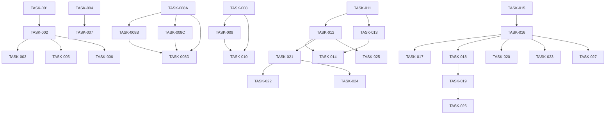

# PKM System Implementation Tasks

## Task Overview

This document provides a comprehensive breakdown of implementation tasks for the PKM system, organized by phase, priority, and dependencies. Each task includes acceptance criteria, estimated effort, and assigned components.

**Last Updated**: 2024-08-23
**Architecture**: Claude Code + Diskless Lakehouse v2.0
**Status**: Phase 1 Complete ✅ - Phase 2 Ready (Retrieval Agent)

## Current Status Summary

### ✅ Completed (Phase 1 - Foundation)
- **Vault Structure**: Clean 00/02/03/04/05 PARA organization ✅
- **Ingestion Pipeline**: Working with 04-resources default ✅
- **Test Framework**: All categorization tests passing ✅
- **Validation Scripts**: Updated for new structure ✅
- **Git Integration**: Ready for development ✅
- **Agent Framework**: Basic Claude Code integration ✅

### 🔄 In Progress (Phase 2 - Retrieval Agent)
- **Core Retrieval Engine**: Search, Get, Links functionality
- **CLI Interface**: `pkm search|get|links` commands
- **Claude Code Integration**: `/pkm-search`, `/pkm-get`, `/pkm-links`
- **Natural Language Interface**: Intent parsing and response
- **Testing Suite**: TDD-driven implementation

### 📅 Upcoming (Phase 3 - Advanced Features)
- **Semantic Search**: Embedding-based similarity
- **Graph Visualization**: Interactive relationship maps
- **Auto-linking**: Intelligent suggestion system
- **Performance Optimization**: Caching and indexing
- **Lakehouse Integration**: Vector storage with Lance

## Task Management Structure

### Priority Levels
- 🔴 **Critical**: Core functionality, blocks other work
- 🟠 **High**: Important features, significant user impact
- 🟡 **Medium**: Enhancements, good to have
- 🟢 **Low**: Nice to have, future considerations

### Effort Estimates
- **XS**: < 4 hours
- **S**: 4-8 hours
- **M**: 1-3 days
- **L**: 3-5 days
- **XL**: 1-2 weeks
- **XXL**: > 2 weeks

## Phase 1: Foundation Tasks ✅ COMPLETED

*Phase 1 focused on establishing the core vault structure and ingestion pipeline. All tasks in this phase have been completed successfully.*

## Phase 2: Retrieval Agent Implementation 🔄 CURRENT

*This phase focuses on building the intelligent retrieval system that provides search, get, and link operations through both CLI and Claude Code interfaces.*

**Development Principles**: TDD (Test-Driven Development), Specs-First, FR-First Prioritization

### 2.1 Core Retrieval Engine

#### TASK-RET-001: Implement RetrievalEngine Core
- **Priority**: 🔴 Critical
- **Effort**: L
- **Dependencies**: None
- **TDD Approach**: Write failing tests first for search, get, links
- **Acceptance Criteria**:
  - [ ] RetrievalEngine class with search(), get(), links() methods
  - [ ] Content indexing from vault markdown files
  - [ ] Metadata extraction and indexing
  - [ ] Basic relevance scoring algorithm
  - [ ] 90% test coverage
- **Implementation**:
  ```python
  # tests/unit/test_retrieval_engine.py - WRITE FIRST
  def test_search_returns_relevant_results():
      engine = RetrievalEngine("test_vault")
      results = engine.search("machine learning")
      assert len(results) > 0
      assert results[0].relevance_score > 0.7
  ```

#### TASK-RET-002: Build Search Functionality
- **Priority**: 🔴 Critical
- **Effort**: L
- **Dependencies**: TASK-RET-001
- **TDD Approach**: Test each search method independently
- **Acceptance Criteria**:
  - [ ] Content search with text matching
  - [ ] Tag-based search with metadata
  - [ ] Hybrid search combining methods
  - [ ] Result ranking by relevance score
  - [ ] Search response time < 100ms
- **Test Implementation**:
  ```python
  def test_content_search_accuracy():
      # Test content search returns relevant notes
  def test_tag_search_precision():
      # Test tag search returns exact matches
  def test_hybrid_search_ranking():
      # Test hybrid search ranks results properly
  ```

#### TASK-RET-003: Implement Note Retrieval System
- **Priority**: 🔴 Critical  
- **Effort**: M
- **Dependencies**: TASK-RET-001
- **TDD Approach**: Test retrieval by different identifiers
- **Acceptance Criteria**:
  - [ ] Get note by unique ID
  - [ ] Get notes by tag collection
  - [ ] Get notes by type (project/area/resource)
  - [ ] Get notes by date range
  - [ ] Include metadata in results
- **Test Implementation**:
  ```python
  def test_get_note_by_id():
      # Test single note retrieval
  def test_get_notes_by_tag():
      # Test collection retrieval
  ```

#### TASK-RET-004: Build Link Discovery Engine
- **Priority**: 🔴 Critical
- **Effort**: L
- **Dependencies**: TASK-RET-001
- **TDD Approach**: Test graph construction and traversal
- **Acceptance Criteria**:
  - [ ] Build link graph from [[wikilinks]]
  - [ ] Find related notes through content similarity
  - [ ] Suggest missing bidirectional links
  - [ ] Detect orphan notes (no incoming links)
  - [ ] Calculate relationship strength scores
- **Test Implementation**:
  ```python
  def test_build_link_graph():
      # Test graph construction from wikilinks
  def test_find_related_notes():
      # Test content similarity discovery
  def test_suggest_bidirectional_links():
      # Test missing link suggestions
  ```

### 2.2 CLI Interface Development

#### TASK-RET-005: Setup CLI Framework
- **Priority**: 🟠 High
- **Effort**: S
- **Dependencies**: TASK-RET-002, TASK-RET-003, TASK-RET-004
- **TDD Approach**: Use click.testing for CLI tests
- **Acceptance Criteria**:
  - [ ] Click-based CLI with pkm command group
  - [ ] Configuration management for vault path
  - [ ] Output formatting (JSON, table, markdown)
  - [ ] Error handling and user feedback
  - [ ] Help system and documentation
- **Implementation**:
  ```bash
  # CLI Interface Design
  pkm search "query" [--method=content|tags|semantic] [--limit=10]
  pkm get <identifier> [--type=id|tag|type] [--format=json|markdown]
  pkm links <note-id> [--operation=related|suggest] [--depth=2]
  ```

#### TASK-RET-006: Implement PKM Search Command
- **Priority**: 🟠 High
- **Effort**: M
- **Dependencies**: TASK-RET-005
- **TDD Approach**: Test CLI command invocation and output
- **Acceptance Criteria**:
  - [ ] `pkm search` command with query parameter
  - [ ] Method selection (content, tags, hybrid)
  - [ ] Result limit and formatting options
  - [ ] Relevance score display
  - [ ] Clear error messages for invalid queries
- **Test Implementation**:
  ```python
  def test_search_command_basic():
      result = runner.invoke(cli, ['search', 'machine learning'])
      assert result.exit_code == 0
      assert 'Found' in result.output
  ```

#### TASK-RET-007: Implement PKM Get Command
- **Priority**: 🟠 High  
- **Effort**: M
- **Dependencies**: TASK-RET-005
- **TDD Approach**: Test various get operations
- **Acceptance Criteria**:
  - [ ] `pkm get` command with identifier parameter
  - [ ] Type selection (id, tag, type, date_range)
  - [ ] Metadata inclusion options
  - [ ] Multiple output formats
  - [ ] Progress indicators for large collections

#### TASK-RET-008: Implement PKM Links Command
- **Priority**: 🟠 High
- **Effort**: M  
- **Dependencies**: TASK-RET-005
- **TDD Approach**: Test link operations and graph output
- **Acceptance Criteria**:
  - [ ] `pkm links` command with note ID parameter
  - [ ] Operation selection (related, suggest, validate, graph)
  - [ ] Depth control for graph traversal
  - [ ] Visual graph output (ASCII art or file export)
  - [ ] Link suggestion confidence scores

### 2.3 Claude Code Integration

#### TASK-RET-009: Create PKM Retrieval Agent Specification
- **Priority**: 🔴 Critical
- **Effort**: S
- **Dependencies**: CLI commands complete
- **TDD Approach**: Test agent command handling
- **Acceptance Criteria**:
  - [ ] Claude agent specification file (.claude/agents/pkm-retrieval.md)
  - [ ] Agent capabilities and tools defined
  - [ ] Integration with RetrievalEngine
  - [ ] Error handling and response formatting
  - [ ] Documentation and examples
- **Implementation**:
  ```yaml
  # .claude/agents/pkm-retrieval.md
  name: pkm-retrieval
  capabilities:
    - search_vault_content
    - retrieve_notes
    - discover_relationships
  tools: ["Read", "Write", "Grep", "Glob"]
  ```

#### TASK-RET-010: Implement /pkm-search Command
- **Priority**: 🔴 Critical
- **Effort**: M
- **Dependencies**: TASK-RET-009
- **TDD Approach**: Test Claude command integration
- **Acceptance Criteria**:
  - [ ] `/pkm-search` command in Claude Code settings
  - [ ] Natural language query parsing
  - [ ] Parameter validation and defaults
  - [ ] Formatted results for Claude interface
  - [ ] Error handling with helpful messages
- **Command Specification**:
  ```yaml
  "/pkm-search":
    description: "Search across vault content"
    agent: "pkm-retrieval"
    parameters:
      - query: string (required)
      - method: enum [content, tags, semantic, hybrid]
      - limit: integer (default: 10)
  ```

#### TASK-RET-011: Implement /pkm-get Command
- **Priority**: 🔴 Critical
- **Effort**: M
- **Dependencies**: TASK-RET-009
- **TDD Approach**: Test get command variations
- **Acceptance Criteria**:
  - [ ] `/pkm-get` command with identifier parsing
  - [ ] Type detection and selection
  - [ ] Summary vs full content options
  - [ ] Metadata inclusion control
  - [ ] Collection handling for multiple notes

#### TASK-RET-012: Implement /pkm-links Command
- **Priority**: 🔴 Critical
- **Effort**: M
- **Dependencies**: TASK-RET-009
- **TDD Approach**: Test link discovery and suggestions
- **Acceptance Criteria**:
  - [ ] `/pkm-links` command with note ID validation
  - [ ] Operation type selection
  - [ ] Graph depth control
  - [ ] Visual relationship display
  - [ ] Link suggestion explanations

### 2.4 Advanced Features

#### TASK-RET-013: Natural Language Query Processing
- **Priority**: 🟡 Medium
- **Effort**: L
- **Dependencies**: TASK-RET-012
- **TDD Approach**: Test intent recognition and parsing
- **Acceptance Criteria**:
  - [ ] Natural language query parsing
  - [ ] Intent detection (search, get, links)
  - [ ] Parameter extraction from natural language
  - [ ] Query expansion and refinement
  - [ ] Ambiguity handling with clarification

#### TASK-RET-014: Performance Optimization
- **Priority**: 🟡 Medium (defer until FR complete)
- **Effort**: M
- **Dependencies**: All core features
- **TDD Approach**: Performance benchmarks as tests
- **Acceptance Criteria**:
  - [ ] Search response time < 100ms
  - [ ] Index build time < 5 seconds for 1000 notes
  - [ ] Memory usage < 100MB for typical vault
  - [ ] Caching for frequently accessed content
  - [ ] Incremental index updates

#### TASK-RET-015: Semantic Search with Embeddings
- **Priority**: 🟢 Low (defer until Phase 3)
- **Effort**: XL
- **Dependencies**: Core functionality proven
- **TDD Approach**: Semantic similarity tests
- **Acceptance Criteria**:
  - [ ] Embedding generation for notes
  - [ ] Vector similarity search
  - [ ] Semantic clustering of results
  - [ ] Integration with existing search
  - [ ] Performance benchmarks

### 2.5 Integration Testing

#### TASK-RET-016: End-to-End Testing Suite
- **Priority**: 🔴 Critical
- **Effort**: L
- **Dependencies**: All implementation tasks
- **TDD Approach**: Complete user workflow tests
- **Acceptance Criteria**:
  - [ ] CLI integration tests with real vault
  - [ ] Claude Code integration tests
  - [ ] Performance benchmarks
  - [ ] Error handling validation
  - [ ] User acceptance test scenarios
- **Test Scenarios**:
  ```python
  def test_complete_search_workflow():
      # User searches -> gets results -> follows links
  def test_note_discovery_workflow():
      # User explores -> finds related -> discovers gaps
  ```

#### TASK-RET-017: Documentation and Examples
- **Priority**: 🟠 High
- **Effort**: M  
- **Dependencies**: Implementation complete
- **Acceptance Criteria**:
  - [ ] CLI usage documentation
  - [ ] Claude Code command examples
  - [ ] API documentation for RetrievalEngine
  - [ ] Performance tuning guide
  - [ ] Troubleshooting documentation

### 1.1 Core Infrastructure

#### TASK-001: Initialize PKM Vault Structure
- **Priority**: 🔴 Critical
- **Effort**: M
- **Dependencies**: None
- **Acceptance Criteria**:
  - [ ] Create complete vault directory structure
  - [ ] Initialize Git repository
  - [ ] Set up .pkm configuration
  - [ ] Create storage configuration
- **Implementation**:
  ```bash
  # Complete vault structure as per specification
  mkdir -p vault/{00-inbox,01-notes,02-projects,03-areas,04-resources,05-archives,06-synthesis,07-journal,08-media,09-data,.pkm}
  ```

#### TASK-001A: Initialize PKM Repository Structure
- **Priority**: 🔴 Critical
- **Effort**: S
- **Dependencies**: None
- **Acceptance Criteria**:
  - [ ] Create directory structure as specified
  - [ ] Initialize Git repository
  - [ ] Add .gitignore and README
  - [ ] Set up branch protection rules
- **Implementation**:
  ```bash
  mkdir -p pkm-system/{vault,synthesis,feynman,agents,.pkm}
  cd pkm-system && git init
  ```

#### TASK-002: Implement Vault Management System
- **Priority**: 🔴 Critical
- **Effort**: L
- **Dependencies**: TASK-001
- **Acceptance Criteria**:
  - [ ] CRUD operations for notes
  - [ ] Folder organization (PARA method)
  - [ ] File naming conventions
  - [ ] Metadata handling
- **Components**:
  - `vault_manager.py`
  - `file_operations.py`
  - `metadata_handler.py`

#### TASK-003: Git Integration Layer
- **Priority**: 🔴 Critical
- **Effort**: M
- **Dependencies**: TASK-002
- **Acceptance Criteria**:
  - [ ] Automated commits
  - [ ] Branch management
  - [ ] Conflict resolution
  - [ ] History tracking
- **Components**:
  - `git_integration.py`
  - `commit_manager.py`
  - `history_tracker.py`

#### TASK-004: Markdown Parser and Validator
- **Priority**: 🔴 Critical
- **Effort**: M
- **Dependencies**: None
- **Acceptance Criteria**:
  - [ ] Parse markdown with extensions
  - [ ] Validate syntax
  - [ ] Extract frontmatter
  - [ ] Handle wikilinks
- **Components**:
  - `markdown_parser.py`
  - `frontmatter_extractor.py`
  - `link_parser.py`

### 1.2 Basic Processing

#### TASK-005: Note Template System
- **Priority**: 🟠 High
- **Effort**: S
- **Dependencies**: TASK-002
- **Acceptance Criteria**:
  - [ ] Create template engine
  - [ ] Default templates (concept, daily, project)
  - [ ] Custom template support
  - [ ] Variable substitution
- **Implementation**:
  ```python
  class TemplateEngine:
      def render(template_name, variables):
          # Template rendering logic
          pass
  ```

#### TASK-006: Basic Search Implementation
- **Priority**: 🟠 High
- **Effort**: M
- **Dependencies**: TASK-002
- **Acceptance Criteria**:
  - [ ] Full-text search
  - [ ] Tag filtering
  - [ ] Date range queries
  - [ ] Search result ranking
- **Components**:
  - `search_engine.py`
  - `indexer.py`
  - `query_parser.py`

#### TASK-007: Simple Link Management
- **Priority**: 🟠 High
- **Effort**: M
- **Dependencies**: TASK-004
- **Acceptance Criteria**:
  - [ ] Create bidirectional links
  - [ ] Update backlinks automatically
  - [ ] Handle link renames
  - [ ] Detect broken links
- **Components**:
  - `link_manager.py`
  - `backlink_updater.py`
  - `link_validator.py`

### 1.3 Lakehouse Infrastructure

#### TASK-007A: Iceberg Catalog Setup
- **Priority**: 🔴 Critical
- **Effort**: L
- **Dependencies**: AWS Account
- **Acceptance Criteria**:
  - [ ] Deploy Glue catalog for Iceberg
  - [ ] Create Bronze, Silver, Gold databases
  - [ ] Define table schemas
  - [ ] Configure partitioning strategies
- **Components**:
  - `iceberg_catalog.py`
  - `table_schemas.yaml`
  - `glue_setup.tf`

#### TASK-007B: SlateDB Metadata Layer
- **Priority**: 🔴 Critical
- **Effort**: M
- **Dependencies**: TASK-007A
- **Acceptance Criteria**:
  - [ ] Deploy SlateDB on S3
  - [ ] Configure diskless operation
  - [ ] Implement metadata APIs
  - [ ] Set up compaction policies
- **Components**:
  - `slatedb_manager.py`
  - `metadata_store.py`
  - `compaction_config.yaml`

#### TASK-007C: Streaming Infrastructure
- **Priority**: 🔴 Critical
- **Effort**: L
- **Dependencies**: None
- **Acceptance Criteria**:
  - [ ] Create Kinesis Data Streams
  - [ ] Deploy Lambda processors
  - [ ] Configure DLQ and error handling
  - [ ] Set up monitoring
- **Components**:
  - `kinesis_setup.tf`
  - `lambda_processors.py`
  - `stream_config.yaml`

### 1.4 Storage Infrastructure

#### TASK-008A: S3 Storage Setup
- **Priority**: 🔴 Critical
- **Effort**: L
- **Dependencies**: AWS Account
- **Acceptance Criteria**:
  - [ ] Create S3 buckets (primary, media, backup, analytics)
  - [ ] Configure lifecycle policies
  - [ ] Set up IAM roles and policies
  - [ ] Enable versioning and encryption
- **Components**:
  - `s3_manager.py`
  - `s3_lifecycle.yaml`
  - `iam_policies.json`

#### TASK-008B: Lance Vector Storage Setup
- **Priority**: 🔴 Critical
- **Effort**: L
- **Dependencies**: TASK-008A
- **Acceptance Criteria**:
  - [ ] Initialize Lance datasets
  - [ ] Create embedding schemas
  - [ ] Implement vector indices
  - [ ] Test similarity search
- **Components**:
  - `lance_store.py`
  - `vector_manager.py`
  - `embedding_index.py`

#### TASK-008C: Parquet Analytics Setup
- **Priority**: 🟠 High
- **Effort**: M
- **Dependencies**: TASK-008A
- **Acceptance Criteria**:
  - [ ] Create Parquet schemas
  - [ ] Implement partitioning strategy
  - [ ] Set up analytics tables
  - [ ] Configure compression
- **Components**:
  - `parquet_analytics.py`
  - `metrics_collector.py`
  - `analytics_query.py`

#### TASK-008D: Storage Integration Layer
- **Priority**: 🟠 High
- **Effort**: L
- **Dependencies**: TASK-008A, TASK-008B, TASK-008C
- **Acceptance Criteria**:
  - [ ] Unified storage interface
  - [ ] Multi-tier routing logic
  - [ ] Caching implementation
  - [ ] Performance optimization
- **Components**:
  - `unified_storage.py`
  - `storage_router.py`
  - `cache_manager.py`

### 1.5 Diskless Processing Setup

#### TASK-009A: Lambda Processing Functions
- **Priority**: 🔴 Critical
- **Effort**: L
- **Dependencies**: TASK-007C
- **Acceptance Criteria**:
  - [ ] Deploy ingestion Lambda
  - [ ] Deploy processing Lambda
  - [ ] Deploy aggregation Lambda
  - [ ] Configure Lambda layers
- **Components**:
  - `lambda_ingestion.py`
  - `lambda_processing.py`
  - `lambda_aggregation.py`

#### TASK-009B: Container-Based Processing
- **Priority**: 🟠 High
- **Effort**: L
- **Dependencies**: TASK-007A
- **Acceptance Criteria**:
  - [ ] Create ECS/Fargate cluster
  - [ ] Deploy Ray cluster
  - [ ] Configure auto-scaling
  - [ ] Set up job scheduling
- **Components**:
  - `ecs_tasks.tf`
  - `ray_cluster.yaml`
  - `batch_processor.py`

#### TASK-009C: Spark Streaming Setup
- **Priority**: 🟠 High
- **Effort**: XL
- **Dependencies**: TASK-007A, TASK-007C
- **Acceptance Criteria**:
  - [ ] Deploy EMR cluster
  - [ ] Configure Iceberg integration
  - [ ] Set up streaming jobs
  - [ ] Implement checkpointing
- **Components**:
  - `emr_cluster.tf`
  - `spark_streaming.py`
  - `checkpoint_manager.py`

### 1.6 Initial Agent Setup

#### TASK-008: Agent Framework Foundation
- **Priority**: 🔴 Critical
- **Effort**: L
- **Dependencies**: None
- **Acceptance Criteria**:
  - [ ] Define agent interface
  - [ ] Message passing system
  - [ ] Agent registration
  - [ ] Error handling
- **Components**:
  - `agent_base.py`
  - `agent_registry.py`
  - `message_broker.py`

#### TASK-009: Basic Ingestion Agent
- **Priority**: 🟠 High
- **Effort**: L
- **Dependencies**: TASK-008
- **Acceptance Criteria**:
  - [ ] Text file ingestion
  - [ ] Markdown import
  - [ ] Basic metadata extraction
  - [ ] Inbox placement
- **Implementation**:
  ```python
  class IngestionAgent(BaseAgent):
      def process(self, input_file):
          # Ingestion logic
          pass
  ```

#### TASK-010: Simple Processing Agent
- **Priority**: 🟠 High
- **Effort**: M
- **Dependencies**: TASK-008, TASK-009
- **Acceptance Criteria**:
  - [ ] Note validation
  - [ ] Basic tagging
  - [ ] Simple categorization
  - [ ] Quality checks
- **Components**:
  - `processing_agent.py`
  - `note_validator.py`
  - `auto_tagger.py`

## Phase 2: Intelligence Tasks

### 2.1 NLP Integration

#### TASK-011: NLP Pipeline Setup
- **Priority**: 🔴 Critical
- **Effort**: L
- **Dependencies**: None
- **Acceptance Criteria**:
  - [ ] Install and configure spaCy
  - [ ] Load language models
  - [ ] Create processing pipeline
  - [ ] Performance optimization
- **Implementation**:
  ```python
  import spacy
  nlp = spacy.load("en_core_web_lg")
  nlp.add_pipe("custom_component")
  ```

#### TASK-012: Concept Extraction Implementation
- **Priority**: 🔴 Critical
- **Effort**: XL
- **Dependencies**: TASK-011
- **Acceptance Criteria**:
  - [ ] Extract atomic concepts
  - [ ] Identify compound concepts
  - [ ] Build concept hierarchy
  - [ ] Calculate concept importance
- **Components**:
  - `concept_extractor.py`
  - `concept_hierarchy.py`
  - `importance_calculator.py`

#### TASK-013: Entity Recognition System
- **Priority**: 🟠 High
- **Effort**: L
- **Dependencies**: TASK-011
- **Acceptance Criteria**:
  - [ ] Standard NER implementation
  - [ ] Custom entity patterns
  - [ ] Entity linking
  - [ ] Entity enrichment
- **Components**:
  - `entity_recognizer.py`
  - `entity_linker.py`
  - `entity_enricher.py`

#### TASK-014: Relationship Extraction
- **Priority**: 🟠 High
- **Effort**: L
- **Dependencies**: TASK-012, TASK-013
- **Acceptance Criteria**:
  - [ ] Direct relationship extraction
  - [ ] Inferred relationships
  - [ ] Relationship strength calculation
  - [ ] Relationship validation
- **Components**:
  - `relationship_extractor.py`
  - `relationship_validator.py`
  - `strength_calculator.py`

### 2.2 Knowledge Graph

#### TASK-015: Graph Database Setup
- **Priority**: 🔴 Critical
- **Effort**: L
- **Dependencies**: None
- **Acceptance Criteria**:
  - [ ] Install Neo4j
  - [ ] Configure connections
  - [ ] Create schema
  - [ ] Set up indices
- **Implementation**:
  ```python
  from neo4j import GraphDatabase
  driver = GraphDatabase.driver(uri, auth=(user, password))
  ```

#### TASK-016: Knowledge Graph Builder
- **Priority**: 🔴 Critical
- **Effort**: XL
- **Dependencies**: TASK-015, TASK-012
- **Acceptance Criteria**:
  - [ ] Create nodes from concepts
  - [ ] Create edges from relationships
  - [ ] Calculate graph metrics
  - [ ] Update graph incrementally
- **Components**:
  - `graph_builder.py`
  - `node_manager.py`
  - `edge_manager.py`
  - `graph_metrics.py`

#### TASK-017: Graph Visualization
- **Priority**: 🟠 High
- **Effort**: L
- **Dependencies**: TASK-016
- **Acceptance Criteria**:
  - [ ] Interactive graph view
  - [ ] Multiple layout algorithms
  - [ ] Filtering and zooming
  - [ ] Export capabilities
- **Components**:
  - `graph_visualizer.py`
  - `layout_engine.py`
  - `graph_exporter.py`

### 2.3 Pattern Detection

#### TASK-018: Pattern Detection Engine
- **Priority**: 🟠 High
- **Effort**: XL
- **Dependencies**: TASK-016
- **Acceptance Criteria**:
  - [ ] Temporal pattern detection
  - [ ] Structural pattern detection
  - [ ] Semantic pattern detection
  - [ ] Pattern validation
- **Components**:
  - `pattern_detector.py`
  - `temporal_patterns.py`
  - `structural_patterns.py`
  - `semantic_patterns.py`

#### TASK-019: Insight Generation System
- **Priority**: 🟠 High
- **Effort**: XL
- **Dependencies**: TASK-018
- **Acceptance Criteria**:
  - [ ] Connection insights
  - [ ] Pattern insights
  - [ ] Anomaly detection
  - [ ] Insight ranking
- **Components**:
  - `insight_generator.py`
  - `anomaly_detector.py`
  - `insight_ranker.py`

#### TASK-020: Gap Analysis Implementation
- **Priority**: 🟡 Medium
- **Effort**: L
- **Dependencies**: TASK-016
- **Acceptance Criteria**:
  - [ ] Identify knowledge gaps
  - [ ] Find missing prerequisites
  - [ ] Detect incomplete concepts
  - [ ] Suggest gap filling
- **Components**:
  - `gap_analyzer.py`
  - `prerequisite_mapper.py`
  - `completion_checker.py`

## Phase 3: Generation Tasks

### 3.1 Content Generation

#### TASK-021: Summary Generation Engine
- **Priority**: 🔴 Critical
- **Effort**: XL
- **Dependencies**: TASK-012
- **Acceptance Criteria**:
  - [ ] Progressive summarization
  - [ ] Multiple summary levels
  - [ ] Thematic summaries
  - [ ] Summary quality validation
- **Components**:
  - `summary_generator.py`
  - `progressive_summarizer.py`
  - `thematic_summarizer.py`

#### TASK-022: Teaching Material Generator
- **Priority**: 🟠 High
- **Effort**: XL
- **Dependencies**: TASK-021
- **Acceptance Criteria**:
  - [ ] Curriculum builder
  - [ ] Exercise generator
  - [ ] Quiz creation
  - [ ] Learning path generation
- **Components**:
  - `curriculum_builder.py`
  - `exercise_generator.py`
  - `quiz_creator.py`
  - `learning_path.py`

#### TASK-023: Visual Content Generator
- **Priority**: 🟡 Medium
- **Effort**: L
- **Dependencies**: TASK-016
- **Acceptance Criteria**:
  - [ ] Concept maps
  - [ ] Flowcharts
  - [ ] Timelines
  - [ ] Infographics
- **Components**:
  - `diagram_generator.py`
  - `concept_mapper.py`
  - `infographic_creator.py`

### 3.2 Feynman Processing

#### TASK-024: Feynman Simplification Engine
- **Priority**: 🔴 Critical
- **Effort**: XL
- **Dependencies**: TASK-021
- **Acceptance Criteria**:
  - [ ] ELI5 generation
  - [ ] Analogy creation
  - [ ] Jargon removal
  - [ ] Clarity validation
- **Implementation**:
  ```python
  class FeynmanProcessor:
      def simplify(self, content):
          # Remove jargon
          # Create analogies
          # Validate understanding
          pass
  ```

#### TASK-025: Question Generation System
- **Priority**: 🟠 High
- **Effort**: L
- **Dependencies**: TASK-012
- **Acceptance Criteria**:
  - [ ] Socratic questions
  - [ ] Comprehension questions
  - [ ] Reflection prompts
  - [ ] Question quality scoring
- **Components**:
  - `question_generator.py`
  - `socratic_questioner.py`
  - `question_scorer.py`

### 3.3 Advanced Synthesis

#### TASK-026: Cross-Domain Synthesizer
- **Priority**: 🟡 Medium
- **Effort**: XL
- **Dependencies**: TASK-019
- **Acceptance Criteria**:
  - [ ] Identify cross-domain patterns
  - [ ] Create unified frameworks
  - [ ] Generate novel combinations
  - [ ] Validate synthesis quality
- **Components**:
  - `cross_domain_synthesizer.py`
  - `framework_builder.py`
  - `combination_generator.py`

#### TASK-027: Contradiction Detection System
- **Priority**: 🟡 Medium
- **Effort**: L
- **Dependencies**: TASK-016
- **Acceptance Criteria**:
  - [ ] Direct contradiction detection
  - [ ] Logical inconsistency finding
  - [ ] Temporal contradiction detection
  - [ ] Resolution suggestions
- **Components**:
  - `contradiction_detector.py`
  - `inconsistency_finder.py`
  - `resolution_suggester.py`

## Phase 4: Optimization Tasks

### 4.1 Performance Optimization

#### TASK-028: Query Optimization
- **Priority**: 🟠 High
- **Effort**: L
- **Dependencies**: TASK-016
- **Acceptance Criteria**:
  - [ ] Index optimization
  - [ ] Query caching
  - [ ] Batch processing
  - [ ] Performance monitoring
- **Components**:
  - `query_optimizer.py`
  - `cache_manager.py`
  - `performance_monitor.py`

#### TASK-029: Parallel Processing Implementation
- **Priority**: 🟠 High
- **Effort**: L
- **Dependencies**: Multiple
- **Acceptance Criteria**:
  - [ ] Multi-threading for I/O
  - [ ] Multi-processing for CPU
  - [ ] Async operations
  - [ ] Load balancing
- **Implementation**:
  ```python
  from concurrent.futures import ProcessPoolExecutor
  executor = ProcessPoolExecutor(max_workers=4)
  ```

#### TASK-030: Resource Management
- **Priority**: 🟡 Medium
- **Effort**: M
- **Dependencies**: TASK-029
- **Acceptance Criteria**:
  - [ ] Memory management
  - [ ] CPU throttling
  - [ ] Disk space monitoring
  - [ ] Resource allocation
- **Components**:
  - `resource_manager.py`
  - `memory_optimizer.py`
  - `disk_monitor.py`

### 4.2 Quality Assurance

#### TASK-031: Comprehensive Testing Suite
- **Priority**: 🔴 Critical
- **Effort**: XL
- **Dependencies**: All components
- **Acceptance Criteria**:
  - [ ] Unit tests (>80% coverage)
  - [ ] Integration tests
  - [ ] Performance tests
  - [ ] End-to-end tests
- **Implementation**:
  ```python
  import pytest
  def test_note_creation():
      # Test implementation
      pass
  ```

#### TASK-032: Documentation Generation
- **Priority**: 🟠 High
- **Effort**: L
- **Dependencies**: All components
- **Acceptance Criteria**:
  - [ ] API documentation
  - [ ] User guides
  - [ ] Developer documentation
  - [ ] Video tutorials
- **Components**:
  - Sphinx setup
  - MkDocs configuration
  - Tutorial scripts

#### TASK-033: Security Hardening
- **Priority**: 🔴 Critical
- **Effort**: L
- **Dependencies**: Multiple
- **Acceptance Criteria**:
  - [ ] Input validation
  - [ ] Authentication system
  - [ ] Encryption implementation
  - [ ] Security audit
- **Components**:
  - `security_manager.py`
  - `auth_handler.py`
  - `encryption_utils.py`

### 4.3 User Experience

#### TASK-034: Web Interface Development
- **Priority**: 🟠 High
- **Effort**: XXL
- **Dependencies**: Backend APIs
- **Acceptance Criteria**:
  - [ ] Note editor interface
  - [ ] Search interface
  - [ ] Graph visualization
  - [ ] Settings management
- **Tech Stack**:
  - Next.js frontend
  - FastAPI backend
  - WebSocket connections

#### TASK-035: CLI Tool Development
- **Priority**: 🟠 High
- **Effort**: L
- **Dependencies**: Core functionality
- **Acceptance Criteria**:
  - [ ] Command structure
  - [ ] Interactive mode
  - [ ] Batch operations
  - [ ] Configuration management
- **Implementation**:
  ```python
  import click
  @click.command()
  def pkm_cli():
      pass
  ```

#### TASK-036: Plugin System
- **Priority**: 🟡 Medium
- **Effort**: XL
- **Dependencies**: TASK-008
- **Acceptance Criteria**:
  - [ ] Plugin interface
  - [ ] Plugin registry
  - [ ] Sandboxing
  - [ ] Plugin marketplace
- **Components**:
  - `plugin_manager.py`
  - `plugin_registry.py`
  - `plugin_sandbox.py`

## Integration Tasks

### TASK-037: Claude Code Agent Integration
- **Priority**: 🔴 Critical
- **Effort**: L
- **Dependencies**: TASK-008
- **Acceptance Criteria**:
  - [ ] Agent specifications
  - [ ] Communication protocol
  - [ ] Error handling
  - [ ] Testing suite
- **Implementation**:
  ```yaml
  # .claude/agents/pkm_agent.yaml
  name: pkm_processor
  capabilities:
    - note_processing
    - knowledge_extraction
    - synthesis
  ```

### TASK-038: API Development
- **Priority**: 🔴 Critical
- **Effort**: XL
- **Dependencies**: Core components
- **Acceptance Criteria**:
  - [ ] RESTful endpoints
  - [ ] GraphQL schema
  - [ ] WebSocket support
  - [ ] API documentation
- **Components**:
  - FastAPI application
  - GraphQL resolvers
  - WebSocket handlers

### TASK-039: Export/Import System
- **Priority**: 🟠 High
- **Effort**: L
- **Dependencies**: TASK-002
- **Acceptance Criteria**:
  - [ ] Multiple format support
  - [ ] Batch operations
  - [ ] Progress tracking
  - [ ] Error recovery
- **Supported Formats**:
  - Obsidian
  - Roam Research
  - Notion
  - JSON/YAML

## DevOps Tasks

### TASK-040: CI/CD Pipeline Setup
- **Priority**: 🔴 Critical
- **Effort**: M
- **Dependencies**: TASK-031
- **Acceptance Criteria**:
  - [ ] GitHub Actions workflow
  - [ ] Automated testing
  - [ ] Build process
  - [ ] Deployment automation
- **Implementation**:
  ```yaml
  # .github/workflows/ci.yml
  name: CI Pipeline
  on: [push, pull_request]
  jobs:
    test:
      runs-on: ubuntu-latest
  ```

### TASK-041: Monitoring and Logging
- **Priority**: 🟠 High
- **Effort**: M
- **Dependencies**: Deployment
- **Acceptance Criteria**:
  - [ ] Application metrics
  - [ ] Error tracking
  - [ ] Performance monitoring
  - [ ] Alerting system
- **Tools**:
  - Prometheus
  - Grafana
  - Sentry
  - ELK Stack

### TASK-042: Backup and Recovery
- **Priority**: 🔴 Critical
- **Effort**: M
- **Dependencies**: TASK-002
- **Acceptance Criteria**:
  - [ ] Automated backups
  - [ ] Recovery procedures
  - [ ] Data validation
  - [ ] Disaster recovery plan
- **Components**:
  - `backup_manager.py`
  - `recovery_handler.py`
  - `data_validator.py`

## Task Dependencies Graph



## Sprint Planning

### Sprint 1 (Weeks 1-2)
- TASK-001: Repository Structure
- TASK-002: Vault Management
- TASK-004: Markdown Parser
- TASK-008: Agent Framework

### Sprint 2 (Weeks 3-4)
- TASK-003: Git Integration
- TASK-005: Template System
- TASK-009: Ingestion Agent
- TASK-010: Processing Agent

### Sprint 3 (Weeks 5-6)
- TASK-006: Search Implementation
- TASK-007: Link Management
- TASK-011: NLP Setup
- TASK-015: Graph Database

[Continue for all sprints...]

## Success Metrics

### Phase 1 Completion
- [ ] All critical tasks completed
- [ ] Basic PKM functionality operational
- [ ] 100+ test notes processed successfully
- [ ] Agent framework functional

### Phase 2 Completion
- [ ] NLP pipeline operational
- [ ] Knowledge graph populated
- [ ] Pattern detection working
- [ ] 80% extraction accuracy

### Phase 3 Completion
- [ ] Content generation functional
- [ ] Feynman processing working
- [ ] Teaching materials validated
- [ ] Cross-domain synthesis operational

### Phase 4 Completion
- [ ] Performance targets met (<100ms)
- [ ] 80% test coverage
- [ ] Complete documentation
- [ ] User interface deployed

## Risk Mitigation

### Technical Risks
- **NLP Accuracy**: Multiple model fallbacks
- **Performance**: Early optimization, caching
- **Scalability**: Distributed architecture planning
- **Integration**: Comprehensive testing

### Schedule Risks
- **Dependencies**: Parallel work streams
- **Complexity**: Incremental development
- **Resources**: Clear prioritization
- **Scope Creep**: Strict change control

---

*This implementation task list will be updated weekly based on progress and discoveries. All tasks should be tracked in the project management system with appropriate labels and assignments.*

## Lakehouse Implementation Milestones

### Lakehouse Phase 1: Foundation
- [ ] Iceberg catalog deployed
- [ ] SlateDB operational
- [ ] Kinesis streams active
- [ ] Lambda processors running

### Lakehouse Phase 2: Processing
- [ ] Spark streaming operational
- [ ] Ray cluster deployed
- [ ] NLP pipeline integrated
- [ ] Vector processing with Lance

### Lakehouse Phase 3: Analytics
- [ ] Unified query layer
- [ ] Time travel queries
- [ ] Materialized views
- [ ] Dashboard integration

### Lakehouse Phase 4: Optimization
- [ ] Auto-scaling configured
- [ ] Cost optimization rules
- [ ] Performance tuning complete
- [ ] Monitoring dashboards live

## Storage Implementation Milestones

### Storage Phase 1: Local + Git
- [ ] Vault structure created
- [ ] Git integration operational
- [ ] Local caching implemented

### Storage Phase 2: S3 Integration
- [ ] S3 buckets configured
- [ ] Lifecycle policies active
- [ ] Media upload/download working

### Storage Phase 3: Lance Vectors
- [ ] Lance datasets initialized
- [ ] Vector search operational
- [ ] Performance < 10ms queries

### Storage Phase 4: Parquet Analytics
- [ ] Analytics schemas defined
- [ ] Partitioning implemented
- [ ] Query optimization complete

**Total Estimated Effort**: ~8 person-months (updated with storage tasks)
**Recommended Team Size**: 4-6 developers + 1 DevOps engineer
**Target Completion**: 12 months