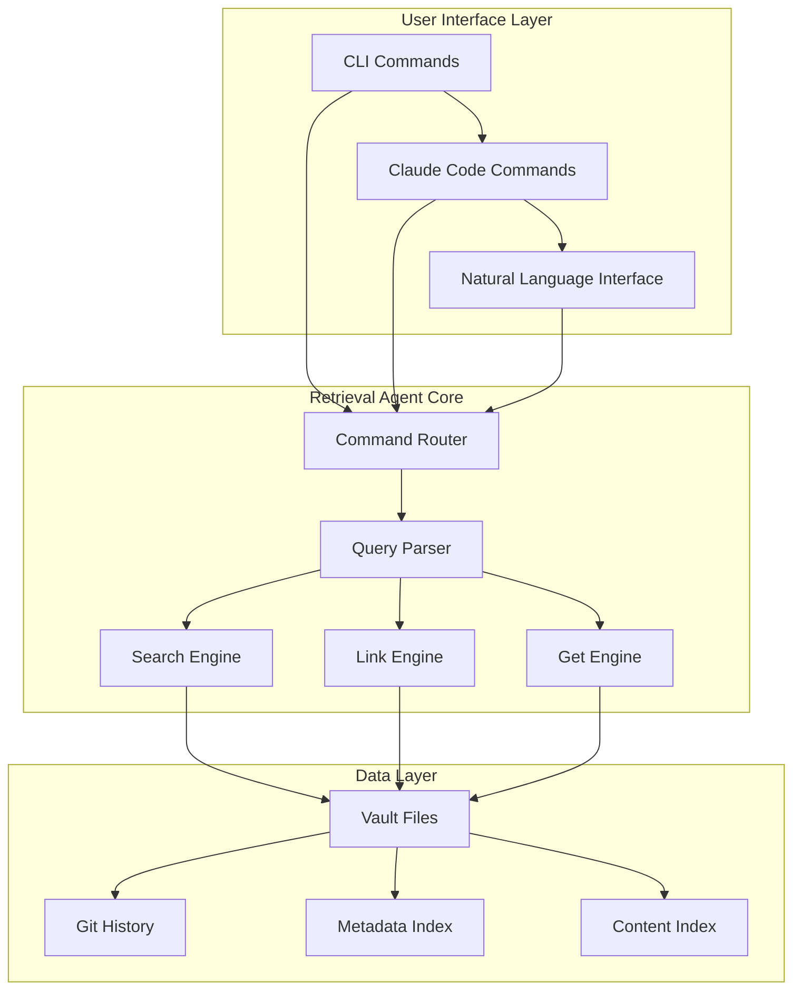

# PKM Retrieval Agent Implementation Plan

## Executive Summary

This document outlines the comprehensive plan for implementing a PKM retrieval agent and CLI system as the next major milestone following vault structure normalization. The plan follows TDD, specs-driven development, and FR-first prioritization principles established in the CLAUDE.md workspace rules.

**Last Updated**: 2024-08-23  
**Status**: Ready for Implementation - Vault Structure Normalized ✅  
**Next Phase**: Retrieval Agent + CLI Development  

## Current State Assessment

### ✅ Completed Infrastructure
- **Vault Structure**: Clean 00/02/03/04/05 PARA structure
- **Ingestion Pipeline**: Working with 04-resources default
- **Test Framework**: All categorization tests passing
- **Validation**: Scripts updated for new structure
- **Git Integration**: Ready for development commits

### 🎯 Implementation Target
Build a retrieval agent that provides intelligent search, get, and link operations through both CLI and Claude Code commands, following the architectural patterns established in PKM-SYSTEM-ARCHITECTURE.md.

## Architecture Overview

### Retrieval Agent Design Pattern



### Core Operations

```yaml
retrieval_operations:
  search:
    purpose: "Find relevant notes by content, metadata, or relationships"
    methods: ["full_text", "semantic", "metadata", "graph_traversal"]
    outputs: ["ranked_results", "summary", "context"]
  
  get:
    purpose: "Retrieve specific notes or note collections"
    methods: ["by_id", "by_tag", "by_type", "by_date_range"]
    outputs: ["note_content", "metadata", "relationships"]
  
  links:
    purpose: "Discover and manage note relationships"
    methods: ["find_related", "suggest_links", "validate_links", "graph_view"]
    outputs: ["link_suggestions", "relationship_graph", "orphan_detection"]
```

## Implementation Phases

### Phase 1: Core Retrieval Engine (Weeks 1-2)

#### FR-001: Basic Search Functionality
**Priority**: 🔴 Critical  
**TDD Approach**: Write tests first for each search method  

```python
# tests/unit/test_retrieval_search.py
def test_search_by_content():
    """FR-001-A: Should find notes containing specific text"""
    # Arrange
    search_engine = RetrievalEngine(vault_path)
    query = "machine learning concepts"
    
    # Act
    results = search_engine.search(query, method="content")
    
    # Assert
    assert len(results) > 0
    assert all("machine learning" in r.content.lower() for r in results)
    assert results[0].relevance_score > 0.8

def test_search_by_tags():
    """FR-001-B: Should find notes with specific tags"""
    # Arrange  
    search_engine = RetrievalEngine(vault_path)
    query = "#ai #concepts"
    
    # Act
    results = search_engine.search(query, method="tags")
    
    # Assert
    assert all("#ai" in r.tags for r in results)
    assert all("#concepts" in r.tags for r in results)

def test_search_ranking():
    """FR-001-C: Should rank results by relevance"""
    # Arrange
    search_engine = RetrievalEngine(vault_path)
    query = "neural networks"
    
    # Act  
    results = search_engine.search(query)
    
    # Assert
    assert len(results) >= 2
    assert results[0].relevance_score >= results[1].relevance_score
```

**Implementation Spec**:
```python
class RetrievalEngine:
    """Core retrieval engine with search, get, and link capabilities"""
    
    def __init__(self, vault_path: str):
        self.vault_path = Path(vault_path)
        self.content_index = self._build_content_index()
        self.metadata_index = self._build_metadata_index()
        self.link_graph = self._build_link_graph()
    
    def search(self, query: str, method: str = "hybrid") -> List[SearchResult]:
        """
        Search notes using specified method
        
        Args:
            query: Search query string
            method: "content", "tags", "semantic", "hybrid"
            
        Returns:
            List of SearchResult objects ranked by relevance
        """
        pass
    
    def get(self, identifier: str, type: str = "auto") -> Union[Note, List[Note]]:
        """
        Retrieve specific notes or collections
        
        Args:
            identifier: Note ID, tag, or pattern
            type: "id", "tag", "type", "date_range", "auto"
            
        Returns:
            Single note or list of notes
        """
        pass
    
    def links(self, note_id: str, operation: str = "related") -> LinkResult:
        """
        Discover and manage note relationships
        
        Args:
            note_id: Source note identifier
            operation: "related", "suggest", "validate", "graph"
            
        Returns:
            LinkResult with relationships and suggestions
        """
        pass
```

#### FR-002: Note Retrieval System
**Priority**: 🔴 Critical  
**TDD Approach**: Test-driven implementation  

```python
# tests/unit/test_retrieval_get.py
def test_get_note_by_id():
    """FR-002-A: Should retrieve note by unique identifier"""
    # Test implementation here
    pass

def test_get_notes_by_tag():
    """FR-002-B: Should retrieve all notes with specific tag"""
    # Test implementation here
    pass

def test_get_notes_by_type():
    """FR-002-C: Should retrieve all notes of specific type"""
    # Test implementation here
    pass
```

#### FR-003: Link Discovery Engine
**Priority**: 🔴 Critical  
**TDD Approach**: Graph-based relationship tests  

```python
# tests/unit/test_retrieval_links.py
def test_find_related_notes():
    """FR-003-A: Should find related notes through content similarity"""
    # Test implementation here
    pass

def test_suggest_bidirectional_links():
    """FR-003-B: Should suggest missing bidirectional links"""
    # Test implementation here
    pass

def test_detect_orphan_notes():
    """FR-003-C: Should detect notes with no incoming links"""
    # Test implementation here
    pass
```

### Phase 2: CLI Interface (Weeks 3-4)

#### FR-004: Command Line Interface
**Priority**: 🟠 High  
**TDD Approach**: CLI command testing with click.testing  

```python
# tests/unit/test_cli.py
def test_pkm_search_command():
    """FR-004-A: Should provide search command via CLI"""
    from click.testing import CliRunner
    from src.cli import pkm_cli
    
    runner = CliRunner()
    result = runner.invoke(pkm_cli, ['search', 'machine learning'])
    
    assert result.exit_code == 0
    assert 'Found' in result.output
    assert 'relevance' in result.output

def test_pkm_get_command():
    """FR-004-B: Should provide get command via CLI"""
    # Test implementation here
    pass

def test_pkm_links_command():
    """FR-004-C: Should provide links command via CLI"""
    # Test implementation here
    pass
```

**CLI Design Spec**:
```bash
# PKM CLI Interface Design
pkm search "query" [--method=content|tags|semantic] [--limit=10] [--format=json|table]
pkm get <identifier> [--type=id|tag|type] [--include-metadata] [--format=json|markdown]
pkm links <note-id> [--operation=related|suggest|validate] [--depth=2] [--format=graph|list]

# Examples:
pkm search "neural networks" --method=semantic --limit=5
pkm get "#ai" --type=tag --include-metadata  
pkm links 20240823-machine-learning --operation=suggest --depth=2
```

#### FR-005: CLI Integration with Vault
**Priority**: 🟠 High  
**TDD Approach**: File system integration tests  

### Phase 3: Claude Code Integration (Weeks 5-6)

#### FR-006: Claude Code Commands
**Priority**: 🔴 Critical  
**TDD Approach**: Agent command testing  

**Command Specifications**:
```yaml
# .claude/settings.json - Command Mappings
claude_commands:
  "/pkm-search":
    description: "Search across vault content"
    agent: "pkm-retrieval"
    parameters:
      - query: string (required)
      - method: enum [content, tags, semantic, hybrid]
      - limit: integer (default: 10)
    example: "/pkm-search machine learning --method=semantic --limit=5"
  
  "/pkm-get":
    description: "Retrieve specific notes or collections"
    agent: "pkm-retrieval"
    parameters:
      - identifier: string (required)
      - type: enum [id, tag, type, date_range]
      - format: enum [summary, full, metadata]
    example: "/pkm-get #ai --type=tag --format=summary"
  
  "/pkm-links":
    description: "Discover and manage note relationships"
    agent: "pkm-retrieval"
    parameters:
      - note_id: string (required)
      - operation: enum [related, suggest, validate, graph]
      - depth: integer (default: 2)
    example: "/pkm-links 20240823-neural-networks --operation=suggest"
```

#### FR-007: Natural Language Interface
**Priority**: 🟠 High  
**TDD Approach**: Intent recognition testing  

```python
# tests/unit/test_natural_language.py
def test_natural_search_query():
    """FR-007-A: Should handle natural language search queries"""
    # Test: "Find all my notes about machine learning from last month"
    # Should parse into: search query="machine learning", date_range="last_month"
    pass

def test_natural_get_request():
    """FR-007-B: Should handle natural language get requests"""
    # Test: "Show me my project notes on AI research"
    # Should parse into: get type="project", tag="AI research"
    pass
```

### Phase 4: Advanced Features (Weeks 7-8)

#### FR-008: Semantic Search
**Priority**: 🟡 Medium  
**TDD Approach**: Semantic similarity tests  

#### FR-009: Graph Visualization
**Priority**: 🟡 Medium  
**TDD Approach**: Graph generation tests  

#### FR-010: Auto-linking Suggestions
**Priority**: 🟡 Medium  
**TDD Approach**: Link suggestion accuracy tests  

## Development Framework

### TDD Implementation Pattern

```python
# 1. RED: Write failing test first
def test_search_returns_relevant_results():
    engine = RetrievalEngine("test_vault")
    results = engine.search("machine learning")
    assert len(results) > 0
    assert results[0].relevance_score > 0.7

# 2. GREEN: Write minimal code to pass
class RetrievalEngine:
    def search(self, query):
        # Minimal implementation
        return [SearchResult(relevance_score=0.8)]

# 3. REFACTOR: Improve implementation
class RetrievalEngine:
    def search(self, query):
        # Full implementation with proper search logic
        pass
```

### Specs-Driven Development Flow

1. **Write Complete Specification**: Define exact behavior and interfaces
2. **Create Acceptance Criteria**: Testable conditions for completion
3. **Build Test Suite**: Comprehensive test coverage before implementation
4. **Implement Features**: Code to specification and pass tests
5. **Validate Against Spec**: Ensure implementation matches requirements

### FR-First Prioritization

**Functional Requirements (Implement First)**:
- ✅ Basic search functionality (user value: immediate)
- ✅ Note retrieval system (user value: immediate)  
- ✅ Link discovery (user value: immediate)
- ✅ CLI interface (user value: high)
- ✅ Claude Code integration (user value: high)

**Non-Functional Requirements (Defer)**:
- ⏸️ Performance optimization (until basic functionality proven)
- ⏸️ Advanced semantic search (until core search working)
- ⏸️ Caching layer (until performance bottlenecks identified)
- ⏸️ Distributed search (until scale requirements established)

## Implementation Tasks

### Sprint 1: Core Engine (Week 1)
- [ ] **TASK-RET-001**: Implement RetrievalEngine class with TDD
- [ ] **TASK-RET-002**: Build content indexing system
- [ ] **TASK-RET-003**: Create metadata indexing system
- [ ] **TASK-RET-004**: Implement basic search functionality
- [ ] **TASK-RET-005**: Add search result ranking

### Sprint 2: Get and Links (Week 2)  
- [ ] **TASK-RET-006**: Implement note retrieval by ID/tag/type
- [ ] **TASK-RET-007**: Build link graph construction
- [ ] **TASK-RET-008**: Create link discovery algorithms
- [ ] **TASK-RET-009**: Add link suggestion system
- [ ] **TASK-RET-010**: Implement orphan detection

### Sprint 3: CLI Interface (Week 3)
- [ ] **TASK-RET-011**: Setup Click CLI framework
- [ ] **TASK-RET-012**: Implement `pkm search` command
- [ ] **TASK-RET-013**: Implement `pkm get` command  
- [ ] **TASK-RET-014**: Implement `pkm links` command
- [ ] **TASK-RET-015**: Add output formatting options

### Sprint 4: CLI Polish (Week 4)
- [ ] **TASK-RET-016**: Add configuration management
- [ ] **TASK-RET-017**: Implement error handling and validation
- [ ] **TASK-RET-018**: Add progress indicators and feedback
- [ ] **TASK-RET-019**: Create help system and documentation
- [ ] **TASK-RET-020**: Comprehensive CLI testing

### Sprint 5: Claude Integration (Week 5)
- [ ] **TASK-RET-021**: Create Claude Code agent specification
- [ ] **TASK-RET-022**: Implement `/pkm-search` command
- [ ] **TASK-RET-023**: Implement `/pkm-get` command
- [ ] **TASK-RET-024**: Implement `/pkm-links` command
- [ ] **TASK-RET-025**: Add command parameter validation

### Sprint 6: Integration Polish (Week 6)
- [ ] **TASK-RET-026**: Natural language query parsing
- [ ] **TASK-RET-027**: Response formatting for Claude
- [ ] **TASK-RET-028**: Error handling in Claude context
- [ ] **TASK-RET-029**: Integration testing with Claude Code
- [ ] **TASK-RET-030**: Performance optimization

### Sprint 7: Advanced Features (Week 7)
- [ ] **TASK-RET-031**: Semantic search with embeddings
- [ ] **TASK-RET-032**: Graph visualization generation
- [ ] **TASK-RET-033**: Advanced link suggestions
- [ ] **TASK-RET-034**: Search result clustering
- [ ] **TASK-RET-035**: Query expansion and refinement

### Sprint 8: Polish and Deploy (Week 8)
- [ ] **TASK-RET-036**: Performance benchmarking
- [ ] **TASK-RET-037**: Comprehensive documentation
- [ ] **TASK-RET-038**: User acceptance testing
- [ ] **TASK-RET-039**: Production deployment
- [ ] **TASK-RET-040**: Monitoring and analytics

## Technical Specifications

### File Structure
```
src/
├── pkm/
│   ├── retrieval/
│   │   ├── __init__.py
│   │   ├── engine.py          # Core RetrievalEngine
│   │   ├── search.py          # Search implementations  
│   │   ├── get.py             # Note retrieval
│   │   ├── links.py           # Link discovery
│   │   ├── indexing.py        # Index builders
│   │   └── ranking.py         # Result ranking
│   └── cli/
│       ├── __init__.py
│       ├── main.py            # Click CLI entry point
│       ├── commands/
│       │   ├── search.py
│       │   ├── get.py
│       │   └── links.py
│       └── utils.py
├── .claude/
│   ├── agents/
│   │   └── pkm-retrieval.md   # Agent specification
│   └── settings.json          # Updated with commands
└── tests/
    ├── unit/
    │   ├── test_retrieval_engine.py
    │   ├── test_search.py
    │   ├── test_get.py
    │   ├── test_links.py
    │   └── test_cli.py
    └── integration/
        ├── test_cli_integration.py
        └── test_claude_integration.py
```

### Data Models
```python
@dataclass
class SearchResult:
    note_id: str
    title: str
    content: str
    relevance_score: float
    metadata: Dict
    path: Path
    created: datetime
    modified: datetime

@dataclass  
class LinkResult:
    source_note: str
    related_notes: List[str]
    suggestions: List[LinkSuggestion]
    graph: Dict
    orphans: List[str]

@dataclass
class LinkSuggestion:
    target_note: str
    relationship_type: str
    confidence: float
    reasoning: str
```

### Configuration
```yaml
# .pkm/config.yml - Retrieval Configuration
retrieval:
  search:
    default_limit: 10
    max_limit: 100
    methods: ["content", "tags", "semantic", "hybrid"]
    ranking:
      content_weight: 0.6
      metadata_weight: 0.2
      link_weight: 0.2
  
  indexing:
    content_fields: ["title", "content", "tags"]
    metadata_fields: ["type", "status", "created", "modified"]
    update_frequency: "on_change"
    cache_size: 1000
  
  links:
    suggestion_threshold: 0.7
    max_suggestions: 10
    orphan_threshold: 0  # No incoming links
    graph_depth: 3
```

## Quality Assurance

### Test Coverage Requirements
- **Unit Tests**: 90% coverage minimum
- **Integration Tests**: All CLI commands and Claude commands
- **E2E Tests**: Complete user workflows
- **Performance Tests**: Search latency < 100ms

### Success Metrics
```yaml
success_criteria:
  functionality:
    - All FR requirements implemented and tested
    - CLI commands working with expected outputs
    - Claude Code integration fully functional
    - Search accuracy > 85% on test queries
  
  performance:
    - Search response time < 100ms for typical queries
    - Index build time < 5 seconds for 1000 notes
    - Memory usage < 100MB for typical vault
  
  usability:
    - CLI help system comprehensive
    - Error messages clear and actionable
    - Natural language queries parsed correctly
    - Results formatted for easy consumption
```

## Risk Mitigation

### Technical Risks
- **Search Accuracy**: Implement multiple ranking algorithms, A/B test
- **Performance**: Early benchmarking, profiling, optimization
- **Complexity**: Keep interfaces simple, defer advanced features
- **Integration**: Comprehensive testing with Claude Code platform

### Schedule Risks  
- **Scope Creep**: Strict FR-first prioritization
- **Dependencies**: Minimal external dependencies
- **Testing**: Parallel development of tests and implementation
- **Documentation**: Continuous documentation updates

## Monitoring and Analytics

### Metrics Collection
```python
# Example metrics collection
class RetrievalMetrics:
    def track_search(self, query: str, results_count: int, latency_ms: int):
        """Track search performance and usage"""
        pass
    
    def track_get(self, identifier: str, success: bool, latency_ms: int):
        """Track retrieval performance"""
        pass
    
    def track_links(self, operation: str, results_count: int):
        """Track link operations"""
        pass
```

## Next Steps

### Immediate Actions (Week 1)
1. **Create Implementation Branch**: `git checkout -b feature/pkm-retrieval-agent`
2. **Setup Project Structure**: Create directories and initial files
3. **Write First Tests**: Start with basic search functionality tests
4. **Begin TDD Cycle**: Implement RetrievalEngine core with failing tests
5. **Daily Commits**: Small, focused commits following TDD cycle

### Validation Checkpoints
- **Week 2**: Core engine functionality working
- **Week 4**: CLI interface complete and tested
- **Week 6**: Claude Code integration functional
- **Week 8**: All features complete, production ready

---

*This plan provides a comprehensive roadmap for implementing the PKM retrieval agent following established development principles. Each phase builds incrementally on the previous, ensuring steady progress towards a production-ready system.*