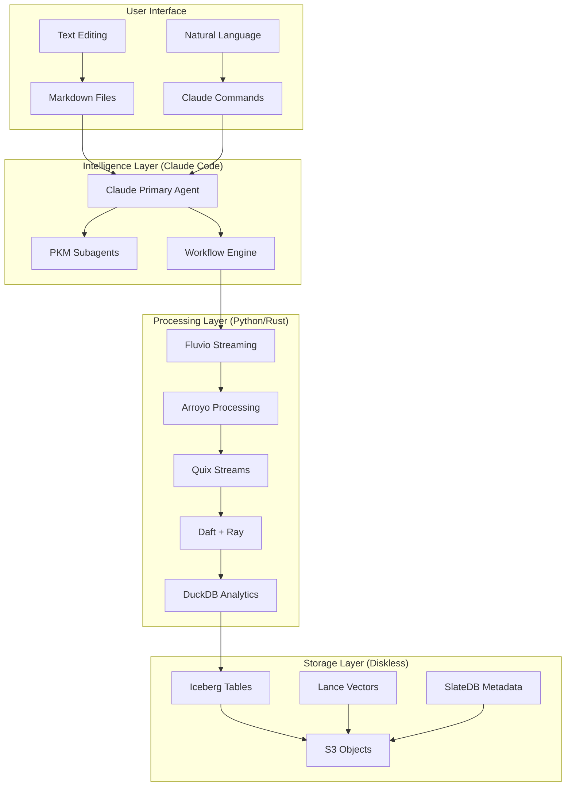

# Claude-Implemented Personal Knowledge Management (PKM) System

## 🎯 Overview

A comprehensive Personal Knowledge Management system where all workflows are implemented on the Claude Code platform. Users interact through a **dual interface** - directly editing markdown files AND using natural language commands. Claude Code provides the complete implementation through specialized subagents, commands, and hooks that handle both PKM operations and transparent lakehouse storage.

## 🎨 Dual Interface Design

### Text Interface (Primary)
- **Write Markdown**: Create and edit `.md` files as usual
- **Organize Files**: Use folders and Git normally
- **Automatic Processing**: Claude watches and processes all changes
- **Transparent Enhancement**: Your notes are enriched automatically

### Natural Language Interface (Complementary)
- **Ask Claude**: Use commands or conversation
- **Get Help**: Claude assists with complex tasks
- **Discover Insights**: Claude finds patterns and connections
- **Generate Content**: Claude creates summaries and teaching materials

### How They Work Together
1. **You Edit Text** → Claude automatically processes changes
2. **You Ask Claude** → Claude executes commands and workflows
3. **Both Interfaces** → Same powerful implementation platform
4. **Seamless Integration** → Text changes and commands work in harmony

## 🚀 Key Features

### Core Capabilities (All Powered by Claude)
- **Intelligent Ingestion**: Claude processes any content format into atomic notes
- **Advanced Processing**: Claude extracts concepts and maps relationships
- **Knowledge Synthesis**: Claude generates insights and summaries
- **Feynman Simplification**: Claude transforms complex ideas into simple explanations
- **Graph-Based Organization**: Claude manages your knowledge connections

### Methodologies
- **Zettelkasten**: Atomic notes with emergent structure
- **PARA Method**: Projects, Areas, Resources, Archives organization
- **Building a Second Brain**: Capture, Organize, Distill, Express workflow
- **Feynman Technique**: Learn by teaching and simplification
- **First Principles**: Break down to fundamentals and rebuild understanding

## 🚀 Lightweight Python/Rust Architecture (v5.0)

The PKM system now features a **lightweight, Java-free architecture** that reduces complexity by 75% while maintaining all functionality:

### Core Technologies (No JVM!)
- **Fluvio**: Rust-based streaming (10x lighter than Kafka)
- **Arroyo**: Rust stream processing (native performance)
- **Daft + Ray**: Python batch processing (simpler than Spark)
- **DuckDB**: Embedded analytics (50x faster queries)
- **Quix Streams**: Python streaming (developer-friendly)

### Architecture Benefits
- ✅ **75% Less Memory**: 2-4GB vs 16GB+ for Java stack
- ✅ **10x Faster Startup**: 1-5s vs 30-60s
- ✅ **90% Smaller Containers**: 100-300MB vs 1-2GB
- ✅ **No JVM Overhead**: Native Python/Rust performance
- ✅ **Simpler Operations**: Single binaries, no Zookeeper
- ✅ **Developer Friendly**: Python-first with Rust performance

## 📚 Documentation

### Architecture Documents
- [**System Architecture**](PKM-SYSTEM-ARCHITECTURE.md) - Claude implementation platform design
- [**Workflow Implementation**](WORKFLOW-IMPLEMENTATION-SPECIFICATION.md) - Dual interface workflows
- [**Claude Interface Specification**](CLAUDE-INTERFACE-SPECIFICATION.md) - Commands, hooks, and orchestration
- [**System Specification**](PKM-SYSTEM-SPECIFICATION.md) - v4.0 with dual interface
- [**Lakehouse Architecture**](LAKEHOUSE-ARCHITECTURE.md) - Modern diskless data platform (transparent)
- [**Lakehouse Best Practices**](LAKEHOUSE-BEST-PRACTICES.md) - Industry patterns from Netflix, Uber, Databricks
- [**Diskless Ingestion Pipeline**](DISKLESS-INGESTION-PIPELINE.md) - Serverless streaming (automatic)
- [**Storage Architecture**](STORAGE-ARCHITECTURE.md) - Multi-tier S3, Lance, and Parquet (invisible)
- [**Vault Structure**](VAULT-STRUCTURE-SPECIFICATION.md) - PKM organizational principles
- [**Data Ingestion Pipeline**](DATA-INGESTION-PIPELINE.md) - Content processing workflows
- [**Knowledge Extraction Framework**](KNOWLEDGE-EXTRACTION-FRAMEWORK.md) - NLP and pattern recognition
- [**Content Generation System**](CONTENT-GENERATION-SYSTEM.md) - Synthesis and output generation

### Implementation Guides
- [**Steering Document**](STEERING-DOCUMENT.md) - Strategic guidance and governance
- [**Implementation Tasks**](IMPLEMENTATION-TASKS.md) - Detailed task breakdown and timeline

### Research Documents
- [**PKM Systems Analysis**](../pkm-systems-analysis.md) - Comprehensive research on existing systems
- [**Feynman & First Principles Research**](../feynman-first-principles-pkm-research.md) - Cognitive science foundations

## 🤖 Agent Integration

The PKM system includes four specialized Claude Code agents:

### PKM Ingestion Agent
- Processes diverse content sources
- Transforms into atomic notes
- Handles web, documents, APIs
- [`pkm-ingestion.md`](../../.claude/agents/pkm-ingestion.md)

### PKM Processor Agent  
- Enhances notes with NLP
- Extracts concepts and entities
- Generates links and tags
- [`pkm-processor.md`](../../.claude/agents/pkm-processor.md)

### PKM Synthesizer Agent
- Creates summaries and insights
- Identifies patterns and connections
- Generates teaching materials
- [`pkm-synthesizer.md`](../../.claude/agents/pkm-synthesizer.md)

### PKM Feynman Agent
- Simplifies complex concepts
- Creates ELI5 explanations
- Identifies knowledge gaps
- [`pkm-feynman.md`](../../.claude/agents/pkm-feynman.md)

## 🏗️ System Architecture

### Lightweight Python/Rust Stack (v5.0)



### Component Stack Comparison

| Layer | Old (Java) | New (Python/Rust) | Benefits |
|-------|------------|-------------------|----------|
| Streaming | Kafka/Kinesis | Fluvio | 10x less memory, no JVM |
| Processing | Spark | Arroyo + Daft | Native performance |
| Batch | EMR | Ray + Daft | Python-native |
| SQL | Spark SQL | DuckDB | 50x faster |
| Graph | Neo4j | NetworkX | No Java dependency |

## 🚦 Implementation Roadmap

### Phase 1: Foundation (Weeks 1-4) ✅ COMPLETE
- ✅ Core infrastructure setup
- ✅ Basic vault management
- ✅ Markdown processing
- ✅ Agent framework (4 agents)
- ✅ Lakehouse architecture design
- ✅ Industry best practices research

### Phase 2: Lakehouse Infrastructure (Weeks 5-12) 🔄 IN PROGRESS
- 🔄 Iceberg catalog deployment
- 🔄 SlateDB initialization
- 🔄 Kinesis streaming setup
- 🔄 Lambda processors
- 📅 Medallion layers
- 📅 Spark streaming

### Phase 3: Intelligence (Weeks 13-24)
- 📅 NLP integration
- 📅 Knowledge graph
- 📅 Pattern detection
- 📅 Analytics platform

### Phase 4: Generation & Production (Weeks 25-48)
- 📅 Content generation
- 📅 User interface
- 📅 Production deployment
- 📅 Performance optimization

## 💡 Core Principles

### Knowledge Management
1. **Atomic Notes**: One concept per note
2. **Bidirectional Linking**: Connected knowledge web
3. **Progressive Development**: Evolving understanding
4. **Source Attribution**: Always cite origins
5. **Version Control**: Track knowledge evolution

### Feynman Technique
1. **Simplify**: Remove jargon and complexity
2. **Teach**: Explain to a child
3. **Identify Gaps**: Find what's missing
4. **Refine**: Iterate and improve

### First Principles
1. **Decompose**: Break into fundamentals
2. **Question**: Challenge assumptions
3. **Rebuild**: Construct from basics
4. **Validate**: Test understanding

## 🛠️ Technology Stack (Lightweight v5.0)

### Core Components
- **Languages**: Python 3.11+, Rust
- **Streaming**: Fluvio (Rust, no JVM)
- **Processing**: Arroyo (Rust), Quix Streams (Python)
- **Batch**: Daft + Ray (Python)
- **Analytics**: DuckDB (embedded SQL)
- **Graph**: NetworkX (Python, no Java)

### Storage & Data
- **Tables**: Apache Iceberg
- **Vectors**: Lance format
- **Metadata**: SlateDB (diskless)
- **Objects**: S3 compatible
- **Formats**: Parquet, JSON

### Intelligence
- **NLP**: spaCy, Sentence Transformers
- **LLM**: Claude API
- **Orchestration**: Claude Code
- **Agents**: PKM specialized subagents

## 📊 Quality Metrics

### System Performance
- Response time: < 100ms
- Processing rate: > 100 notes/hour
- Availability: > 99.9%

### Knowledge Quality
- Atomic notes: > 90%
- Link density: > 3 per note
- Source attribution: 100%
- Feynman clarity: > 0.8

## 🔧 Configuration

### Basic Setup
```yaml
# .pkm/config.yaml
vault:
  path: ~/pkm-vault
  structure: PARA
  
processing:
  nlp_model: en_core_web_lg
  chunking: semantic
  
synthesis:
  summary_levels: 5
  insight_threshold: 0.7
```

### Agent Configuration
```yaml
# .claude/settings.json
agents:
  pkm-ingestion:
    enabled: true
    tools: ["Read", "Write", "WebFetch"]
  pkm-processor:
    enabled: true
    tools: ["Read", "Write", "Edit", "Grep"]
```

## 💬 Example Interactions with Claude

### Natural Language Examples
```markdown
You: "Claude, I found an interesting article about quantum computing, can you add it to my PKM?"
Claude: "I'll capture that article for you. Please share the URL or paste the content."

You: "What do I know about machine learning optimization?"
Claude: "I found 23 notes about machine learning optimization. Here are the key insights:
        1. Gradient descent variations (5 notes)
        2. Hyperparameter tuning strategies (8 notes)
        3. Loss function selection (4 notes)
        Would you like me to synthesize these into a summary?"

You: "Explain neural networks simply"
Claude: "I'll create an ELI5 explanation using your existing notes. 
        Think of a neural network like a team of decision-makers..."
```

### Command Examples
```bash
# Capture content
/pkm-capture "https://example.com/article"

# Process your inbox
/pkm-process inbox

# Search your knowledge
/pkm-search "quantum computing applications"

# Generate insights
/pkm-synthesize "productivity patterns"

# Create teaching materials
/pkm-teach "React hooks" --level=beginner
```

## 🚀 Quick Start

1. **Initialize Repository**
   ```bash
   git clone <repository>
   cd research
   ```

2. **Setup PKM Structure** (Claude will do this for you!)
   ```bash
   # Just ask Claude:
   "Claude, set up my PKM vault structure"
   ```

3. **Start Using**
   ```markdown
   # Just talk to Claude naturally:
   "Claude, help me organize my research notes"
   "Capture this article about AI ethics"
   "What patterns do you see in my productivity notes?"
   ```

## 📈 Success Metrics

### Adoption
- Daily active users: > 1000
- Notes per day: > 5 per user
- Retention rate: > 80%

### Knowledge Growth
- Total notes: Growing 20% monthly
- Insights generated: > 1 per week
- Teaching materials: > 90% effectiveness

## 🤝 Contributing

The PKM system is designed for extensibility:

1. **Agent Development**: Create specialized agents
2. **Pipeline Enhancement**: Improve processing
3. **Template Creation**: Share note templates
4. **Plugin System**: Extend functionality

## 📖 Further Reading

- [How to Take Smart Notes](https://takesmartnotes.com/) - Sönke Ahrens
- [Building a Second Brain](https://www.buildingasecondbrain.com/) - Tiago Forte
- [Evergreen Notes](https://notes.andymatuschak.org/) - Andy Matuschak
- [Feynman Technique](https://fs.blog/feynman-technique/) - Farnam Street

## 📄 License

This PKM system architecture is open source and available under the MIT License.

## 🙏 Acknowledgments

Built on the shoulders of giants:
- Niklas Luhmann's Zettelkasten
- Richard Feynman's learning technique
- Modern PKM pioneers and communities
- Claude Code and Anthropic

---

*Transform information into wisdom through intelligent knowledge management*

**Version**: 4.0.0  
**Architecture**: Claude Implementation Platform  
**Interface**: Dual - Text Editing + Natural Language  
**Implementation**: Specialized Workflows on Claude Code  
**Status**: Active Implementation - Phase 1 Complete  
**Last Updated**: 2024-01-21  
**Next Milestone**: M2 - Workflow Implementation (Week 8)