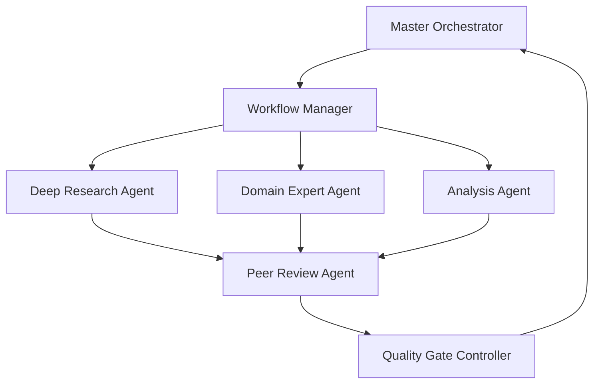
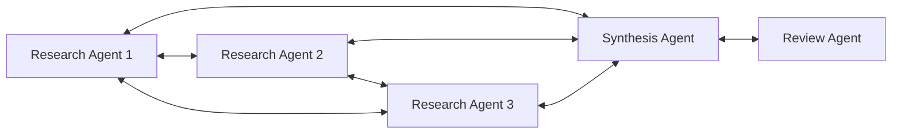
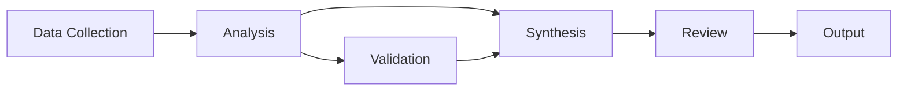

# Agent Collaboration Framework

## Overview

The Agent Collaboration Framework defines the protocols, standards, and mechanisms that enable seamless coordination between specialized research agents in the Claude Code ecosystem. This framework ensures efficient knowledge sharing, task coordination, quality control, and collective intelligence emergence.

## Collaboration Architecture

### Multi-Tier Communication Model

```yaml
communication_layers:
  tier_1_orchestration:
    participants:
      - master_research_orchestrator
      - workflow_manager
      - quality_gate_controller
    communication_type: command_and_control
    protocols: synchronous_messaging
    
  tier_2_peer_coordination:
    participants:
      - deep_research_agents
      - domain_expert_agents
      - analysis_agents
    communication_type: peer_to_peer
    protocols: asynchronous_collaboration
    
  tier_3_specialist_consultation:
    participants:
      - fact_verification_agents
      - bias_detection_agents
      - ethics_review_agents
    communication_type: service_request
    protocols: request_response_pattern
    
  tier_4_output_coordination:
    participants:
      - writing_agents
      - visualization_agents
      - presentation_agents
    communication_type: pipeline_processing
    protocols: sequential_handoff
```

### Agent Interaction Patterns

#### 1. Hierarchical Coordination Pattern


#### 2. Collaborative Network Pattern


#### 3. Pipeline Processing Pattern


## Communication Protocols

### Standard Message Format

#### Agent-to-Agent Message Structure
```json
{
  "message_header": {
    "message_id": "uuid_v4",
    "timestamp": "iso_8601_datetime",
    "sender": {
      "agent_id": "unique_agent_identifier",
      "agent_type": "agent_classification",
      "instance_id": "specific_instance"
    },
    "recipient": {
      "agent_id": "target_agent_identifier", 
      "agent_type": "target_classification",
      "instance_id": "target_instance"
    },
    "message_type": "request|response|notification|alert|broadcast",
    "priority": "critical|high|medium|low",
    "encryption": "none|symmetric|asymmetric",
    "authentication": "signature_hash"
  },
  "message_body": {
    "context": {
      "research_project_id": "project_identifier",
      "task_id": "specific_task_reference",
      "workflow_stage": "current_process_stage",
      "dependencies": ["prerequisite_tasks"],
      "deadline": "iso_8601_datetime"
    },
    "content": {
      "action_required": "specific_request_or_command",
      "data_payload": "structured_information",
      "parameters": "configuration_options",
      "constraints": "limitations_and_requirements",
      "quality_standards": "expected_output_criteria"
    },
    "collaboration": {
      "coordination_type": "sequential|parallel|competitive|consensus",
      "information_sharing": "full|partial|restricted|none",
      "result_format": "expected_output_structure",
      "feedback_required": "yes|no|conditional",
      "escalation_rules": "exception_handling_protocol"
    }
  },
  "attachments": [
    {
      "attachment_id": "unique_reference",
      "type": "document|dataset|model|visualization",
      "format": "file_format_specification",
      "size": "bytes",
      "checksum": "integrity_verification",
      "access_control": "permission_requirements"
    }
  ]
}
```

### Communication Channels

#### 1. Synchronous Communication
```yaml
synchronous_channels:
  command_control:
    use_case: orchestrator_to_agent_commands
    latency: under_100ms
    reliability: guaranteed_delivery
    ordering: strict_sequence
    
  real_time_collaboration:
    use_case: agent_to_agent_coordination
    latency: under_500ms
    reliability: best_effort
    ordering: timestamp_based
    
  emergency_alerts:
    use_case: critical_issue_notification
    latency: under_50ms
    reliability: multiple_delivery_attempts
    ordering: priority_based
```

#### 2. Asynchronous Communication
```yaml
asynchronous_channels:
  task_queues:
    use_case: work_distribution
    persistence: durable_storage
    ordering: priority_and_fifo
    scaling: auto_scaling_workers
    
  event_streams:
    use_case: state_change_notifications
    persistence: configurable_retention
    ordering: temporal_sequence
    scaling: partitioned_streams
    
  publish_subscribe:
    use_case: broadcast_updates
    persistence: subscriber_dependent
    ordering: publication_timestamp
    scaling: topic_based_distribution
```

## Coordination Mechanisms

### Task Allocation and Load Balancing

#### Dynamic Task Assignment Algorithm
```python
class TaskAllocationManager:
    def allocate_task(self, task: ResearchTask) -> AgentAssignment:
        """
        Intelligent task allocation based on multiple factors
        """
        available_agents = self.get_available_agents(task.required_capabilities)
        
        scoring_factors = {
            'expertise_match': 0.35,
            'current_workload': 0.25, 
            'past_performance': 0.20,
            'availability_window': 0.15,
            'collaboration_history': 0.05
        }
        
        agent_scores = {}
        for agent in available_agents:
            score = self.calculate_agent_score(agent, task, scoring_factors)
            agent_scores[agent.id] = score
            
        # Select best agent or form team if needed
        if task.complexity > TEAM_THRESHOLD:
            return self.form_collaboration_team(task, agent_scores)
        else:
            best_agent = max(agent_scores.items(), key=lambda x: x[1])
            return AgentAssignment(agent_id=best_agent[0], confidence=best_agent[1])
    
    def calculate_agent_score(self, agent: Agent, task: ResearchTask, 
                            factors: dict) -> float:
        """Calculate weighted score for agent-task fit"""
        expertise_score = self.assess_expertise_match(agent, task)
        workload_score = self.assess_current_workload(agent)
        performance_score = self.get_historical_performance(agent, task.domain)
        availability_score = self.check_availability_alignment(agent, task)
        collaboration_score = self.assess_collaboration_fit(agent, task.team_members)
        
        total_score = (
            expertise_score * factors['expertise_match'] +
            workload_score * factors['current_workload'] +
            performance_score * factors['past_performance'] +
            availability_score * factors['availability_window'] +
            collaboration_score * factors['collaboration_history']
        )
        
        return total_score
```

### Conflict Resolution Framework

#### Multi-Level Conflict Resolution
```yaml
conflict_types:
  resource_conflicts:
    detection: overlapping_resource_requests
    resolution: priority_based_scheduling
    escalation: resource_pool_expansion
    
  information_conflicts:
    detection: contradictory_findings
    resolution: evidence_quality_assessment
    escalation: expert_panel_review
    
  priority_conflicts:
    detection: competing_high_priority_tasks
    resolution: stakeholder_consultation
    escalation: executive_decision
    
  quality_conflicts:
    detection: review_disagreements
    resolution: additional_reviewer_consensus
    escalation: methodology_expert_consultation

resolution_protocols:
  automated_resolution:
    applicability: routine_conflicts_with_clear_rules
    mechanism: rule_based_decision_engine
    override: human_escalation_option
    
  consensus_building:
    applicability: subjective_quality_assessments
    mechanism: weighted_voting_system
    timeout: maximum_consensus_time_limit
    
  expert_arbitration:
    applicability: complex_technical_disputes
    mechanism: domain_expert_panel
    binding: final_decision_authority
    
  human_oversight:
    applicability: ethical_or_strategic_conflicts
    mechanism: human_supervisor_intervention
    documentation: full_decision_audit_trail
```

### Knowledge Sharing Protocols

#### Collective Knowledge Management
```yaml
knowledge_sharing_mechanisms:
  shared_knowledge_base:
    structure: graph_database_with_semantic_links
    access_control: role_based_permissions
    versioning: git_like_version_control
    search: semantic_and_full_text_search
    
  experience_sharing:
    method: post_task_debriefs
    format: structured_lessons_learned
    distribution: relevant_agent_notification
    retention: long_term_learning_database
    
  best_practice_propagation:
    identification: performance_pattern_analysis
    validation: peer_review_and_testing
    dissemination: training_update_distribution
    implementation: guided_practice_adoption
    
  real_time_insights:
    sharing: live_discovery_broadcasting
    filtering: relevance_based_routing
    aggregation: trend_and_pattern_detection
    application: immediate_workflow_adjustment
```

## Quality Assurance Collaboration

### Peer Review Coordination

#### Multi-Agent Review Process
```yaml
review_orchestration:
  review_assignment:
    criteria: domain_expertise_and_availability
    redundancy: minimum_two_reviewers_per_output
    independence: no_conflict_of_interest
    diversity: varied_perspectives_encouraged
    
  review_coordination:
    sequencing: parallel_review_with_synthesis
    communication: reviewer_to_reviewer_dialogue
    consensus_building: disagreement_resolution_protocol
    timeline_management: deadline_enforcement_system
    
  quality_synthesis:
    aggregation_method: weighted_expert_opinion
    conflict_resolution: evidence_based_arbitration
    final_determination: consensus_or_escalation
    feedback_generation: constructive_improvement_guidance
```

#### Cross-Validation Protocols
```yaml
cross_validation_framework:
  methodology_validation:
    validators: methodology_expert_agents
    criteria: scientific_rigor_and_appropriateness
    process: independent_assessment_and_comparison
    outcome: approved_conditional_or_rejected
    
  source_validation:
    validators: fact_checking_and_source_verification_agents
    criteria: credibility_accuracy_and_currency
    process: automated_and_manual_verification
    outcome: confidence_score_and_recommendation
    
  logic_validation:
    validators: logic_and_reasoning_specialist_agents
    criteria: consistency_and_sound_argumentation
    process: argument_mapping_and_fallacy_detection
    outcome: logic_score_and_improvement_suggestions
    
  bias_validation:
    validators: bias_detection_specialist_agents
    criteria: fairness_objectivity_and_balance
    process: multi_dimensional_bias_assessment
    outcome: bias_report_and_mitigation_recommendations
```

## Performance Monitoring and Optimization

### Collaboration Effectiveness Metrics

#### Key Performance Indicators
```yaml
collaboration_kpis:
  coordination_efficiency:
    metrics:
      - task_handoff_time
      - communication_overhead
      - coordination_success_rate
      - conflict_resolution_speed
    targets:
      - handoff_time_under_5_minutes
      - communication_overhead_under_10_percent
      - coordination_success_over_95_percent
      - conflict_resolution_under_24_hours
      
  knowledge_sharing_effectiveness:
    metrics:
      - information_propagation_speed
      - knowledge_reuse_rate
      - learning_transfer_success
      - collective_intelligence_emergence
    targets:
      - propagation_under_1_hour
      - reuse_rate_over_80_percent
      - transfer_success_over_90_percent
      - intelligence_emergence_measurable
      
  quality_assurance_efficiency:
    metrics:
      - review_completion_time
      - review_quality_scores
      - reviewer_agreement_rates
      - improvement_implementation_success
    targets:
      - completion_within_sla
      - quality_scores_over_4_5
      - agreement_rates_over_85_percent
      - implementation_success_over_95_percent
```

### Adaptive Collaboration Optimization

#### Machine Learning for Collaboration Enhancement
```python
class CollaborationOptimizer:
    def __init__(self):
        self.performance_history = CollaborationPerformanceDB()
        self.optimization_models = {
            'task_allocation': TaskAllocationML(),
            'communication_routing': CommunicationOptimizationML(),
            'conflict_prediction': ConflictPredictionML(),
            'team_formation': TeamFormationML()
        }
    
    def optimize_collaboration_patterns(self, historical_data: Dict) -> OptimizationRecommendations:
        """
        Use ML to continuously improve collaboration effectiveness
        """
        patterns = self.analyze_collaboration_patterns(historical_data)
        bottlenecks = self.identify_bottlenecks(patterns)
        optimizations = self.generate_optimizations(bottlenecks)
        
        return OptimizationRecommendations(
            task_allocation_improvements=optimizations['task_allocation'],
            communication_flow_optimizations=optimizations['communication'],
            conflict_prevention_strategies=optimizations['conflict_prevention'],
            team_composition_recommendations=optimizations['team_formation']
        )
    
    def predict_collaboration_success(self, proposed_collaboration: CollaborationPlan) -> SuccessPrediction:
        """
        Predict likelihood of successful collaboration outcome
        """
        features = self.extract_collaboration_features(proposed_collaboration)
        success_probability = self.optimization_models['team_formation'].predict(features)
        risk_factors = self.identify_risk_factors(features)
        mitigation_strategies = self.recommend_mitigations(risk_factors)
        
        return SuccessPrediction(
            success_probability=success_probability,
            confidence_interval=self.calculate_confidence_interval(features),
            risk_factors=risk_factors,
            mitigation_recommendations=mitigation_strategies
        )
```

## Security and Privacy Framework

### Secure Collaboration Protocols

#### Multi-Layer Security Model
```yaml
security_layers:
  authentication:
    agent_identity_verification: cryptographic_certificates
    message_authentication: digital_signatures
    session_management: secure_token_based_sessions
    multi_factor_authentication: required_for_sensitive_operations
    
  authorization:
    role_based_access_control: granular_permission_system
    capability_based_security: specific_function_access
    dynamic_permission_adjustment: context_aware_authorization
    principle_of_least_privilege: minimal_necessary_access
    
  communication_security:
    encryption_in_transit: tls_1_3_minimum
    encryption_at_rest: aes_256_encryption
    key_management: automated_key_rotation
    secure_channels: isolated_communication_pathways
    
  data_protection:
    data_classification: sensitivity_level_tagging
    access_logging: comprehensive_audit_trails
    data_retention: policy_based_lifecycle_management
    privacy_compliance: gdpr_hipaa_compliance_built_in
```

#### Privacy-Preserving Collaboration
```yaml
privacy_mechanisms:
  differential_privacy:
    application: statistical_analysis_sharing
    implementation: noise_injection_algorithms
    privacy_budget: carefully_managed_epsilon_values
    utility_preservation: minimal_accuracy_loss
    
  secure_multi_party_computation:
    application: joint_analysis_without_data_sharing
    protocols: garbled_circuits_and_secret_sharing
    performance: optimized_for_research_workloads
    verification: cryptographic_proof_systems
    
  federated_learning:
    application: collaborative_model_training
    privacy: local_data_never_shared
    aggregation: secure_gradient_averaging
    robustness: byzantine_fault_tolerance
    
  homomorphic_encryption:
    application: computation_on_encrypted_data
    operations: addition_multiplication_comparison
    performance: practical_for_specific_use_cases
    integration: transparent_to_research_agents
```

## Integration with External Systems

### API Gateway and Service Mesh

#### External Integration Framework
```yaml
integration_architecture:
  api_gateway:
    functionality: centralized_external_api_management
    security: authentication_and_rate_limiting
    monitoring: request_response_logging
    transformation: protocol_and_format_conversion
    
  service_mesh:
    functionality: inter_agent_communication_management
    security: mutual_tls_between_agents
    observability: distributed_tracing_and_metrics
    reliability: circuit_breaker_and_retry_logic
    
  event_streaming:
    functionality: real_time_event_distribution
    scalability: horizontally_scalable_partitions
    reliability: durable_message_storage
    integration: kafka_compatible_protocols
    
  data_pipeline:
    functionality: automated_data_flow_management
    transformation: etl_and_stream_processing
    quality: data_validation_and_cleansing
    lineage: comprehensive_data_governance
```

### Human-Agent Collaboration Interface

#### Hybrid Intelligence Framework
```yaml
human_agent_interface:
  collaboration_modes:
    human_in_the_loop: human_validation_at_key_decision_points
    human_on_the_loop: human_oversight_with_intervention_capability
    human_out_of_the_loop: fully_autonomous_with_exception_escalation
    adaptive_mode: dynamic_switching_based_on_context
    
  interaction_patterns:
    consultation: agents_seeking_human_expert_input
    validation: humans_reviewing_agent_outputs
    collaboration: joint_human_agent_problem_solving
    supervision: humans_monitoring_agent_activities
    
  interface_design:
    transparency: explainable_agent_reasoning
    control: human_override_and_direction_capability
    feedback: continuous_learning_from_human_input
    trust: confidence_building_through_reliability
```

## Deployment and Scaling Considerations

### Distributed Deployment Architecture
```yaml
deployment_strategy:
  containerization:
    technology: docker_containers_with_kubernetes
    orchestration: automated_scaling_and_recovery
    isolation: secure_process_and_network_isolation
    portability: cloud_agnostic_deployment
    
  microservices:
    architecture: loosely_coupled_service_oriented
    communication: asynchronous_message_passing
    data_management: service_specific_databases
    monitoring: distributed_system_observability
    
  edge_deployment:
    rationale: reduced_latency_for_real_time_collaboration
    architecture: federated_edge_computing_nodes
    synchronization: eventual_consistency_protocols
    resilience: autonomous_operation_capability
    
  cloud_native:
    scalability: auto_scaling_based_on_demand
    availability: multi_region_deployment
    cost_optimization: resource_usage_optimization
    integration: cloud_provider_service_utilization
```

This comprehensive collaboration framework provides the foundation for seamless, secure, and effective coordination between research agents in complex multi-agent research scenarios.