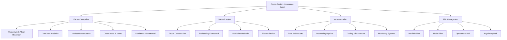
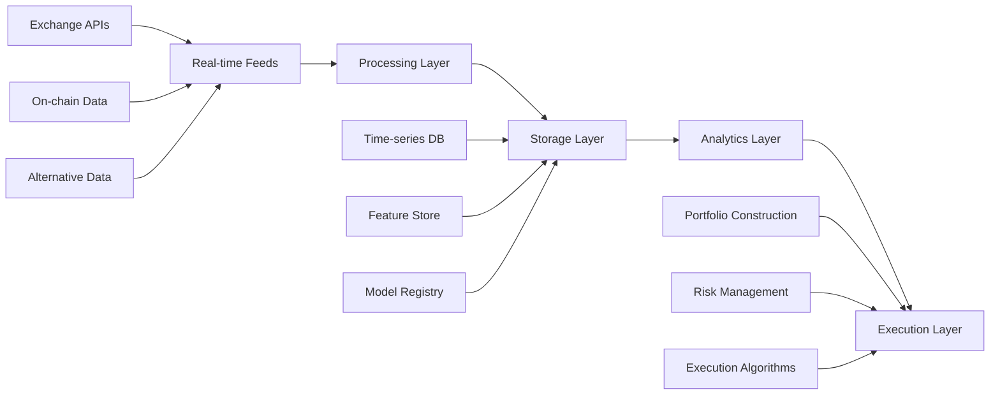

# Crypto Factors Investing Knowledge Graph

## Knowledge Graph Architecture

This knowledge graph represents the comprehensive research framework for systematic crypto factor investing, connecting theoretical foundations with practical implementation.

### Core Knowledge Domains



## 1. Factor Category Network

### 1.1 Momentum & Mean Reversion Cluster
- **Core Node**: [[202509021914-momentum-strategies]]
- **Connected Concepts**:
  - Price momentum patterns
  - Volume-price relationships
  - Cross-sectional ranking systems
  - Volatility mean reversion
  - Short-term reversal signals

### 1.2 On-Chain Analytics Cluster
- **Core Nodes**:
  - Network activity metrics
  - Token economics factors
  - DeFi protocol analytics
  - Miner/validator economics
- **Key Relationships**:
  - Network growth → Token valuation
  - Staking participation → Price momentum
  - TVL changes → Sector rotation
  - Mining economics → Market cycles

### 1.3 Market Microstructure Cluster
- **Core Concepts**:
  - Order book dynamics
  - Liquidity provisioning
  - Cross-exchange arbitrage
  - Trade execution quality
- **Interconnections**:
  - Liquidity → Price impact → Factor capacity
  - Volatility → Bid-ask spreads → Trading costs
  - Market fragmentation → Arbitrage opportunities

### 1.4 Cross-Asset Relationships
- **Traditional Finance Links**:
  - Equity market correlations
  - Fixed income sensitivity
  - Currency relationships
  - Commodity connections
- **Crypto-Specific Factors**:
  - Bitcoin dominance effects
  - DeFi yield relationships
  - Layer 1/Layer 2 dynamics

### 1.5 Sentiment & Behavioral Network
- **Data Sources**:
  - Social media sentiment
  - Search trends
  - News analytics
  - On-chain behavior patterns
- **Psychological Factors**:
  - Fear and greed cycles
  - Herding behavior
  - Contrarian indicators

## 2. Methodological Framework Network

### 2.1 Factor Construction Pipeline
```
Raw Data → Signal Processing → Factor Engineering → Quality Control → Validation
    ↓              ↓                  ↓                ↓              ↓
[[data-quality]] → [[signal-extraction]] → [[cross-sectional-ranking]] → [[factor-decay]] → [[out-of-sample-testing]]
```

### 2.2 Validation Hierarchy
- **Statistical Validation**:
  - Sharpe ratio analysis
  - Information ratio optimization
  - Maximum drawdown assessment
  - Factor loading stability
  
- **Economic Validation**:
  - Economic intuition verification
  - Market regime robustness
  - Transaction cost integration
  - Capacity constraints analysis

### 2.3 Backtesting Framework
- **Core Components**:
  - Point-in-time data integrity
  - Survivorship bias handling
  - Transaction cost modeling
  - Risk attribution analysis

## 3. Implementation Architecture Graph

### 3.1 Data Infrastructure Network


### 3.2 Research & Production Pipeline
- **Research Environment**:
  - Jupyter-based notebooks
  - Statistical libraries
  - Visualization tools
  - Version control systems

- **Production Systems**:
  - Real-time signal generation
  - Portfolio optimization
  - Risk monitoring
  - Performance attribution

## 4. Risk Management Network

### 4.1 Portfolio Risk Decomposition
- **Factor Risk Attribution**:
  - Common factor exposures
  - Specific risk components
  - Concentration limits
  - Sector constraints

### 4.2 Model Risk Framework
- **Overfitting Detection**:
  - In-sample vs out-of-sample performance
  - Parameter stability analysis
  - Regime change detection
  - Adaptive modeling approaches

### 4.3 Operational Risk Management
- **Data Quality Monitoring**:
  - Real-time data validation
  - Missing data detection
  - Outlier identification
  - Provider reliability tracking

## 5. Factor Interaction Patterns

### 5.1 Positive Correlations
- Momentum factors tend to cluster during trending markets
- On-chain activity correlates with price momentum
- Sentiment factors amplify fundamental signals
- Cross-asset correlations increase during stress periods

### 5.2 Negative Correlations / Diversification
- Mean reversion vs momentum (regime-dependent)
- Micro vs macro factors
- Fundamental vs technical signals
- Short-term vs long-term factors

### 5.3 Non-Linear Relationships
- Volatility regime switches affect factor performance
- Liquidity crises create factor breakdowns
- Regulatory events cause structural breaks
- Market maturation changes factor dynamics

## 6. Knowledge Graph Navigation

### 6.1 Entry Points by Use Case

**For Researchers**:
- Start with [[202509021914-momentum-strategies]]
- Explore factor validation methodologies
- Review backtesting frameworks
- Analyze risk attribution methods

**For Practitioners**:
- Begin with implementation architecture
- Focus on data infrastructure requirements
- Examine transaction cost modeling
- Study risk management protocols

**For Risk Managers**:
- Review portfolio risk decomposition
- Analyze model risk frameworks
- Study operational risk controls
- Examine regime change detection

### 6.2 Learning Pathways

**Beginner Path**:
1. Factor investing fundamentals
2. Crypto market characteristics
3. Basic signal construction
4. Simple backtesting methods

**Intermediate Path**:
1. Multi-factor model construction
2. Risk-adjusted performance metrics
3. Transaction cost optimization
4. Portfolio construction methods

**Advanced Path**:
1. Alternative data integration
2. Machine learning applications
3. Cross-asset factor models
4. Dynamic risk management

## 7. Research Frontiers & Future Extensions

### 7.1 Emerging Factor Categories
- **Layer 2 Scaling Factors**:
  - L2 adoption metrics
  - Cross-chain bridge activity
  - Rollup economics
  
- **DeFi 2.0 Factors**:
  - Protocol-owned liquidity
  - Algorithmic stablecoin mechanics
  - Yield farming 2.0 patterns

- **NFT & Metaverse Factors**:
  - NFT collection momentum
  - Gaming token economics
  - Virtual real estate metrics

### 7.2 Methodological Advances
- **Machine Learning Integration**:
  - Deep learning feature extraction
  - Reinforcement learning optimization
  - Natural language processing enhancement
  
- **Alternative Data Sources**:
  - Satellite imagery analysis
  - Social graph analytics
  - Developer activity tracking

### 7.3 Cross-Chain Analytics
- **Multi-Chain Factors**:
  - Cross-chain arbitrage signals
  - Interoperability metrics
  - Bridge volume analysis
  - Multi-chain portfolio optimization

## 8. Quality Assurance Network

### 8.1 Research Validation Chain
```
Research Hypothesis → Literature Review → Data Validation → Statistical Testing → Economic Validation → Peer Review → Implementation Testing → Production Deployment
```

### 8.2 Continuous Monitoring Framework
- **Model Performance Tracking**:
  - Real-time factor performance
  - Decay detection algorithms
  - Regime change identification
  - Adaptation triggers

### 8.3 Knowledge Graph Maintenance
- **Regular Updates**:
  - New research integration
  - Link validation and maintenance
  - Concept evolution tracking
  - Dead link identification and removal

## 9. Practical Application Workflows

### 9.1 New Factor Development
1. **Research Phase**:
   - Literature review and gap analysis
   - Economic intuition development
   - Data source identification
   - Initial signal construction

2. **Validation Phase**:
   - Statistical significance testing
   - Out-of-sample validation
   - Transaction cost analysis
   - Risk attribution assessment

3. **Implementation Phase**:
   - Production system integration
   - Real-time signal generation
   - Portfolio construction integration
   - Monitoring system deployment

### 9.2 Portfolio Construction Workflow
1. **Factor Selection**: Multi-dimensional factor screening
2. **Risk Budgeting**: Factor exposure optimization
3. **Position Sizing**: Volatility-adjusted allocation
4. **Rebalancing**: Dynamic portfolio maintenance
5. **Performance Attribution**: Factor contribution analysis

## Conclusion

This knowledge graph provides a comprehensive navigation system for crypto factor investing research and implementation. The interconnected nature of factors, methodologies, and implementation approaches requires systematic thinking and continuous learning.

The graph serves as both a learning tool for newcomers and a reference system for experienced practitioners. Regular updates and expansions ensure the knowledge base remains current with evolving crypto markets and advancing quantitative methods.

---

**Navigation Commands**:
- Use `[[double-brackets]]` to explore linked concepts
- Follow methodological pathways for structured learning
- Cross-reference implementation details with theoretical foundations
- Validate findings through multiple knowledge paths

**Maintenance Notes**:
- Knowledge graph updated: 2025-09-02
- Next review scheduled: 2025-10-02
- Contributing researchers: Add new findings through PKM pipeline
- Quality assurance: Peer review required for major additions