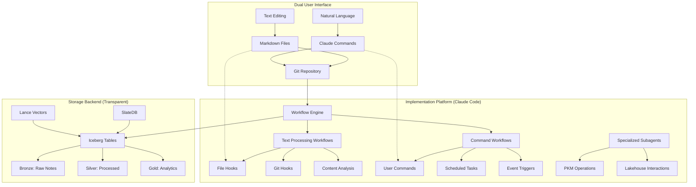

# Dual Interface Architecture

```mermaid
graph TB
    subgraph "Dual User Interface"
        A[Text Editing] --> B[Markdown Files]
        C[Natural Language] --> D[Claude Commands]
        B --> E[Git Repository]
        D --> E
    end
    
    subgraph "Implementation Platform (Claude Code)"
        F[Workflow Engine] --> G[Text Processing Workflows]
        F --> H[Command Workflows]
        
        G --> I[File Hooks]
        G --> J[Git Hooks]
        G --> K[Content Analysis]
        
        H --> L[User Commands]
        H --> M[Scheduled Tasks]
        H --> N[Event Triggers]
        
        O[Specialized Subagents]
        O --> P[PKM Operations]
        O --> Q[Lakehouse Interactions]
    end
    
    subgraph "Storage Backend (Transparent)"
        R[Iceberg Tables] --> S[Bronze: Raw Notes]
        R --> T[Silver: Processed]
        R --> U[Gold: Analytics]
        V[SlateDB] --> R
        W[Lance Vectors] --> R
    end
    
    E --> F
    F --> R
    B -.-> I
    D -.-> L
```

## Connections
- Related concepts: [[to-be-linked]]
